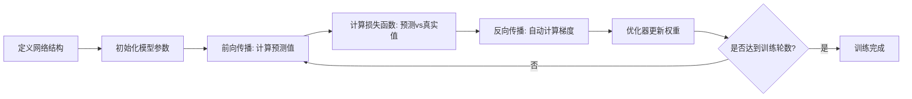
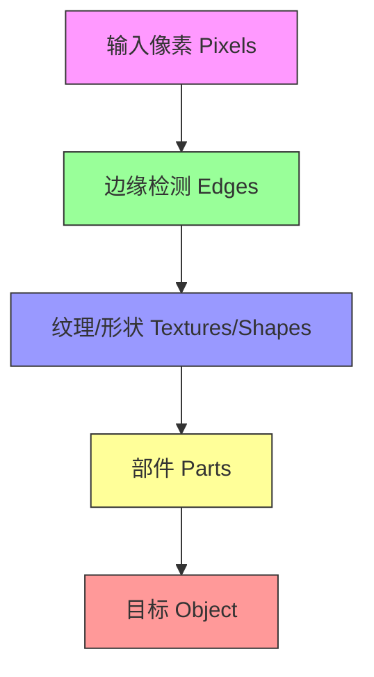
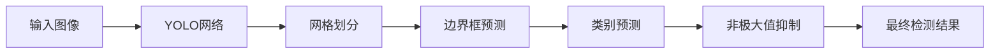
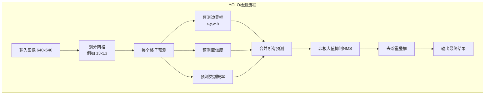
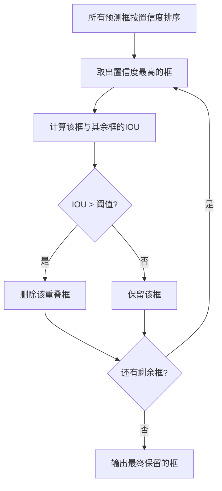

<!-- more -->


## 第一章：PyTorch 核心基础

### 1.1 什么是 PyTorch？

PyTorch = NumPy + GPU，它完美解决了 NumPy 只能使用 CPU 计算、大数据场景下速度过慢的痛点。

PyTorch 的核心数据结构是**张量（Tensor）**，它的用法和 NumPy 几乎完全一致，唯一的区别是张量可以被轻松迁移到 GPU 上运行，计算速度能提升几十倍。

### 1.2 张量（Tensor）入门

张量是 PyTorch 中最基础的数据结构，我们可以像操作 NumPy 数组一样操作它：

```python
import torch
import numpy as np

# 1. 创建自定义张量
x = torch.Tensor([[1, 2, 3], [4, 5, 6], [7, 8, 9]])
print(x)

# 2. 创建全零张量
x=torch.zeros(3)
print(x)

# 3. 从NumPy数组无缝转换为张量
a = np.ones(3)
x = torch.from_numpy(a)
print(x)
```

### 1.3 张量的基本运算

PyTorch 提供了丰富的张量运算，所有运算都支持 GPU 加速：

```python
import torch
x = torch.Tensor([[1, 2, 3], [4, 5, 6], [7, 8, 9]])

# 求幂运算
print(x.pow(-1.0))  # 倒数
print(x.pow(2.0))   # 平方

# 按列求和（dim=0 代表列维度）
print(x.sum(dim = 0))

# 按行求和（dim=1 代表行维度）
print(x.sum(dim = 1))

# 对角矩阵转换
temp = x.sum(dim = 1).pow(-1.0)
print(temp.diag_embed())
```

### 1.4 自动求导机制

神经网络训练的核心是反向传播，手动推导导数公式非常复杂，而 PyTorch 的 \*\* 自动求导（Autograd）\*\* 帮我们解决了这个问题：

你只需要编写前向传播的计算逻辑，PyTorch 会自动记录所有操作，调用`.backward()`就能自动算出所有参数的梯度。

```python
# 定义需要计算梯度的张量
x = torch.tensor(2.0, requires_grad=True) 

# 前向计算：y = x²
y = x**2 

# 反向传播，自动计算梯度
y.backward() 

# 梯度 dy/dx = 2x = 4
print(x.grad)
```

### 1.5 动态图与静态图

与 TensorFlow 1.x 的静态图不同，PyTorch 使用**动态计算图**：

- 静态图：先写好完整的网络结构，编译后才能运行，调试困难

- 动态图：每次前向传播都会实时构建计算图，所见即所得，可以随时打印变量、逐行调试，就像写普通 Python 脚本一样方便

这也是为什么 PyTorch 成为了学术界和研究人员的首选框架。

### 1.6 分布式训练进阶

PyTorch 支持多种分布式训练方案，帮助你快速利用多 GPU 加速训练：

1. **DataParallel**：最简单的单机多 GPU 方案，一行代码包装模型即可

2. **DistributedDataParallel**：更高效的多机多 GPU 方案，负载更均衡

3. **PyTorch Lightning**：封装了所有分布式细节，只需指定 GPU 数量即可自动启用

```python
# PyTorch Lightning 简化多GPU训练
trainer = Trainer(accelerator="gpu", devices=4, strategy="ddp") 
trainer.fit(model)
```

### 1.7 PyTorch 训练完整流程



### 1.8 实战：你的第一个 PyTorch 神经网络

我们用波士顿房价预测来演示一个完整的训练流程：

```python
import torch
import torch.nn as nn
import torch.optim as optim
import pandas as pd
from sklearn.model_selection import train_test_split

# 1. 加载数据集
data = pd.read_csv('housing.csv', header=None, sep='\s+')
X = data.iloc[:, :13].values # 13个房屋特征
y = data.iloc[:, 13].values  # 房价标签

# 2. 划分数据集并转换为张量
X_train, X_test, y_train, y_test = train_test_split(X, y, test_size=0.2)
X_train = torch.from_numpy(X_train).float()
y_train = torch.from_numpy(y_train).float().unsqueeze(1)
X_test = torch.from_numpy(X_test).float()
y_test = torch.from_numpy(y_test).float().unsqueeze(1)

# 3. 定义3层全连接神经网络
class Net(nn.Module):
    def __init__(self):
        super(Net, self).__init__()
        self.fc1 = nn.Linear(13, 64)  # 输入层->隐藏层
        self.fc2 = nn.Linear(64, 32)  # 隐藏层->隐藏层
        self.fc3 = nn.Linear(32, 1)   # 隐藏层->输出层
        
    def forward(self, x):
        x = torch.relu(self.fc1(x))
        x = torch.relu(self.fc2(x))
        x = self.fc3(x)
        return x

model = Net()

# 4. 定义损失函数和优化器
criterion = nn.MSELoss()
optimizer = optim.Adam(model.parameters(), lr=0.001)

# 5. 训练循环
epochs = 1000
for epoch in range(epochs):
    # 前向传播
    y_pred = model(X_train)
    loss = criterion(y_pred, y_train)
    
    # 反向传播和优化
    optimizer.zero_grad()  # 清空梯度
    loss.backward()        # 计算梯度
    optimizer.step()       # 更新权重
    
    if epoch % 100 == 0:
        print(f'Epoch {epoch}, Loss: {loss.item():.4f}')
```

---

## 第二章：工业视觉缺陷检测基础

### 2.1 传统 vs 深度学习视觉检测

| 维度     | 传统视觉检测                 | 深度学习视觉检测             |
| -------- | ---------------------------- | ---------------------------- |
| 核心     | 人工特征工程，编写规则       | 端到端数据驱动，自动提取特征 |
| 代表工具 | Halcon、VisionPro、OpenCV    | YOLO、Faster R-CNN           |
| 适用场景 | 简单、固定的场景，特征明确   | 复杂、多变的场景，特征难定义 |
| 缺点     | 场景变动需要重写规则，泛化差 | 需要一定的数据量             |

### 2.2 缺陷检测的系统方案

缺陷检测是一个**软硬件结合的系统工程**，不是只靠算法就能解决的，通常需要三类工程师配合：

1. 硬件 / 打光工程师

2. 算法工程师

3. 自动化 / PLC 工程师

#### 硬件选型：相机

- **黑白相机 vs 彩色相机**：工业检测优先选黑白相机，相同分辨率下精度更高，对边缘和细节的检测能力更强；只有当颜色是核心特征时才用彩色相机

- **工业相机 vs 手机相机**：工业相机的传感器更大，能接收更多光线，支持高速拍照，低光照下成像质量远好于手机

#### 硬件选型：光源

不同的光源适用于不同的检测场景：

| 光源类型 | 作用                     | 适用场景                             |
| -------- | ------------------------ | ------------------------------------ |
| 环形光   | 360 度均匀照明           | 通用外观检测、PCB 检测、划痕检测     |
| 条形光   | 自由度高，可组合使用     | 表面不平整检测、金属裂纹、大面积划痕 |
| 背光     | 剪影效果，突出轮廓       | 尺寸测量、边缘检测、孔洞检测         |
| 线光     | 极亮线光源，配合线阵相机 | 连续生产的钢板、布匹、玻璃检测       |

---

## 第三章：卷积神经网络（CNN）入门

### 3.1 CNN 的生物学启发

CNN 的灵感来自于 Hubel 和 Wiesel 对猫视觉皮层的研究：

- **S 细胞（简单细胞）**：感受野内检测特定的线条、边缘

- **C 细胞（复杂细胞）**：对位置不敏感，只要有特征就响应，实现平移不变性

这对应到 CNN 中就是：

- S 细胞 -> 卷积层（Convolution）：提取局部特征

- C 细胞 -> 池化层（Pooling）：忽略位置抖动，实现平移不变性

### 3.2 CNN 的核心结构

CNN 的本质是**权重共享的神经网络**：

- 局部连接：每个神经元只和上一层的局部区域连接，减少参数

- 权重共享：同一个卷积核在整张图上复用，大幅减少参数数量



CNN 通过层层堆叠，从简单的像素、边缘，逐步提取出复杂的纹理、部件，最终识别出完整的目标。

### 3.3 卷积计算实战

我们用一个最简单的例子来理解卷积的计算过程：

```python
import torch
import torch.nn as nn
import numpy as np

# 1. 定义输入的5x5灰度图像
image = np.array([[1,1,1,0,0],
                 [0,1,1,1,0],
                 [0,0,1,1,1],
                 [0,0,1,1,0],
                 [0,1,1,0,0]])

# 2. 定义3x3的卷积核（滤波器），用于检测特征
filter_1 = np.array([[1, 0, 1],
                    [0, 1, 0], 
                    [1, 0, 1]])
filters = np.array([filter_1])

# 3. 转换为PyTorch张量格式: [batch_size, channels, height, width]
# batch_size=1(单张图片), channels=1(灰度图)
image = image.astype('float32')
image = torch.from_numpy(image).unsqueeze(0).unsqueeze(1)
print(f"输入图像形状: {image.shape}")

# 4. 转换卷积核权重
weight = torch.from_numpy(filters).unsqueeze(1).type(torch.FloatTensor)

# 5. 定义卷积层
conv = nn.Conv2d(1,1, kernel_size=(3,3), bias=False)
conv.weight = torch.nn.Parameter(weight)

# 6. 执行卷积，得到特征图
conv_output = conv(image)
print(f"卷积后的特征图:\n{conv_output}")
```

### 3.4 CNN 特征可视化

我们可以通过可视化来直观看到 CNN 是如何提取特征的：

```python
import cv2
import numpy as np
import matplotlib.pyplot as plt
import torch
import torch.nn as nn
import torch.nn.functional as F

# 1. 读取并预处理图像
img = cv2.imread('gugong.jpg')
img_RGB = cv2.cvtColor(img, cv2.COLOR_BGR2RGB)
# 灰度化
grayImage = cv2.cvtColor(img, cv2.COLOR_BGR2GRAY)
grayImage = grayImage.astype("float32")/255

# 2. 定义4个不同的滤波器
filter_vals = np.array([
  [-1, -1, 1, 1],
  [-1, -1, 1, 1],
  [-1, -1, 1, 1],
  [-1, -1, 1, 1]
])
filter_1 = filter_vals
filter_2 = -filter_1
filter_3 = filter_1.T
filter_4 = -filter_3
filters = np.array([filter_1, filter_2, filter_3, filter_4])

# 3. 定义CNN网络
class Net(nn.Module):
    def __init__(self, weight):
        super(Net, self).__init__()
        k_height, k_width = weight.shape[2:]
        # 4个灰度滤波器
        self.conv = nn.Conv2d(1, 4, kernel_size=(k_height, k_width), bias=False)
        self.conv.weight = torch.nn.Parameter(weight)
        # 池化层
        self.pool = nn.MaxPool2d(2, 2)
        
    def forward(self, x):
        # 计算三层的输出：卷积层、激活层、池化层
        conv_x = self.conv(x)
        activated_x = F.relu(conv_x)
        pooled_x = self.pool(activated_x)
        return conv_x, activated_x, pooled_x

# 4. 初始化网络
weight = torch.from_numpy(filters).unsqueeze(1).type(torch.FloatTensor)
model = Net(weight)

# 5. 处理图像并得到输出
gray_img_tensor = torch.from_numpy(grayImage).unsqueeze(0).unsqueeze(1)
conv_layer, activated_layer, pool_layer = model(gray_img_tensor)

# 6. 可视化各层的输出
def viz_layer(layer, n_filters=4):
    fig = plt.figure(figsize=(20, 20))
    for i in range(n_filters):
        ax = fig.add_subplot(1, n_filters, i+1)
        ax.imshow(np.squeeze(layer[0,i].data.numpy()), cmap='gray')
        ax.set_title(f'Output {i+1}')

# 可视化卷积层输出
viz_layer(conv_layer)
# 可视化激活层输出
viz_layer(activated_layer)
# 可视化池化层输出
viz_layer(pool_layer)
```

通过这个例子你会发现：

- 不同的滤波器会提取不同方向的边缘特征

- 越深的层，提取的特征越抽象、越高级

---

## 第四章：YOLO 目标检测全解析

### 4.1 什么是 YOLO？

- **CNN**：是基础的技术组件，负责从图片里提取特征

- **YOLO**：是目标检测的解决方案，用 CNN 搭建的框架，不仅能看懂图，还能算出物体的位置和类别

简单来说：CNN 是砖块，YOLO 是用砖块盖起来的摩天大楼。

### 4.2 YOLO 的进化史

YOLO 从 2016 年发布至今，已经迭代了 13 个版本，不断在速度和精度上突破：

| 版本    | 核心改进                                     |
| ------- | -------------------------------------------- |
| YOLOv1  | 首次提出 one-stage 检测，用回归做检测        |
| YOLOv2  | 引入 Anchor Boxes，提升多尺度适应性          |
| YOLOv3  | 多尺度预测，Darknet-53 backbone              |
| YOLOv4  | 大量 Trick 提升精度，Bag of Freebies         |
| YOLOv5  | 工程化优化，易用性大幅提升                   |
| YOLOv8  | Ultralytics 统一框架，支持检测 / 分割 / 分类 |
| YOLOv12 | 注意力机制优化，进一步提升性能               |

### 4.3 YOLOv1 核心原理

YOLO 把目标检测变成了一个回归问题，只用一个神经网络就能同时预测目标的位置和类别：






核心逻辑：

1. 将图片划分为 S×S 的网格

2. 每个网格负责检测**中心点落在该网格内**的目标

3. 每个网格预测 B 个边界框，以及每个框的置信度

4. 每个网格预测 C 个类别的概率

### 4.4 核心概念：IOU 与 NMS

#### IOU（交并比）

IOU 是衡量两个边界框重叠程度的指标，计算公式是：
 $IOU = \frac{A \cap B}{A \cup B}$ 

#### 非极大值抑制（NMS）

一个目标可能会被多个网格预测出多个框，NMS 的作用就是去掉重复的框，保留最佳的那个：



---

## 第五章：YOLO 实战：从通用检测到自定义项目

### 5.1 环境准备

我们使用`ultralytics`库，这是目前最易用的 YOLO 框架，支持所有最新的 YOLO 版本：

```bash
pip install ultralytics
```

### 5.2 快速上手：通用目标检测

我们先试试用预训练模型做通用的目标检测：

```python
from ultralytics import YOLO

# 1. 加载预训练的YOLOv12 Nano模型
# 模型会自动下载，小而快，适合快速测试
model = YOLO('yolov12n.pt')

# 2. 对单张图片进行目标检测
results = model("./000000000139.jpg")

# 3. 显示检测结果
results[0].show()

# 4. 在验证集上评估模型性能
metrics = model.val(data='./coco.yaml', save_json=True)
# 打印mAP指标，这是目标检测的核心精度指标
print(f"模型mAP指标: {metrics.box.map}")
```

运行后你会得到这样的检测结果：


### 5.3 通用模型训练

如果你有自己的通用数据集，可以用下面的代码训练模型：

```python
from ultralytics import YOLO

# 1. 从配置文件初始化YOLOv12模型
model = YOLO("yolov12.yaml")
# 也可以加载预训练模型：model = YOLO("yolov12n.pt")

# 显示模型信息
model.info()

# 2. 开始训练
results = model.train(
    data='coco.yaml',        # 数据集配置文件
    epochs=100,              # 训练轮数
    batch=256,               # 批次大小
    imgsz=640,               # 输入图像尺寸
    # 数据增强参数
    scale=0.5,               # 图像缩放比例
    mosaic=1.0,              # 马赛克数据增强概率
    mixup=0.0,               # 混合数据增强概率
    copy_paste=0.1,          # 复制粘贴增强概率
    device="0",              # 使用的GPU设备号
)

# 3. 训练完成后测试
results = model("./000000000139.jpg")
results[0].show()
```

### 5.4 实战项目：钢铁表面缺陷检测

接下来我们进入实战，用 YOLOv12 做钢铁表面缺陷检测，这是一个典型的工业缺陷检测项目。

#### 项目背景

我们需要识别热轧带钢表面的 6 种缺陷：

| ID   | 缺陷名称        | 说明         |
| ---- | --------------- | ------------ |
| 0    | crazing         | 开裂         |
| 1    | inclusion       | 夹杂         |
| 2    | pitted_surface  | 点蚀         |
| 3    | scratches       | 划痕         |
| 4    | patches         | 斑块         |
| 5    | rolled-in_scale | 氧化铁皮压入 |

#### 数据集结构

```Plain Text
steel_data/
├── train/
│   ├── images/      # 训练图片
│   ├── labels/      # 训练标注
│   ├── train.txt    # 训练集文件列表
│   ├── val.txt      # 验证集文件列表
│   └── test.txt     # 测试集文件列表
└── test/
    └── images/      # 测试图片
```

#### 数据集配置文件

首先我们需要创建一个`dataset.yaml`文件，告诉 YOLO 我们的数据集信息：

```yaml
path: ./steel_data # 数据集根目录
train: train/train.txt # 训练集路径
val: train/val.txt     # 验证集路径
test: train/test.txt   # 测试集路径

# 6种缺陷的类别名称
names:
  0: crazing
  1: inclusion
  2: pitted_surface
  3: scratches
  4: patches
  5: rolled-in_scale
```

#### 训练代码

接下来我们编写训练代码，针对这个小数据集调整参数：

```python
from ultralytics import YOLO
import os

# 1. 初始化YOLOv12模型
model = YOLO('yolov12.yaml')
# 也可以加载预训练模型做迁移学习：model = YOLO('yolov12n.pt')

# 显示模型信息
model.info()

# 2. 开始训练
results = model.train(
    data='./steel_data/dataset.yaml',  # 我们的数据集配置
    epochs=100,               # 训练轮数
    batch=16,                 # 小数据集用小一点的batch
    imgsz=640,                # 输入图像尺寸
    patience=50,              # 早停：50轮没提升就停止
    save=True,                # 保存训练好的模型
    device='0',               # 使用GPU，CPU的话设为'cpu'
    workers=8,                # 数据加载线程数
    pretrained=True,          # 使用预训练权重加速收敛
    optimizer='auto',         # 自动选择优化器
    verbose=True,             # 显示详细训练日志
    # 数据增强，小数据集需要更多增强
    scale=0.5,
    mosaic=1.0,
    mixup=0.1,
    copy_paste=0.1,
)

# 3. 训练完成后在验证集评估
results = model.val()
```

#### 预测与结果导出

训练完成后，我们加载训练好的模型，对测试集进行预测，并导出为比赛要求的`submission.csv`格式：

```python
from ultralytics import YOLO
import os
import pandas as pd
import numpy as np
from PIL import Image

def convert_to_submission_format(results, image_name, img_shape):
    """将YOLO的预测结果转换为比赛要求的submission格式"""
    # 获取图像ID（去掉.jpg后缀）
    image_id = int(image_name.split('.')[0])
    
    # 获取预测框、类别和置信度
    boxes = results[0].boxes
    submission_rows = []
    
    if len(boxes) > 0:
        # 获取xyxy格式的绝对坐标
        xyxy = boxes.xyxy.cpu().numpy()
        # 获取置信度
        conf = boxes.conf.cpu().numpy()
        # 获取类别ID
        cls = boxes.cls.cpu().numpy()
        
        # 遍历每个预测框
        for box, category_id, confidence in zip(xyxy, cls, conf):
            # 转换为整数坐标
            box = [int(x) for x in box]
            # 添加到结果列表
            submission_rows.append({
                'image_id': image_id,
                'bbox': str(box),
                'category_id': int(category_id),
                'confidence': float(confidence)
            })
    
    return submission_rows

def main():
    # 1. 加载训练好的最佳模型
    model = YOLO('./runs/detect/train/weights/best.pt')
    
    # 存储所有预测结果
    all_predictions = []
    
    # 2. 遍历所有测试图片
    test_image_dir = './steel_data/test/images'
    if os.path.exists(test_image_dir):
        for image_name in os.listdir(test_image_dir):
            if not image_name.endswith('.jpg'):
                continue
                
            # 读取图片
            img_path = os.path.join(test_image_dir, image_name)
            img = Image.open(img_path)
            img_shape = img.size
            
            # 3. 预测
            results = model(img_path)
            
            # 保存可视化结果
            results[0].save(os.path.join('./runs/detect/predict', image_name))
            
            # 4. 转换为提交格式
            submission_rows = convert_to_submission_format(results, image_name, img_shape)
            all_predictions.extend(submission_rows)
    
    # 5. 保存为CSV文件
    if all_predictions:
        df = pd.DataFrame(all_predictions)
        df.to_csv('submission.csv', index=False)
        print(f"已保存预测结果到 submission.csv，共 {len(df)} 个预测框")
    else:
        print("没有找到任何预测结果")

if __name__ == '__main__':
    main()
```
