<!-- more -->


## 1. 大模型微调概述

### 1.1 什么是模型微调

**微调（Fine-tuning）** 是将预训练好的大模型进行二次训练，使其适应特定任务或领域的过程。

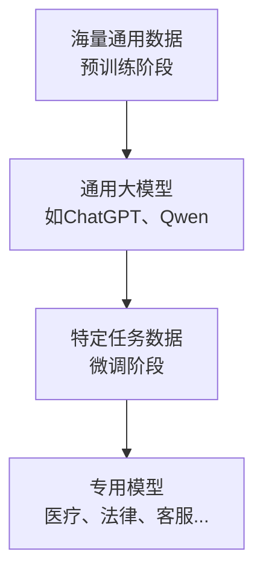

### 1.2 为什么需要微调

| 问题类型         | 具体表现                 | 解决方案 |
| ---------------- | ------------------------ | -------- |
| **没问清楚**     | 用户提问方式不标准       | 提示工程 |
| **缺乏背景知识** | 垂直领域专业知识不足     | RAG      |
| **能力不足**     | 通用能力无法满足特定场景 | 微调     |

### 1.3 两类微调场景对比

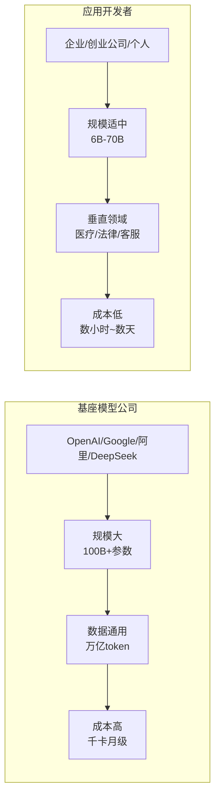

**关键区别**：

- 基座模型公司：目标是提升通用语言能力
- 应用开发者：目标是适配垂直领域和私域知识

---

## 2. 高效微调方法对比

### 2.1 常见高效微调方法一览

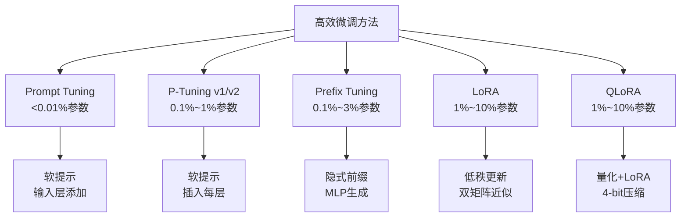

### 2.2 各方法详细对比

| 方法               | 可训练参数 | 核心思想                         | 适用场景                     |
| ------------------ | ---------- | -------------------------------- | ---------------------------- |
| **Prompt Tuning**  | <0.01%     | 在输入层添加可训练的"软提示"向量 | 超大模型(>10B)，资源极度受限 |
| **P-Tuning v1/v2** | 0.1%~1%    | 将软提示向量插入每层输入         | NLU任务(分类、阅读理解)      |
| **Prefix Tuning**  | 0.1%~3%    | 每层头部添加可训练向量           | NLG任务(对话、摘要、翻译)    |
| **LoRA**           | 1%~10%     | 用两个小矩阵近似权重更新         | **最流行，几乎全能**         |
| **QLoRA**          | 1%~10%     | 4-bit量化+LoRA                   | 单卡微调大模型(65B+)         |

### 2.3 为什么LoRA最流行

1. **参数效率高**：只训练1%-10%的参数
2. **效果好**：几乎能匹敌全量微调
3. **部署方便**：只需保存小文件(几十MB)
4. **可热插拔**：可同时加载多个LoRA权重

---

## 3. LoRA数学原理详解

### 3.1 核心问题

直接微调一个大模型（如7B参数）需要：

- 巨大的GPU显存
- 昂贵的计算成本
- 长时间的训练周期

### 3.2 LoRA的解决方案

**核心思想**：假设权重更新是"低秩"的

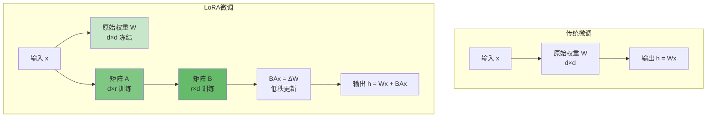

### 3.3 数学公式

**前向传播公式**：

$$h = Wx + BAx$$

其中：

- $W$：原始预训练权重矩阵（冻结不动）
- $A$：降维矩阵（d × r）
- $B$：升维矩阵（r × d）
- $r$：秩（远小于d，如8、16、64）

### 3.4 什么是"低秩"

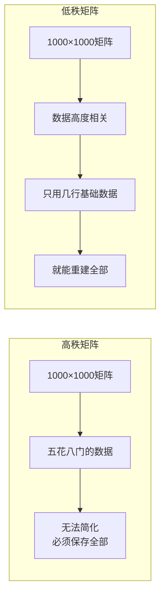

**生活中的类比**：

- 高秩：每个城市的独立天气数据
- 低秩：只需要"纬度"+"季节"等几个核心因素

### 3.5 为什么权重更新是低秩的

研究发现，微调产生的权重更新矩阵 $\Delta W$ 具有以下特点：

1. **奇异值衰减很快**：大部分奇异值接近零
2. **有效信息集中**：只在前几个最大奇异值对应的方向上
3. **冗余度高**：可以用很少的参数近似

这意味着：学习新任务所需的本质变化非常简单！

### 3.6 LoRA的优势总结

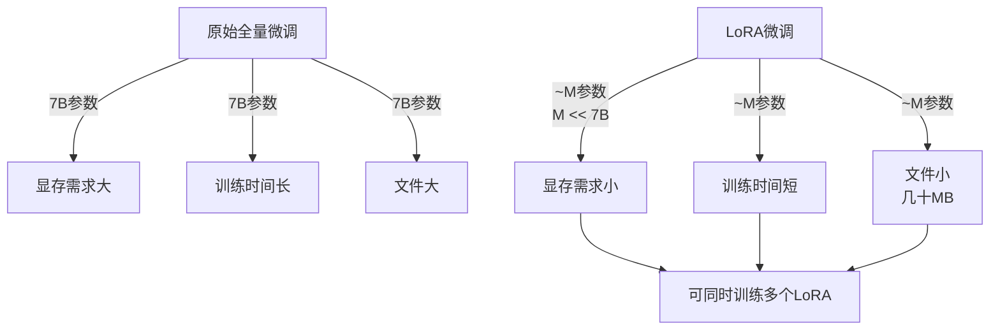

---

## 4. 矩阵分解与推荐系统

### 4.1 推荐系统问题背景

在推荐系统中，我们有一个**用户-商品评分矩阵**：

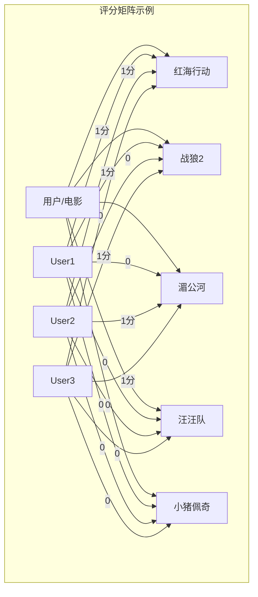

**问题**：矩阵是稀疏的（大量0），如何预测用户对未评分商品的喜好？

### 4.2 矩阵分解思想

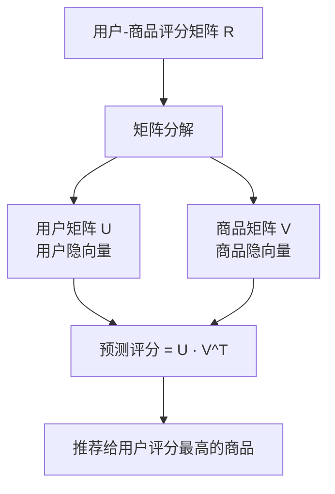

### 4.3 隐向量的含义

**用户向量**（以电影推荐为例）：

| 用户  | 动作分 | 动画分 | 爱情分 |
| ----- | ------ | ------ | ------ |
| User1 | 0.93   | -0.08  | 0.07   |
| User5 | 0.11   | 0.81   | -0.51  |

**含义**：User1喜欢动作片，User5喜欢动画片

**商品向量**：

| 类型 | 红海行动 | 战狼2 | 汪汪队 | 小猪佩奇 |
| ---- | -------- | ----- | ------ | -------- |
| 动作 | 0.99     | 0.99  | 0.23   | 0.03     |
| 动画 | 0.09     | -0.14 | 0.87   | 0.58     |
| 爱情 | 0.16     | 0.07  | -0.41  | -0.47    |

**预测评分** = 用户向量与商品向量的内积

### 4.4 矩阵分解的数学表达

**目标函数**：

$$\min_{U,V} \sum_{(u,i) \in R} (r_{ui} - u_i^T v_j)^2 + \lambda(||U||^2 + ||V||^2)$$

- $r_{ui}$：用户u对物品i的实际评分
- $u_i^T v_j$：预测评分（内积）
- $\lambda$：正则化项，防止过拟合

---

## 5. ALS交替最小二乘法

### 5.1 ALS算法流程

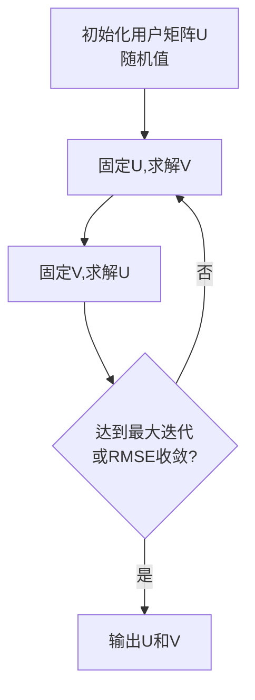

### 5.2 ALS核心公式

**固定Y优化X**：

$$x_u = (Y_u Y_u^T + \lambda I)^{-1} Y_u R_u$$

其中：

- $Y_u$：用户u评过分的商品向量
- $R_u$：用户u的评分向量

### 5.3 伪代码

```
输入: 评分矩阵R, 隐向量维度k, 最大迭代次数max_iter
输出: 用户矩阵U, 商品矩阵V

1. 随机初始化U (m × k)
2. FOR iter = 1 to max_iter:
3.     固定U, 求解V:
4.         FOR 每个商品j:
5.             V[j] = (U^T U + λI)^(-1) U^T * R[:, j]
6.     固定V, 求解U:
7.         FOR 每个用户i:
8.             U[i] = (V^T V + λI)^(-1) V^T * R[i, :]
9.     计算RMSE
10. RETURN U, V
```

### 5.4 RMSE评估指标

**MSE（均方误差）**：
$$MSE = \frac{1}{n} \sum (预测值 - 真实值)^2$$

**RMSE（均方根误差）**：
$$RMSE = \sqrt{MSE}$$

RMSE越小，说明预测越准确！

---

## 6. SVD奇异值分解

### 6.1 SVD定义

任意矩阵 $A$ 都可以分解为：

$$A = P \Sigma Q^T$$

- $P$：左奇异矩阵 (m × m)
- $\Sigma$：奇异值矩阵 (m × n)，对角矩阵
- $Q$：右奇异矩阵 (n × n)

### 6.2 SVD分解图解

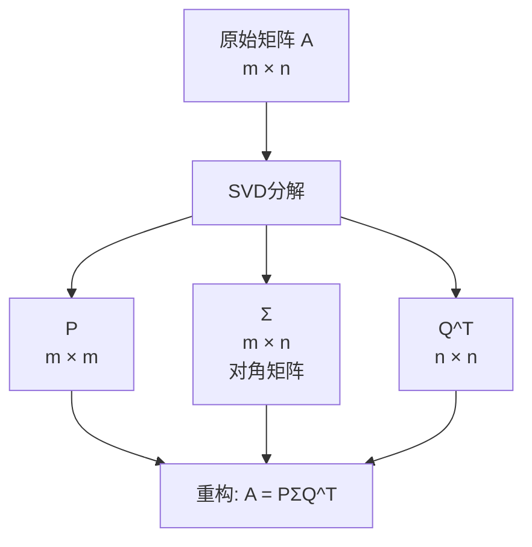

### 6.3 降维压缩原理

**关键发现**：奇异值衰减很快！

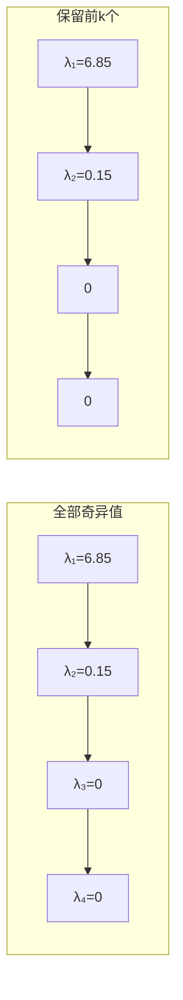

### 6.4 降维重构公式

$$A_k = P_k \Sigma_k Q_k^T$$

保留前k个最大的奇异值，其他设为0。

### 6.5 图像压缩示例

对于一张1440×1080的图片：

| 保留特征数 | 压缩效果   | 存储比例 |
| ---------- | ---------- | -------- |
| k=5        | 模糊       | ~0.5%    |
| k=50       | 基本可辨认 | ~5%      |
| k=500      | 较清晰     | ~50%     |
| k=1080     | 原图       | 100%     |

**SVD的神奇之处**：用8%的信息量还原95%的内容！

---

## 7. 实战代码示例

### 7.1 ALS推荐系统代码

```python
# ALS.py - 使用ALS进行矩阵分解的推荐系统
# 代码来源: ALS.py

from itertools import product, chain
from copy import deepcopy
import pandas as pd
import numpy as np
import random
from collections import defaultdict


class Matrix:
    """自定义矩阵类，实现基本的矩阵运算"""

    def __init__(self, data):
        self.data = data
        self.shape = (len(data), len(data[0]))

    def transpose(self):
        """矩阵转置"""
        data = list(map(list, zip(*self.data)))
        return Matrix(data)

    def mat_mul(self, B):
        """矩阵乘法"""
        assert self.shape[1] == B.shape[0], "维度不匹配!"
        return Matrix([
            [sum(a*b for a, b in zip(row_A, col_B))
             for col_B in zip(*B.data)]
            for row_A in self.data
        ])

    def inverse(self):
        """矩阵求逆（使用高斯消元法）"""
        assert self.is_square, "必须是方阵!"
        n = self.shape[0]
        # 构造增广矩阵 [A|I]
        aug = [self.data[i] + self._eye(n)[i] for i in range(n)]
        # 高斯消元...
        return Matrix(self._inverse(self.data))


class ALS:
    """交替最小二乘法矩阵分解"""

    def __init__(self):
        self.user_ids = None
        self.item_ids = None
        self.user_matrix = None
        self.item_matrix = None
        self.rmse = None

    def fit(self, X, k, max_iter=10):
        """
        训练ALS模型

        参数:
            X: 评分数据 [(user_id, item_id, rating), ...]
            k: 隐向量维度（秩）
            max_iter: 最大迭代次数
        """
        # 处理数据，构建稀疏矩阵
        ratings, ratings_T = self._process_data(X)
        m, n = self.shape

        # 随机初始化用户矩阵
        self.user_matrix = Matrix(np.random.rand(k, m).tolist())

        # 交替优化
        for i in range(max_iter):
            # 偶数迭代: 固定U，优化V
            if i % 2 == 0:
                users = self.user_matrix
                self.item_matrix = self._users_mul_ratings(
                    users.mat_mul(users.transpose).inverse.mat_mul(users),
                    ratings_T
                )
            # 奇数迭代: 固定V，优化U
            else:
                items = self.item_matrix
                self.user_matrix = self._items_mul_ratings(
                    items.mat_mul(items.transpose).inverse.mat_mul(items),
                    ratings
                )

            # 计算RMSE
            rmse = self._get_rmse(ratings)
            print(f"迭代次数: {i+1}, RMSE: {rmse:.6f}")

        self.rmse = rmse

    def predict(self, user_id, n_items=10):
        """
        为用户推荐Top-N商品

        参数:
            user_id: 用户ID
            n_items: 推荐数量
        返回:
            [(item_id, score), ...] 按评分降序
        """
        # 获取用户向量
        user_idx = self.user_ids_dict[user_id]
        user_vec = self.user_matrix.col(user_idx).transpose.data[0]

        # 计算所有商品的预测评分
        scores = []
        for j, item_id in enumerate(self.item_ids):
            item_vec = self.item_matrix.col(j).data
            score = sum(u*v for u, v in zip(user_vec, [row[0] for row in item_vec]))
            scores.append((item_id, score))

        # 过滤已评分的商品，按评分降序排列
        viewed = self.user_items[user_id]
        scores = [(i, s) for i, s in scores if i not in viewed]
        scores.sort(key=lambda x: x[1], reverse=True)

        return scores[:n_items]


# ============ 使用示例 ============

def load_ratings(filename):
    """加载评分数据"""
    data = []
    with open(filename) as f:
        next(f)  # 跳过表头
        for line in f:
            parts = line.strip().split(',')
            if len(parts) >= 3:
                user_id = int(parts[0])
                item_id = int(parts[1])
                rating = float(parts[2])
                data.append([user_id, item_id, rating])
    return data


# 训练模型
print("=" * 50)
print("使用ALS算法进行推荐系统训练")
print("=" * 50)

model = ALS()
X = load_ratings('./ratings_small.csv')
model.fit(X, k=3, max_iter=20)

# 为用户推荐
print("\n" + "=" * 50)
print("为用户进行推荐")
print("=" * 50)

user_ids = range(1, 13)
predictions = model.predict(user_ids, n_items=2)

for user_id, prediction in zip(user_ids, predictions):
    items = [f"商品{item[0]}(分数:{item[1]:.2f})" for item in prediction]
    print(f"用户{user_id}的推荐: {items}")
```

### 7.2 SVD图像压缩代码

```python
# image_svd.py - 使用SVD进行图像压缩
# 代码来源: image_svd.py

import numpy as np
from scipy.linalg import svd
from PIL import Image
import matplotlib.pyplot as plt


def compress_image(A, k):
    """
    使用SVD压缩图像

    参数:
        A: 图像矩阵 (m × n)
        k: 保留的奇异值个数
    返回:
        压缩后的矩阵
    """
    # SVD分解: A = P @ S @ Q
    P, S, Q = svd(A, full_matrices=False)

    # 只保留前k个奇异值
    S_k = np.zeros(len(S))
    S_k[:k] = S[:k]

    # 重构矩阵
    S_full = np.diag(S_k)
    A_compressed = P @ S_full @ Q

    return A_compressed


def main():
    # 加载256色灰度图像
    image = Image.open('./256.bmp')
    A = np.array(image)

    print(f"原图尺寸: {A.shape}")
    print("=" * 50)

    # 显示原图
    plt.figure(figsize=(12, 3))
    plt.subplot(1, 4, 1)
    plt.imshow(A, cmap='gray')
    plt.title(f'原图\n{A.shape}')
    plt.axis('off')

    # 测试不同的k值
    k_values = [5, 50, 500]

    for i, k in enumerate(k_values):
        # 压缩
        A_compressed = compress_image(A, k)

        # 计算压缩比
        compression_ratio = k / min(A.shape)

        # 显示
        plt.subplot(1, 4, i + 2)
        plt.imshow(A_compressed, cmap='gray')
        plt.title(f'k={k}\n压缩比:{compression_ratio:.1%}')
        plt.axis('off')

        # 计算误差
        error = np.linalg.norm(A - A_compressed) / np.linalg.norm(A)
        print(f"k={k:4d}: 压缩比={compression_ratio:.2%}, 重构误差={error:.4f}")

    plt.tight_layout()
    plt.savefig('svd_compression_result.png')
    plt.show()


if __name__ == '__main__':
    main()
```

### 7.3 运行结果解读

**ALS训练输出示例**：

```
迭代次数: 1, RMSE: 3.379403
迭代次数: 2, RMSE: 0.398586
迭代次数: 3, RMSE: 0.387863
迭代次数: 4, RMSE: 0.382640
迭代次数: 5, RMSE: 0.379231
迭代次数: 6, RMSE: 0.376987
迭代次数: 7, RMSE: 0.375103
```

**观察**：

- RMSE逐渐下降，说明模型在学习
- 下降速度越来越慢，逐渐收敛

**SVD压缩输出示例**：

```
原图尺寸: (1080, 1440)
k=   5: 压缩比=0.46%, 重构误差=0.0892
k=  50: 压缩比=4.63%, 重构误差=0.0312
k= 500: 压缩比=46.30%, 重构误差=0.0056
```

---

## 8. 常见问题与解答

### Q1: LoRA和全量微调哪个更好？

**答**：取决于场景

| 场景             | 推荐方法         |
| ---------------- | ---------------- |
| 资源受限（单卡） | LoRA/QLoRA       |
| 追求极致效果     | 全量微调         |
| 快速实验         | LoRA             |
| 需要多任务切换   | LoRA（可热插拔） |

### Q2: 如何选择LoRA的秩(r)？

**答**：秩越大，表达能力越强，但：

- 需要更多训练数据
- 训练时间更长
- 可能过拟合

**经验法则**：

- 小数据集：r=4~8
- 中等数据集：r=8~16
- 大数据集：r=16~64

### Q3: 微调后模型变"傻"了怎么办？

**答**：

1. **使用Checkpoint回退**：保存训练过程中的多个版本
2. **增加预训练数据比例**：混合通用数据和垂类数据
3. **减少训练轮次**：防止过拟合
4. **调整学习率**：使用更低的学习率

### Q4: 训练数据需要多少？

**答**：与秩的平方成正比

| 模型参数 | 推荐数据量 |
| -------- | ---------- |
| 7B       | 1k~100k    |
| 13B      | 10k~1M     |
| 70B      | 100k~10M   |

### Q5: 为什么SVD分解可以压缩图像？

**答**：

1. 自然图像的信息高度冗余
2. 大部分奇异值接近零
3. 保留前k个最大奇异值，就能保留大部分信息
4. 这就是"低秩近似"的思想

---

## 9. 知识点总结图

### 9.1 完整知识体系

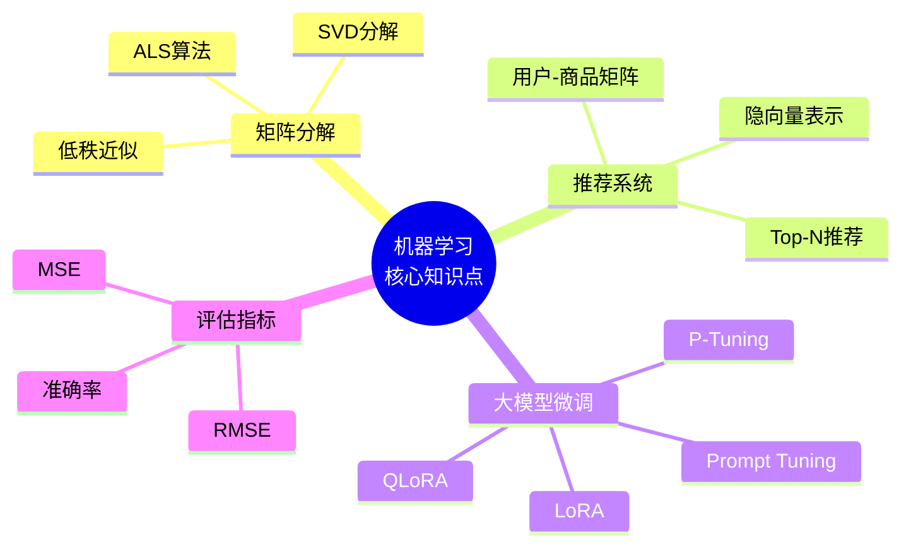

### 9.2 算法选择决策树

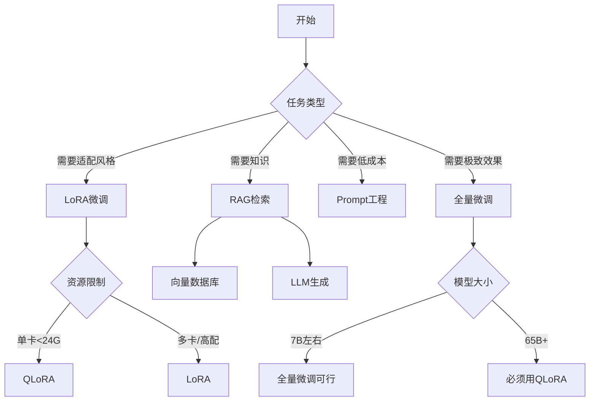

---

## 附录：关键公式速查表

| 名称             | 公式                                         | 说明              |
| ---------------- | -------------------------------------------- | ----------------- |
| **LoRA前向传播** | $h = Wx + BAx$                               | W冻结，BA为可训练 |
| **矩阵分解目标** | $\min \sum(r_{ui} - u_i^T v_j)^2$            | 最小化预测误差    |
| **ALS求解U**     | $x_u = (Y_u Y_u^T + \lambda I)^{-1} Y_u R_u$ | 固定V求U          |
| **SVD分解**      | $A = P\Sigma Q^T$                            | 任意矩阵分解      |
| **降维重构**     | $A_k = P_k \Sigma_k Q_k^T$                   | 保留前k个奇异值   |
| **RMSE**         | $\sqrt{\frac{1}{n}\sum(\hat{y}-y)^2}$        | 评估预测精度      |

