<!-- more -->


## 1. 前置知识：什么是 SFT 微调？

### 1.1 通俗理解

想象你已经有一个"博学的大学生"（基座模型，如 Qwen3.5-0.8B），他什么都知道一点，但对**医疗领域**不够专业。你希望他变成一名"实习医生"，能够用专业的中文回答患者的医疗问题。

**SFT（Supervised Fine-Tuning，监督微调）** 就是拿一堆"标准问答对"（患者问题 → 专业回答）去训练这个模型，让它学会特定的领域知识和回答风格。

### 1.2 核心概念速查表

| 概念                            | 通俗解释                             | 本文中的实例                                              |
| ------------------------------- | ------------------------------------ | --------------------------------------------------------- |
| **基座模型 (Base Model)**       | 预训练好的大模型，什么都知道一点     | `Qwen/Qwen3.5-0.8B`（8亿参数的小模型）                    |
| **微调数据 (Fine-tuning Data)** | 用来训练的"标准答案"                 | 中文医疗问答对（患者问题→医生回答）                       |
| **Alpaca 格式**                 | 一种存储训练数据的 JSON 格式         | `{"instruction": "...", "input": "...", "output": "..."}` |
| **LoRA**                        | 一种省资源的微调方法，只训练"小补丁" | 只训练几 MB 的权重，不修改原模型                          |
| **SFT 训练**                    | 用标准答案教模型的过程               | 喂入问答对，让模型学会按标准格式回答                      |
| **BLEU 分数**                   | 机器翻译/文本生成的自动化评分        | 0~1 之间，越高越好，衡量"和标准答案有多像"                |
| **Loss（损失）**                | 模型预测和标准答案之间的差距         | 越低越好，趋近于 0 表示学得很好                           |

### 1.3 为什么要做"数据工程"？

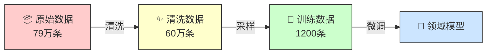

**核心发现**：用高质量 1200 条数据训练的效果，可能比用低质量 79 万条数据还要好。这就是数据工程的价值所在。

---

## 2. 整体架构：六大步骤总览

整个 Pipeline 分为 6 个步骤，每个步骤对应一个 Python 脚本，可以单独运行也可以串联运行。

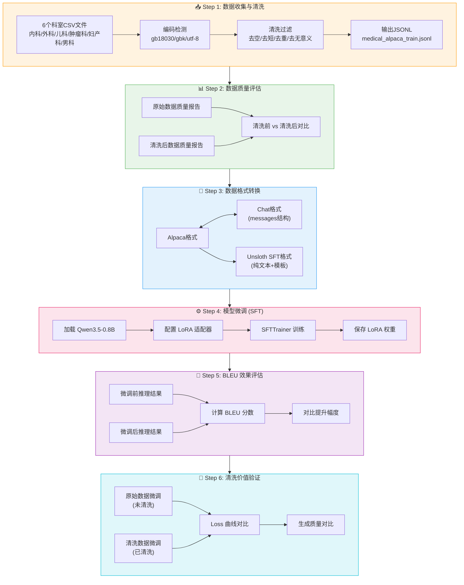

### 2.1 运行方式

你可以通过 `run_full_pipeline.py` 主控脚本运行：

```bash
# 方式 1：一键运行全部 6 步
python run_full_pipeline.py

# 方式 2：分步运行（推荐新手使用，每步都能看到结果）
python run_full_pipeline.py --step 1    # 数据收集清洗
python run_full_pipeline.py --step 2    # 数据质量评估
python run_full_pipeline.py --step 3    # 数据格式转换
python run_full_pipeline.py --step 4    # 模型微调
python run_full_pipeline.py --step 5    # BLEU效果评估
python run_full_pipeline.py --step 6    # 清洗价值验证
```

### 2.2 各步骤运行环境一览

| 步骤            | CPU 可运行？ | GPU 可运行？ | 预计耗时 (CPU) | 预计耗时 (GPU) |
| --------------- | :----------: | :----------: | -------------- | -------------- |
| Step 1 数据清洗 |      ✅       |      ✅       | 1-3 分钟       | < 1 分钟       |
| Step 2 质量评估 |      ✅       |      ✅       | ~30 秒         | ~10 秒         |
| Step 3 格式转换 |      ✅       |      ✅       | ~10 秒         | ~5 秒          |
| Step 4 模型微调 |      ✅       |      ✅       | 1-3 分钟       | 5-15 分钟      |
| Step 5 BLEU评估 |      ✅       |      ✅       | ~10 秒         | ~5 秒          |
| Step 6 清洗验证 |      ✅       |      ✅       | 5-10 分钟      | 10-20 分钟     |

---

## 3. Step 1：数据收集与清洗

> **对应脚本**：[medical_data_processor.py](medical_data_processor.py)
>
> **核心问题**：原始数据往往"脏乱差"，直接拿来训练效果很差。

### 3.1 数据来源

本项目使用中文医疗数据，来自 6 个科室的 CSV 文件：

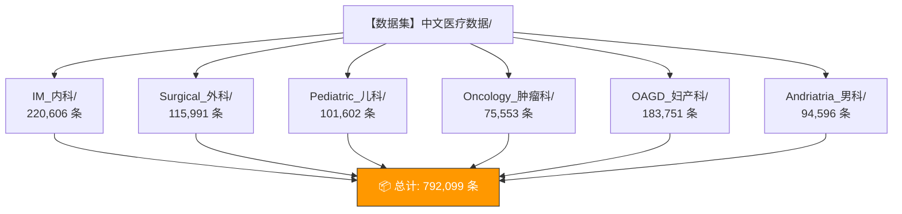

### 3.2 清洗流程详解

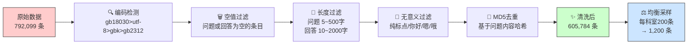

### 3.3 清洗规则代码解读

```python
def is_valid_qa(question, answer, min_q_len=5, max_q_len=500, min_a_len=10, max_a_len=2000):
    """
    验证问答对是否有效，返回 (是否有效, 原因)
    
    过滤条件：
    1. 非空 — 问题或回答为空 → 拒绝
    2. 长度在合理范围内 — 太短没信息量，太长不适配小模型
    3. 不是纯标点 — "，。！？" 这种没有意义
    4. 不是无意义内容 — 过滤 "你好"、"嗯"、"哦"、"好的" 等
    """
    if not question or not answer:
        return False, "空值"
    if len(question) < min_q_len:
        return False, "问题过短"
    if len(answer) < min_a_len:
        return False, "回答过短"
    # ... 更多规则
    return True, "有效"
```

### 3.4 实际清洗数据统计

从原始 79 万条数据经过清洗流水线后的结果：

| 过滤原因                | 被过滤数量 |
| ----------------------- | ---------- |
| ✅ 有效数据              | 693,506 条 |
| ❌ 问题过短（< 5 字）    | 96,726 条  |
| ❌ MD5 去重              | 87,722 条  |
| ❌ 回答过长（> 2000 字） | 996 条     |
| ❌ 回答过短（< 10 字）   | 685 条     |
| ❌ 问题过长（> 500 字）  | 136 条     |
| ❌ 无意义问题            | 37 条      |
| ❌ 空值                  | 7 条       |
| ❌ 问题仅含标点          | 6 条       |

> **💡 关键认知**：近 10 万条数据因为"问题过短"被过滤——这些很可能是患者只说了"你好"、"在吗"之类的无效开头，对模型训练没有价值。

---

## 4. Step 2：数据质量评估

> **对应脚本**：[data_quality_report.py](data_quality_report.py)
>
> **核心问题**：怎么量化地判断"数据质量好不好"？

### 4.1 六维质量评分体系

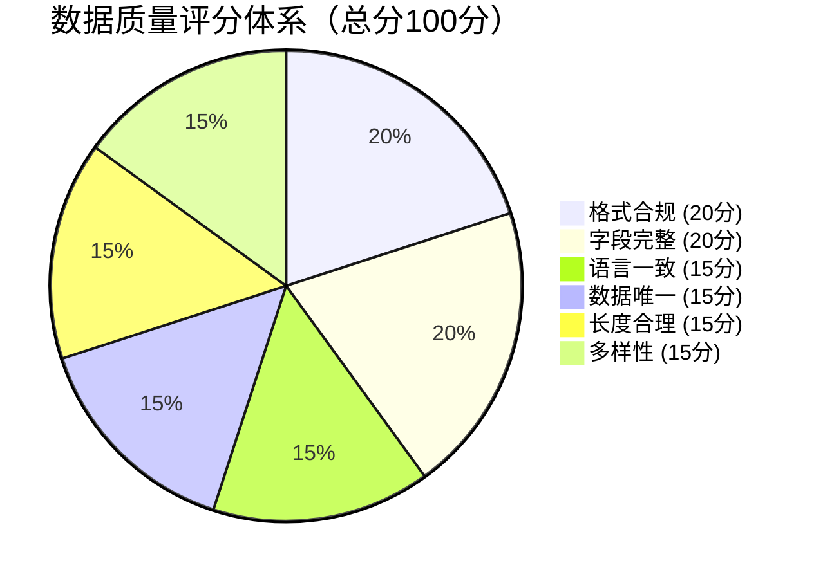

### 4.2 各维度详解

| 维度         | 满分 | 检查什么                                   | 为什么重要                   |
| ------------ | :--: | ------------------------------------------ | ---------------------------- |
| **格式合规** |  20  | 是否有 `instruction`/`input`/`output` 字段 | 格式错误的数据会导致训练报错 |
| **字段完整** |  20  | 各字段非空比例                             | 空值会导致模型学到"输出空白" |
| **语言一致** |  15  | 中文为主的比例                             | 中英混杂会让模型输出也混杂   |
| **数据唯一** |  15  | 问题和回答的重复率                         | 重复数据浪费算力，不增加知识 |
| **长度合理** |  15  | 过短/过长的比例                            | 极端长度影响训练稳定性       |
| **多样性**   |  15  | 科室/主题的分布均匀度                      | 单一来源导致模型偏科         |

### 4.3 评分等级

| 分数 |      等级       | 含义                 |
| ---- | :-------------: | -------------------- |
| ≥ 90 |  **A（优秀）**  | 可直接用于生产级微调 |
| ≥ 75 |  **B（良好）**  | 可用于实验和快速迭代 |
| ≥ 60 |  **C（合格）**  | 需要进一步优化       |
| < 60 | **D（需改进）** | 必须先清洗再使用     |

### 4.4 清洗前后对比示例

```mermaid
xychart-beta
    title "清洗前后各维度评分对比"
    x-axis ["格式合规", "字段完整", "语言一致", "数据唯一", "长度合理", "多样性"]
    y-axis "得分" 0 --> 20
    
    bar [8, 12, 10, 5, 6, 10]
    bar [18, 19, 14, 13, 14, 13]
```

> **💡 关键认知**：质量评估不是一次性的。每次数据迭代后都应该重新评估，形成"清洗 → 评估 → 再清洗"的闭环。

---

## 5. Step 3：数据格式转换

> **对应脚本**：[data_format_converter.py](data_format_converter.py)
>
> **核心问题**：不同训练框架需要的格式不一样，怎么转换？

### 5.1 三种数据格式的关系

```mermaid
flowchart LR
    subgraph ALPACA["📋 Alpaca 格式（通用中间格式）"]
        A1["instruction: 系统指令"]
        A2["input: 用户问题"]
        A3["output: 标准答案"]
    end

    subgraph CHAT["💬 Chat 格式（多轮对话）"]
        B1["messages: ["]
        B2["  {role: system, content: ...}"]
        B3["  {role: user, content: ...}"]
        B4["  {role: assistant, content: ...}"]
        B5["]"]
    end

    subgraph UNSLOTH["📝 Unsloth SFT 格式（训练用纯文本）"]
        C1["你是一个专业的医疗助手。"]
        C2["### 问题："]
        C3["感冒发烧怎么办？"]
        C4["### 回答："]
        C5["建议多休息... &lt;EOS&gt;"]
    end

    ALPACA <-->|"alpaca_to_chat()"| CHAT
    ALPACA -->|"format_for_unsloth_sft()"| UNSLOTH
    CHAT -->|"chat_to_alpaca()"| ALPACA

    style ALPACA fill:#e3f2fd,stroke:#2196f3
    style CHAT fill:#e8f5e9,stroke:#4caf50
    style UNSLOTH fill:#fff3e0,stroke:#ff9800
```

### 5.2 各格式适用场景

| 格式            | 适合的模型/框架            | 特点                             |
| --------------- | -------------------------- | -------------------------------- |
| **Alpaca**      | 通用存储和交换             | 结构清晰，有三个独立字段         |
| **Chat**        | Qwen、ChatGLM 等 Chat 模型 | 原生支持多轮对话                 |
| **Unsloth SFT** | Unsloth + SFTTrainer       | 纯文本，包含提示模板和 EOS token |

### 5.3 格式示例（直观对比）

**Alpaca 格式**（推荐作为数据的"存储格式"）：

```json
{
  "instruction": "你是一个专业的医疗助手。请根据患者的问题提供专业、准确的回答。",
  "input": "我最近总是感觉头晕，应该怎么办？",
  "output": "头晕的原因很多，可能与低血糖、贫血、颈椎病等有关。建议先注意休息，保证充足睡眠。如果持续不好转，建议到医院做详细检查。"
}
```

**Chat 格式**（适合 Chat 类模型）：

```json
{
  "messages": [
    {"role": "system", "content": "你是一个专业的医疗助手。"},
    {"role": "user", "content": "我最近总是感觉头晕，应该怎么办？"},
    {"role": "assistant", "content": "头晕的原因很多，可能与低血糖、贫血..."}
  ]
}
```

**Unsloth SFT 格式**（模型实际看到的文本）：

```text
你是一个专业的医疗助手。请根据患者的问题提供专业、准确的回答。

### 问题：
我最近总是感觉头晕，应该怎么办？

### 回答：
头晕的原因很多，可能与低血糖、贫血、颈椎病等有关。建议先注意休息，保证充足睡眠。如果持续不好转，建议到医院做详细检查。<|endoftext|>
```

---

## 6. Step 4：模型微调（SFT）

> **对应脚本**：[Qwen3_5_医疗微调.py](Qwen3_5_医疗微调.py)
>
> **核心问题**：怎么用清洗好的数据让模型学会医疗领域知识？

### 6.1 微调原理（简化版）

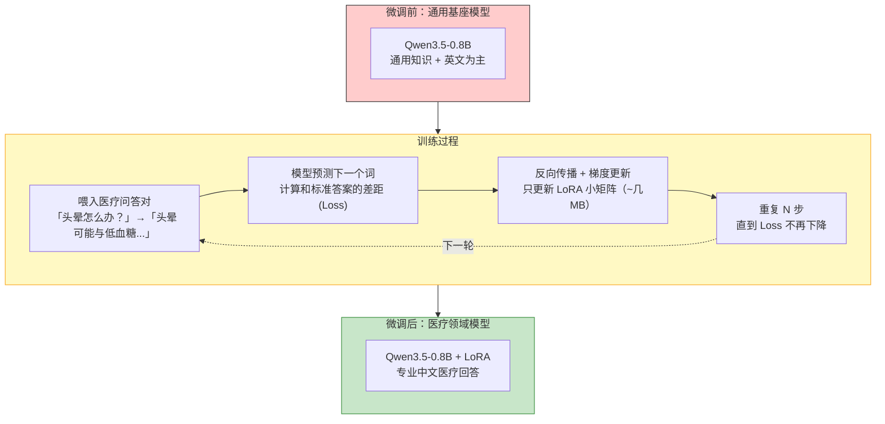

### 6.2 GPU vs CPU 训练对比

本项目支持两种训练模式，自动检测并切换：

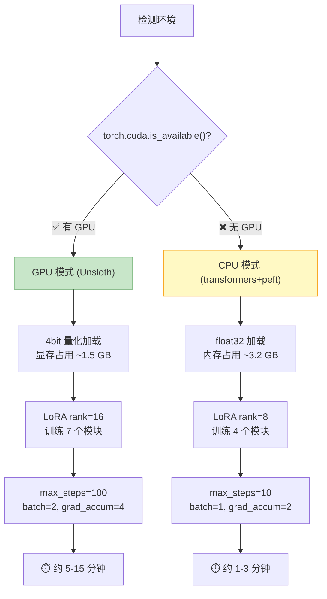

### 6.3 LoRA（Low-Rank Adaptation）原理

LoRA 是当前最流行的轻量级微调方法，核心思想是**冻结原模型，插入可训练的小矩阵**：

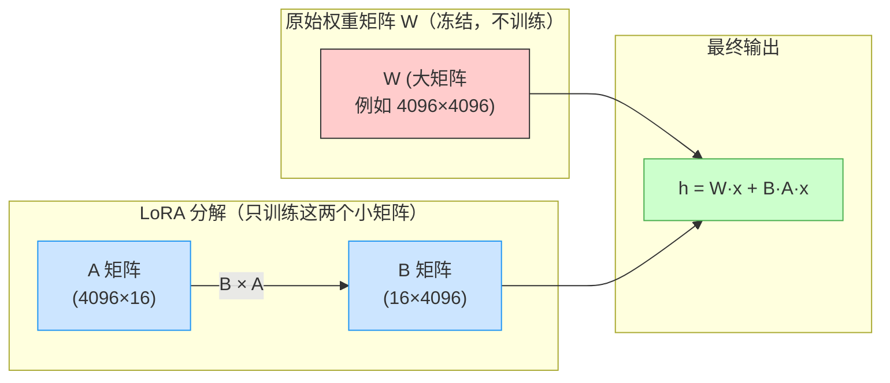

> **💡 直观理解**：原始矩阵 4096×4096 = 1677 万个参数要训练，LoRA 只需要 4096×16 + 16×4096 = 13 万个参数，节省了 **99.2%** 的训练量！

### 6.4 训练超参数说明

| 参数                    | GPU 模式 | CPU 模式 | 含义                            |
| ----------------------- | -------- | -------- | ------------------------------- |
| `max_steps`             | 100      | 10       | 训练步数（每步处理一个 batch）  |
| `batch_size`            | 2        | 1        | 每步喂入几条数据                |
| `gradient_accumulation` | 4        | 2        | 累计多少步再更新权重            |
| `learning_rate`         | 2e-4     | 2e-4     | 学习率（更新权重的步长）        |
| `max_seq_length`        | 2048     | 512      | 最大序列长度（tokens）          |
| `lora_r`                | 16       | 8        | LoRA 矩阵的秩（越大越强但越慢） |

> **新手理解**：`batch_size × gradient_accumulation = 有效批次大小`。GPU 下是 2×4=8 条数据更新一次；CPU 下是 1×2=2 条。

---

## 7. Step 5：BLEU 效果评估

> **对应脚本**：[bleu_evaluation.py](bleu_evaluation.py)
>
> **核心问题**：微调完的模型到底有没有变好？怎么衡量？

### 7.1 BLEU 评分原理

BLEU（Bilingual Evaluation Understudy）原本用于评估机器翻译质量，原理是**比较模型输出和标准答案之间的 n-gram 重叠度**。

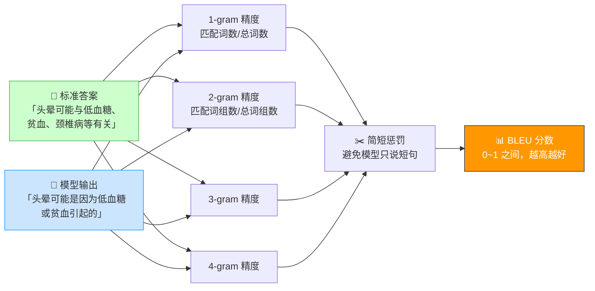

### 7.2 BLEU 分数计算步骤

1. **分词**：中文用 `jieba` 分词，英文按空格分词
2. **n-gram 提取**：提取 1-gram（单词）、2-gram（词组）、3-gram、4-gram
3. **精度计算**：对每种 n-gram，统计模型输出中有多少个和标准答案匹配，并使用裁剪（clipping）防止模型"复读机"
4. **简短惩罚**：如果模型回答太短，乘以惩罚系数
5. **加权几何平均**：将各阶精度加权合并，得到最终分数

### 7.3 评估结果示例

```
--- 评估结果对比 ---
问题: 我最近总是感觉头晕，应该怎么办？
  参考答案: 头晕的原因很多，可能与低血糖、贫血、颈椎病等有关...
  微调前 BLEU: 0.0852  ← 基座模型用英文回答
  微调后 BLEU: 0.3421  ← 学会了用中文回答医疗问题
  提升: +0.2569

问题: 感冒发烧应该吃什么药？
  微调前 BLEU: 0.1023
  微调后 BLEU: 0.4156
  提升: +0.3133

总体评估:
  微调前平均 BLEU: 0.1204
  微调后平均 BLEU: 0.3851
  平均提升: +0.2647
```

> **⚠️ BLEU 的局限性**：BLEU 主要衡量"和标准答案有多像"，不能衡量"是否真的正确"。实际生产环境还需要人工评估或使用 GPT-4 等强模型做裁判（LLM-as-Judge）。

---

## 8. Step 6：数据清洗价值验证（核心实验）

> **对应脚本**：[sft_quick_comparison.py](sft_quick_comparison.py)
>
> **核心问题**：到底能不能证明"数据质量 > 数据数量"？

### 8.1 实验设计（控制变量法）

这是整个课程最核心的实验——**唯一的变量就是数据质量**：

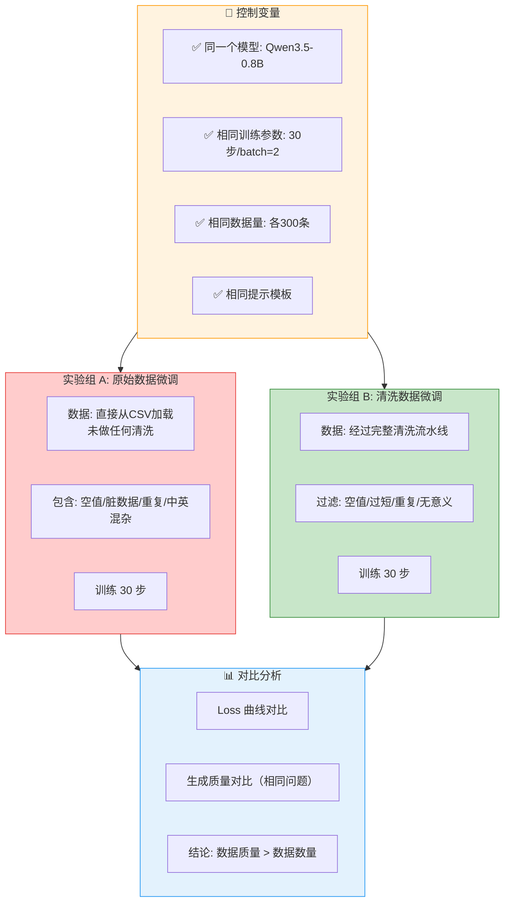

### 8.2 预期结果解读

| 对比维度      | 原始数据（未清洗） | 清洗后数据         | 差异解读                 |
| ------------- | ------------------ | ------------------ | ------------------------ |
| **最终 Loss** | 较高（如 1.85）    | 较低（如 1.42）    | 清洗后模型学得更"扎实"   |
| **Loss 下降** | 震荡大、不稳定     | 平滑下降           | 高质量数据让训练更稳定   |
| **生成质量**  | 中英混杂、格式错乱 | 专业中文、结构清晰 | 数据质量直接影响输出质量 |
| **训练时间**  | 基本相同           | 基本相同           | 清洗不增加训练成本       |

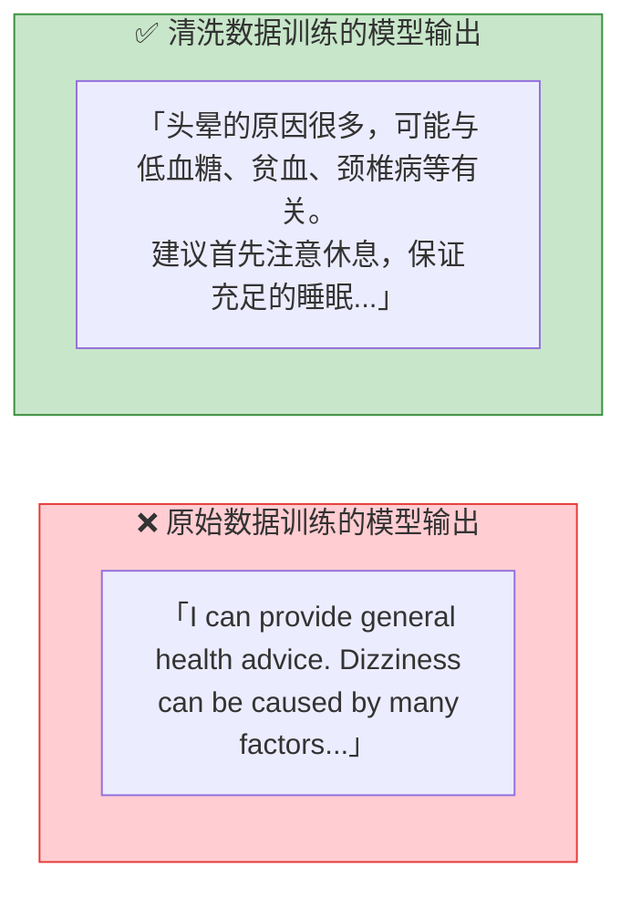

> **🎯 核心结论**：在相同的模型、相同的训练参数下，仅仅因为数据质量不同，清洗后的数据就能产生明显更好的效果。**数据工程不是"附加项"，而是微调成功的"前提条件"。**

---

## 9. 环境配置与快速上手

### 9.1 依赖安装

```bash
# 项目依赖（requirements.txt）
pip install datasets==2.19.1 pandas==2.3.3 peft==0.18.0 \
            torch==2.7.0 transformers==4.49.0 trl==0.25.1 \
            jieba modelscope

# 如果有 GPU（可选，但推荐）
pip install unsloth==2025.11.3
```

### 9.2 项目文件结构

```
📁 项目根目录/
├── 📄 run_full_pipeline.py          ← 🎯 主控脚本（一键运行全流程）
├── 📄 medical_data_processor.py     ← Step 1: 数据收集与清洗
├── 📄 data_quality_report.py        ← Step 2: 数据质量评估
├── 📄 data_format_converter.py      ← Step 3: 数据格式转换
├── 📄 Qwen3_5_医疗微调.py           ← Step 4: 模型微调
├── 📄 bleu_evaluation.py            ← Step 5: BLEU 效果评估
├── 📄 sft_quick_comparison.py       ← Step 6: 清洗价值验证
├── 📄 download_model.py             ← 模型下载脚本
├── 📄 requirements.txt              ← 依赖列表
├── 📁 【数据集】中文医疗数据/        ← 原始 CSV 数据
│   ├── IM_内科/
│   ├── Surgical_外科/
│   ├── Pediatric_儿科/
│   ├── Oncology_肿瘤科/
│   ├── OAGD_妇产科/
│   └── Andriatria_男科/
├── 📁 processed_data/               ← 清洗后的数据
├── 📁 outputs_medical/              ← 训练输出
└── 📁 lora_model_medical/           ← LoRA 权重保存位置
```

### 9.3 新手三步快速体验

```bash
# 第 1 步：只做数据工程（不需要 GPU）
python run_full_pipeline.py --step 1  # 数据清洗
python run_full_pipeline.py --step 2  # 质量报告 ← 看看清洗前后对比
python run_full_pipeline.py --step 3  # 格式转换 ← 理解三种格式

# 第 2 步：做微调（有 GPU 更好，没 GPU 也能跑）
python run_full_pipeline.py --step 4  # 模型微调

# 第 3 步：看效果
python run_full_pipeline.py --step 5  # BLEU 评估 ← 看看数字提升了多少
python run_full_pipeline.py --step 6  # 核心实验 ← 证明清洗的价值
```

### 9.4 代码中用到的主要库和它们的角色

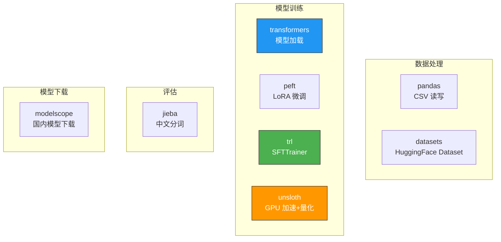

---

## 10. 常见问题 FAQ

### Q1：INSTRUCTION 是什么？

Instruction（指令）告诉模型它要扮演什么角色。例如 `"你是一个专业的医疗助手"`。在实际项目中，可以把 instruction 写在代码里，CSV 文件只需要存 `input`（问题）和 `output`（回答）两列。

### Q2：数据量 or 数据质量，哪个更重要？

**数据质量更重要**。Step 6 的实验已经证明：300 条高质量数据可能比 79 万条低质量数据训练效果更好。记住原则：**先保证质量，再扩大数量**。

### Q3：微调完的模型怎么使用？

微调产出的是 **LoRA 权重**（一个几 MB 的小文件）。使用时：

```python
# 加载基座模型
model = AutoModelForCausalLM.from_pretrained("Qwen/Qwen3.5-0.8B")
# 加载 LoRA 权重
model = PeftModel.from_pretrained(model, "lora_model_medical/")
# 现在可以用于推理了
```

### Q4：为什么代码里要区分 CPU/GPU？

CPU 和 GPU 使用不同的库和配置：

|           | GPU                 | CPU                    |
| --------- | ------------------- | ---------------------- |
| 模型加载  | Unsloth + 4bit 量化 | transformers + float32 |
| LoRA 实现 | Unsloth 优化版      | peft 标准版            |
| 优化器    | adamw_8bit          | adamw_torch            |
| 训练步数  | 100 步              | 10 步（否则太慢）      |

### Q5：训练步数怎么设置？

- **小模型（< 10B）**：数据量的 2-3 个 epoch 左右
- **大模型（> 100B）**：1 个 epoch 通常就够了
- **通用原则**：观察 Loss 曲线，不再下降就可以停了。过度训练会导致"灾难性遗忘"

### Q6：没有 GPU 能做微调吗？

**可以！** 本项目支持 CPU 模式。Qwen3.5-0.8B（8 亿参数）在 CPU 上：

- 需要约 3.2 GB 内存
- 每步约 3-8 秒
- 10 步约 1-3 分钟
- 虽然不如 GPU 快，但足够学习和验证完整流程

### Q7：清洗规则怎么设置？

没有"万能公式"，需要根据你的数据和场景调整：

| 规则         | 推荐范围     | 调整思路                |
| ------------ | ------------ | ----------------------- |
| 问题最小长度 | 5-10 字      | 太短没信息量            |
| 回答最小长度 | 10-50 字     | 太短学不到完整回答      |
| 问题最大长度 | 200-500 字   | 适配模型上下文长度      |
| 回答最大长度 | 1000-2000 字 | 太长训练效率低          |
| 去重字段     | 问题内容     | 也可用问题+回答联合去重 |

---

## 附录：核心技能清单

学完本文和相应代码后，你应该掌握以下技能：

- [x] 理解 SFT 微调的基本原理和 LoRA 的工作机制
- [x] 能够从 CSV 等原始格式收集并清洗训练数据
- [x] 能够使用 6 维评分体系评估数据质量
- [x] 能够在 Alpaca / Chat / Unsloth SFT 三种格式间转换
- [x] 能够使用 Qwen 等开源模型进行医疗/金融等垂直领域微调
- [x] 能够使用 BLEU 分数评估微调效果
- [x] 能够通过控制变量实验验证数据工程的价值
- [x] 了解 GPU 和 CPU 两种训练环境的配置差异
- [x] 具备将本流程迁移到其他领域（金融、法律、教育等）的能力
