<!-- more -->

## 一、前置知识扫盲

### 1.1 什么是大语言模型（LLM）

**类比理解：一个读过海量书籍的"超级学霸"**

想象你有一个朋友，他从小就把整个互联网上的文章、书籍、对话全部读了一遍。当你问他任何问题时，他能根据自己读过的内容，预测出最合理的回答。大语言模型（Large Language Model，简称LLM）就是这样一种AI程序——它通过"阅读"海量文本数据，学会了理解人类语言并生成回复。

> 🏭 **工业界的叫法**：你可能会听到"GPT"、"Qwen"、"DeepSeek"、"LLaMA"这些名字，它们都是不同公司或团队训练出来的大语言模型，就像不同学校培养出来的学霸，各有特长。

**核心概念：**

| 术语                       | 通俗解释                                                     |
| -------------------------- | ------------------------------------------------------------ |
| **Token（词元）**          | 模型处理文本的最小单位。一个中文字 ≈ 1-2个token，一个英文单词 ≈ 1-3个token。可以把token理解为"阅读时的最小片段" |
| **参数（Parameter）**      | 模型内部的"记忆单元"数量。7B = 70亿个参数。参数越多，模型"脑容量"越大，但也越消耗计算资源 |
| **预训练（Pre-training）** | 让模型在海量文本上"自学"的过程。相当于学霸的"九年义务教育"阶段 |
| **推理（Inference）**      | 模型根据输入生成输出的过程。相当于你问学霸一个问题，他思考后给出答案 |

### 1.2 什么是模型微调（Fine-tuning）

**类比理解：给一个通才学霸做"专科进修"**

预训练出来的模型是一个"通才"——它什么都懂一点，但都不精通。微调就是在这个通才的基础上，用特定领域的数据进行"专科培训"，让它成为某个领域的专家。

```
预训练（通才教育）         微调（专科进修）
─────────────────────    ─────────────────────
读遍全网文章              学习医学问答数据
→ 什么都能聊               → 成为医疗咨询专家
→ 但专业深度不够            → 专业回答准确率大幅提升
```

**微调与预训练的关系：**

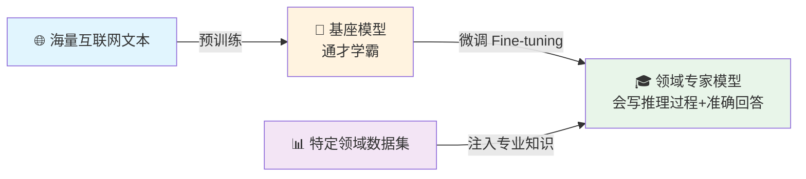

> 💡 **关键理解**：微调不是让模型"从头学起"，而是在它已有的知识基础上做"针对性加强"。就像一位医生去进修心脏外科——他本来就有医学基础，只是需要精进某个细分方向。

### 1.3 什么是知识蒸馏（Knowledge Distillation）

**类比理解：老教授 → 年轻教师的"教学传承"**

想象一位经验丰富的老教授（**教师模型**，参数很大，如671B）要把自己的学识传授给一位年轻教师（**学生模型**，参数较小，如7B）。这个过程就是知识蒸馏：

- **教师模型**：经验丰富、学识渊博，但"出场费"高（运行成本大、速度慢）
- **学生模型**：年轻、反应快、成本低，但经验不足
- **蒸馏**：让教师模型"教"学生模型，学生不仅学标准答案，还要学教师的思考方式

#### 硬标签 vs 软标签

这是理解蒸馏的关键所在：

| 维度       | 硬标签（Hard Label）      | 软标签（Soft Label）                             |
| ---------- | ------------------------- | ------------------------------------------------ |
| **是什么** | 只告诉你正确答案          | 告诉你每个选项的可能性                           |
| **类比**   | 考试选择题的"标准答案：C" | 老师说"这道题A有5%可能性，B有10%，C有80%，D有5%" |
| **例子**   | `[猫=1, 狗=0, 鸟=0]`      | `[猫=0.8, 狗=0.15, 鸟=0.05]`                     |
| **信息量** | 只知道是猫                | 知道是猫，还知道它和狗有相似特征（暗知识）       |

> 🔥 **暗知识（Dark Knowledge）**：软标签中隐含的"类别间关系"就是暗知识。模型通过软标签学会了"猫和狗比猫和鸟更相似"这种人类直觉级别的判断力。

#### 温度系数 T

温度系数是控制软标签"软到什么程度"的调节器：

```
T=1（正常温度）：输出 [猫:0.99, 狗:0.01, 鸟:0.00]
→ 概率极度集中，几乎丢失了狗和鸟的信息
→ 学生只能死记硬背"这是猫"

T=5（高温）：  输出 [猫:0.64, 狗:0.24, 鸟:0.12]
→ 概率被"熨平"，教师透露了"有点像狗"的线索
→ 学生学到了类别间的相似关系
```

> 📌 **使用原则**：训练时用高T（3~10）充分传递暗知识；推理时回归T=1，恢复模型的自信判断。

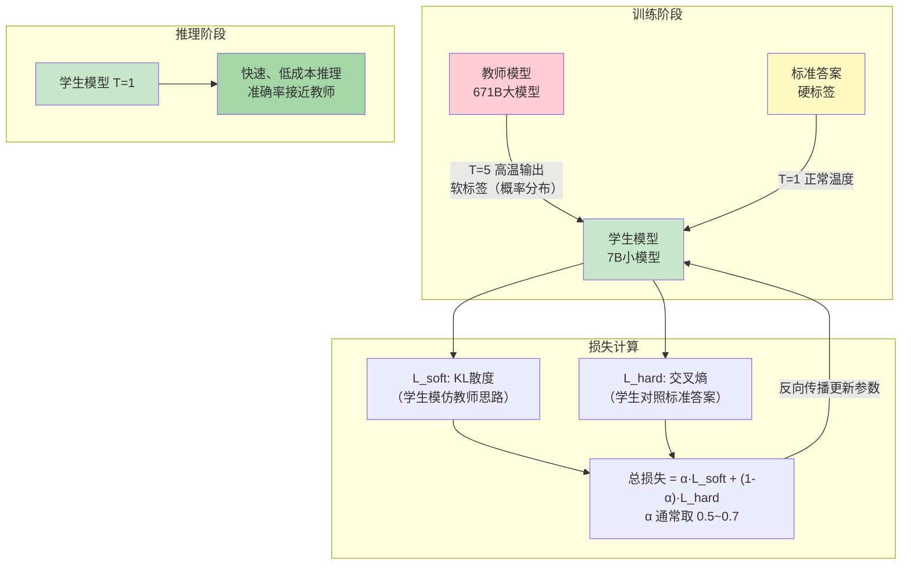

### 1.4 微调与蒸馏的区别与联系

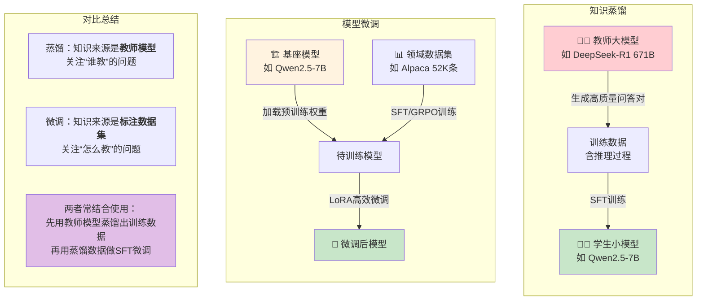

**核心区别总结：**

| 维度         | 知识蒸馏                   | 模型微调                 |
| ------------ | -------------------------- | ------------------------ |
| **目的**     | 将大模型的能力迁移到小模型 | 让模型适应特定领域/任务  |
| **知识来源** | 教师模型的输出（软标签）   | 标注数据集（硬标签）     |
| **核心变化** | 模型参数规模通常变小       | 模型参数规模通常不变     |
| **训练数据** | 教师模型生成的问答对       | 人工标注的领域数据       |
| **典型场景** | 671B → 7B 能力迁移         | 通用模型 → 医疗/法律专家 |

> [!tip]
> ⚠️ **一个重要认知**：在实际项目中，蒸馏和微调往往不是二选一，而是分阶段组合使用：
> - **Phase 1**：用大模型（教师）生成高质量训练数据（蒸馏）
> - **Phase 2**：用小模型（学生）在该数据上做 SFT 微调
> - **Phase 3**：用 GRPO 强化学习进一步提升推理能力

---

#### 🧠 零基础理解要点

- LLM = 读过海量文本的AI程序，能理解和生成人类语言
- 微调 = 在预训练模型基础上做"专科进修"，不从头学起
- 蒸馏 = 大模型（教师）教小模型（学生），传递的不只是答案，还有思考方式
- **关键直觉**：软标签 > 硬标签，因为它包含了"暗知识"（类别间的关系）
- 蒸馏和微调实际项目中常常组合使用，不是互斥的

---

## 二、环境配置与依赖说明

### 2.1 Python版本与核心依赖

本项目基于Python生态，核心依赖清单如下：

| 库名           | 版本建议 | 用途说明                                           |
| -------------- | -------- | -------------------------------------------------- |
| `torch`        | ≥2.0.0   | 深度学习底层框架，PyTorch                          |
| `unsloth`      | latest   | **核心框架**，高效LLM微调（比原生HF快2-5倍）       |
| `transformers` | ≥4.40.0  | HuggingFace模型库，加载预训练模型                  |
| `trl`          | ≥0.9.0   | Transformer强化学习库（含SFTTrainer、GRPOTrainer） |
| `vllm`         | latest   | 高性能推理引擎（GRPO训练需要）                     |
| `datasets`     | latest   | HuggingFace数据集加载工具                          |
| `peft`         | latest   | 参数高效微调（LoRA等技术）                         |
| `pandas`       | latest   | 表格数据处理（Excel/CSV）                          |
| `openpyxl`     | latest   | Excel文件读写                                      |
| `Pillow`       | latest   | 图像处理（VL视觉模型微调需要）                     |
| `modelscope`   | latest   | 国内模型下载源（替代HuggingFace Hub）              |

### 2.2 硬件配置建议

| 任务类型             | 最低显存 | 推荐显存 | 推荐显卡      |
| -------------------- | -------- | -------- | ------------- |
| 7B模型 4bit LoRA微调 | 6 GB     | 12 GB+   | RTX 3060/4060 |
| 7B模型 GRPO训练      | 16 GB    | 24 GB+   | RTX 3090/4090 |
| VL多模态微调（3B）   | 4 GB     | 8 GB+    | RTX 3060+     |
| 7B模型全参微调       | 40 GB+   | 80 GB    | A100/A800     |

> 💡 **云GPU推荐**：如果本地显卡不够，可以使用 [AutoDL](https://www.autodl.com) 等云GPU平台，按小时租用A100/A800/3090。本项目代码就是在AutoDL环境下运行的。

### 2.3 环境安装步骤

```bash
# Step 1: 创建虚拟环境（推荐）
conda create -n llm-finetune python=3.10 -y
conda activate llm-finetune

# Step 2: 安装PyTorch（根据CUDA版本选择）
# CUDA 12.1
pip install torch torchvision --index-url https://download.pytorch.org/whl/cu121

# Step 3: 安装核心依赖
pip install -r requirements.txt

# Step 4（可选）: 使用国内镜像加速
pip install -r requirements.txt -i https://pypi.tuna.tsinghua.edu.cn/simple

# Step 5: 验证安装
python -c "import torch; print(f'CUDA可用: {torch.cuda.is_available()}'); print(f'显存: {torch.cuda.get_device_properties(0).total_memory / 1e9:.1f} GB')"
```

**requirements.txt 完整内容：**

```
# LLM模型蒸馏与微调实操 - 环境依赖
unsloth                          # 高效LLM微调框架（核心）
transformers                     # HuggingFace模型库
trl                              # SFTTrainer, GRPOTrainer
vllm                             # 高性能推理引擎
datasets                         # 数据集加载
pandas                           # 数据处理
openpyxl                         # Excel读写
Pillow                           # 图像处理
torch                            # 深度学习框架
torchvision                      # 视觉相关工具
modelscope                       # 国内模型下载
jieba                            # 中文分词（评估用）
nltk                             # 自然语言工具包（评估用）
```

> ⚠️ **常见踩坑**：`unsloth`和`vllm`有版本依赖关系，建议先装`unsloth`再装`vllm`。如果遇到CUDA版本不匹配，去 [PyTorch官网](https://pytorch.org/get-started/locally/) 选择对应版本。

---

#### 🧠 零基础理解要点

- 虚拟环境 = 给每个项目一个独立的"工具箱"，互不干扰
- 4bit量化 = 把模型参数从16位小数压缩到4位，牺牲微小精度换取大幅降低显存
- 如果没有高端显卡，就用云GPU（AutoDL等），按小时付费即可
- `requirements.txt` = 项目需要的所有Python包的"购物清单"

---

## 三、项目代码结构解析

### 3.1 目录树

```
12-LLM模型蒸馏与微调实操/
├── 1-LLM模型蒸馏与微调实操.pdf    # 课程课件（55页）
├── requirements.txt               # 环境依赖清单
├── 笔记20260308.txt               # 课堂问答笔记
│
├── Qwen2_5_(7B)_Alpaca.py         # ⭐ SFT微调：Qwen2.5-7B + Alpaca数据集
├── Qwen2_5_(7B)_R1_GRPO.py        # ⭐ GRPO训练：打造自己的R1推理模型
├── qwen_vl_car_insurance_train.py # ⭐ VL微调：视觉模型识别车辆里程表
├── model_comparison_eval.py       # 📊 评估工具：对比不同模型的输出质量
│
├── qwen-vl-train.xlsx             # VL训练数据（Excel格式）
│
├── images/
│   ├── 1-vehicle-odometer-reading.jpg  # 测试图片1
│   └── 2-vehicle-odometer-reading.jpg  # 测试图片2
│
├── 【数据集】alpaca-cleaned/
│   ├── alpaca_data_cleaned.json   # 52K条指令微调数据
│   └── README.md
│
└── 【数据集】gsm8k/
    ├── gsm8k.zip                  # 8.5K小学数学题
    ├── main/                      # 主配置（question + answer）
    │   ├── train-00000-of-00001.parquet
    │   └── test-00000-of-00001.parquet
    ├── socratic/                  # 苏格拉底配置（含子问题引导）
    └── README.md
```

### 3.2 各文件功能说明

| 文件                             | 核心功能                  | 输入                          | 输出           | 关键技术                     |
| -------------------------------- | ------------------------- | ----------------------------- | -------------- | ---------------------------- |
| `Qwen2_5_(7B)_Alpaca.py`         | 对Qwen2.5-7B做SFT监督微调 | Alpaca-cleaned 52K条指令      | LoRA适配器权重 | Unsloth + 4bit量化 + LoRA    |
| `Qwen2_5_(7B)_R1_GRPO.py`        | 训练具备推理能力的R1模型  | GSM8K数学题（仅问题+答案）    | GRPO LoRA权重  | GRPO + vLLM + 奖励函数       |
| `qwen_vl_car_insurance_train.py` | 微调视觉模型识别里程表    | Excel数据（图片+prompt+回答） | VL LoRA权重    | FastVisionModel + 多模态     |
| `model_comparison_eval.py`       | 对比基座/SFT/GRPO模型效果 | 测试问题 + 模型回复           | 多维度评分报告 | F1评分 + 推理质量 + 格式检查 |

### 3.3 核心代码调用关系

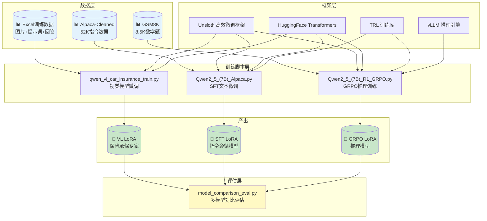

**调用关系说明：**

1. 三个训练脚本**各自独立运行**，不存在代码级别的相互调用
2. 它们共用同一套底层框架（Unsloth + Transformers + TRL）
3. 训练完成后，由 `model_comparison_eval.py` 对三个模型进行**统一评估对比**
4. 蒸馏不是独立的脚本，而是**隐含在SFT训练中**：SFT用的Alpaca数据集本身就是"蒸馏产物"（由GPT-3生成），GRPO用的GSM8K数据也经过了大模型的推理过程生成

---

#### 🧠 零基础理解要点

- 项目包含 **3个训练脚本 + 1个评估脚本**，各自独立但共享底层框架
- `Qwen2_5_(7B)_Alpaca.py` = 教模型"背答案"（SFT微调）
- `Qwen2_5_(7B)_R1_GRPO.py` = 教模型"打草稿"（GRPO推理训练）
- `qwen_vl_car_insurance_train.py` = 教模型"看图说话"（视觉微调）
- `model_comparison_eval.py` = 给模型"打分排名"（效果评估）

---

## 四、模型蒸馏实操流程

### 4.1 蒸馏全景流程

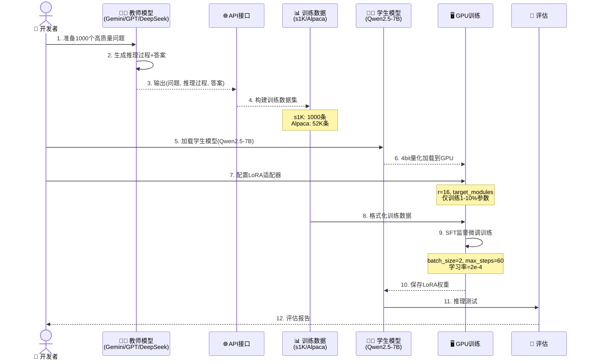

### 4.2 各步骤详解

#### Step 1: 教师模型选择

教师模型的选择直接影响蒸馏效果。本项目涉及的蒸馏场景：

| 场景                | 教师模型                  | 学生模型    | 数据量 | 蒸馏方式      |
| ------------------- | ------------------------- | ----------- | ------ | ------------- |
| S1模型（李飞飞）    | Gemini 2.0 Flash Thinking | Qwen2.5-32B | 1000条 | API蒸馏       |
| Alpaca              | GPT-3 (text-davinci-003)  | LLaMA-7B    | 52K条  | API蒸馏       |
| DeepSeek-R1-Distill | DeepSeek-R1 (671B)        | Qwen2.5系列 | 80万+  | 经典蒸馏+GRPO |

> 📌 **选择原则**：师生参数量比一般控制在 **4:1 到 10:1** 之间。72B教师直接教1.5B学生效果不好（差距太大），应采用渐进式：72B → 32B → 7B → 1.5B。

#### Step 2: 数据准备

数据集格式分为两种：

**Alpaca格式（SFT用）：**

```json
{
    "instruction": "计算这些物品的总费用。",
    "input": "汽车-$3000，衣服-$100，书-$20。",
    "output": "总费用为 $3000 + $100 + $20 = $3120。"
}
```

**GSM8K格式（GRPO用）：**

```json
{
    "question": "Natalia sold clips to 48 friends in April, then half as many in May. How many total?",
    "answer": "Natalia sold 48/2 = 24 clips in May.\n48+24 = 72 clips altogether.\n#### 72"
}
```

对应代码在 `Qwen2_5_(7B)_Alpaca.py` 的第52-77行和 `Qwen2_5_(7B)_R1_GRPO.py` 的第52-103行。

#### Step 3: 蒸馏训练

蒸馏训练的核心是**损失函数**的设计：

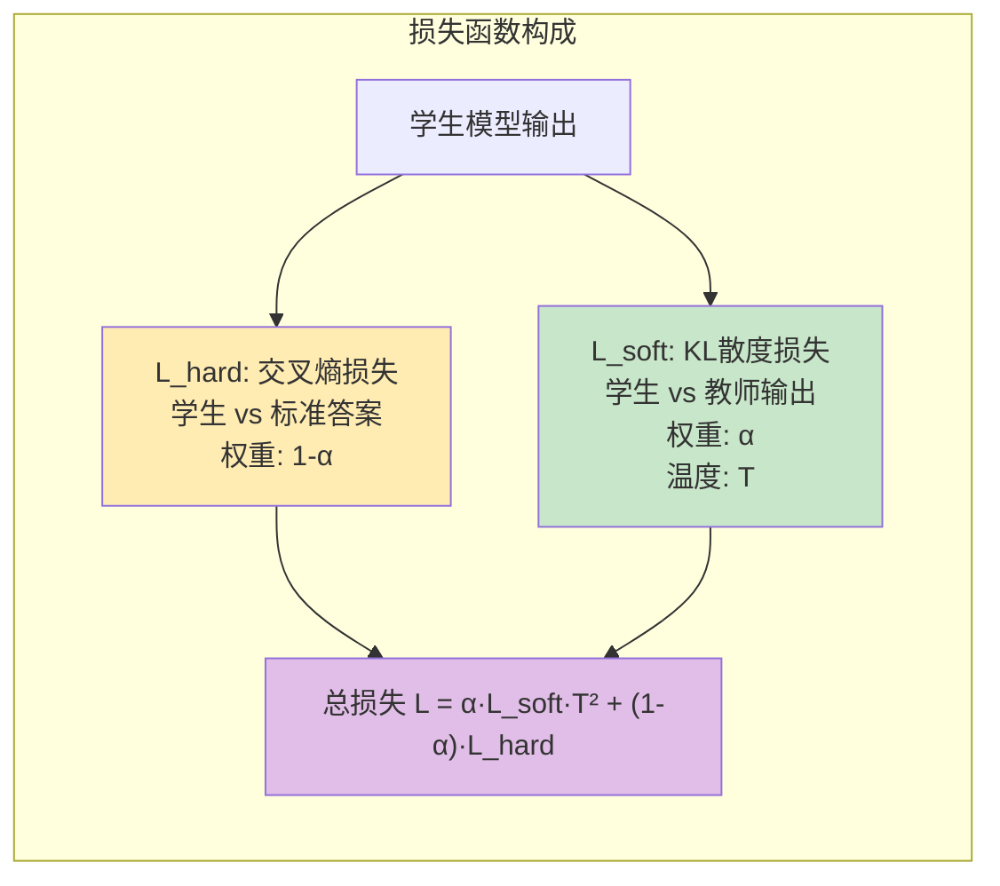

**核心参数说明：**

| 参数          | 含义                   | 推荐值              | 作用                                |
| ------------- | ---------------------- | ------------------- | ----------------------------------- |
| **温度 T**    | 软化概率分布的程度     | 训练: 3~10, 推理: 1 | T越大，概率越"平滑"，越能暴露暗知识 |
| **α (alpha)** | 软标签损失的权重       | 0.5~0.7             | 平衡"模仿教师"和"对照标准答案"      |
| **KL散度**    | 衡量两个概率分布的差异 | 作为L_soft          | KL越小，学生越接近教师的判断模式    |

> 💡 **为什么L_soft要乘以T²？** 因为高温下梯度会被缩小T²倍，乘以T²可以补偿这个缩放，保持软标签损失和硬标签损失在同一数量级。

#### Step 4: 模型导出

对应代码在 `Qwen2_5_(7B)_Alpaca.py` 的第199-213行：

```python
# 方式1: 仅保存LoRA适配器（最小，推荐）
model.save_pretrained("lora_model")

# 方式2: 合并保存为16bit（可直接用于推理）
# model.save_pretrained_merged("model", tokenizer, save_method="merged_16bit")

# 方式3: 合并保存为4bit（更小）
# model.save_pretrained_merged("model", tokenizer, save_method="merged_4bit")

# 方式4: 保存为GGUF格式（用于Ollama/llama.cpp本地部署）
# model.save_pretrained_gguf("model", tokenizer, quantization_method="q4_k_m")
```

---

#### 🧠 零基础理解要点

- 蒸馏 = 教师模型"出题+解答" → 学生模型"学习模仿"
- 温度T是核心：高温让知识传递更充分，低温让推理更准确
- 实际项目中，蒸馏往往**隐含在SFT训练过程中**，不一定是独立步骤
- 经典蒸馏（能看内部概率）> API蒸馏（只能看输出文本），但闭源模型只能做API蒸馏

---

## 五、模型微调实操流程

### 5.1 SFT监督微调流程（Alpaca）

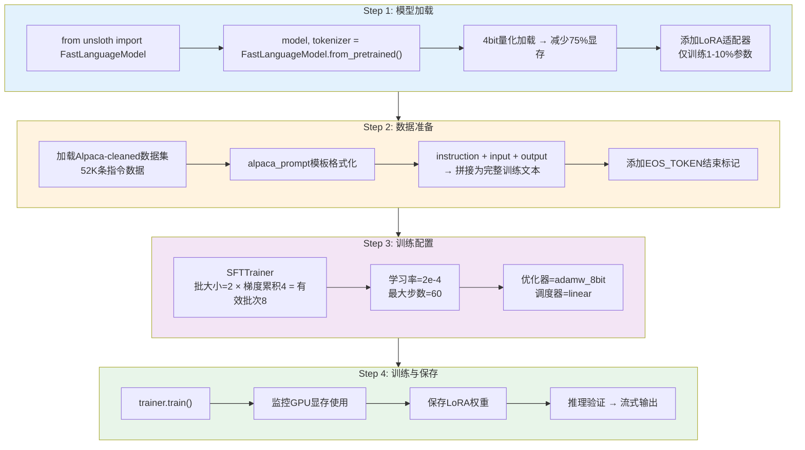

### 5.2 GRPO强化学习训练流程（R1推理模型）

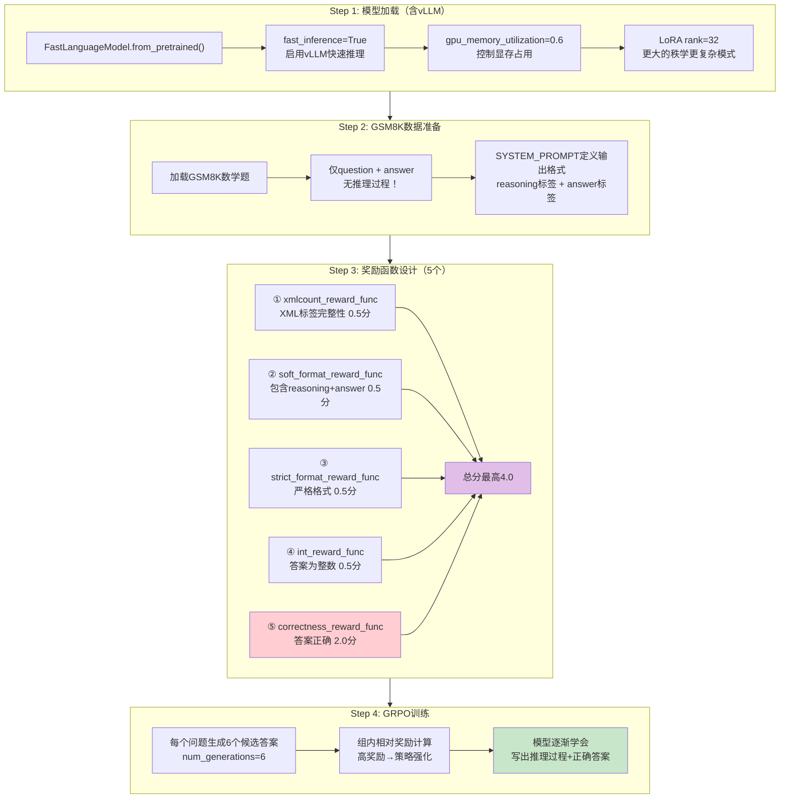

### 5.3 VL视觉模型微调流程（多模态）

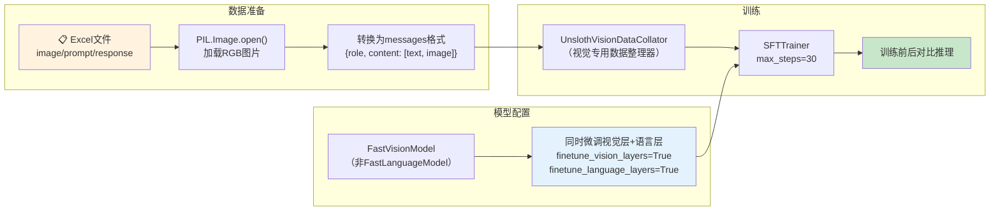

### 5.4 核心训练参数速查表

| 参数           | Alpaca SFT | GRPO R1          | VL微调     | 说明                         |
| -------------- | ---------- | ---------------- | ---------- | ---------------------------- |
| **学习率**     | 2e-4       | 5e-6             | 2e-4       | GRPO用更低学习率保持稳定     |
| **批次大小**   | 2          | 1                | 2          | 受显存限制                   |
| **梯度累积**   | 4          | 1                | 4          | 等效增大批次                 |
| **最大步数**   | 60         | 250              | 30         | 数据量×epoch÷批次            |
| **LoRA秩(r)**  | 16         | 32               | 16         | 秩越大→学得越多→越慢         |
| **优化器**     | adamw_8bit | paged_adamw_8bit | adamw_8bit | 8bit节省显存                 |
| **调度器**     | linear     | cosine           | linear     | 控制学习率衰减方式           |
| **有效批大小** | 2×4=8      | 1×1=1            | 2×4=8      | 实际参与一次参数更新的样本数 |

### 5.5 三种微调方式的对比

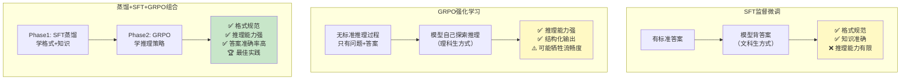

---

#### 🧠 零基础理解要点

- SFT = 有标准答案的学习，适合"背知识"型的任务
- GRPO = 没有标准推理过程，只给最终答案打分，鼓励模型自己探索
- LoRA = 不修改原模型99%的参数，只在外挂的小矩阵上训练，极大节省显存
- 4bit量化 = 参数压缩4倍，是能在消费级显卡上跑7B模型的关键技术
- 实际最佳实践：先SFT蒸馏（学知识） → 再GRPO（学推理）

---

## 六、关键代码逐段解读

### 6.1 模型加载与LoRA配置

> 📍 来源：`Qwen2_5_(7B)_Alpaca.py` 第13-45行

```python
# ========================================
# Step 1: 模型加载与4bit量化
# ========================================

from unsloth import FastLanguageModel  # Unsloth是优化版的模型加载器
import torch

max_seq_length = 2048  # 【参数】模型一次能处理的最大token数
# 💡 为什么是2048？平衡训练速度和长文本能力，7B模型通常用2048足够

dtype = None  # 【参数】自动检测最佳数据类型
# 💡 None表示自动选择：老显卡(T4)用Float16，新显卡(A100/3090)用Bfloat16
# Bfloat16比Float16数值范围更大，训练更稳定

load_in_4bit = True  # 【参数】使用4bit量化加载
# 💡 这是能在12GB显存上跑7B模型的关键！参数压缩4倍，精度损失<1%

# 加载预训练模型
model, tokenizer = FastLanguageModel.from_pretrained(
    model_name="/root/autodl-tmp/models/Qwen/Qwen2___5-7B-Instruct",
    # 💡 路径中的___是HuggingFace命名规范，实际模型名是Qwen2.5-7B-Instruct
    max_seq_length=max_seq_length,
    dtype=dtype,
    load_in_4bit=load_in_4bit,
)
# 📌 返回两个对象：
#   - model: 模型本体（神经网络权重）
#   - tokenizer: 分词器（负责把文字切成token，把token还原成文字）

# ========================================
# Step 2: LoRA适配器配置
# ========================================

model = FastLanguageModel.get_peft_model(
    model,
    r=16,  # 【核心参数】LoRA的"秩"
    # 💡 秩越大 → 可学习的参数越多 → 学得越精细 → 但更慢更耗显存
    # 经验值：8(简单任务), 16(通用), 32(复杂推理), 64-128(几乎用不到)

    target_modules=["q_proj", "k_proj", "v_proj", "o_proj",
                    "gate_proj", "up_proj", "down_proj"],
    # 💡 这些是Transformer内部注意力机制的7个关键矩阵
    # "q_proj"=查询投影, "k_proj"=键投影, "v_proj"=值投影, "o_proj"=输出投影
    # "gate_proj", "up_proj", "down_proj"=前馈网络的门控/上采样/下采样
    # 类比：只给书的"目录"和"索引"加注释，不改正文内容

    lora_alpha=16,  # 【参数】LoRA的缩放因子
    # 💡 alpha/r = 缩放比例。alpha=16, r=16 → 缩放比例=1，不额外放大或缩小

    lora_dropout=0,  # 【参数】随机丢弃神经元的比例
    # 💡 0表示不丢弃任何神经元。微调通常不需要dropout，因为训练步数少

    bias="none",  # 【参数】是否训练偏置项
    # 💡 "none"是最优设置，LoRA的核心思想就是只训练低秩矩阵

    use_gradient_checkpointing="unsloth",
    # 💡 梯度检查点：用时间换空间的策略，减少约30%的显存使用
    # 原理：不保存所有中间结果，反向传播时重新计算

    random_state=3407,  # 【参数】随机种子
    # 💡 固定随机种子保证实验结果可复现。3407是LLM社区常用的"玄学数字"
)
```

> [!tip]
>  ⚠️ **容易踩坑的地方**：
> 1. `model_name`路径中的`___`不是打字错误，HuggingFace用`___`替代模型名中的`.`，实际对应`Qwen2.5-7B-Instruct`
> 2. `r`值不是越大越好——r=16已经能覆盖90%的任务需求，r=128会让训练慢3-5倍
> 3. 如果用老显卡（不支持bfloat16），`dtype=None`会自动降级为float16

---

### 6.2 数据格式化函数（Alpaca模板）

> 📍 来源：`Qwen2_5_(7B)_Alpaca.py` 第52-77行

```python
# ========================================
# Step 3: Alpaca数据集准备
# ========================================

# 定义提示词模板 —— 这是告诉模型"输入长什么样"的格式说明书
alpaca_prompt = """Below is an instruction that describes a task, paired with an input that provides further context. Write a response that appropriately completes the request.

### Instruction:
{}

### Input:
{}

### Response:
{}"""
# 💡 三个{}是Python的占位符，后面用.format()填充实际内容
# ### 标记是Alpaca格式的特殊分隔符，模型训练后能识别这种结构

EOS_TOKEN = tokenizer.eos_token  # 结束标记
# 💡 EOS = End Of Sequence，告诉模型"这句话结束了，不要再继续生成"
# 不加EOS_TOKEN的话，模型可能生成到max_new_tokens才停，产生大量废话


def formatting_prompts_func(examples):
    """
    将Alpaca格式数据转换为训练用的文本格式

    参数:
        examples: 一个批次的数据字典，包含instruction, input, output三个字段

    返回:
        {"text": [...]}  —— 拼接好的完整训练文本列表
    """
    instructions = examples["instruction"]   # 取出所有"指令"
    inputs = examples["input"]               # 取出所有"上下文"
    outputs = examples["output"]             # 取出所有"期望回答"
    texts = []

    # 逐条拼接 —— zip()把三个列表的对应元素打包成元组
    for instruction, input, output in zip(instructions, inputs, outputs):
        # 用alpaca_prompt模板格式化 + 添加EOS结束标记
        text = alpaca_prompt.format(instruction, input, output) + EOS_TOKEN
        # 💡 拼接后的效果（以斐波那契数列为例）：
        # "Below is an instruction...\n\n### Instruction:\nContinue the fibonnaci sequence.
        #  \n\n### Input:\n1, 1, 2, 3, 5, 8\n\n### Response:\n13, 21, 34, 55, 89<EOS>"
        texts.append(text)

    return {"text": texts}
    # 💡 返回字典格式，key必须叫"text"，这是SFTTrainer默认读取的字段名


from datasets import load_dataset
# 加载清洗版Alpaca数据集（52K条高质量指令数据）
dataset = load_dataset("/root/autodl-tmp/datasets/yahma/alpaca-cleaned", split="train")

# batched=True 表示批量处理（一次处理多条），比逐条处理快很多
dataset = dataset.map(formatting_prompts_func, batched=True)
# 💡 dataset.map() 是HuggingFace的高效数据转换方法，类似Python的map()但支持批处理
```

> [!tip]
>  ⚠️ **容易踩坑的地方**：
> 1. 必须加 `EOS_TOKEN`！不加的话模型不知道什么时候停止生成，会一直输出到最大长度
> 2. 返回的字典key必须是 `"text"`，因为 `SFTTrainer` 的 `dataset_text_field` 参数默认就是 `"text"`
> 3. `batched=True` 很重要——同样是52K条数据，批量处理比逐条处理快10倍以上

---

### 6.3 GRPO奖励函数设计

> 📍 来源：`Qwen2_5_(7B)_R1_GRPO.py` 第110-163行

```python
# ========================================
# Step 4: 奖励函数设计（GRPO的核心！）
# ========================================
# 【核心概念】奖励函数 = 给模型的输出"打分"
# - 高分 → 模型会多生成类似的输出
# - 低分 → 模型会避免生成这种输出
# 通过这个机制，模型逐渐学会写出"推理过程 + 正确答案"

def correctness_reward_func(prompts, completions, answer, **kwargs) -> list[float]:
    """
    正确性奖励 —— 权重最高的奖励函数（2.0分）

    检查模型提取出的答案是否与标准答案一致。
    这是整个奖励体系中最重要的函数，权重是其他函数的4倍。

    参数:
        prompts: 输入提示
        completions: 模型生成的完整输出列表
        answer: 标准答案
    """
    # 从模型生成的输出中提取文本内容
    responses = [completion[0]['content'] for completion in completions]
    q = prompts[0][-1]['content']

    # 从模型输出中用XML标签提取出最终答案
    extracted_responses = [extract_xml_answer(r) for r in responses]

    # 打印调试信息 —— 方便观察训练过程中模型的表现
    print('-' * 20, f"Question:\n{q}", f"\nAnswer:\n{answer[0]}",
          f"\nResponse:\n{responses[0]}", f"\nExtracted:\n{extracted_responses[0]}")

    # 核心逻辑：答案正确 → 2.0分；答案错误 → 0分
    return [2.0 if r == a else 0.0 for r, a in zip(extracted_responses, answer)]


def int_reward_func(completions, **kwargs) -> list[float]:
    """
    整数奖励 —— 0.5分

    检查提取的答案是否为整数（因为GSM8K的答案都是整数）
    这是一个辅助奖励，帮助模型学会输出数字答案而非文字描述
    """
    responses = [completion[0]['content'] for completion in completions]
    extracted_responses = [extract_xml_answer(r) for r in responses]
    # isdigit()判断字符串是否全为数字字符
    return [0.5 if r.isdigit() else 0.0 for r in extracted_responses]


def strict_format_reward_func(completions, **kwargs) -> list[float]:
    """
    严格格式奖励 —— 0.5分

    检查输出是否完全符合规定的XML格式：
    <reasoning>\n...\n</reasoning>\n<answer>\n...\n</answer>\n
    包括换行符的位置都必须正确
    """
    pattern = r"^<reasoning>\n.*?\n</reasoning>\n<answer>\n.*?\n</answer>\n$"
    # 这个正则表达式逐字符匹配：
    # ^ 开头
    # <reasoning>\n  推理标签+换行
    # .*?\n          推理内容+换行（?表示非贪婪匹配）
    # </reasoning>\n  推理结束标签+换行
    # <answer>\n      答案标签+换行
    # .*?\n           答案内容+换行
    # </answer>\n     答案结束标签+换行
    # $               结尾

    responses = [completion[0]["content"] for completion in completions]
    matches = [re.match(pattern, r) for r in responses]
    return [0.5 if match else 0.0 for match in matches]


def soft_format_reward_func(completions, **kwargs) -> list[float]:
    """
    宽松格式奖励 —— 0.5分

    与严格版本的区别：不要求换行符精确匹配
    只检查是否包含了 <reasoning>...</reasoning> 和 <answer>...</answer>
    """
    pattern = r"<reasoning>.*?</reasoning>\s*<answer>.*?</answer>"
    # \s* 表示可以有任何空白字符（包括换行、空格）
    # 这个更宽容，模型刚开始训练时更容易获得奖励

    responses = [completion[0]["content"] for completion in completions]
    matches = [re.match(pattern, r) for r in responses]
    return [0.5 if match else 0.0 for match in matches]


def count_xml(text) -> float:
    """
    XML标签计数奖励 —— 精细化评分

    不只看"有没有标签"，还看"标签用得对不对"
    每个正确的标签得0.125分，总共4个标签 → 最高0.5分
    """
    count = 0.0
    if text.count("<reasoning>\n") == 1:       # 恰好一个开始标签
        count += 0.125
    if text.count("\n</reasoning>\n") == 1:    # 恰好一个结束标签
        count += 0.125
    if text.count("\n<answer>\n") == 1:        # 恰好一个答案开始标签
        count += 0.125
        # 扣除答案标签后的多余内容（越多越扣分）
        count -= len(text.split("\n</answer>\n")[-1]) * 0.001
    if text.count("\n</answer>") == 1:         # 恰好一个答案结束标签
        count += 0.125
        count -= (len(text.split("\n</answer>")[-1]) - 1) * 0.001
    return count


# 【关键】奖励函数按此顺序执行，所有分数累加
# 最高可得: 0.5 + 0.5 + 0.5 + 0.5 + 2.0 = 4.0分
reward_funcs = [
    xmlcount_reward_func,         # ① XML标签完整性（精细评分）
    soft_format_reward_func,      # ② 宽松格式检查
    strict_format_reward_func,    # ③ 严格格式检查
    int_reward_func,              # ④ 答案是否为整数
    correctness_reward_func,      # ⑤ 答案是否正确（权重最高）
]
```

> [!tip]
>  ⚠️ **容易踩坑的地方**：
> 1. 奖励函数的设计要**由宽到严**——刚开始训练时，模型可能连基本格式都不会，先用宽松奖励引导，再逐渐收紧
> 2. `correctness_reward_func`的权重（2.0）远高于其他（各0.5），这是因为**答案正确才是最终目标**
> 3. 为什么GSM8K没有推理过程却能训练出推理能力？因为LLM本身已经具备推理能力，奖励函数只是在**引导它把内在的推理过程显式写出来**

---

### 6.4 SFTTrainer训练循环

> 📍 来源：`Qwen2_5_(7B)_Alpaca.py` 第84-134行

```python
# ========================================
# Step 4: SFTTrainer训练
# ========================================

from trl import SFTTrainer
from transformers import TrainingArguments
from unsloth import is_bfloat16_supported

# 配置训练参数
training_args = TrainingArguments(
    per_device_train_batch_size=2,     # 每个GPU每次处理2条数据
    # 💡 为什么只有2？因为7B模型+4bit量化后，24GB显存也只能跑batch_size=2

    gradient_accumulation_steps=4,     # 梯度累积4步后再更新参数
    # 💡 有效批大小 = batch_size × 梯度累积步数 = 2 × 4 = 8
    # 这是"穷人增大批大小"的技巧：分4次计算梯度，累加后一次性更新

    warmup_steps=5,                    # 前5步线性增大学习率
    # 💡 "热身"的概念：刚开始训练时模型还不稳定，用较小的学习率逐步加速

    max_steps=60,                      # 总共训练60步
    # 💡 为什么只训练60步？LoRA微调不需要太多步数
    # 训练样本数 = 有效批大小 × max_steps = 8 × 60 = 480条数据
    # Alpaca有52K条数据，但我们只用了不到1%，这是故意的——微调不需要全量数据

    learning_rate=2e-4,                # 学习率 = 0.0002
    # 💡 LoRA微调的学习率通常比全参微调高一个数量级

    fp16=not is_bfloat16_supported(),  # 不支持bfloat16时用float16
    bf16=is_bfloat16_supported(),      # 支持bfloat16时优先使用

    logging_steps=1,                   # 每步都记录日志（方便监控）

    optim="adamw_8bit",                # 8bit AdamW优化器
    # 💡 AdamW = Adam + Weight Decay（权重衰减），是目前最主流的优化器
    # 8bit版本进一步节省显存

    weight_decay=0.01,                 # 权重衰减系数（防止过拟合）

    lr_scheduler_type="linear",        # 学习率线性衰减
    # 💡 从learning_rate(2e-4)线性衰减到0，训练结束时学习率接近0

    seed=3407,                         # 随机种子（保证可复现）
    output_dir="outputs",              # 输出目录
    report_to="none",                  # 不上报到wandb等平台
)

# 创建训练器
trainer = SFTTrainer(
    model=model,                       # 已配置LoRA的模型
    tokenizer=tokenizer,               # 分词器
    train_dataset=dataset,             # 格式化后的训练数据
    dataset_text_field="text",         # 数据集中哪个字段是文本
    max_seq_length=max_seq_length,     # 2048，超过此长度会被截断
    dataset_num_proc=2,                # 用2个进程并行处理数据
    packing=False,                     # 不打包短序列
    # 💡 packing=True可以将多个短序列拼成一个长序列，训练速度提升5倍
    # 但这里设为False，因为Alpaca数据的长度差异较大
    args=training_args,
)

# ---- 监控GPU信息 ----
gpu_stats = torch.cuda.get_device_properties(0)
start_gpu_memory = round(torch.cuda.max_memory_reserved() / 1024 / 1024 / 1024, 3)
max_memory = round(gpu_stats.total_memory / 1024 / 1024 / 1024, 3)
print(f"GPU = {gpu_stats.name}. Max memory = {max_memory} GB.")
print(f"{start_gpu_memory} GB of memory reserved.")

# ---- 开始训练！ ----
trainer_stats = trainer.train()        # 🚀 这一行是训练的核心

# ---- 训练统计 ----
used_memory = round(torch.cuda.max_memory_reserved() / 1024 / 1024 / 1024, 3)
used_memory_for_lora = round(used_memory - start_gpu_memory, 3)
used_percentage = round(used_memory / max_memory * 100, 3)
print(f"{trainer_stats.metrics['train_runtime']} seconds used for training.")
print(f"{round(trainer_stats.metrics['train_runtime']/60, 2)} minutes used for training.")
print(f"Peak reserved memory = {used_memory} GB.")
print(f"Peak reserved memory for training = {used_memory_for_lora} GB.")
print(f"Peak reserved memory % of max memory = {used_percentage} %.")
```

> [!tip]
>  ⚠️ **容易踩坑的地方**：
> 1. **max_steps=60 不是随便设的**：`2 × 4 × 60 = 480`条训练样本，对52K数据集来说是"浅尝辄止"。如果效果不好，可以增大max_steps或设置`num_train_epochs`
> 2. `packing=False` 在数据长度差异大时是正确的，但如果数据都是短文本（<500 token），设为True可以提速5倍
> 3. 训练过程中如果显存不够，优先减小`per_device_train_batch_size`，同时增大`gradient_accumulation_steps`保持有效批大小不变

---

### 6.5 模型推理与效果对比评估

> 📍 来源：`model_comparison_eval.py` 第19-197行（核心评估逻辑）

```python
# ========================================
# 评估指标类 —— 多维度量化模型好坏
# ========================================

class EvalMetrics:
    """评估指标计算 —— 从4个维度给模型打分"""

    @staticmethod
    def format_compliance(response, expected_format="xml"):
        """
        维度1: 格式遵循能力
        检查模型输出是否按要求格式组织内容

        XML格式（推理模型用）：必须包含<reasoning>和<answer>标签
        医疗格式（SFT模型用）：有###结构标记或足够长的回复
        """
        if expected_format == "xml":
            # re.DOTALL 让 . 也能匹配换行符
            has_reasoning = bool(re.search(r'<reasoning>.*?</reasoning>', response, re.DOTALL))
            has_answer = bool(re.search(r'<answer>.*?</answer>', response, re.DOTALL))
            score = 0.0
            if has_reasoning: score += 0.5  # 有推理过程 → +0.5
            if has_answer:    score += 0.5  # 有答案标签 → +0.5
            return score

        elif expected_format == "medical":
            # 医疗场景：有结构化标记或回复够长 → 满分
            has_structure = "###" in response or len(response) > 20
            return 1.0 if has_structure else 0.0

        return 0.0

    @staticmethod
    def answer_accuracy(response, reference_answer, threshold=0.5):
        """
        维度2: 答案准确率（简化版F1评分）

        用字符集重叠度来近似评估答案准确性。
        虽然是简化版，但对于快速对比不同模型已足够。

        精确率 = 回复中有多少字符是参考答案中的
        召回率 = 参考答案中有多少字符被回复覆盖了
        F1 = 精确率和召回率的调和平均
        """
        if not reference_answer:
            return 0.0

        ref_chars = set(reference_answer)   # 参考答案的字符集合
        resp_chars = set(response)          # 模型回复的字符集合
        overlap = len(ref_chars & resp_chars)  # 交集大小

        precision = overlap / len(resp_chars) if resp_chars else 0
        recall = overlap / len(ref_chars) if ref_chars else 0

        if precision + recall == 0:
            return 0.0
        f1 = 2 * precision * recall / (precision + recall)  # F1公式
        return round(f1, 4)

    @staticmethod
    def reasoning_quality(response):
        """
        维度3: 推理链质量评估（专用于GRPO推理模型）

        从3个角度评估推理过程：
        ① 长度：推理过程不应太短（>50字最好）
        ② 步骤性：是否包含分步推理（"首先""然后""1.""2."等）
        ③ 结论性：是否有总结性语句（"因此""所以"等）
        """
        score = 0.0

        # 提取<reasoning>标签中的内容
        reasoning_match = re.search(r'<reasoning>(.*?)</reasoning>', response, re.DOTALL)
        if not reasoning_match:
            return 0.0  # 没有推理过程 → 0分

        reasoning = reasoning_match.group(1).strip()

        # ① 长度评分
        if len(reasoning) > 50:
            score += 0.3
        elif len(reasoning) > 20:
            score += 0.15

        # ② 步骤性评分 —— 检查是否有分步推理的标志词
        step_indicators = ['first', 'then', 'next', 'finally', 'therefore',
                          '首先', '然后', '接下来', '最后', '因此', '所以',
                          '1.', '2.', '3.', 'step']
        step_count = sum(1 for indicator in step_indicators
                        if indicator.lower() in reasoning.lower())
        if step_count >= 2:
            score += 0.4   # 有2个以上步骤标志 → 推理链较完整
        elif step_count >= 1:
            score += 0.2   # 有1个步骤标志 → 有基本推理结构

        # ③ 结论性评分
        conclusion_indicators = ['therefore', 'so', 'thus', '因此', '所以', '综上']
        has_conclusion = any(ind in reasoning.lower() for ind in conclusion_indicators)
        if has_conclusion:
            score += 0.3

        return round(min(score, 1.0), 4)  # 封顶1.0分

    @staticmethod
    def language_match(response, expected_language="chinese"):
        """
        维度4: 语言匹配评估
        统计中文字符占比，判断回复语言是否与期望一致

        为什么需要这个指标？微调前的基座模型经常会用英文回答中文问题
        """
        cn_chars = len(re.findall(r'[一-鿿]', response))  # 中文字符数
        en_chars = len(re.findall(r'[a-zA-Z]', response))         # 英文字符数
        total = cn_chars + en_chars

        if total == 0:
            return 0.0

        if expected_language == "chinese":
            return round(cn_chars / total, 4)
        else:
            return round(en_chars / total, 4)
```

> [!tip]
>  ⚠️ **容易踩坑的地方**：
> 1. `answer_accuracy`用的是**简化版F1**（基于字符集重叠），不是语义级别的准确率。对于严格的评估需求，应使用更大的模型（如GPT-4）做评判
> 2. `reasoning_quality`中的步骤标志词列表可以根据具体任务扩展，比如代码推理任务可以加入`"def"`, `"import"`, `"class"`等
> 3. 评估脚本中`demo_comparison()`用的是模拟数据，实际使用时需要替换为真实模型推理结果

---

#### 🧠 零基础理解要点

- LoRA的核心思想：只训练"外挂"的小矩阵，不动原模型的99%参数
- 有效批大小 = `batch_size × gradient_accumulation_steps`，是实际参与参数更新的样本数
- GRPO的奖励函数就像"考试评分标准"：格式整齐+1分，步骤清晰+1分，答案正确+4分
- 评估模型要**多维度**看：格式、准确率、推理质量、语言匹配，不能只看一个指标
- 代码中的"玄学数字"（如3407、2048）大多数是经过实验验证的经验值，初学阶段可以直接使用

---

## 七、常见问题与排错指南

### 7.1 OOM（Out of Memory，显存不足）

**这是最常见的错误！** 以下是排查和解决的优先级顺序：

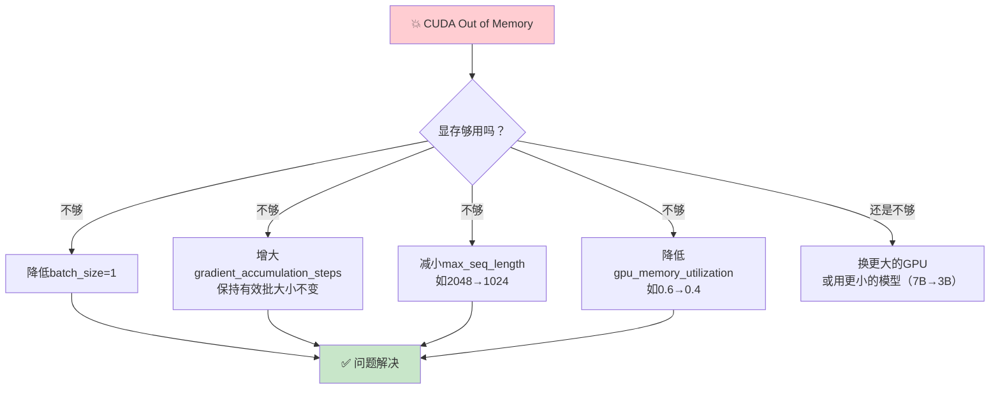

**具体操作：**

```python
# 方案1: 减小批次大小
per_device_train_batch_size=1,      # 从2降到1
gradient_accumulation_steps=8,      # 从4增到8，保持有效批大小=8

# 方案2: 减小序列长度
max_seq_length=1024,                # 从2048降到1024

# 方案3: 降低GPU显存使用率（GRPO训练）
gpu_memory_utilization=0.4,         # 从0.6降到0.4

# 方案4: 启用CPU offloading（如果unsloth支持）
# 将部分计算卸载到CPU内存（速度变慢但不会OOM）
```

### 7.2 数据集格式错误

| 错误信息                                   | 原因                      | 解决方案                                                  |
| ------------------------------------------ | ------------------------- | --------------------------------------------------------- |
| `KeyError: 'instruction'`                  | 数据集缺少instruction字段 | 检查JSON数据结构，确保有instruction/input/output三个字段  |
| `dataset_text_field "text" not found`      | 数据格式化后没有text字段  | `formatting_prompts_func`必须返回 `{"text": texts}`       |
| `cannot identify image file`               | 图片文件损坏或路径错误    | 用`os.path.exists()`验证文件存在，用PIL打开验证文件完整性 |
| `CUDA error: device-side assert triggered` | tokenizer输出超出词表范围 | 检查`add_special_tokens`参数设置                          |

### 7.3 依赖版本冲突

```bash
# 常见问题1: unsloth与transformers版本不兼容
pip install unsloth --upgrade
pip install transformers==4.44.0  # 降级到兼容版本

# 常见问题2: vllm安装失败（需要CUDA 12.x）
# 先确认CUDA版本：
nvcc --version
# 如果是CUDA 11.x，使用兼容版本：
pip install vllm --index-url https://download.pytorch.org/whl/cu118

# 常见问题3: bitsandbytes加载失败（Windows）
# Windows上4bit量化可能需要额外配置：
# 建议在Linux环境（或WSL2）中运行
```

### 7.4 训练效果不佳

| 症状                         | 可能原因                  | 解决方案                                 |
| ---------------------------- | ------------------------- | ---------------------------------------- |
| 模型输出重复/乱码            | 学习率太大                | 降低学习率：2e-4 → 5e-5                  |
| 模型输出英文（期望中文）     | 训练数据以英文为主        | 使用中文数据集，或在prompt中明确要求中文 |
| 模型格式不遵循               | 训练步数不够              | 增大max_steps：60 → 120                  |
| GRPO训练推理过程为空         | 奖励函数权重不合理        | 增大格式奖励的权重                       |
| 过拟合（训练集好，测试集差） | 训练数据太少/训练步数太多 | 减少训练步数，增大weight_decay           |

### 7.5 路径问题（AutoDL/云GPU环境）

```python
# AutoDL环境下模型路径格式
model_name = "/root/autodl-tmp/models/Qwen/Qwen2___5-7B-Instruct"
# 注意：模型名中的.被替换为___（3个下划线）

# 验证路径是否正确
import os
print(os.path.exists("/root/autodl-tmp/models/Qwen/Qwen2___5-7B-Instruct"))

# 数据集路径
dataset_path = "/root/autodl-tmp/datasets/yahma/alpaca-cleaned"
```

---

#### 🧠 零基础理解要点

- OOM是最常见的错误，解决思路：减小batch_size → 减小序列长度 → 降低显存利用率 → 换GPU
- 数据集格式错误往往是因为字段名不匹配，多打印中间结果来定位问题
- 版本冲突时，优先使用`requirements.txt`中锁定的版本
- 训练效果不好不要慌，先排查学习率、训练步数、数据质量这三个核心因素

---

## 八、总结与延伸学习建议

### 8.1 蒸馏与微调的场景选择建议

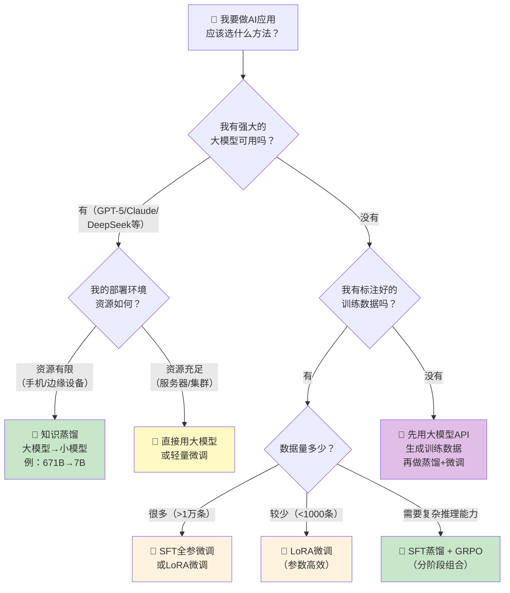

**一句话选择指南：**

| 你的情况                                      | 推荐方案                               |
| --------------------------------------------- | -------------------------------------- |
| "我有一个大模型API，想做个小模型部署到手机上" | **API蒸馏 + LoRA微调**                 |
| "我有标注好的领域数据，想让通用模型变成专家"  | **LoRA SFT微调**                       |
| "我要让模型学会数学推理/代码生成"             | **SFT蒸馏 + GRPO强化学习**             |
| "我要让模型看懂图片（OCR、图表）"             | **VL多模态微调**                       |
| "我什么数据都没有"                            | **先用大模型API生成数据，再蒸馏+微调** |

### 8.2 后续学习路径推荐

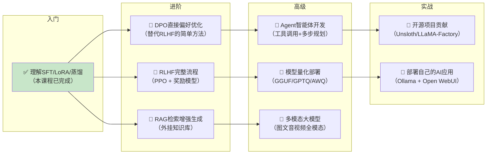

**推荐学习资源：**

| 阶段         | 资源                                                         | 说明                    |
| ------------ | ------------------------------------------------------------ | ----------------------- |
| **入门**     | [HuggingFace NLP Course](https://huggingface.co/learn/nlp-course) | 免费、系统、有代码      |
| **微调**     | [Unsloth官方文档](https://docs.unsloth.ai/)                  | 本项目使用的框架        |
| **强化学习** | [TRL官方文档](https://huggingface.co/docs/trl/)              | SFTTrainer、GRPOTrainer |
| **部署**     | [Ollama](https://ollama.com/)                                | GGUF模型本地部署        |
| **中文社区** | [Datawhale](https://github.com/datawhalechina)               | 中文AI学习社区          |
| **论文**     | [s1: Simple test-time scaling](https://arxiv.org/abs/2501.19393) | 李飞飞$50复刻R1         |

### 8.3 关键认知总结

> [!tip]
> 
> 1. **蒸馏不是万能的**：教师模型和学生模型参数量差距不能太大（建议4:1到10:1），否则学生"学不动"
> 2. **SFT和GRPO是互补的**：SFT负责"背知识"，GRPO负责"学推理"，两者结合效果最好
> 3. **数据质量 >> 数据数量**：s1模型仅用1000条高质量数据就达到了接近O1的效果
> 4. **LoRA是入门最佳选择**：仅需训练1-10%参数，消费级显卡就能跑7B模型
> 5. **GRPO让模型"从草稿纸到答题卡"**：不需要人工标注推理过程，模型自己学会写出思考步骤
> 6. **小模型是趋势**：通过蒸馏+微调，7B模型可以在特定任务上匹敌大得多的模型

---

#### 🧠 零基础理解要点

- 没有万能的方法，根据你的资源、数据和目标选择合适的技术组合
- 入门路线：SFT → LoRA → 蒸馏 → GRPO → DPO → RLHF，循序渐进
- 不要盲目追求大模型——蒸馏后的小模型在特定任务上性价比更高
- 数据和奖励函数的质量决定了模型的上限，训练参数只是加速到达上限

---

> [!tip]
>  📝 **文档信息**
> - 原始课件：`1-LLM模型蒸馏与微调实操.pdf`（55页）
> - 项目代码：4个Python训练/评估脚本
> - 数据集：Alpaca-Cleaned（52K条指令）、GSM8K（8.5K数学题）
> - 核心框架：Unsloth、Transformers、TRL、vLLM
> - 本文档所有Mermaid图表均可在支持Mermaid渲染的Markdown编辑器中查看