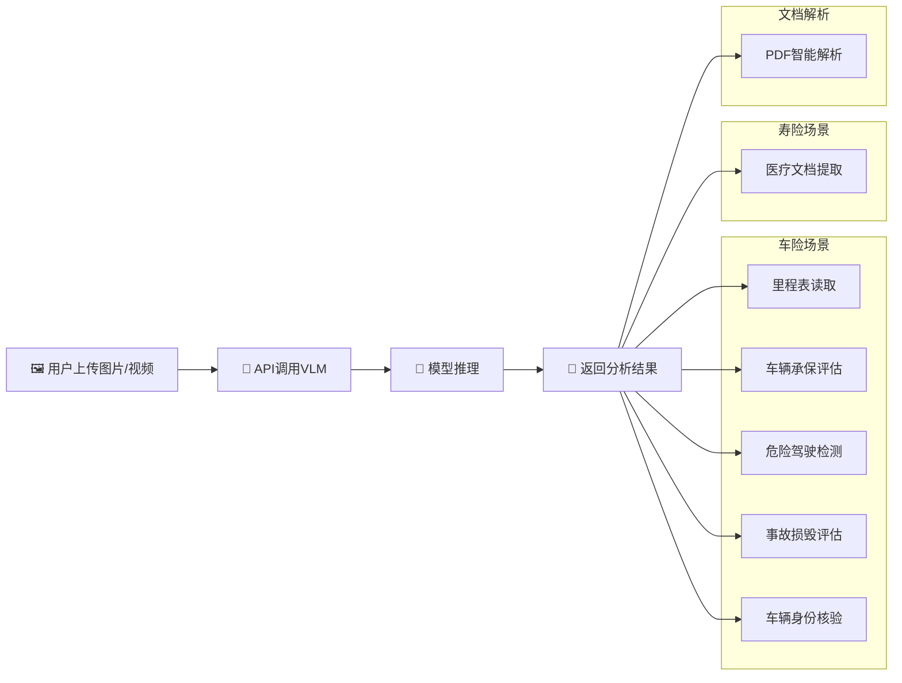
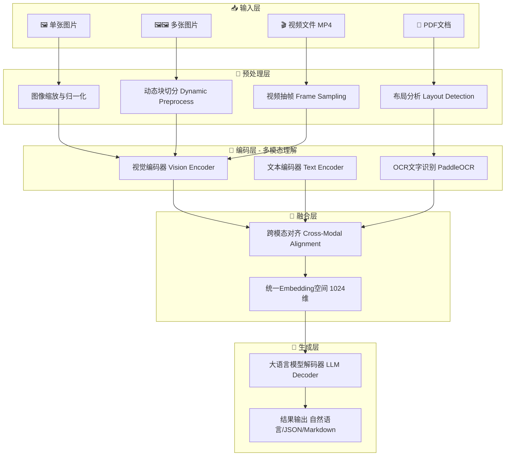
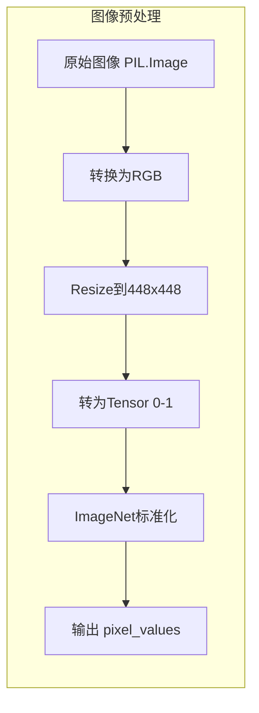
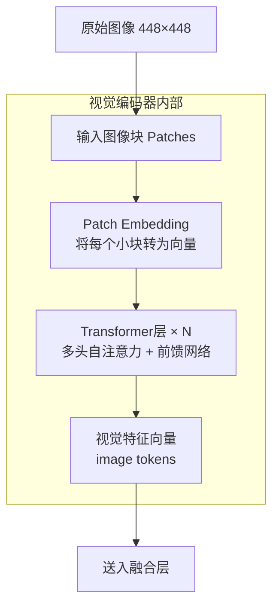
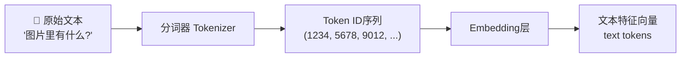
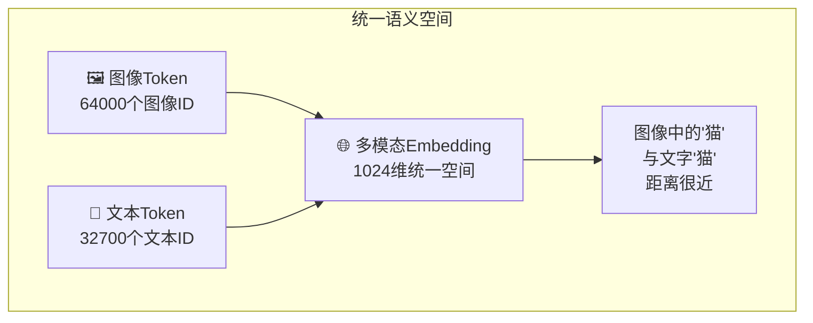
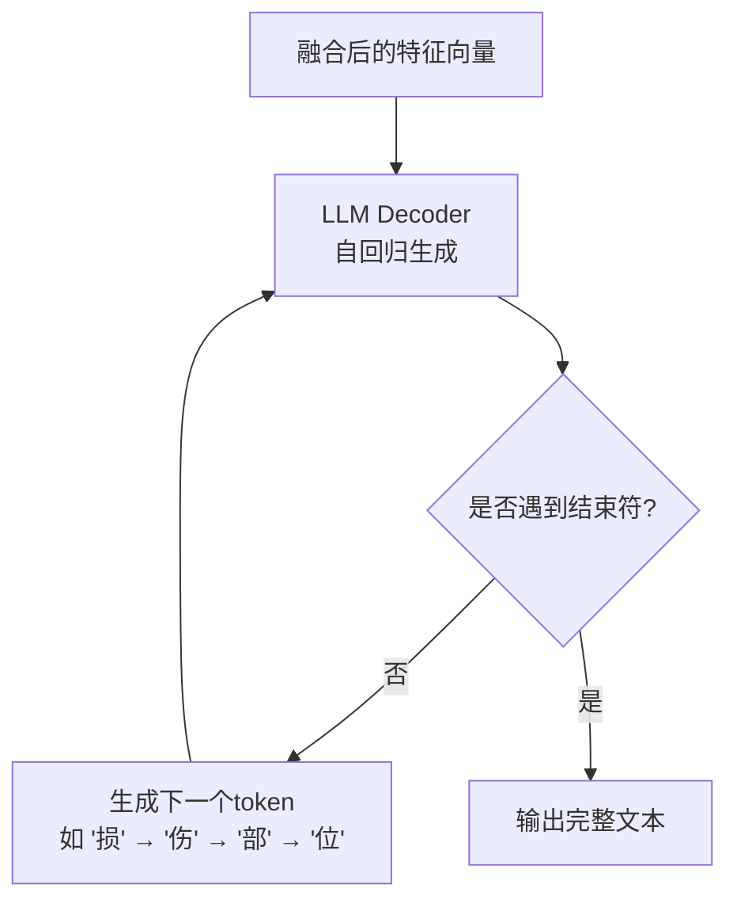
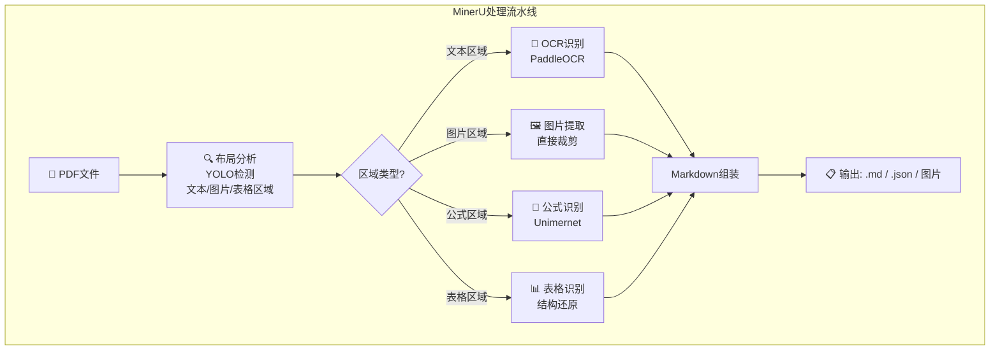
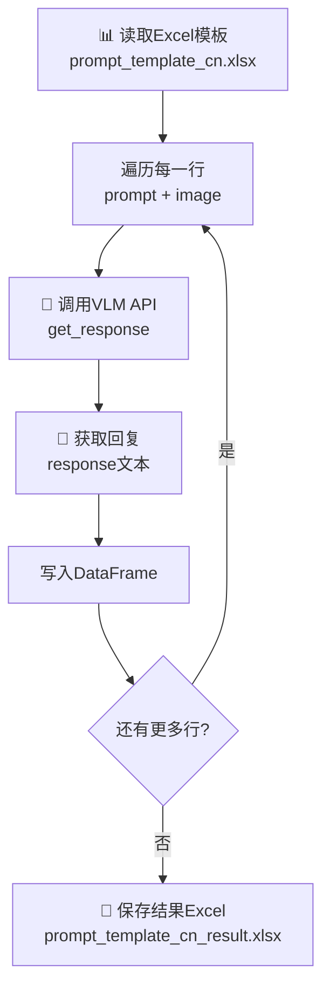
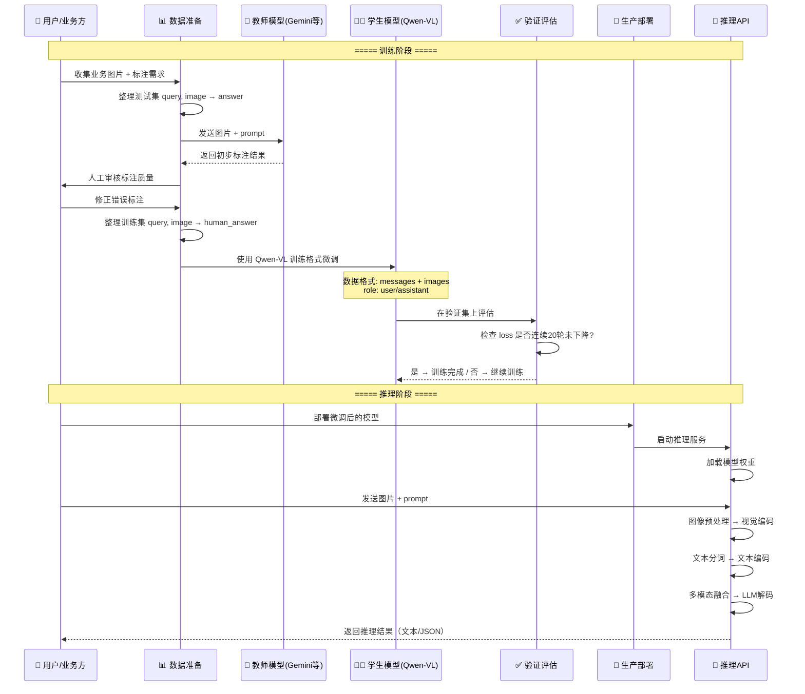

<!-- more -->


## 1. 概述

### 1.1 用日常比喻理解"视觉大模型"

想象一下，你有一个**既能看到图像、又能读懂文字、还能开口说话**的超级助手：

- 你给它看一张车祸现场的照片，它能告诉你"这辆白色轿车的右前门被撞凹了，保险杠开裂"；
- 你让它看一段行车记录仪视频，它能总结"视频中有两个人，一辆白车剐蹭到了墙角"；
- 你丢给它一份扫描的日文病历 PDF，它能提取出其中的关键信息并翻译成中文。

这就是**视觉大模型（Visual Large Model，简称 VLM）**在做的事情：**让计算机同时"看懂"图像和"读懂"文字，并用自然语言回答你的问题**。

> 📌 **通俗版定义**：  
> VLM = 图像识别器 + 文本理解器 + 语言生成器，三者合为一体。

> 📌 **专业版定义**：  
> 视觉大模型是一种基于 Transformer 架构的多模态神经网络，它通过将图像和文本映射到统一的语义空间（embedding），实现跨模态的对齐与推理，从而支持图像描述、视觉问答、文档理解等任务。

### 1.2 "多模态理解"解决了什么问题？

在传统 AI 系统中，图像识别和文本理解是**分开的两条线**：

```
传统方式：
  图像 → CNN/YOLO → "这是一辆车"（标签）
  文本 → RNN/BERT → "车被撞了"（分类）

VLM方式：
  图像 + 文本 → 一个统一模型 → 这辆白色特斯拉Model 3的右前门严重凹陷，预估维修费用约8000元
```

**多模态理解**的核心价值在于：

| 痛点                           | VLM 的解决方案               |
| ------------------------------ | ---------------------------- |
| 图像只能输出标签，不能深度描述 | 输出自然语言，灵活描述细节   |
| 图文信息分离，需要人工串联     | 端到端同时处理图文，自动关联 |
| 跨语言文档难以理解             | 同时识别图像中的文字并翻译   |
| 视频内容需逐帧人工查看         | 自动抽取关键帧，生成整体摘要 |

### 1.3 本项目在保险场景中的实际应用

本项目的代码覆盖了**车险**和**寿险**两大场景，展示了 VLM 技术的完整落地路径：



**文字解读**：用户将图片或视频上传后，系统通过 API 调用视觉大模型进行推理，最终返回自然语言的分析结果。应用场景覆盖车险的五大环节（里程表读取、承保评估、危险行为检测、事故评估、身份核验）以及寿险的医疗文档提取和通用的 PDF 智能解析。

---

## 2. 核心概念

> 📝 以下小贴士用最简洁的方式解释关键术语，每个不超过 3 句话。

### 🤖 Transformer（变换器）

一种"注意力为王"的神经网络架构。它不再像传统模型那样逐字逐句地阅读，而是让每个词都可以"看到"句子中的所有其他词，从而捕捉长距离依赖关系。几乎所有现代大模型（GPT、Qwen、InternVL）都基于它。

### 👁️ 注意力机制（Attention）

Transformer 的核心组件，好比你在看一张照片时，目光会自然地聚焦在最重要的区域上。模型通过计算"查询（Query）"和"键（Key）"之间的相似度，自动给不同位置的信息分配不同的权重。

### 🖼️ 视觉编码器（Vision Encoder）

负责将一张图片"压缩"成一系列向量（数字列表）。常用的视觉编码器包括 ViT（Vision Transformer），它将图像切成小块（patch），像处理文字一样处理这些小块。

### 📝 文本编码器（Text Encoder）

将自然语言（中文、英文等）转换成模型能理解的数字序列。每个词或子词被映射为一个固定长度的向量（embedding），这就是"分词（Tokenization）"的过程。

### 🔗 跨模态对齐（Cross-Modal Alignment）

让"猫的图像块"和"猫这个文字"在数学空间中距离很近。通俗地说，就是让模型知道图像中的猫和文字"猫"指的是同一个东西。

### 💬 提示工程（Prompt Engineering）

精心设计输入文本，引导模型输出你想要的结果。例如，在保险场景中，把"看看这张图"改成"你是一名汽车保险理赔专家，请评估图中车辆的损坏情况"，输出质量会大幅提升。

### 📐 Token（令牌）

模型处理信息的最小单位。一个中文汉字 ≈ 1~2 个 token，一张 448×448 的图像可能被切分成数百个 image token。根据课程笔记，Qwen-VL 约有 32700 个文本 token ID 和 64000 个图像 token ID。

### 🎯 知识蒸馏（Knowledge Distillation）

用一个"大老师模型"（如 Gemini）来教一个"小学生模型"（如 Qwen-VL）。老师模型先对数据生成答案，学生模型再学习模仿，从而以更低成本获得接近老师的效果。

---

## 3. 整体架构图

以下架构图展示了本项目中视觉大模型系统的**完整数据流**，从输入到输出的全链路：



**文字解读**：

1. **输入层**有四种入口：单张图片（如里程表照片）、多张图片（如车辆多角度照片）、视频文件（如行车记录仪 MP4）和 PDF 文档。
2. **预处理层**根据输入类型选择不同的处理策略：图片做缩放归一化或动态切块，视频按时间轴均匀抽帧，PDF 先用 YOLO 做布局分析。
3. **编码层**是"理解"的核心：视觉编码器处理图像信号，文本编码器处理 Prompt 文字，OCR 模块专门识别图像中的文字。
4. **融合层**将图像向量和文本向量映射到同一个 1024 维的语义空间，使模型能够"关联"图文信息。
5. **生成层**用大语言模型解码器逐 token 生成最终输出，可以是自然语言描述、结构化 JSON 或 Markdown 文档。

---

## 4. 模块详解

### 4.1 数据预处理模块

**功能说明**：将原始图像/视频转换为模型可接受的标准化张量（Tensor）格式。

#### 4.1.1 原理简图



**文字解读**：图像预处理流水线先将任意格式的图片统一转为 RGB，再缩放到模型要求的 448×448 尺寸，接着转为 PyTorch 张量（数值范围 0~1），最后用 ImageNet 数据集的均值和标准差做归一化。

#### 4.1.2 动态预处理（Dynamic Preprocess）

这是 InternVideo2.5 系列模型的一个关键设计：**根据图像宽高比动态决定切分成几个块（tile）**。例如，一张很长的横向图片可能被切成 2×1 两个块，而接近正方形的图片只切 1×1。

```python
# 文件：CASE-汽车剐蹭视频理解/video-understand.py
# 函数：dynamic_preprocess()

def dynamic_preprocess(image, min_num=1, max_num=6, image_size=448, use_thumbnail=False):
    """
    动态预处理：根据图像宽高比，将图像分割成多个块（tile）
    - 横长图 → 切成 2×1 或 3×1 的多个块
    - 竖长图 → 切成 1×2 或 1×3 的多个块
    - 接近正方形 → 保持 1×1 不切分
    """
    orig_width, orig_height = image.size           # 获取原始图像的宽和高
    aspect_ratio = orig_width / orig_height         # 计算宽高比，例如 1.78 表示 16:9

    # 生成所有可能的切分方案，例如 1x1, 1x2, 2x1, 2x2 等
    target_ratios = set(
        (i, j) for n in range(min_num, max_num + 1)  # n 是总块数范围 1~6
        for i in range(1, n + 1) for j in range(1, n + 1)
        if i * j <= max_num and i * j >= min_num
    )
    target_ratios = sorted(target_ratios, key=lambda x: x[0] * x[1])

    # 找到最接近原始宽高比的切分方案
    target_aspect_ratio = find_closest_aspect_ratio(
        aspect_ratio, target_ratios, orig_width, orig_height, image_size
    )

    # 计算目标尺寸并切分图像
    target_width = image_size * target_aspect_ratio[0]   # 例如 448 × 2 = 896
    target_height = image_size * target_aspect_ratio[1]  # 例如 448 × 1 = 448
    blocks = target_aspect_ratio[0] * target_aspect_ratio[1]  # 总块数

    resized_img = image.resize((target_width, target_height))  # 先缩放到目标尺寸
    processed_images = []
    for i in range(blocks):
        # 按网格切分出每个块
        box = (
            (i % (target_width // image_size)) * image_size,      # 左上角 x
            (i // (target_width // image_size)) * image_size,      # 左上角 y
            ((i % (target_width // image_size)) + 1) * image_size, # 右下角 x
            ((i // (target_width // image_size)) + 1) * image_size  # 右下角 y
        )
        split_img = resized_img.crop(box)  # 裁剪出当前块
        processed_images.append(split_img)

    # 如果使用缩略图模式，额外添加一个全局缩略图
    if use_thumbnail and len(processed_images) != 1:
        thumbnail_img = image.resize((image_size, image_size))
        processed_images.append(thumbnail_img)

    return processed_images  # 返回处理后的图像块列表
```

> 💡 **为什么需要动态切分？**  
> 固定尺寸缩放会改变图像的宽高比，导致信息变形。动态切分保持了原始宽高比，同时通过多个 tile 保留了高分辨率图像的细节。添加全局缩略图则提供了"整体视角"。

#### 4.1.3 视频帧采样

视频理解的关键是**均匀抽取关键帧**，而不是逐帧处理（那样计算量太大）。

```python
# 文件：CASE-汽车剐蹭视频理解/video-understand.py
# 函数：get_index()

def get_index(bound, fps, max_frame, first_idx=0, num_segments=32):
    """
    从视频中均匀采样 num_segments 个帧的索引
    - 例如 10 秒视频、32 段 → 大约每 0.31 秒取一帧
    """
    if bound:
        start, end = bound[0], bound[1]   # 如果指定了时间边界就用边界
    else:
        start, end = -100000, 100000       # 否则默认取整段视频
    start_idx = max(first_idx, round(start * fps))   # 起始帧
    end_idx = min(round(end * fps), max_frame)        # 结束帧
    seg_size = float(end_idx - start_idx) / num_segments  # 每段长度
    # 在每段的中间位置取一帧
    frame_indices = np.array([
        int(start_idx + (seg_size / 2) + np.round(seg_size * idx))
        for idx in range(num_segments)
    ])
    return frame_indices  # 返回帧索引数组，如 [5, 15, 25, 35, ...]
```

#### 4.1.4 输入/输出数据示例

**图像输入示例**：

```
输入: car_undistorted.jpg (RGB图像, 1920×1080)
经过 dynamic_preprocess: 
  → 宽高比 = 1920/1080 ≈ 1.78
  → 最佳匹配: 2×1 (宽高比 2.0, 最接近 1.78)
  → resize 到 896×448
  → 切成 2 个 448×448 的块 + 1 个 448×448 缩略图
  → 经 build_transform 归一化后
输出: torch.Tensor, shape=(3, 3, 448, 448)
      (3个块, 3通道RGB, 448高, 448宽)
```

**视频输入示例**：

```
输入: car.mp4 (10秒, 30fps, 共300帧)
经过 load_video(num_segments=128):
  → 均匀采样 128 帧 (约每 2.3 帧取1帧)
  → 每帧做 dynamic_preprocess
  → 拼接所有帧的 pixel_values
输出: torch.Tensor, shape=(128, 3, 448, 448)
      (128帧, 3通道, 448高, 448宽)
```

---

### 4.2 视觉骨干网络

**功能说明**：将图像张量转换成富含语义信息的视觉特征向量。

#### 4.2.1 原理简图



**文字解读**：视觉编码器先将图像切割成固定大小的小块（如 14×14 像素），每个小块通过线性投影变成一个向量。然后经过多层 Transformer 的自注意力处理，每个小块向量都融合了全局上下文信息，最终输出一组视觉 token 向量。

> ⚠️ **注意**：本项目主要通过 **API 调用** Qwen-VL 和 InternVideo2.5，视觉编码器的内部实现在云端/本地模型文件中，不在项目 Python 代码中。因此本节原理基于 PDF 理论和模型官方文档推断。

#### 4.2.2 关键代码片段

虽然视觉编码器本身是黑盒调用，但我们可以从模型加载代码中看到其配置：

```python
# 文件：CASE-汽车剐蹭视频理解/video-understand.py
# 模型初始化部分

from modelscope import AutoModel, AutoTokenizer

model_path = '/root/autodl-tmp/models/OpenGVLab/InternVideo2_5_Chat_8B'

# 加载分词器 —— 负责文本→token 的转换
tokenizer = AutoTokenizer.from_pretrained(
    model_path,
    trust_remote_code=True  # 允许执行模型仓库中的自定义代码
)

# 加载模型 —— 包含视觉编码器 + LLM 解码器
# .half() 使用FP16半精度，节省显存
# .cuda() 将模型移到GPU
# .to(torch.bfloat16) 使用BF16格式，与训练时保持一致
model = AutoModel.from_pretrained(
    model_path,
    trust_remote_code=True
).half().cuda().to(torch.bfloat16)
```

#### 4.2.3 输入/输出数据示例

```
输入: pixel_values, shape=(3, 3, 448, 448)
      [batch_size=3个tile, channels=3, height=448, width=448]

经过视觉编码器:
  → 每个 448×448 的 tile 被切分成 32×32 = 1024 个 patch
  → 每个 patch 14×14 像素
  → patch embedding → 1024 个向量，每个维度 1024
  → N 层 Transformer 处理后

输出: visual_tokens, shape=(3, 1024, 1024)
      [3个tile, 1024个patch token, 1024维特征]
```

---

### 4.3 文本编码器

**功能说明**：将自然语言的 Prompt（提示词）转换成模型能理解的 token ID 序列。

#### 4.3.1 原理简图



**文字解读**：文本先被分词器拆解成子词（subword），每个子词映射为一个整数 ID。然后通过 Embedding 层将每个 ID 映射为固定维度的向量。这些向量就是后续融合层的输入。

#### 4.3.2 关键代码片段

```python
# 文件：CASE-VLM在车险中的应用/1-Qwen-VL-保险识别-cn.py
# 函数：get_response() — 构建 messages 的过程

def get_response(user_prompt, image_url):
    """
    通过 OpenAI 兼容接口调用 Qwen-VL 模型
    - user_prompt: 用户的文字指令，如 "请提取关键信息"
    - image_url: 图片在OSS上的路径
    """
    # 构建 content 列表 —— 图文混合输入
    content = [{"type": "text", "text": f"{user_prompt}"}]  # ← 文本部分
    for temp_url in image_url_list:                          # ← 图像部分（可多张）
        image_url = f"https://vl-image.oss-cn-shanghai.aliyuncs.com/{temp_url}.jpg"
        content.append({"type": "image_url", "image_url": {"url": f"{image_url}"}})

    # 组装成标准的 Chat Message 格式
    messages = [{
        "role": "user",      # 角色：user（用户）/ assistant（助手）
        "content": content   # 内容：文本 + 图像的混合列表
    }]

    # 调用 API —— 文本和图像在服务端被编码为统一的 token 流
    completion = client.chat.completions.create(
        model="qwen-vl-max-2025-04-08",  # 模型版本
        messages=messages                # 对话消息
    )
    return completion
```

#### 4.3.3 Prompt 设计示例（来自实际 Excel 模板）

| 场景           | Prompt（提示词）                                             | 输入图像       |
| -------------- | ------------------------------------------------------------ | -------------- |
| 里程表读取     | "你是一名汽车保险承保专家。这里有一张车辆里程表的图片。请从中提取关键信息。" | 仪表盘照片     |
| 承保评估       | "你是一名汽车保险承保专家。这里有一组多角度拍摄的车辆照片，请根据这些照片分析关键的承保信息。" | 5张车辆外观图  |
| 危险驾驶检测   | "你是一名汽车保险的风险监控专家。这里有一段来自行车记录仪的视频片段，请简要分析..." | 行车记录仪截图 |
| 事故评估       | "您是一名汽车保险理赔处理专家。这里有一张车祸现场的照片，请简要评估损坏情况。" | 事故现场照片   |
| 信息提取(JSON) | "请以JSON格式提取以下信息：道路状况、天气状况、照明条件、事故估计原因、受损部位..." | 事故照片       |
| 身份核验       | "你是一名汽车保险欺诈检测专家。这里有两张图片...请确定它们是否为同一辆车。" | 事故前后对比图 |

> 💡 **设计要点**：每个 Prompt 都以"角色设定"开头（如"你是一名汽车保险承保专家"），这利用了 LLM 的角色扮演能力，能显著提升输出质量的专业性和针对性。

---

### 4.4 多模态融合层

**功能说明**：将视觉 token 和文本 token 映射到同一个语义空间，使模型能够"关联"图像内容和文字含义。

#### 4.4.1 原理简图



**文字解读**：模型内部有一个巨大的"语义地图"（1024 维空间）。无论输入是图像还是文字，最终都被映射到这个空间中的某个位置。如果"猫的图像块"和"猫这个字"在这个空间中距离很近，模型就"理解"了它们指的是同一个概念。

#### 4.4.2 关键代码片段

> ⚠️ **未在代码中找到对应实现**：本项目中，多模态融合是通过 Qwen-VL 和 InternVideo2.5 的 **API/预训练模型内部**完成的，Python 代码层面无法直接看到融合层的实现细节。以下基于 PDF 理论和模型架构推断。

融合的核心机制可以通过 **Chat Message 的格式**间接理解：

```python
# 文件：CASE-VLM在车险中的应用/2-Qwen-VL-chat1.py
# 多轮对话演示 —— 展示了图文如何在对话中融合

# 第1轮：用户发送图片+问题
messages = [{
    "role": "user",
    "content": [
        {"type": "text", "text": "框出图中轮毂的位置"},         # ← 文本指令
        {"type": "image_url", "image_url": {"url": "..."}}      # ← 图像
    ]
}]
completion = client.chat.completions.create(model="qwen-vl-max-2024-08-09", messages=messages)
# 输出: "好的，我已经在图中标出了轮毂的位置。"

# 第2轮：追加对话历史，实现多轮上下文融合
messages.append({'role': 'assistant', 'content': completion.choices[0].message.content})
messages.append({
    "role": "user",
    "content": [
        {"type": "text", "text": "图中轮毂的位置在哪里"},       # ← 追问
        {"type": "image_url", "image_url": {"url": "..."}}      # ← 再次附上图片
    ]
})
completion = client.chat.completions.create(model="qwen-vl-plus", messages=messages)
# 输出: "在图中，轮毂位于车辆的后部，靠近车尾的位置。具体来说，轮毂在车轮的中心部分..."
```

> 📌 **多轮对话中的融合**：每次新问题都会携带之前的对话历史（`history`），模型需要同时理解之前说过的话和当前图片的内容，这就是"多模态上下文融合"的体现。

---

### 4.5 解码/生成头

**功能说明**：根据融合后的多模态特征，逐 token 生成最终的文本输出。

#### 4.5.1 原理简图



**文字解读**：解码器是一个自回归（autoregressive）模型，每次根据之前生成的所有 token 预测下一个 token，直到遇到结束符（EOS）或达到最大长度。

#### 4.5.2 视频理解中的生成配置

```python
# 文件：CASE-汽车剐蹭视频理解/video-understand.py
# generation_config 配置

generation_config = dict(
    do_sample=False,        # 不使用随机采样，采用贪心解码（确定性输出）
    temperature=0.0,        # 温度为0 → 每步选择概率最高的token
    max_new_tokens=1024,    # 最多生成1024个新token（约500-800个中文字）
    top_p=0.1,              # nucleus sampling参数（do_sample=False时不生效）
    num_beams=1             # beam search 宽度为1，即贪心搜索
)
```

#### 4.5.3 单轮与多轮对话生成

```python
# 文件：CASE-汽车剐蹭视频理解/video-understand.py
# 视频理解的单轮与多轮对话

with torch.no_grad():  # 推理阶段不需要计算梯度，节省显存
    # 加载视频 → 得到 pixel_values 和每帧的块数列表
    pixel_values, num_patches_list = load_video(
        video_path, num_segments=128, max_num=1
    )
    pixel_values = pixel_values.to(torch.bfloat16).to(model.device)

    # 构建视频前缀 —— 告诉模型每一帧对应的标记
    video_prefix = "".join([
        f"Frame{i+1}: <image>\n" for i in range(len(num_patches_list))
    ])

    # 第1轮：视频描述（英文）
    question1 = "Describe this video in detail."
    question = video_prefix + question1     # 前缀 + 问题
    output1, chat_history = model.chat(
        tokenizer, pixel_values, question,
        generation_config,
        num_patches_list=num_patches_list,
        history=None,               # 第一轮对话，历史为空
        return_history=True         # 返回历史用于下一轮
    )
    print(output1)
    # 输出: "The video shows a person inspecting the damage to a white car's fender..."

    # 第2轮：追问人数（利用第1轮的 chat_history）
    question2 = "How many people appear in the video?"
    output2, chat_history = model.chat(
        tokenizer, pixel_values, question2,
        generation_config,
        num_patches_list=num_patches_list,
        history=chat_history,       # ← 传入上一轮的对话历史
        return_history=True
    )
    print(output2)
    # 输出: "Two people appear in the video."
```

#### 4.5.4 输入/输出数据示例

**API 调用（Qwen-VL）输出示例**：

```json
{
  "id": "chatcmpl-8c906899-...",
  "model": "qwen-vl-max",
  "choices": [{
    "finish_reason": "stop",
    "message": {
      "role": "assistant",
      "content": "从这张车辆里程表的图片中，我们可以提取以下关键信息：\n\n1. **当前速度**：0 km/h（车辆处于静止状态）\n2. **总行驶里程**：约 45,832 公里\n3. **燃油表**：约 3/4 油箱剩余\n..."
    }
  }],
  "usage": {
    "prompt_tokens": 1259,
    "completion_tokens": 124,
    "total_tokens": 1383
  }
}
```

---

### 4.6 文档解析模块 (MinerU)

**功能说明**：将 PDF 文档自动解析为结构化的 Markdown 和 JSON 格式，结合了布局分析、OCR 文字识别和公式识别三大能力。

#### 4.6.1 原理简图



**文字解读**：MinerU 的处理流水线分为两步——① 布局分析（用 YOLO 模型检测 PDF 每页上的文本块、图片、表格、公式的位置）；② 内容识别（对文本区域跑 OCR，对公式区域跑公式识别模型，对图片区域直接裁剪提取）。最后将所有结果组装为结构化的 Markdown 文件。

#### 4.6.2 关键代码片段

```python
# 文件：CASE-MinerU使用/1-MinerU.py
# MinerU 完整处理流水线

from magic_pdf.data.data_reader_writer import FileBasedDataWriter, FileBasedDataReader
from magic_pdf.data.dataset import PymuDocDataset
from magic_pdf.model.doc_analyze_by_custom_model import doc_analyze
from magic_pdf.config.enums import SupportedPdfParseMethod

# 1. 读取PDF文件
reader = FileBasedDataReader("")
pdf_bytes = reader.read(pdf_file_path)        # 读取PDF为字节流

# 2. 创建数据集实例
ds = PymuDocDataset(pdf_bytes)

# 3. 自动判断文档类型（OCR型 vs 文本型）
doc_type = ds.classify()
# 扫描件/图片型PDF → OCR模式
# 原生文本型PDF → 文本模式

if doc_type == SupportedPdfParseMethod.OCR:
    # OCR模式：对图片型PDF逐页做OCR识别
    infer_result = ds.apply(doc_analyze, ocr=True)
    pipe_result = infer_result.pipe_ocr_mode(image_writer)
else:
    # 文本模式：直接提取嵌入的文字
    infer_result = ds.apply(doc_analyze, ocr=False)
    pipe_result = infer_result.pipe_txt_mode(image_writer)

# 4. 生成各类输出
pipe_result.dump_md(md_writer, f"{name_without_suff}.md", image_dir)
# → 输出 Markdown 文件，包含文本和图片引用

pipe_result.dump_content_list(md_writer, f"{name_without_suff}_content_list.json", image_dir)
# → 输出内容列表 JSON，记录每页的结构化信息

pipe_result.dump_middle_json(md_writer, f'{name_without_suff}_middle.json')
# → 输出中间JSON，可追溯处理过程
```

#### 4.6.3 模型依赖说明

```python
# 文件：CASE-MinerU使用/download_models.py
# MinerU 依赖的模型组件

mineru_patterns = [
    "models/Layout/YOLO/*",              # 布局检测：YOLOv10 检测文本块、图片、表格位置
    "models/MFD/YOLO/*",                 # 公式检测：YOLOv8 定位数学公式区域
    "models/MFR/unimernet_hf_small_2503/*", # 公式识别：Unimernet 识别公式内容
    "models/OCR/paddleocr_torch/*",      # 文字识别：PaddleOCR 支持中/英/日/韩/法等语言
]
# 从 ModelScope 下载 PDF-Extract-Kit-1.0 模型包
model_dir = snapshot_download(
    'opendatalab/PDF-Extract-Kit-1.0',
    allow_patterns=mineru_patterns
)
```

#### 4.6.4 输入/输出数据示例

```
输入: 三国演义.pdf (扫描版古籍, 100页)

处理流程:
  1. YOLO布局检测 → 每页识别出：标题区、正文区、页码区
  2. PaddleOCR识别正文 → 逐行识别为中文文本
  3. 图片区域裁剪 → 提取插图为独立 .jpg 文件

输出:
  ├── 三国演义.md              # Markdown格式全文
  ├── 三国演义_content_list.json  # 结构化内容（含坐标、类型）
  ├── 三国演义_middle.json      # 中间处理数据
  ├── 三国演义_model.pdf        # 模型分析结果可视化
  ├── 三国演义_layout.pdf       # 布局检测结果可视化
  ├── 三国演义_spans.pdf        # 文本块检测结果可视化
  └── images/                   # 提取出的图片文件
```

---

### 4.7 Prompt 工程与批量推理模块

**功能说明**：通过 Excel 模板管理 Prompt，批量调用 VLM API 处理大量图片，并将结果回写到 Excel。

#### 4.7.1 批量推理流程



#### 4.7.2 关键代码片段

```python
# 文件：CASE-VLM在车险中的应用/1-Qwen-VL-保险识别-cn.py
# 批量推理主循环

import pandas as pd

# 读取包含 prompt 和 image 列的 Excel 模板
df = pd.read_excel('./prompt_template_cn.xlsx')
df['response'] = ''  # 新增一列，用于存放模型回复

for index, row in df.iterrows():
    user_prompt = row['prompt']    # 从Excel读取提示词
    image_url = row['image']       # 从Excel读取图片标识

    # 调用VLM进行推理
    completion = get_response(user_prompt, image_url)

    # 提取模型回复的文本内容
    response = completion.choices[0].message.content

    # 将结果写回DataFrame
    df.loc[index, 'response'] = response
    print(f"{index+1} {user_prompt} {image_url}")

# 保存完整结果到新Excel文件
df.to_excel('./prompt_template_cn_result-20250430.xlsx', index=False)
```

#### 4.7.3 输入/输出数据示例

**输入 Excel（prompt_template_cn.xlsx）**：

| id   | prompt                                                       | image                                  |
| ---- | ------------------------------------------------------------ | -------------------------------------- |
| 1    | 你是一名汽车保险承保专家。这里有一张车辆里程表的图片。请从中提取关键信息。 | 1-vehicle-odometer-reading             |
| 2    | 你是一名汽车保险承保专家。这里有一张车辆里程表的图片。请从中提取关键信息。 | 2-vehicle-odometer-reading             |
| 7    | 您是一名汽车保险理赔处理专家。这里有一张车祸现场的照片，请简要评估损坏情况。 | 7-vehicle-damage-evaluation            |
| 9    | 你是一名汽车保险理赔处理专家。这里有一张车祸现场的照片。请以JSON格式提取以下信息：道路状况、天气状况、照明条件、事故估计原因、受损部位、车辆品牌型号、损害程度、损害分类、预估费用... | 9-extraction-of-auto-accident-elements |

**输出 Excel 新增 response 列**：

```
id=9 的回复:
```json
{
  "道路状况": "湿滑",
  "天气状况": "阴天",
  "照明条件": "白天自然光",
  "事故估计原因": "追尾碰撞",
  "受损部位": "前部",
  "车辆品牌型号": "丰田卡罗拉",
  "损害程度": "中等",
  "损害分类": "保险杠凹陷、大灯破损",
  "预估费用": "约5000-8000元"
}
```

---

## 5. 训练与推理流程

### 5.1 完整生命周期序列图



**文字解读**：

**训练阶段**：

1. 业务方收集真实图片，整理测试集（`<query, image → answer>`）。
2. 使用教师模型（如 Gemini）进行初步标注，生成 `<query, image → answer>`。
3. 人工审核标注质量，修正错误回答。
4. 将修正后的数据整理成 Qwen-VL 的微调格式（Chat 格式的 messages + images）。
5. 对学生模型（Qwen-VL）进行监督微调（SFT）。
6. 在验证集上评估，若 loss 连续约 20 轮未下降则停止训练。

**推理阶段**：

1. 将微调后的模型部署到生产环境。
2. 用户发送图片和 prompt，系统依次完成图像预处理、视觉编码、文本编码、多模态融合、LLM 解码。
3. 返回自然语言或结构化 JSON 结果。

### 5.2 训练 vs 推理的关键差异

| 维度     | 训练阶段                 | 推理阶段                          |
| -------- | ------------------------ | --------------------------------- |
| 梯度计算 | ✅ 需要反向传播更新参数   | ❌ `torch.no_grad()` 禁用梯度      |
| 数据量   | 大批量（batch_size ≥ 4） | 逐条或小批量                      |
| 精度     | FP16/BF16 混合精度       | BF16 推理精度                     |
| 参数状态 | `model.train()`          | `model.eval()`                    |
| 解码策略 | 可启用 dropout、采样     | 通常贪心解码（`do_sample=False`） |
| 输出     | Loss 值、评估指标        | 自然语言文本                      |

---

## 6. 代码组织与运行指南

### 6.1 文件夹结构

```
13-视觉大模型与多模态理解/
│
├── 视觉大模型与多模态理解.pdf          # 课程讲义（理论部分）
├── 笔记20260312.txt                    # 课堂问答记录
│
├── CASE-VLM在车险中的应用/             # 🚗 车险场景 VLM 实战
│   ├── 1-Qwen-VL-保险识别-cn.py       # 批量推理脚本：从Excel读prompt，调API，写回结果
│   ├── 1-Qwen-VL-保险识别-cn.ipynb    # 同上，Jupyter交互版（含运行输出）
│   ├── 2-Qwen-VL-chat1.py             # 多轮对话演示：图片问答 + 目标框选
│   ├── 2-Qwen-VL-chat1.ipynb          # 同上，Jupyter交互版
│   ├── prompt_template_cn.xlsx        # 中文 Prompt 模板（12个场景）
│   ├── prompt_template_en.xlsx        # 英文 Prompt 模板
│   ├── prompt_template_cn_result.xlsx  # 中文推理结果
│   ├── prompt_template_en_result.xlsx  # 英文推理结果
│   └── *.jpg                          # 测试图片（里程表、事故现场等）
│
├── CASE-VLM在寿险中的应用/             # 🏥 寿险场景 VLM 实战
│   ├── 1-Qwen-VL-保险识别-cn.py       # 批量推理：医疗文档信息提取
│   ├── 1-Qwen-VL-保险识别-cn.ipynb    # 同上 Jupyter 版
│   ├── 2-Qwen-VL-本地图片.py           # 本地图片上传 + VLM 识别
│   ├── 2-Qwen-VL-本地图片.ipynb        # 同上 Jupyter 版
│   ├── prompt_template_cn.xlsx        # 中文 Prompt 模板（5种语言文档）
│   └── *.jpg                          # 测试图片（中/日/法/德/韩医疗文档）
│
├── CASE-汽车剐蹭视频理解/              # 🎬 视频理解实战（InternVideo2.5）
│   ├── video-understand.py            # 视频理解脚本：抽帧 + 对话
│   ├── video-understand.ipynb         # 同上 Jupyter 版
│   ├── car.mp4                        # 测试视频（汽车剐蹭场景）
│   └── requirements.txt               # Python 依赖清单
│
└── CASE-MinerU使用/                    # 📄 文档解析实战（MinerU）
    ├── 1-MinerU.py                    # MinerU 本地处理脚本
    ├── 1-MinerU.ipynb                 # 同上 Jupyter 版（含 API 调用方式）
    ├── download_models.py             # 模型下载（ModelScope源）
    ├── download_models_hf.py          # 模型下载（HuggingFace源）
    ├── markdown.md                    # MinerU 解析结果示例
    ├── Qwen3-tech_report.pdf          # 测试用 PDF
    ├── 三国演义.pdf                    # 测试用 PDF（中文古籍扫描件）
    └── output/                        # MinerU 输出目录
```

### 6.2 各文件作用说明

| 文件                       | 核心功能                               | 关键技术                           |
| -------------------------- | -------------------------------------- | ---------------------------------- |
| `1-Qwen-VL-保险识别-cn.py` | 批量调用 Qwen-VL API，将结果写入 Excel | OpenAI SDK、DashScope API          |
| `2-Qwen-VL-chat1.py`       | 演示多轮对话和目标检测框选             | Chat Completion API、多轮 history  |
| `2-Qwen-VL-本地图片.py`    | 演示本地图片上传到 API                 | DashScope MultiModalConversation   |
| `video-understand.py`      | 视频抽帧 + 多轮对话视频理解            | InternVideo2.5、decord、动态预处理 |
| `1-MinerU.py`              | PDF 解析全流程：布局分析→OCR→Markdown  | magic-pdf、PymuDocDataset          |
| `download_models.py`       | 从 ModelScope 下载 MinerU 依赖模型     | modelscope snapshot_download       |

### 6.3 从零搭建环境

```bash
# ==========================================
# 第1步：创建 Python 虚拟环境
# ==========================================
conda create -n vlm python=3.10 -y
conda activate vlm

# ==========================================
# 第2步：安装 VLM API 调用依赖（车险/寿险场景）
# ==========================================
pip install openai==1.55.0          # OpenAI 兼容接口，调用 DashScope
pip install pandas openpyxl         # 读写 Excel 模板
pip install dashscope               # 阿里云 DashScope SDK（本地图片上传）

# ==========================================
# 第3步：安装视频理解依赖（剐蹭视频场景）
# ==========================================
# 注意：需要 NVIDIA GPU + CUDA 环境
pip install torch==2.5.1 torchvision==0.20.1  # PyTorch
pip install modelscope==1.25.0     # 模型下载与加载
pip install decord==0.6.0          # 视频解码
pip install numpy==2.2.5 Pillow==11.2.1

# ==========================================
# 第4步：安装 MinerU 文档解析依赖
# ==========================================
pip install -U "magic-pdf[full]"   # MinerU 完整版（含所有模型依赖）

# ==========================================
# 第5步：下载 MinerU 依赖模型
# ==========================================
cd CASE-MinerU使用
python download_models.py           # 从 ModelScope 下载模型
# 或
python download_models_hf.py        # 从 HuggingFace 下载模型

# ==========================================
# 第6步：配置 API Key
# ==========================================
# 在 ~/.bashrc 中添加：
export DASHSCOPE_API_KEY="your_api_key_here"
source ~/.bashrc
```

### 6.4 运行示例

```bash
# 示例1：车险场景 - 批量图片分析
cd CASE-VLM在车险中的应用
python 1-Qwen-VL-保险识别-cn.py
# 输出: prompt_template_cn_result-20250430.xlsx

# 示例2：车险场景 - 多轮对话
python 2-Qwen-VL-chat1.py

# 示例3：寿险场景 - 本地图片识别
cd CASE-VLM在寿险中的应用
python 2-Qwen-VL-本地图片.py

# 示例4：视频理解 - 汽车剐蹭分析
cd CASE-汽车剐蹭视频理解
python video-understand.py
# 输出: 视频描述文本 + 损伤位置分析

# 示例5：PDF文档解析
cd CASE-MinerU使用
python 1-MinerU.py
# 输出: .md 文件 + .json 文件 + 可视化PDF
```

---

## 7. 常见问题与调参建议

基于课程笔记中的课堂问答、PDF 中的实验结论和代码中的默认参数，整理以下实用建议：

### Q1：VLM 回答质量不好怎么办？

**建议**：采用"三步走"策略。

1. **优化 Prompt**：加入角色设定（如"你是一名资深汽车保险理赔专家"），明确输出格式（JSON/列表）。
2. **蒸馏教师模型**：用更强的模型（如 Gemini 2.5 Pro）对同一批图片生成高质量答案，作为训练集。
3. **人工审核微调**：找到 VLM 回答质量较差的 case，人工修正后整理成 `<query, image → human_answer>` 格式，用 unsloth 等工具对 Qwen-VL 进行 SFT 微调。

### Q2：图像 token 和文本 token 如何计算语义相关性？

**建议**：两类 token 被映射到同一个 1024 维的 Embedding 空间。在这个空间中，"猫的图像块向量"和"猫字的文本向量"通过训练被拉近，而"猫的图像块向量"和"狗字的文本向量"被推远。这种对齐是通过对比学习（Contrastive Learning）在预训练阶段完成的。

### Q3：多张图片如何一次传给 VLM？

**建议**：Qwen-VL API 支持在 `content` 列表中放入多个 `image_url` 对象（参见 `1-Qwen-VL-保险识别-cn.py` 中处理多张图片的逻辑）。InternVideo2.5 也支持多帧输入（`num_patches_list` 参数）。但注意，每张图都会消耗大量 token，需关注 API 费用和上下文长度限制。

### Q4：视频理解是直接输入 MP4 还是先抽帧？

**建议**：根据代码实现，InternVideo2.5 需要**先抽帧再输入**。视频先通过 `decord` 库解码，按 `num_segments` 参数均匀采样（默认 32 帧，代码中用了 128 帧），然后对每一帧做与图像相同的预处理。`num_segments` 越大 → 时间精度越高 → 推理越慢。建议根据视频长度动态调整（参见 `get_num_frames_by_duration` 函数）。

### Q5：MinerU 解析 PDF 时如何选择 OCR 和文本模式？

**建议**：`ds.classify()` 会自动判断。如果 PDF 是原生文本型（文字可选中的），用文本模式速度更快；如果是扫描件或图片型 PDF，必须用 OCR 模式。如果自动判断不准确，可以手动指定 `ocr=True`。

### Q6：推理时显存不够怎么办？

**建议**：

- 使用 `.half()` 或 `.to(torch.bfloat16)` 降低精度（代码中已采用）。
- 减小 `max_num` 参数（动态切分的最大块数，默认 6，可降至 4）。
- 减少视频 `num_segments`（默认 32，如果显存紧张可以降到 16）。
- 使用 `torch.no_grad()` 上下文（代码中已采用）。

### Q7：温度（temperature）参数怎么调？

**建议**：

- **需要确定性输出**（如信息提取、JSON 格式输出）→ 设置 `temperature=0.0`，`do_sample=False`。
- **需要创造性输出**（如生成描述、文案）→ 设置 `temperature=0.7~1.0`，`do_sample=True`。
- 当前代码中视频理解使用 `temperature=0.0` 贪心解码，保证了输出的一致性。

### Q8：如何判断模型训练是否完成？

**建议**：监控验证集的 loss 曲线。如果验证集 loss **连续约 20 轮没有下降**（甚至开始上升），说明模型已经"学好"了当前数据，继续训练可能导致过拟合。此时应停止训练。

### Q9：为什么用 Gemini 蒸馏而不是直接使用 Gemini？

**建议**：

1. **成本**：Gemini API 调用成本远高于自部署的 Qwen-VL。
2. **数据安全**：保险/医疗场景涉及敏感数据，本地部署更合规。
3. **可控性**：蒸馏后的模型可以针对特定场景深度定制，Gemini 作为通用模型在某些专业领域未必最优。
4. **Gemini 的输出也不一定全对**，仍需人工审核修正。

### Q10：MinerU 和大模型是什么关系？

**建议**：MinerU **不是生成式 AI**，它是传统的"布局分析 + OCR"文本识别模型。它不会"理解"文档内容，只是将 PDF 转换为结构化的 Markdown/JSON 格式。如果需要进一步理解和分析文档内容，可以将 MinerU 的输出作为 VLM（如 Qwen-VL）的输入。

---

## 8. 总结与延伸阅读

### 8.1 当前方案的优势

- ✅ **多模型协同**：Qwen-VL（图像理解）+ InternVideo2.5（视频理解）+ MinerU（文档解析）覆盖了保险场景的核心需求。
- ✅ **零代码微调路径**：通过 API + Excel 模板，业务人员可以零代码完成批量推理；通过教师模型蒸馏 + 人工审核，可以积累高质量训练数据。
- ✅ **多语言支持**：寿险场景支持中/日/法/德/韩五种语言的医疗文档提取。
- ✅ **结构化输出**：支持 JSON 格式输出，可直接对接下游业务系统。

### 8.2 当前方案的局限

- ⚠️ **API 依赖**：车险/寿险场景依赖阿里云 DashScope API，需要稳定的网络和 API 额度。
- ⚠️ **本地部署门槛高**：视频理解（InternVideo2.5 8B）需要 RTX 4090 级别 GPU，成本较高。
- ⚠️ **Prompt 敏感**：同样的图片，不同 Prompt 输出质量差异大，需要大量实验找到最优 Prompt。
- ⚠️ **PDF 复杂排版**：MinerU 对复杂表格、多栏排版的解析准确率仍有提升空间。
- ⚠️ **缺少模型训练代码**：本项目聚焦于推理和调用，未包含模型微调/训练的完整代码。

### 8.3 延伸学习资源

根据课程 PDF 和代码引用，推荐以下学习方向：

1. **Qwen-VL 官方文档**：了解 Qwen-VL 系列模型的完整能力（视频理解、目标检测、OCR），以及最新的 Qwen-VL-Chat 本地部署和微调方法。（来源：代码中使用的 `qwen-vl-max` 和 `qwen-vl-plus` 模型）

2. **InternVideo2.5 论文**：深入了解视频理解模型的动态预处理策略、多帧融合机制和训练方法。项目中使用的是 `OpenGVLab/InternVideo2_5_Chat_8B` 版本。（来源：`video-understand.py` 文件头的模型说明注释）

3. **MinerU/PDF-Extract-Kit**：学习 PDF 结构化解析的完整技术栈，包括 YOLO 布局检测、PaddleOCR 文字识别、Unimernet 公式识别。（来源：`download_models.py` 中引用的 `opendatalab/PDF-Extract-Kit-1.0`）

4. **Chain-of-Thought Prompting**：论文《Chain of Thought Prompting Elicits Reasoning in Large Language Models》—— 学习如何通过思维链提示提升 VLM 的复杂推理能力。（来源：PDF 第 1.2.1 节引用）

5. **多模态 RAG**：将图像和文本统一 Embedding 后接入 RAG（检索增强生成）系统，实现"以图搜图"和"图文混合检索"。（来源：课程笔记中关于"多模态 embedding 1024 维度"和"RAG 知识库 chunk embedding"的讨论）
