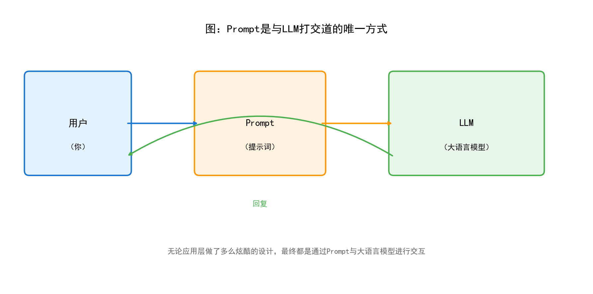
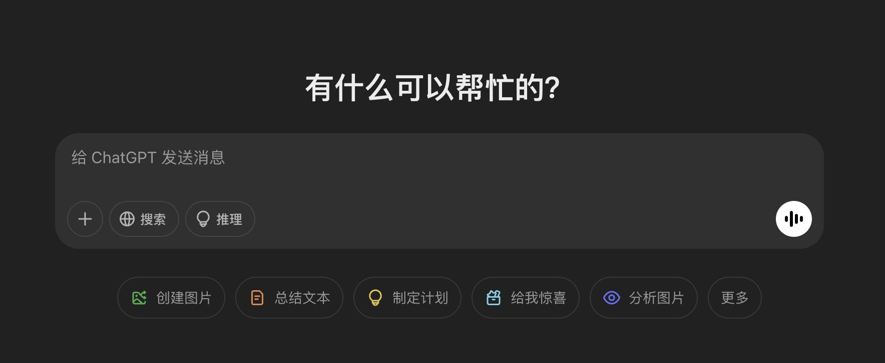
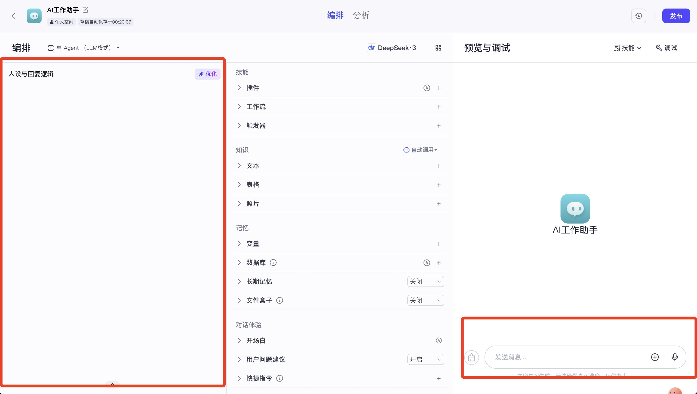
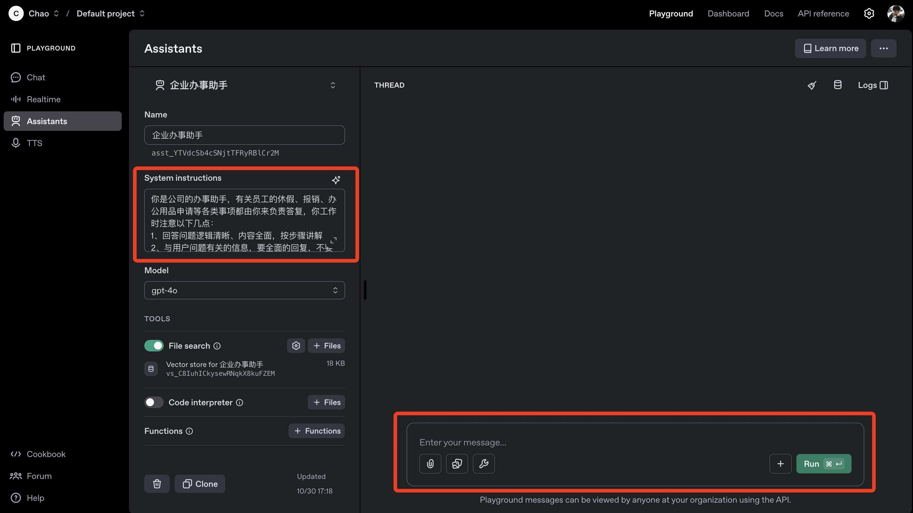
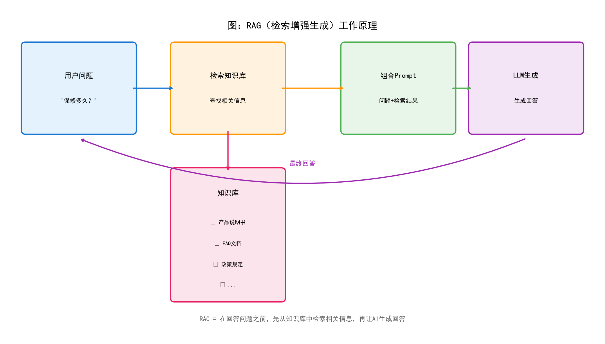
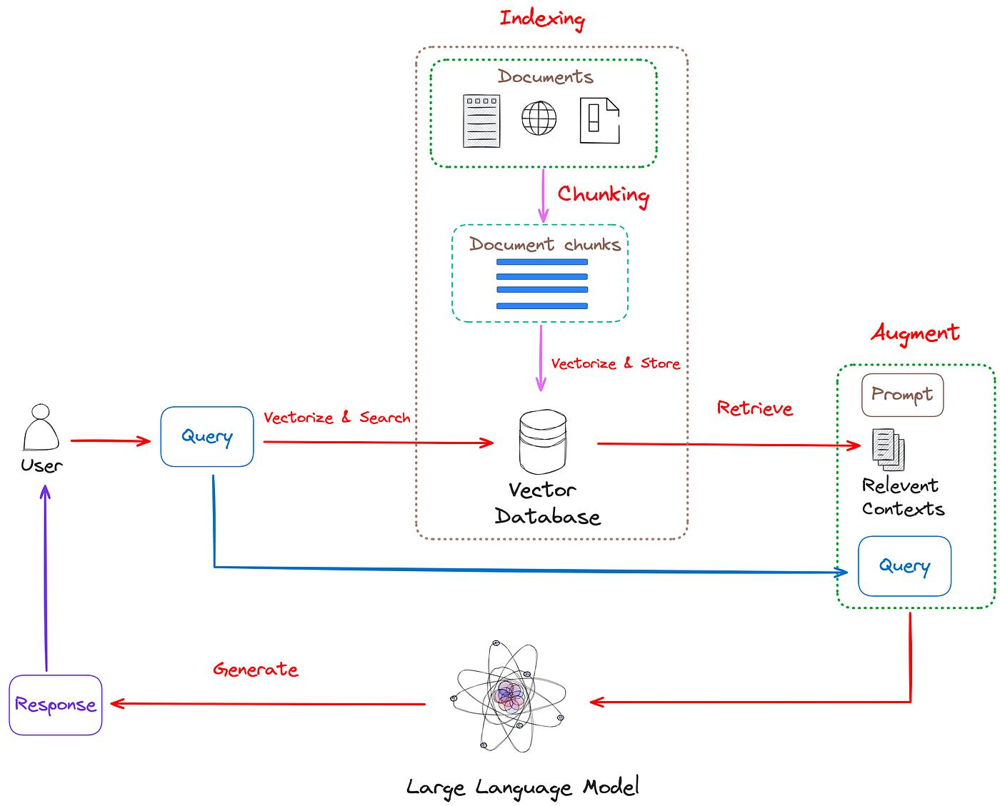
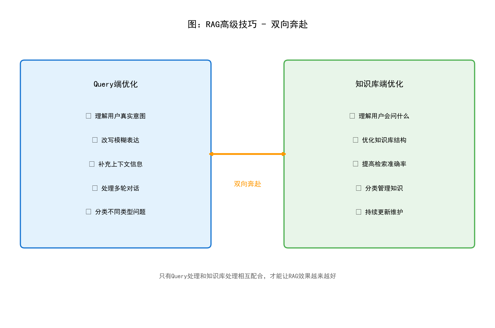
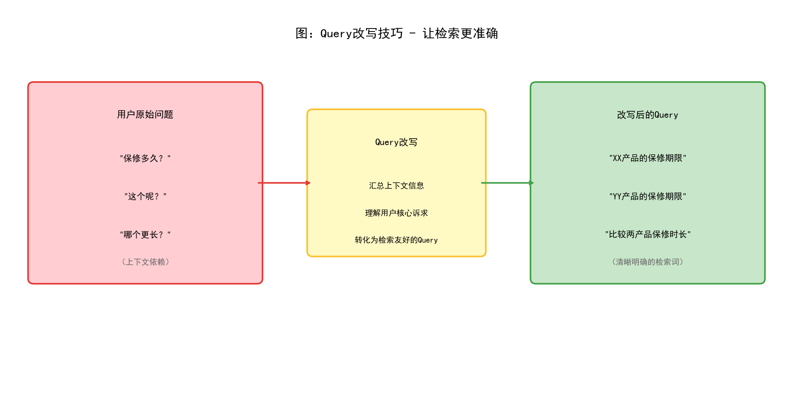

## 目录

1. [前言：为什么需要学习提示词和RAG？](#一前言为什么需要学习提示词和rag)
2. [提示词（Prompt）基础](#二提示词prompt基础)
3. [RAG（检索增强生成）详解](#三rag检索增强生成详解)
4. [RAG高级技巧：双向奔赴](#四rag高级技巧双向奔赴)
5. [实践案例](#五实践案例)
6. [总结与要点回顾](#六总结与要点回顾)

---

## 一、前言：为什么需要学习提示词和RAG？

在当今人工智能快速发展的时代，大语言模型（Large Language Model，简称LLM）已经成为了许多应用的核心技术。从智能客服到知识问答，从内容创作到代码生成，LLM正在改变我们与技术交互的方式。然而，要让LLM真正发挥价值，我们需要掌握两个关键技术：**提示词工程**和**RAG技术**。

### 1.1 课程内容概览

本课程主要涵盖三大核心主题：

| 序号 | 主题 | 核心要点 |
|:---:|:---|:---|
| 1 | 提示词 | 应用层的技术，都是为了拼出一条合适的Prompt |
| 2 | RAG | 全世界最流行的AI技术，也是AI领域最大的坑 |
| 3 | RAG高级技巧 | 双向奔赴，让检索和知识库相互配合 |

### 1.2 学习目标

通过本课程的学习，你将能够：

- **理解提示词的本质**：掌握如何与AI进行有效沟通
- **掌握RAG的核心原理**：理解为什么RAG是当今最流行的AI应用架构
- **学会优化技巧**：能够构建更智能、更准确的AI应用

---

## 二、提示词（Prompt）基础

### 2.1 什么是提示词？

**提示词（Prompt）** 是我们与大型语言模型（LLM）交互的唯一方式。简单来说，提示词就是我们要告诉AI的"指令"或"问题"。就像我们与人类沟通需要语言一样，与AI沟通也需要通过特定的"语言格式"——这就是提示词。










**核心认知**：无论应用层做了多么炫酷的设计——是聊天界面、语音助手，还是智能客服系统——最终都是为了传递合适的Prompt给LLM。可以这样说，**Prompt是连接人类意图与AI能力的桥梁**。

### 2.2 Prompt的组成要素

一个完整的Prompt通常包含以下六个要素：

| 要素 | 说明 | 示例 |
|:---|:---|:---|
| **身份设定** | 定义AI的角色身份 | "你是一个专业的客服助手" |
| **背景设定** | 描述任务发生的场景和背景 | "用户正在为小孩挑选游戏机作为礼物" |
| **参考资料** | 提供完成任务所需的信息 | 产品说明书、FAQ文档等 |
| **样例** | 展示期望的输入输出格式 | 问答对的示例 |
| **指令** | 明确要求AI完成的任务 | "请根据用户问题，提供专业建议" |
| **限制条件** | 对输出的格式、风格等进行约束 | "回复要简洁礼貌，不超过100字" |

### 2.3 Zero-Shot、One-Shot、Few-Shot 详解

根据Prompt中提供的样例数量，可以将提示方式分为三种类型：


#### 2.3.1 Zero-Shot（零样本提示）

**定义**：不提供任何样例，直接向AI提出问题或任务。

**特点**：
- 最简单的提示方式
- 完全依赖AI的预训练知识
- 适合通用性较强的问题

**示例**：
```
用户：把"苹果"翻译成英文
AI：Apple

用户：把"香蕉"翻译成英文
AI：Banana
```

**适用场景**：当任务比较简单、或者AI已经具备足够的相关知识时，Zero-Shot是一个高效的选择。比如翻译常见词汇、回答常识性问题等。

#### 2.3.2 One-Shot（单样本提示）

**定义**：提供一个样例，让AI理解任务的具体格式和要求。

**特点**：
- 通过一个例子明确任务模式
- 帮助AI"举一反三"
- 适合需要特定输出格式的任务

**示例**：
```
用户：把"苹果"翻译成英文
AI：Apple

用户：把"香蕉"翻译成英文
AI：Banana
```

**适用场景**：当你希望AI按照特定的格式或风格输出时，提供单个样例往往就能让AI"领悟"你的意图。

#### 2.3.3 Few-Shot（少样本提示）

**定义**：提供多个样例（通常2-5个），让AI更准确地理解任务要求。

**特点**：
- 多个样例提供更丰富的模式参考
- 显著提高输出质量
- 适合复杂或专业性较强的任务

**示例**：
```
用户：把"苹果"翻译成英文
AI：Apple
用户：把"橘子"翻译成英文
AI：Orange
用户：把"葡萄"翻译成英文
AI：Grape

用户：把"香蕉"翻译成英文
AI：Banana
```

**适用场景**：复杂任务、专业领域任务，或者需要特定输出风格的场景。样例越多，AI的理解越准确，但也要注意控制Prompt的长度。

### 2.4 实战案例：店员角色扮演

让我们通过一个具体案例来理解如何构建有效的Prompt：

**场景描述**：一位妈妈正在给小孩挑选游戏机作为礼物，正在比较Switch和PS5。

**用户问题**："感觉价格方面，Switch性价比高，PS5要贵不少吧？"

**构建Prompt**：

```
【身份设定】
你是一位专业的游戏机销售店员，对各类游戏机非常了解，态度友好热情。

【背景设定】
一位妈妈正在为她的孩子挑选游戏机作为生日礼物，孩子年龄约8岁。
她正在比较Nintendo Switch和PlayStation 5这两款产品。

【参考资料】
- Switch价格约2000-2500元，便携，游戏适合全家
- PS5价格约3500-4500元，画面精美，游戏偏向核心玩家

【样例】
用户：这两款有什么区别？
店员：主要区别在于使用场景和游戏类型。Switch可以便携，适合随时随地玩；PS5性能更强，画质更好，适合在家享受沉浸式体验。

【指令】
请根据用户的问题，提供专业、友好的回答。

【限制条件】
- 回复不超过150字
- 语气亲切，像朋友聊天
- 不要强行推销
```

---

## 三、RAG（检索增强生成）详解

### 3.1 什么是RAG？

**RAG** 是 **Retrieval-Augmented Generation** 的缩写，中文译为"检索增强生成"。

用最通俗的话来解释：**RAG就是让AI在回答问题之前，先去知识库里"查资料"，然后再给出回答**。



### 3.2 为什么需要RAG？

#### 3.2.1 In-Context-Learning的局限性

前面我们学习了在Prompt中添加参考资料和样例的方法，这种方法叫做**In-Context-Learning（上下文学习）**。这种方式确实有效，但存在两个关键问题：

| 问题 | 说明 |
|:---|:---|
| **字数限制** | 模型能接收的提示词有字数上限，无法把所有资料都放进去 |
| **性能下降** | 提示词内容过多时，模型的处理速度会变慢，效果也会下降 |

#### 3.2.2 RAG的解决方案

RAG的核心思想是：**既然不能把所有知识都放进Prompt，那就需要一个知识库，需要的时候再去知识库里找**。

这就像我们考试一样：
- In-Context-Learning = 开卷考试，把所有资料都带上
- RAG = 闭卷考试，但可以随时去图书馆查阅资料

### 3.3 RAG的工作流程

RAG系统包含两个核心环节：

#### 环节一：构建可检索的知识库

这是RAG的"基础设施建设"阶段，主要工作包括：

1. **知识收集**：收集产品手册、FAQ文档、规章制度等资料
2. **知识处理**：将长文档拆分成适合检索的小段落
3. **向量化存储**：将文本转换为计算机可以理解的向量形式
4. **建立索引**：建立快速检索的索引结构

#### 环节二：模型调用知识库完成用户任务

这是RAG的"日常工作"阶段，每次用户提问时：

1. **接收问题**：用户提出问题
2. **检索知识**：在知识库中搜索相关内容
3. **组合Prompt**：将检索结果与用户问题组合成完整的Prompt
4. **生成回答**：让LLM基于检索到的信息生成回答

### 3.4 RAG架构

以下是RAG架构示意图：



这张图展示了RAG系统的整体架构，包括知识的存储、检索和生成过程。

---

## 四、RAG高级技巧：双向奔赴

### 4.1 什么是"双向奔赴"？

"双向奔赴"是RAG优化的核心理念，意思是：**既要优化用户端的查询（Query），也要优化知识库端的内容，两者相互配合才能取得最佳效果**。



### 4.2 Query改写技巧

#### 4.2.1 为什么需要Query改写？

在实际应用中，用户的表达方式往往不够"标准"，这会导致检索效果不佳：

| 问题类型 | 说明 |
|:---|:---|
| **表达模糊** | 用户说"保修多久？"，但没说是哪个产品 |
| **上下文依赖** | 用户说"这个呢？"，需要结合之前的对话理解 |
| **多轮对话** | 连续几轮对话后，用户的真实意图可能分散在多处 |

#### 4.2.2 Query改写的核心方法

**核心原则**：汇总上下文所有信息，总结用户核心诉求作为检索Query。



#### 4.2.3 常见的Query类型及改写策略

| Query类型 | 原始表达 | 改写策略 |
|:---|:---|:---|
| **上下文依赖型** | "保修多久？"、"还有其他颜色吗？" | 结合上下文补充具体对象，如"XX产品的保修期限" |
| **对比型** | "哪个保修时间更长？" | 拆解为多个独立检索，如"A产品的保修期限"和"B产品的保修期限" |
| **模糊指代型** | "都支持无线充电吗？" | 明确指代对象，如"XX产品和YY产品是否支持无线充电" |
| **多意图型** | "有几个颜色？尺码齐全吗？大概什么时候能到货？" | 拆分为多个独立Query分别检索 |
| **反问型** | "这不会也得等一个月吧？" | 理解用户意图，转化为"XX产品的发货时间" |
| **条件型** | "有没有500元以下的、适合女生用的那种？" | 提取筛选条件，如"500元以下适合女生的产品推荐" |

### 4.3 知识库处理技巧

#### 4.3.1 对场景的深入理解

优化知识库的第一步是**完全清楚用户都会问什么、都会怎么问**。这需要：

1. **收集真实问题**：整理用户实际提出的问题
2. **分析问题模式**：归纳问题的类型和特点
3. **预判潜在问题**：思考用户可能还会问什么

#### 4.3.2 技术层面的优化

| 优化方向 | 具体措施 |
|:---|:---|
| **问题分类** | 将用户问题分为不同类型，如产品咨询、售后问题、技术支持等 |
| **知识库分库** | 不同类型问题对应不同的知识库 |
| **知识处理方式** | 根据内容特点选择合适的分段、索引方式 |

### 4.4 实践案例：课程答疑助手

以一个课程答疑助手为例，可以建立多个知识库：

| 知识库类型 | 内容来源 | 用途 |
|:---|:---|:---|
| **平台知识库** | coze平台文档 | 解答平台使用问题 |
| **课程视频知识库** | 课程视频转录文本 | 解答课程内容相关问题 |
| **微信群问答知识库** | 群内历史问答记录 | 解答常见问题 |

---

## 五、实践案例

让我们通过一个完整的案例来串联所学的知识：

**场景**：某电商平台需要构建一个智能客服系统

**Step 1：分析用户需求**

用户可能问的问题类型：
- 商品信息查询（价格、规格、库存等）
- 订单状态查询
- 售后服务咨询（退换货、维修等）
- 物流配送问题

**Step 2：设计Prompt模板**

```
【身份设定】
你是XX电商平台的智能客服助手，专业、耐心、友好。

【背景设定】
用户正在使用我们的购物平台，可能遇到商品、订单、售后等问题。

【指令】
1. 首先理解用户问题的核心意图
2. 如果需要查询具体信息，请明确告知需要什么信息
3. 基于提供的知识回答用户问题
4. 如果问题超出知识范围，礼貌告知用户转人工客服

【限制条件】
- 回复简洁明了，不超过200字
- 语气亲切友好
- 必要时主动提供相关建议
```

**Step 3：构建知识库**

| 知识库 | 内容 | 更新频率 |
|:---|:---|:---|
| 商品信息库 | 所有商品的详细信息 | 实时更新 |
| 常见问题库 | FAQ及标准答案 | 每周更新 |
| 售后政策库 | 退换货政策、保修政策等 | 按需更新 |

**Step 4：实现Query改写**

```
用户原始问题："这个有货吗？"

系统分析：
- 上下文：用户正在查看XX手机的详情页
- 改写后Query："XX手机当前库存情况"
- 检索知识库：商品信息库
- 返回结果：根据商品ID查询库存状态
```

---

## 六、总结与要点回顾

### 6.1 核心知识点总结

#### 关于提示词（Prompt）

| 知识点 | 核心要点 |
|:---|:---|
| **Prompt的本质** | 是我们与LLM打交道的唯一方式 |
| **应用层技术** | 所有应用层的技术，最终都是为了拼出合适的Prompt |
| **六要素** | 身份设定、背景设定、参考资料、样例、指令、限制条件 |
| **三种Shot类型** | Zero-Shot（无样例）、One-Shot（1个样例）、Few-Shot（多个样例） |

#### 关于RAG

| 知识点 | 核心要点 |
|:---|:---|
| **RAG定义** | Retrieval-Augmented Generation，检索增强生成 |
| **核心思想** | 回答问题前，先从知识库检索相关信息 |
| **两个环节** | 构建知识库 + 调用知识库 |
| **解决的问题** | Prompt字数限制、大量内容时性能下降 |

#### 关于RAG高级技巧

| 知识点 | 核心要点 |
|:---|:---|
| **双向奔赴** | Query端优化 + 知识库端优化 |
| **Query改写** | 汇总上下文，提取核心诉求 |
| **六种Query类型** | 上下文依赖型、对比型、模糊指代型、多意图型、反问型、条件型 |

### 6.2 学习建议

对于零基础的学习者，建议按以下顺序逐步深入：

1. **第一步**：熟练掌握Prompt的基本写法，多练习Zero-Shot和Few-Shot
2. **第二步**：理解RAG的原理，尝试搭建简单的知识库
3. **第三步**：学习Query改写技巧，优化检索效果
4. **第四步**：深入理解业务场景，实现真正的"双向奔赴"

### 6.3 相关资料

课程相关资料链接：[飞书文档](https://ncnmfdan85y5.feishu.cn/wiki/Fa8swInGPiBSAVkurEVct0sZnge?farom=from_copylink)

