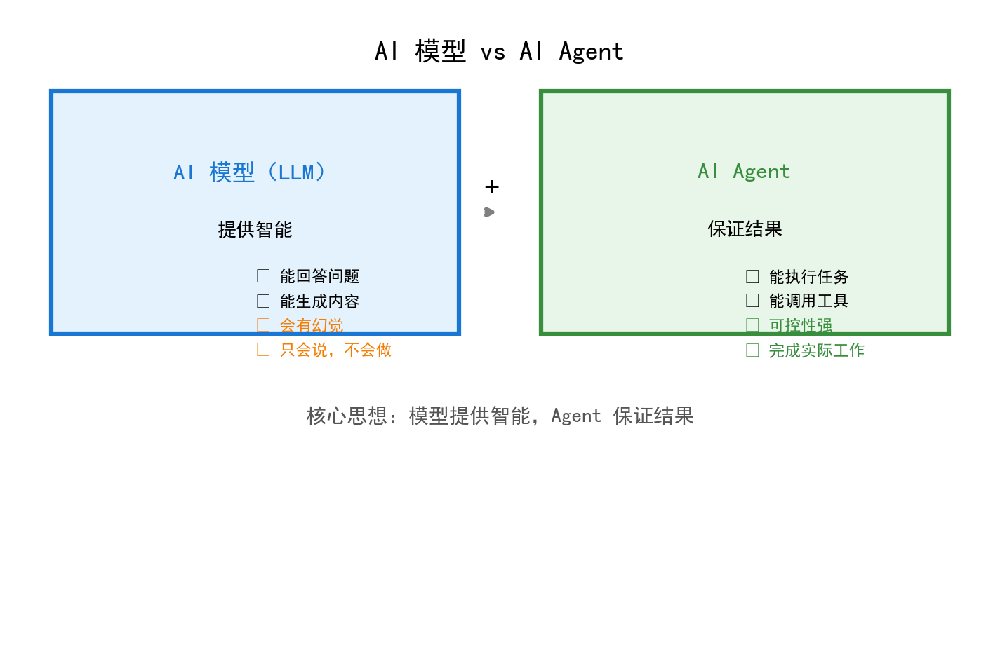
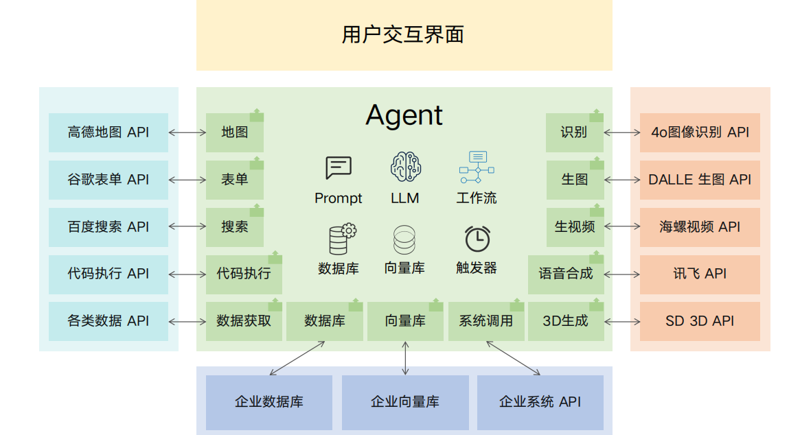
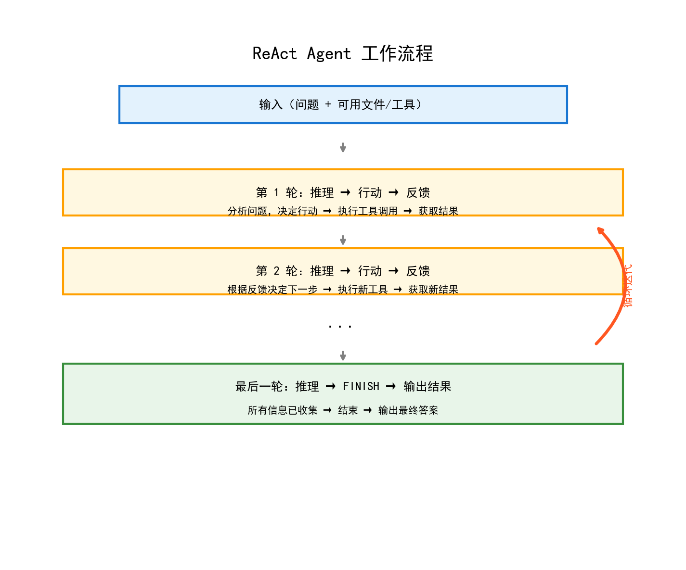
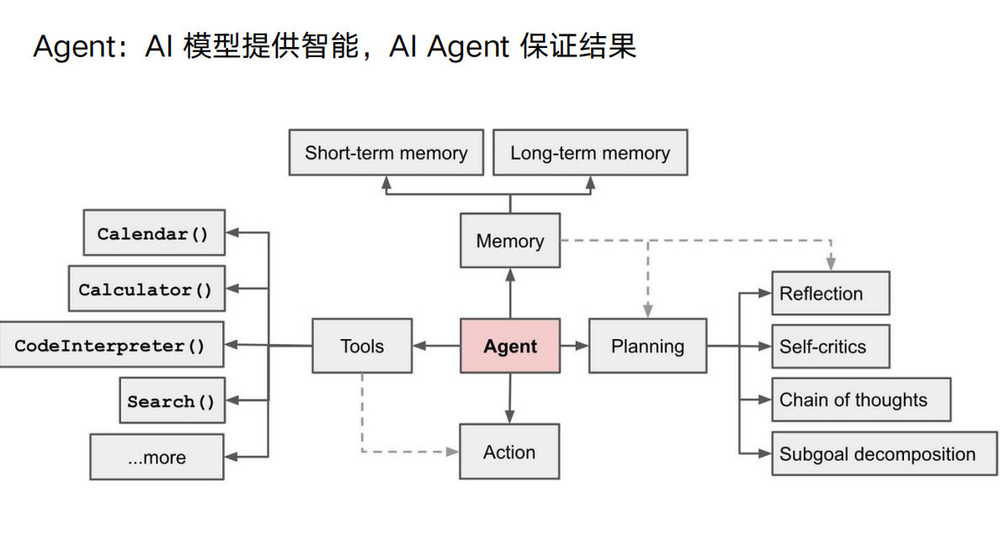
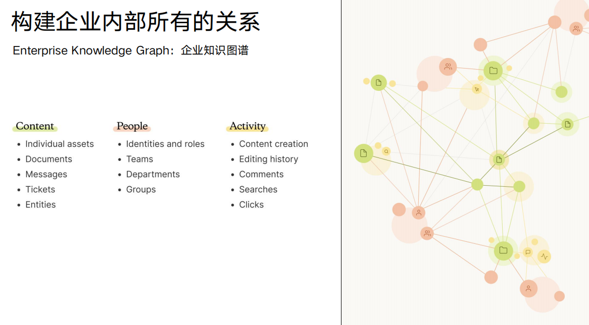
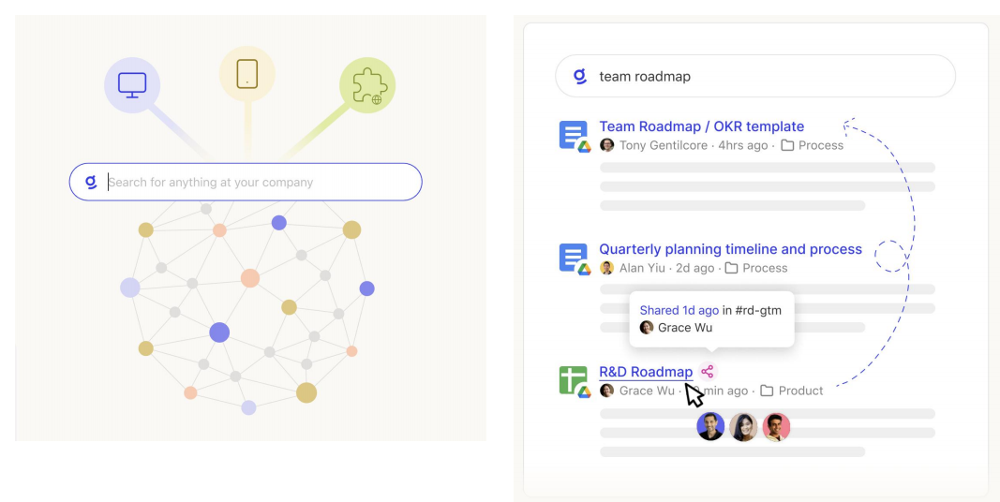
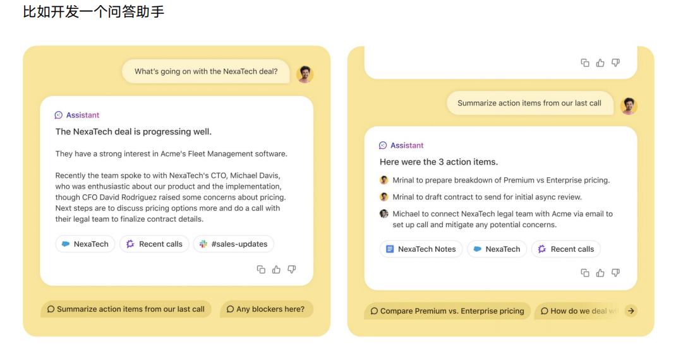
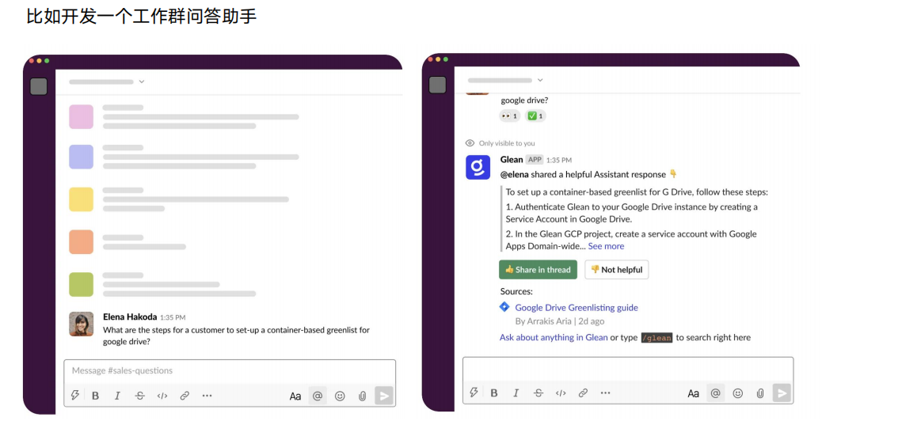
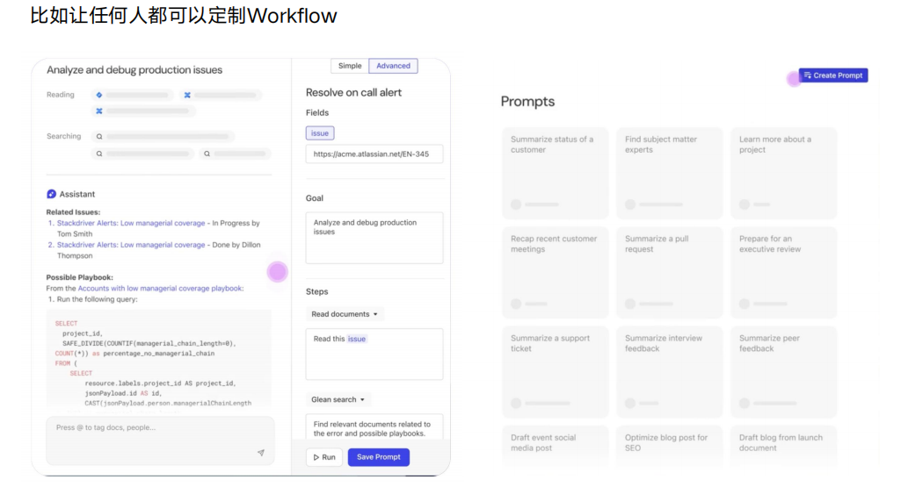

# Agent（智能体）知识点整理


## 目录

1. [什么是 Agent？](#什么是-agent)
2. [Workflow Agent（工作流智能体）](#workflow-agent-工作流智能体)
3. [ReAct Agent（推理型智能体）](#react-agent-推理型智能体)
4. [Agent 平台](#agent-平台)
5. [总结](#总结)

---

## 什么是 Agent？

### AI 模型 vs AI Agent



简单来说：
- **AI 模型（LLM）**：提供智能，能回答问题、生成内容
- **AI Agent**：保证结果，能执行任务、调用工具、完成实际工作

> 📌 **核心思想**：模型提供智能，Agent 保证结果

### 为什么需要 Agent？

LLM（大语言模型）存在以下局限性：

1. **LLM 会有幻觉**：可能生成不准确或虚构的内容
2. **LLM 只会说，不会做**：只能输出文字，无法执行实际操作
3. **LLM 规划的步骤不靠谱**：自动生成的执行步骤可能不准确

有些任务需要极高的准确度和可控性，这时就需要 Agent 来弥补 LLM 的不足。

---

## Workflow Agent（工作流智能体）

### 什么是 Workflow Agent？

Workflow Agent 是一种**预先定义好执行步骤**的智能体。设计者提前规划好任务流程，Agent 按照固定流程执行。

### Workflow Agent 架构图



### 核心特点

| 特点         | 说明                                           |
| ------------ | ---------------------------------------------- |
| ✅ 可控性强   | 步骤由设计者定义，执行过程可预测               |
| ✅ 准确度高   | 适合对准确性要求高的场景                       |
| ✅ 可集成工具 | 可以调用各种 API 和工具完成 LLM 无法完成的任务 |
| ⚠️ 灵活性低   | 只能处理预设流程内的任务                       |

### Workflow Agent 的能力

1. **用 RAG 技术构建私有知识库**，提升对话能力
2. **用设计者定义好的 Workflow 完成特定任务**
3. **过程中使用工具完成 LLM 无法完成的任务**
4. **让 LLM 写代码，完成数据处理、数学计算**

### 适用场景

- ✅ 客服问答系统
- ✅ 数据报表生成
- ✅ 固定流程的审批系统
- ✅ 标准化的业务处理流程

---

## ReAct Agent（推理型智能体）

### 什么是 ReAct Agent？

有些任务无法提前设定步骤怎么办？比如：
- "我有份文件里记录了上个月最终的业务数据，找找是哪份文件"
- "检查一下直播系统，我的直播间学员们说很卡，但是网络测速是正常的"
- "听说明天台风，我明天从深圳飞北京，能正常起飞么？"

这类任务需要**动态决策**，这时就需要 ReAct Agent。

### ReAct 的核心原理

**ReAct = Reasoning（推理） + Acting（行动）**

执行循环：
```
推理 → 行动 → 获得反馈 → 再次推理 → 再次行动 → 再次获得反馈 → ...
```

### ReAct 工作流程图



### 实战案例：查找 9 月份销售额不达标的供应商

**输入**：
- 文件：`各类电子产品销售数据.xlsx`、` 各地供应商信息.xlsx`、`2023 年供应商月销售额任务管理方案.pdf`
- 问题：9 月份销售额不达标的供应商有哪些？

**执行过程**：

| 轮次    | 推理                        | 行动                        | 反馈                           |
| ------- | --------------------------- | --------------------------- | ------------------------------ |
| 第 1 轮 | 需要知道有哪些文件可用      | `ListFileNames`             | 获取 3 个文件名                |
| 第 2 轮 | 需要查询达标标准            | `AskDocument` 查询 PDF      | 9 月达标标准：3 万元           |
| 第 3 轮 | 需要查看供应商信息表结构    | `InspectExcel` 查看供应商表 | 获取列名和数据样例             |
| 第 4 轮 | 需要查看销售数据表结构      | `InspectExcel` 查看销售表   | 获取列名和数据样例             |
| 第 5 轮 | 需要计算各供应商 9 月销售额 | `AnalyseExcel` 计算汇总     | 获取各供应商销售额             |
| 第 6 轮 | 需要筛选不达标的供应商      | `AnalyseExcel` 筛选         | 珠海健康科技有限公司：18320 元 |
| 第 7 轮 | 所有信息已收集完毕          | `FINISH`                    | 输出最终结果                   |

**输出结果**：
> 9 月份销售额不达标的供应商：珠海健康科技有限公司（销售额 18320 元，达标标准 30000 元）

### 使用了 ReAct 技术的 AI 产品

- **AutoGPT**：自主执行复杂任务的 AI
- **Perplexity**：智能搜索问答
- **Manus**：自主任务执行
- **Cursor**：AI 编程助手
- **GenSpark**：智能内容生成

### 思维链（Chain Of Thought）

ReAct 技术的基础是**思维链（CoT）**：

> 模型执行任务时，通过输出一系列中间推理过程文字，模拟人类推理过程。

就像人类解决问题时会一步步思考一样，AI 模型也可以通过"自言自语"的方式来组织思路，做出更准确的决策。



---

## Agent 平台

### 什么是 Agent 平台？

Agent 平台是**管理、运行、支持一系列 Agent** 的基础设施。

### 企业级 Agent 平台的核心能力

#### 1. 数据连接器（Connector）

企业数据和信息分散在各个系统中，如何打通？

- **硬功夫**：开发大量连接器（Connector）
- **支持类型**：
  - 实时获取：即时同步数据
  - T+1：隔天批量同步

#### 2. 企业知识图谱（Enterprise Knowledge Graph）

构建企业内部所有的关系网络：



### 基于平台构建的 Agent 应用

#### 1. 企业内部搜索框

员工可以通过一个搜索框查找：
- 文档资料
- 项目信息
- 同事联系方式
- 客户记录
- 等等...




#### 2. 问答助手

- 回答企业内部政策问题
- 查询业务数据
- 提供流程指导



#### 3. 工作群问答助手

在即时通讯工具中嵌入 AI 助手，随时回答问题。




#### 4. 自定义 Workflow

让任何人都可以通过可视化界面定制自己的工作流，无需编程。



---

## 总结

### Workflow Agent vs ReAct Agent 对比


| 特性         | Workflow Agent   | ReAct Agent        |
| ------------ | ---------------- | ------------------ |
| **灵活性**   | 低（预设流程）   | 高（动态决策）     |
| **可控性**   | 高               | 中                 |
| **适用场景** | 标准化流程       | 复杂探索性任务     |
| **执行方式** | 按部就班         | 推理 - 行动循环    |
| **典型应用** | 客服系统、审批流 | 数据分析、问题诊断 |

### 核心要点

1. **AI 模型（LLM）** 提供智能，但存在幻觉、无法执行实际问题
2. **AI Agent** 通过工作流或推理 + 行动的方式，保证任务结果可靠
3. **Workflow Agent** 适合预设流程、高准确性要求的场景
4. **ReAct Agent** 适合需要动态决策、探索性的复杂任务
5. **Agent 平台** 提供基础设施，支持大规模 Agent 应用的构建和运行

