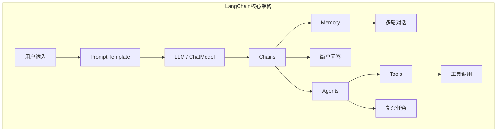
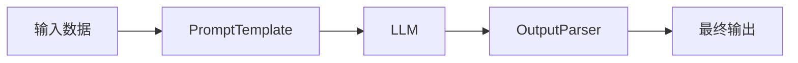
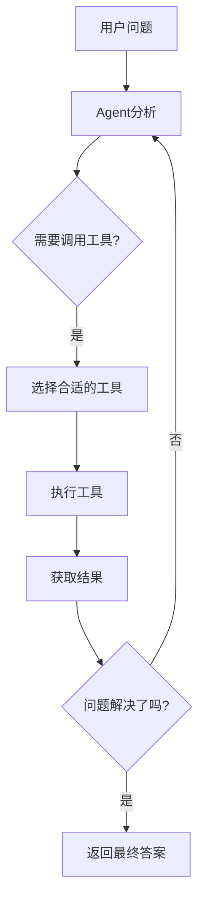
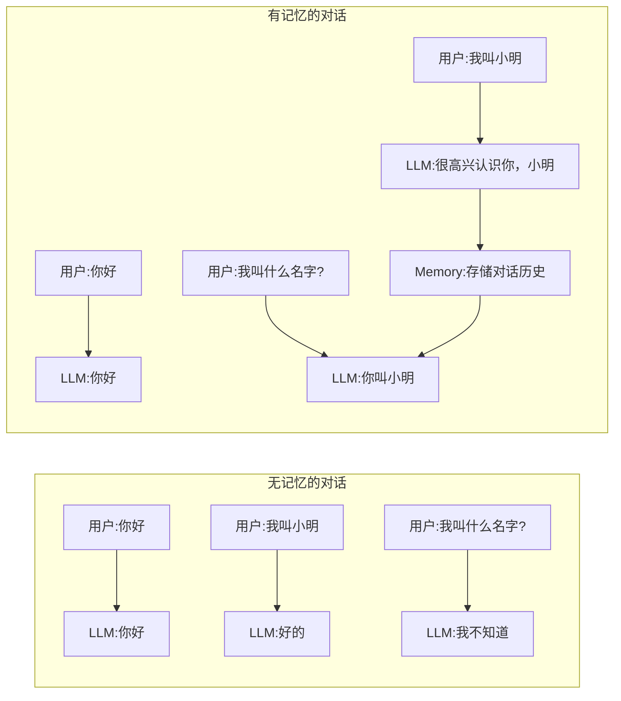
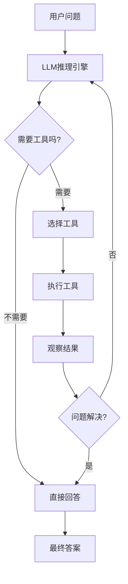
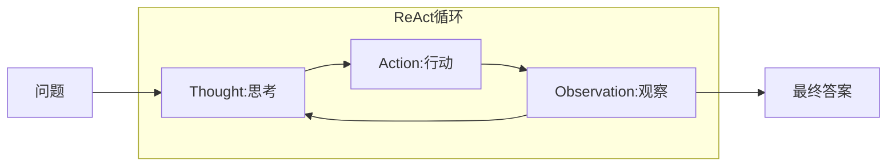
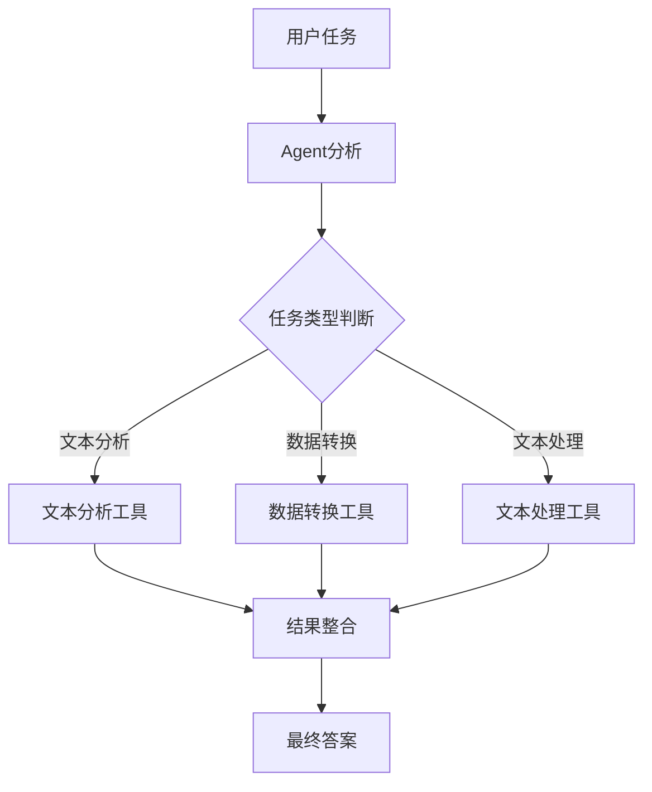
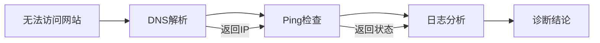
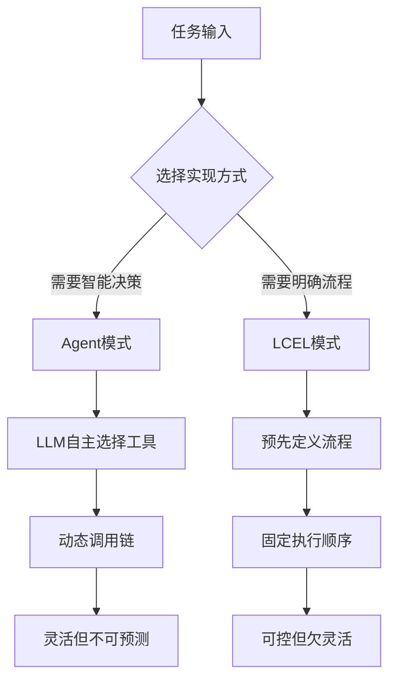
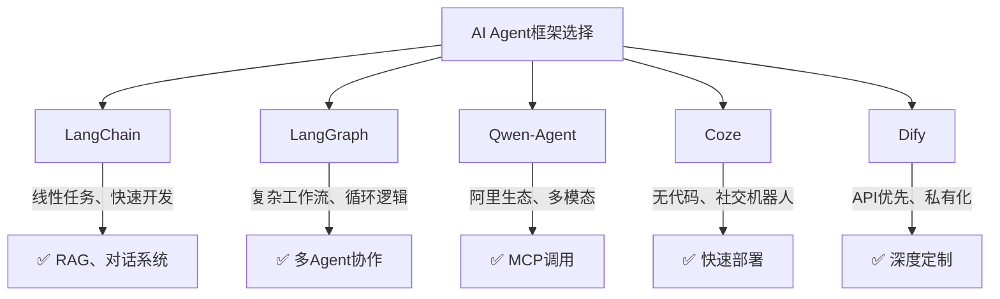

<!-- more -->

## 目录

1. [什么是LangChain?](#1-什么是langchain)
2. [LangChain 1.0版本重大变化](#2-langchain-10版本重大变化)
3. [核心组件详解](#3-核心组件详解)
4. [基础案例:Prompt + LLM](#4-基础案例prompt--llm)
5. [Agent与Tools](#5-agent与tools)
6. [Memory记忆组件](#6-memory记忆组件)
7. [ReAct范式详解](#7-react范式详解)
8. [本地知识智能客服案例](#8-本地知识智能客服案例)
9. [工具链组合设计](#9-工具链组合设计)
10. [LCEL构建任务链](#10-lcel构建任务链)
11. [AI Agent工具对比](#11-ai-agent工具对比)

---


## 第一部分：LangChain基础概念

### 1.1 LangChain是什么

LangChain是一个强大的开源框架，专门用于简化大语言模型（LLM）应用程序的开发过程。它提供了一套完整的工具、组件和接口，使开发者能够更加高效地构建基于LLM的应用程序。LangChain的核心价值在于将复杂的LLM应用开发过程模块化、组件化，让开发者可以专注于业务逻辑而非底层实现细节。

LangChain的设计理念是“组合优于继承”，通过将各种功能组件（如提示词模板、模型接口、工具集、记忆系统等）解耦为独立模块，开发者可以根据实际需求灵活组合这些组件，构建出功能强大的LLM应用。这种设计思想大大降低了LLM应用的开发门槛，同时也为复杂应用场景提供了足够的扩展性。

LangChain最初于2022年底发布，经过快速发展，于2024年发布了1.0版本，标志着该框架进入了成熟稳定的阶段。1.0版本在架构上进行了重大重构，引入了LCEL（LangChain Expression Language）表达式语言，使得组件的组合和调用更加直观和灵活。

### 1.2 LangChain核心组件架构

LangChain框架由六大核心组件构成，每个组件都承担着特定的功能职责，共同支撑起整个框架的能力体系。理解这些组件的作用和相互关系，是掌握LangChain的基础。



**模型层（Models）** 是LangChain与各种大语言模型交互的接口层。该层封装了对GPT-4、Claude、通义千问等主流模型的调用，提供了统一的接口规范。LangChain支持两种模型类型：LLM用于文本补全任务，ChatModel用于对话任务。ChatModel相比LLM具有更好的对话支持，并且支持tool calling功能，能够让模型调用外部工具。

**提示词层（Prompts）** 负责管理和优化提示词。该组件包括提示词模板（PromptTemplate）、提示词优化器以及提示词序列化功能。通过使用提示词模板，开发者可以将用户输入动态插入到预设的提示词框架中，实现提示词的复用和标准化管理。

**记忆层（Memory）** 为LLM应用提供了持久化上下文的能力。在默认情况下，LLM是无状态的，每次交互都是独立的。Memory组件允许应用保存和检索对话历史，使LLM能够记住之前的交互内容，从而实现真正的多轮对话体验。

**索引层（Indexes）** 提供了结构化文档处理的能力，是构建知识库应用的核心组件。该层包含文档加载器、文档转换器、文本分割器、向量计算器、向量存储和检索器等功能模块。如果需要构建基于私有知识的问答系统，索引层是必不可少的基础设施。

**链层（Chains）** 是将多个组件串联起来执行的核心机制。通过Chain，开发者可以定义一系列有序的组件调用，将用户的输入经过多个处理步骤后得到最终输出。Chain是LangChain最核心的执行单元。

**代理层（Agents）** 赋予LLM自主决策的能力。与Chain的固定执行流程不同，Agent能够根据用户的问题自主决定调用哪些工具、如何组织执行顺序，直到得到满意的答案。Agent是构建智能助手和自动化代理系统的关键技术。

### 1.3 LangChain 1.0版本重大变化

LangChain从0.3X升级到1.0版本，发生了架构性的重大变化。虽然核心概念保持一致，但包结构和使用方式有了显著改进，开发者需要特别注意这些变化。

**包结构完全重构** 是1.0版本最明显的变化。原有的单一`langchain`包被拆分为多个独立的子包：`langchain-core`只包含抽象基类和LCEL表达式语言，所有第三方集成不再直接依赖完整langchain包；`langchain-community`包含社区维护的几十种loader、retriever和tool实现；合作伙伴包如`langchain-openai`、`langchain-anthropic`等独立成库，体积更小、升级更加灵活。这种模块化设计使得依赖管理更加清晰，也减少了不必要的依赖传递。

**新增官方子项目** 进一步完善了LangChain生态系统。LangGraph是用于“图”编排多步、多角色、有状态工作流的新组件，替代了传统多重Chain嵌套的写法，特别适合复杂业务流程的建模；LangServe可以将链或代理一键封装为REST API，自带`/invoke`、`/stream`、`/batch`端点和Swagger页面，大大简化了LLM应用的部署；LangSmith是可视化调试、回归测试和在线监控平台，与1.0版本的回调系统深度集成，提供了专业的LLM应用开发和运维能力。

**API风格全面转向LCEL** 是1.0版本的核心改进。新的API鼓励使用`|`管道运算符将组件拼装成Runnable对象，而不是继承Chain基类。这种链式表达式的写法更加直观和Pythonic，例如`prompt | llm | output_parser`这样的代码清晰表达了数据流的整个过程。LCEL还支持并行执行、条件分支、流式输出等高级特性，使得复杂业务流程的实现变得简单。

---

## 第二部分：基础Chain开发

### 2.1 第一个LangChain程序

让我们从一个最简单的例子开始，理解LangChain的基本使用方式。最基础的LangChain用法是将Prompt模板和LLM组合成可执行的Chain。以下代码演示了如何创建一个简单的翻译Chain：

```python
from langchain_core.prompts import PromptTemplate
from langchain_community.llms import Tongyi  # 导入通义千问Tongyi模型
import dashscope
import os

# 从环境变量获取 dashscope 的 API Key
api_key = os.getenv('DASHSCOPE_API_KEY')
dashscope.api_key = api_key
 
# 加载 Tongyi 模型
llm = Tongyi(model_name="qwen-turbo", dashscope_api_key=api_key)  # 使用通义千问qwen-turbo模型

# 创建Prompt Template
prompt = PromptTemplate(
    input_variables=["product"],
    template="What is a good name for a company that makes {product}?",
)

# 新推荐用法：将 prompt 和 llm 组合成一个"可运行序列"
chain = prompt | llm

# 使用 invoke 方法传入输入
result1 = chain.invoke({"product": "colorful socks"})
print(result1)

result2 = chain.invoke({"product": "广告设计"})
print(result2)

```

这段代码展示了LangChain最核心的使用模式：首先创建Prompt模板定义输入格式，然后创建LLM实例，接着使用`|`管道符将它们组合成Chain，最后通过`invoke()`方法执行。这种链式组合方式是LangChain 1.0版本的推荐写法，被称为LCEL（LangChain Expression Language）。

### 2.2 LCEL表达式语言详解

LCEL是LangChain 1.0版本推出的核心特性，它提供了一种声明式的方式来组合各种LangChain组件。LCEL的设计受到了Unix管道符的启发，让复杂的数据处理流程变得直观易懂。



LCEL的核心优势体现在多个方面。首先是**代码简洁**，传统的Chain定义需要继承基类并重写方法，而LCEL只需要一行管道表达式；其次是**逻辑清晰**，数据流向一目了然，每个组件的输入输出都明确可见；第三是**易于调试**，可以在管道中间插入日志或断点，追踪数据流转过程；第四是**支持复杂编排**，LCEL原生支持并行执行、条件分支、错误处理等高级特性。

LCEL支持多种组合模式。**串联模式**是最基础的用法，数据依次流经各个组件：`chain = step_a | step_b | step_c`。**并行模式**允许同时执行多个组件，结果可以通过字典或列表返回：`{"result_a": chain_a, "result_b": chain_b}`。**条件分支**可以根据输入动态选择执行路径：`RunnableBranch([(condition, chain), (default, default_chain)])`。

```python
from langchain_core.prompts import ChatPromptTemplate
from langchain_community.llms import Tongyi  # 导入通义千问Tongyi模型
from langchain_core.output_parsers import StrOutputParser
import dashscope
import os

# 从环境变量获取 dashscope 的 API Key
api_key = os.environ.get('DASHSCOPE_API_KEY')
dashscope.api_key = api_key

# stream=True 让LLM支持流式输出
llm = Tongyi(model_name="qwen-turbo", dashscope_api_key=api_key, stream=True)

# 定义三个子任务：翻译->处理->回译
translate_to_en = ChatPromptTemplate.from_template("Translate this to English: {input}") | llm | StrOutputParser()
process_text = ChatPromptTemplate.from_template("Analyze this text: {text}") | llm | StrOutputParser()
translate_to_cn = ChatPromptTemplate.from_template("Translate this to Chinese: {output}") | llm | StrOutputParser()

# 组合成多任务链
workflow = {"text": translate_to_en} | process_text | translate_to_cn
#workflow.invoke({"input": "北京有哪些好吃的地方，简略回答不超过200字"})

# 使用stream方法，边生成边打印
for chunk in workflow.stream({"input": "北京有哪些好吃的地方，简略回答不超过200字"}):
    print(chunk, end="", flush=True)
```

---

## 第三部分：Tools工具系统

### 3.1 工具系统的作用与原理

在LangChain中，Tools（工具）是扩展LLM能力的关键组件。尽管LLM在语言理解和生成方面表现出色，但它们无法直接与外部世界交互——无法搜索最新信息、无法执行计算、无法访问数据库。Tools正是为了解决这一问题而设计的，它们为LLM提供了“手”和“脚”，使其能够执行各种实际操作。



LangChain内置了多种常用工具，开发者也可以根据自己的需求创建自定义工具。工具系统的工作原理是：Agent接收用户问题后，通过LLM的推理能力决定是否需要调用工具、调用哪个工具、以及传递什么参数；工具执行完成后，结果被返回给Agent，Agent根据结果决定是否继续调用其他工具或给出最终答案。

### 3.2 预置工具的使用

LangChain社区提供了丰富的预置工具，涵盖了搜索、计算、数据库访问等多个领域。以下是几个最常用的预置工具及其使用方法。

**SerpAPI工具**是最常用的搜索工具之一，它集成了Google、Baidu、Yahoo等多种搜索引擎的API。安装非常简单，只需要执行`pip install google-search-results`即可。使用时需要到[SerpAPI官网](https://serpapi.com/)注册账号获取API密钥，免费计划每月提供100次搜索额度。

```python
from langchain_community.chat_models import ChatTongyi
from langchain_community.agent_toolkit.load_tools import load_tools
from langchain.agents import create_agent

# 1. 创建ChatModel（支持tool calling）
llm = ChatTongyi(
    model_name="qwen-turbo",
    dashscope_api_key=api_key
)

# 2. 加载预置工具
tools = load_tools(['serpapi'])

# 3. 创建Agent
agent = create_agent(llm, tools)

# 4. 运行Agent
result = agent.invoke({
    "messages": [("user", "今天是几月几号？历史上的今天有哪些名人出生？")]
})
print(result)
```

**llm-math工具**为Agent提供了数学计算能力，可以处理复杂的数学表达式。当用户提出涉及计算的问题时，Agent会自动调用这个工具。以下是一个综合使用多个工具的示例：

```python
# 加载多个工具组合使用 (llm-math已废弃)
tools = load_tools(['serpapi', 'llm-math'], llm=llm)

# 创建Agent
agent = create_agent(llm, tools)

# Agent现在可以处理复杂问题：
# "当前北京的温度是多少华氏度？这个温度的1/4是多少？"
# Agent会自动：
# 1. 使用serpapi搜索北京当前温度
# 2. 使用llm-math计算温度的1/4

result = agent.invoke({
     "messages": [("user", "当前北京的温度是多少华氏度？这个温度的1/4是多少？")]
})
```

### 3.3 自定义工具的开发

除了使用预置工具，LangChain还允许开发者创建完全自定义的工具。自定义工具通过`@tool`装饰器实现，将普通Python函数转换为LangChain可识别的工具。以下是创建自定义工具的详细示例：

```python
import os
from langchain_community.agent_toolkits.load_tools import load_tools
from langchain_community.chat_models import ChatTongyi
from langchain.agents import create_agent
from langchain_core.tools import tool
import dashscope

# 从环境变量获取 dashscope 的 API Key
api_key = os.getenv('DASHSCOPE_API_KEY')
dashscope.api_key = api_key

# 加载模型 (使用 ChatModel 以支持 tool calling)
llm = ChatTongyi(model_name="deepseek-v3", dashscope_api_key=api_key)

# 自定义数学计算工具 (替代已废弃的 llm-math)
@tool
def calculator(expression: str) -> str:
    """计算数学表达式。只接受数字和运算符，例如: 2+2, 100/4, 32*1.8+32。不要使用变量名或占位符。"""
    # 只允许数字、运算符和括号
    import re
    if not re.match(r'^[\d\s\+\-\*\/\.\(\)]+$', expression):
        return f"错误: 表达式 '{expression}' 包含无效字符。请只使用数字和运算符(+,-,*,/)"
    return str(eval(expression))

# 加载 serpapi 工具 + 自定义计算器
serpapi_tools = load_tools(["serpapi"])
tools = serpapi_tools + [calculator]

# LangChain 1.x 新写法
agent = create_agent(llm, tools)

# 运行 agent
result = agent.invoke({"messages": [("user", "当前北京的温度是多少华氏度？这个温度的1/4是多少")]})
print(result["messages"][-1].content)
```

**注意事项**：在定义自定义工具时，docstring（三引号内的文档字符串）非常重要。Docstring会被Agent用来判断何时应该使用该工具，因此必须清晰、准确地描述工具的功能和使用方式。

---

## 第四部分：Memory记忆系统

### 4.1 为什么需要记忆系统

默认情况下，LangChain的Chain和Agent是无状态的——每次交互都是独立的，LLM不会记住之前说过什么。这对于简单的单轮问答场景没有问题，但实际应用中，大多数场景都需要多轮对话支持。用户可能在一个会话中提出多个相关问题，或者需要AI记住之前的上下文来提供更准确的回答。



### 4.2 LangChain中的记忆类型

LangChain提供了多种记忆类型，每种类型适用于不同的场景，开发者可以根据实际需求选择合适的实现方式。

**BufferMemory（缓冲记忆）** 是最简单的记忆类型，它将之前的对话完全存储下来，每次都完整地传递给LLM。这种方式保留了所有对话细节，但随着对话增长，上下文会越来越长，可能超出LLM的token限制。

```python
from langchain.memory import BufferMemory

# 创建BufferMemory
memory = BufferMemory(
    memory_key="chat_history",  # 记忆的键名
    return_messages=True         # 返回消息对象而非字符串
)

# 在Chain中使用
from langchain.chains import ConversationChain

conversation = ConversationChain(
    llm=llm,
    memory=memory,
    verbose=True  # 打印完整对话过程
)

response = conversation.predict(input="我叫小明")
print(response)
response = conversation.predict(input="我叫什么名字？")
print(response)
```

**BufferWindowMemory(缓冲窗口记忆)** 是BufferMemory的优化版本，它只保留最近K组对话，而不是保存全部历史。这种方式既保证了对话的连贯性，又避免了上下文无限增长的问题：

```python
from langchain.memory import BufferWindowMemory

# 只保留最近3轮对话
memory = BufferWindowMemory(k=3, memory_key="chat_history")
```

**ConversationSummaryMemory(摘要记忆)** 采用了一种更智能的方式——对对话历史进行摘要压缩。每次新的对话产生后，系统会调用LLM生成一个摘要，将详细的对话转化为简洁的摘要形式存储。这种方式特别适合长对话场景，既保留了关键信息，又大大减少了token使用量：

```python
from langchain.memory import ConversationSummaryMemory

memory = ConversationSummaryMemory(
    llm=llm,
    memory_key="chat_history",
    return_messages=True
)
```

**VectorStore-backed Memory(向量存储记忆)** 是最高级的记忆类型。它将所有对话历史通过向量化处理后存储到向量数据库中。当需要检索历史时，根据当前用户输入在向量数据库中进行相似性搜索，找到最相关的K组对话片段。这种方式特别适合需要检索大量历史对话的场景：

```python
from langchain.memory import VectorStoreRetrieverMemory
from langchain.vectorstores import Chroma
from langchain.embeddings import OpenAIEmbeddings

# 创建向量存储
vectorstore = Chroma(embedding_function=OpenAIEmbeddings())

# 创建基于向量存储的记忆
memory = VectorStoreRetrieverMemory(
    retriever=vectorstore.as_retriever(search_kwargs={"k": 3}),
    memory_key="chat_history"
)
```

### 4.3 带记忆的对话Chain实现

以下是一个完整的带记忆对话系统的实现示例，演示了如何创建支持多轮对话的智能助手：

```python
import os
from langchain_community.chat_models import ChatTongyi
from langchain_core.prompts import ChatPromptTemplate, MessagesPlaceholder
from langchain_core.chat_history import InMemoryChatMessageHistory
from langchain_core.runnables.history import RunnableWithMessageHistory
import dashscope

# 从环境变量获取 dashscope 的 API Key
api_key = os.getenv('DASHSCOPE_API_KEY')
dashscope.api_key = api_key

# 加载模型
llm = ChatTongyi(model_name="qwen-turbo", dashscope_api_key=api_key)

# 创建带历史记录的 prompt
prompt = ChatPromptTemplate.from_messages([
    ("system", "You are a helpful assistant."),
    MessagesPlaceholder(variable_name="history"),
    ("human", "{input}")
])

# 创建 chain
chain = prompt | llm

# 存储会话历史
store = {}

def get_session_history(session_id: str):
    if session_id not in store:
        store[session_id] = InMemoryChatMessageHistory()
    return store[session_id]

# 创建带记忆的对话链
conversation = RunnableWithMessageHistory(
    chain,
    get_session_history,
    input_messages_key="input",
    history_messages_key="history"
)

config = {"configurable": {"session_id": "default"}}

# 第一轮对话
output = conversation.invoke({"input": "Hi there!"}, config=config)
print(output.content)

# 第二轮对话 (会记住上一轮)
output = conversation.invoke({"input": "I'm doing well! Just having a conversation with an AI."}, config=config)
print(output.content)

```

这个示例展示了记忆系统的核心工作流程：`MessagesPlaceholder`在Prompt中为历史消息预留了位置，`RunnableWithMessageHistory`自动管理消息的存储和检索，`session_id`参数允许系统同时维护多个独立的对话会话。

---

## 第五部分：Agent与ReAct范式

### 5.1 Agent的工作原理

Agent是LangChain中最强大也最复杂的组件，它赋予了LLM自主决策和执行任务的能力。与Chain的固定执行流程不同，Agent能够根据用户的问题动态决定：是否需要调用工具、调用哪个工具、如何组织执行顺序。



LangChain官方文档对Agent的定义是：它们使用LLM来确定应该采取哪些行动以及按什么顺序执行。每个行动可以是使用某个工具并观察其输出，或者直接返回给用户。这种"思考-行动-观察"的循环模式使得Agent能够处理复杂的多步骤任务。

### 5.2 ReAct范式详解

ReAct（Reasoning + Acting）是Agent实现的核心范式，源自2022年发表的论文《ReAct: Synergizing Reasoning and Acting in Language Models》。这个范式的核心思想是将推理（Reasoning）和动作（Acting）相结合，让LLM能够像人类一样，在执行任务时进行中间步骤的思考。



ReAct范式的灵感来自于对人类行为的观察：人们在从事需要多个步骤的任务时，在步骤和步骤之间通常会有推理过程。例如，当被问到"Apple Remote最初设计用来控制什么？"时，人类会先思考"我需要搜索Apple Remote的信息"，然后执行搜索，观察结果，再思考"我需要进一步搜索Front Row"，如此循环直到找到答案。

ReAct范式包含四个核心步骤：**Thought（思考）**是LLM分析问题并决定下一步行动的环节；**Action（行动）**是根据思考结果选择并调用具体的工具；**Action Input（行动输入）**是传递给工具的参数；**Observation（观察）**是工具执行后返回的结果。这四个步骤会循环执行，直到LLM认为已经得到最终答案。

### 5.3 Agent开发实战：本地知识客服

以下是一个完整的本地知识客服Agent开发示例，演示了如何构建能够回答关于产品信息的智能客服：

```python
import os
import textwrap
import time

from langchain_community.chat_models import ChatTongyi
from langchain_core.tools import tool
from langchain_core.prompts import PromptTemplate
from langchain.agents import create_agent

# 定义了LLM的Prompt Template
CONTEXT_QA_TMPL = """
根据以下提供的信息，回答用户的问题
信息：{context}

问题：{query}
"""
CONTEXT_QA_PROMPT = PromptTemplate(
    input_variables=["query", "context"],
    template=CONTEXT_QA_TMPL,
)

# 输出结果显示，每行最多60字符，每个字符显示停留0.1秒（动态显示效果）
def output_response(response: str) -> None:
    if not response:
        exit(0)
    for line in textwrap.wrap(response, width=60):
        for word in line.split():
            for char in word:
                print(char, end="", flush=True)
                time.sleep(0.1)
            print(" ", end="", flush=True)
        print()
    print("----------------------------------------------------------------")

# 从环境变量获取 API Key
api_key = os.getenv('DASHSCOPE_API_KEY')

# 定义LLM
llm = ChatTongyi(model_name="qwen-turbo", dashscope_api_key=api_key)

# 工具1：产品描述
@tool
def find_product_description(product_name: str) -> str:
    """通过产品名称找到产品描述。输入产品名称如 Model 3, Model Y, Model X"""
    print('product_name=', product_name)
    product_info = {
        "Model 3": "具有简洁、动感的外观设计，流线型车身和现代化前脸。定价23.19-33.19万",
        "Model Y": "在外观上与Model 3相似，但采用了更高的车身和更大的后备箱空间。定价26.39-36.39万",
        "Model X": "拥有独特的翅子门设计和更加大胆的外观风格。定价89.89-105.89万",
    }
    return product_info.get(product_name, "没有找到这个产品")

# 工具2：公司介绍
@tool
def find_company_info(query: str) -> str:
    """当用户询问公司相关的问题时使用。输入用户的问题"""
    context = """
    特斯拉最知名的产品是电动汽车，其中包括Model S、Model 3、Model X和Model Y等多款车型。
    特斯拉以其技术创新、高性能和领先的自动驾驶技术而闻名。公司不断推动自动驾驶技术的研发，并在车辆中引入了各种驾驶辅助功能，如自动紧急制动、自适应巡航控制和车道保持辅助等。
    """
    prompt = CONTEXT_QA_PROMPT.format(query=query, context=context)
    response = llm.invoke(prompt)
    return response.content

# 定义工具集
tools = [find_product_description, find_company_info]

# 创建 Agent
agent = create_agent(llm, tools)

if __name__ == "__main__":
    # 主过程：可以一直提问下去，直到Ctrl+C
    while True:
        user_input = input("请输入您的问题：")
        result = agent.invoke({"messages": [("user", user_input)]})
        response = result["messages"][-1].content
        output_response(response)

```

这个示例展示了Agent开发的完整流程：首先定义数据源和工具，然后创建提示词模板，接着组装LLMChain和输出解析器，最后创建AgentExecutor来执行。整个过程遵循ReAct范式，Agent会自动进行多轮思考和工具调用，直到得到满意的答案。

---

## 第六部分：工具链组合设计

### 6.1 工具链的概念与价值

在复杂的LLM应用中，通常需要多个工具协同工作才能完成任务。工具链（Tool Chain）就是将多个相关工具组合在一起，形成一个完整的任务处理流程。通过工具链设计，Agent可以像处理复杂任务的专业系统一样，分步骤、按顺序地完成各项工作。



工具链设计的核心价值在于**专业化分工**和**流程可控**。每个工具专注于特定的功能，通过组合形成完整能力；流程的每一步都由开发者明确定义，确保输出的可控性和可预测性。这与Agent的自主决策形成互补——工具链适合步骤明确、流程固定的场景，而Agent更适合需要灵活决策的场景。

### 6.2 工具链实现示例

以下是一个完整的多工具组合系统，包含了文本分析、数据转换和文本处理三个工具：

```python
# 2-simple_toolchain.py
# 使用 LCEL（LangChain Expression Language）方式构建多工具任务链
from langchain_core.runnables import RunnableLambda, RunnableMap, RunnablePassthrough
import json
import os
import dashscope

# 从环境变量获取 dashscope 的 API Key
api_key = os.environ.get('DASHSCOPE_API_KEY')
dashscope.api_key = api_key

# 自定义工具1：文本分析工具
class TextAnalysisTool:
    """文本分析工具，用于分析文本内容"""
    def __init__(self):
        self.name = "文本分析"
        self.description = "分析文本内容，提取字数、字符数和情感倾向"
    def run(self, text: str) -> str:
        word_count = len(text.split())
        char_count = len(text)
        positive_words = ["好", "优秀", "喜欢", "快乐", "成功", "美好"]
        negative_words = ["差", "糟糕", "讨厌", "悲伤", "失败", "痛苦"]
        positive_count = sum(1 for word in positive_words if word in text)
        negative_count = sum(1 for word in negative_words if word in text)
        sentiment = "积极" if positive_count > negative_count else "消极" if negative_count > positive_count else "中性"
        return f"文本分析结果:\n- 字数: {word_count}\n- 字符数: {char_count}\n- 情感倾向: {sentiment}"

# 自定义工具2：数据转换工具
class DataConversionTool:
    """数据转换工具，用于在不同格式之间转换数据"""
    def __init__(self):
        self.name = "数据转换"
        self.description = "在不同数据格式之间转换，如JSON、CSV等"
    def run(self, input_data: str, input_format: str, output_format: str) -> str:
        try:
            if input_format.lower() == "json" and output_format.lower() == "csv":
                data = json.loads(input_data)
                if isinstance(data, list):
                    if not data:
                        return "空数据"
                    headers = set()
                    for item in data:
                        headers.update(item.keys())
                    headers = list(headers)
                    csv = ",".join(headers) + "\n"
                    for item in data:
                        row = [str(item.get(header, "")) for header in headers]
                        csv += ",".join(row) + "\n"
                    return csv
                else:
                    return "输入数据必须是JSON数组"
            elif input_format.lower() == "csv" and output_format.lower() == "json":
                lines = input_data.strip().split("\n")
                if len(lines) < 2:
                    return "CSV数据至少需要标题行和数据行"
                headers = lines[0].split(",")
                result = []
                for line in lines[1:]:
                    values = line.split(",")
                    if len(values) != len(headers):
                        continue
                    item = {}
                    for i, header in enumerate(headers):
                        item[header] = values[i]
                    result.append(item)
                return json.dumps(result, ensure_ascii=False, indent=2)
            else:
                return f"不支持的转换: {input_format} -> {output_format}"
        except Exception as e:
            return f"转换失败: {str(e)}"

# 自定义工具3：文本处理工具
class TextProcessingTool:
    """文本处理工具，用于处理文本内容"""
    def __init__(self):
        self.name = "文本处理"
        self.description = "处理文本内容，如查找、替换、统计等"
    def run(self, operation: str, content: str, **kwargs) -> str:
        if operation == "count_lines":
            return f"文本共有 {len(content.splitlines())} 行"
        elif operation == "find_text":
            search_text = kwargs.get("search_text", "")
            if not search_text:
                return "请提供要查找的文本"
            lines = content.splitlines()
            matches = []
            for i, line in enumerate(lines):
                if search_text in line:
                    matches.append(f"第 {i+1} 行: {line}")
            if matches:
                return f"找到 {len(matches)} 处匹配:\n" + "\n".join(matches)
            else:
                return f"未找到文本 '{search_text}'"
        elif operation == "replace_text":
            old_text = kwargs.get("old_text", "")
            new_text = kwargs.get("new_text", "")
            if not old_text:
                return "请提供要替换的文本"
            new_content = content.replace(old_text, new_text)
            count = content.count(old_text)
            return f"替换完成，共替换 {count} 处。\n新内容:\n{new_content}"
        else:
            return f"不支持的操作: {operation}"

# 工具实例
text_analysis = TextAnalysisTool()
data_conversion = DataConversionTool()
text_processing = TextProcessingTool()

# 工具链（LCEL风格）- 使用 RunnableLambda 包装工具函数
text_analysis_chain = RunnableLambda(lambda x: text_analysis.run(x["text"]))
data_conversion_chain = RunnableLambda(lambda x: data_conversion.run(
    x["input_data"], 
    x["input_format"], 
    x["output_format"]
))
count_lines_chain = RunnableLambda(lambda x: text_processing.run("count_lines", x["content"]))
find_text_chain = RunnableLambda(lambda x: text_processing.run(
    "find_text", 
    x["content"], 
    search_text=x.get("search_text", "")
))
replace_text_chain = RunnableLambda(lambda x: text_processing.run(
    "replace_text", 
    x["content"], 
    old_text=x.get("old_text", ""),
    new_text=x.get("new_text", "")
))

# LCEL 工具字典（用于快速查找）
tools = {
    "文本分析": text_analysis_chain,
    "数据转换": data_conversion_chain,
    "统计行数": count_lines_chain,
    "查找文本": find_text_chain,
    "替换文本": replace_text_chain,
}

# 示例：LCEL任务链 - 单个工具调用
def lcel_task_chain(task_type, params):
    """
    LCEL风格的任务链调度
    参数:
        task_type: 工具名称
        params: 参数字典
    返回:
        工具执行结果
    """
    if task_type not in tools:
        return "不支持的工具类型"
    return tools[task_type].invoke(params)

# LCEL 链式组合示例：文本分析 -> 统计行数
def lcel_analysis_and_count_chain(text):
    """
    使用 LCEL 管道操作符组合多个工具
    先分析文本，再统计行数
    """
    # 使用 RunnablePassthrough 传递数据，然后组合多个工具
    chain = (
        RunnablePassthrough.assign(
            analysis=lambda x: text_analysis_chain.invoke({"text": x["text"]})
        )
        | RunnableLambda(lambda x: {
            "analysis": x["analysis"],
            "line_count": count_lines_chain.invoke({"content": x["text"]})
        })
    )
    return chain.invoke({"text": text})

# LCEL 并行执行示例：同时执行多个工具
def lcel_parallel_tools(text):
    """
    使用 RunnableMap 并行执行多个工具
    """
    parallel_chain = RunnableMap({
        "analysis": RunnableLambda(lambda x: text_analysis_chain.invoke({"text": x["text"]})),
        "line_count": RunnableLambda(lambda x: count_lines_chain.invoke({"content": x["text"]})),
    })
    return parallel_chain.invoke({"text": text})

# 示例用法
if __name__ == "__main__":
    # 示例1：文本分析（单个工具调用）
    result1 = lcel_task_chain("文本分析", {"text": "这个产品非常好用，我很喜欢它的设计，使用体验非常棒！"})
    print("示例1结果（文本分析）：", result1)
    print("-" * 30)

    # 示例2：数据格式转换（单个工具调用）
    csv_data = "name,age,comment\n张三,25,这个产品很好\n李四,30,服务态度差\n王五,28,性价比高"
    result2 = lcel_task_chain("数据转换", {"input_data": csv_data, "input_format": "csv", "output_format": "json"})
    print("示例2结果（数据转换）：", result2)
    print("-" * 30)

    # 示例3：统计行数（单个工具调用）
    text = "第一行内容\n第二行内容\n第三行内容"
    result3 = lcel_task_chain("统计行数", {"content": text})
    print("示例3结果（统计行数）：", result3)
    print("-" * 30)

    # 示例4：LCEL 链式组合（先文本分析，再统计行数）
    # 使用 LCEL 管道操作符组合多个工具
    text4 = "这个产品非常好用，我很喜欢它的设计，使用体验非常棒！\n价格也很合理，推荐大家购买。\n客服态度也很好，解答问题很及时。"
    result4 = lcel_analysis_and_count_chain(text4)
    print("示例4结果（LCEL链式组合）：")
    print("文本分析结果：", result4["analysis"])
    print("行数统计结果：", result4["line_count"])
    print("-" * 30)

    # 示例5：LCEL 并行执行（同时执行多个工具）
    # 使用 RunnableMap 并行执行多个工具
    text5 = "这个产品非常好用，我很喜欢它的设计，使用体验非常棒！\n价格也很合理，推荐大家购买。"
    result5 = lcel_parallel_tools(text5)
    print("示例5结果（LCEL并行执行）：")
    print("文本分析结果：", result5["analysis"])
    print("行数统计结果：", result5["line_count"])
    print("-" * 30)

    # 示例6：查找文本
    text6 = "第一行：这是测试文本\n第二行：包含关键词\n第三行：继续测试"
    result6 = lcel_task_chain("查找文本", {"content": text6, "search_text": "关键词"})
    print("示例6结果（查找文本）：", result6)
    print("-" * 30)

    # 示例7：替换文本
    text7 = "原始文本内容\n需要替换的部分\n继续内容"
    result7 = lcel_task_chain("替换文本", {"content": text7, "old_text": "需要替换的部分", "new_text": "已替换的内容"})
    print("示例7结果（替换文本）：", result7)
    print("-" * 30)
```

### 6.3 故障诊断Agent设计

以下是一个网络故障诊断Agent的设计示例，展示了如何实现工具之间的串联调用：



```python
import os
import re
from typing import Optional
from langchain_core.tools import tool
from langchain.agents import create_agent
from langchain_community.chat_models import ChatTongyi
import dashscope

# 从环境变量获取 dashscope 的 API Key
api_key = os.environ.get('DASHSCOPE_API_KEY')
dashscope.api_key = api_key

# --- 环境设置 ---
# 确保设置了您的通义千问 API 密钥
# 您可以通过环境变量 DASHSCOPE_API_KEY 设置，或者直接在这里修改
# DASHSCOPE_API_KEY = os.getenv('DASHSCOPE_API_KEY', '您的API密钥')
# 为方便演示，我们直接在此处硬编码 (请注意在生产环境中保护好您的密钥)
DASHSCOPE_API_KEY = os.getenv("DASHSCOPE_API_KEY")

# --- 自定义网络诊断工具 ---

# 自定义网络诊断工具 - 使用 @tool 装饰器
@tool
def ping_tool(target: str) -> str:
    """检查本机到指定主机名或 IP 地址的网络连通性。输入应该是目标主机名或 IP 地址。输出表明是否可达及延迟。
    
    参数:
        target: 目标主机名或 IP 地址
    返回:
        模拟的 ping 结果
    """
    print(f"--- 模拟执行 Ping: {target} ---")
    # 简单模拟：特定目标可能失败
    if "unreachable" in target or target == "192.168.1.254":
        return f"Ping {target} 失败：请求超时。"
    elif target == "localhost" or target == "127.0.0.1":
         return f"Ping {target} 成功：延迟 <1ms。"
    elif "example.com" in target:
         # 模拟一个稍微慢点的响应
         import random
         delay = random.randint(20, 80)
         return f"Ping {target} 成功：延迟 {delay}ms。"
    else:
        # 其他情况默认成功
        import random
        delay = random.randint(5, 50)
        return f"Ping {target} 成功：延迟 {delay}ms。"

@tool
def dns_tool(hostname: str) -> str:
    """解析给定的主机名，获取其对应的 IP 地址。输入应该是要解析的主机名。输出是 IP 地址或解析失败信息。
    
    参数:
        hostname: 要解析的主机名
    返回:
        模拟的 DNS 解析结果
    """
    print(f"--- 模拟 DNS 查询: {hostname} ---")
    # 简单模拟
    if hostname == "www.example.com":
        return f"DNS 解析 {hostname} 成功：IP 地址是 93.184.216.34"
    elif hostname == "internal.service.local":
        return f"DNS 解析 {hostname} 成功：IP 地址是 192.168.1.100"
    elif hostname == "unknown.domain.xyz":
        return f"DNS 解析 {hostname} 失败：找不到主机。"
    elif hostname == "127.0.0.1" or re.match(r"\d{1,3}\.\d{1,3}\.\d{1,3}\.\d{1,3}", hostname):
         return f"输入 '{hostname}' 已经是 IP 地址，无需 DNS 解析。"
    else:
        # 模拟一个通用 IP
        return f"DNS 解析 {hostname} 成功：IP 地址是 10.0.0.5"

@tool
def interface_check_tool(interface_name: Optional[str] = None) -> str:
    """检查本机网络接口的状态（如 IP 地址、是否启用）。可选输入是接口名称，若不提供则检查默认接口。输出接口状态信息。
    
    参数:
        interface_name: (可选) 要检查的接口名称
    返回:
        模拟的接口状态信息
    """
    print(f"--- 模拟检查接口状态: {interface_name or '默认接口'} ---")
    if interface_name and "eth1" in interface_name.lower():
        return f"接口 '{interface_name}' 状态：关闭 (Administratively down)"
    else:
        # 模拟一个常见的有线或无线接口状态
        return f"接口 'Ethernet'/'Wi-Fi' 状态：启用, IP 地址: 192.168.1.50, 子网掩码: 255.255.255.0, 网关: 192.168.1.1"

@tool
def log_analysis_tool(keywords: str, time_range: Optional[str] = "过去1小时") -> str:
    """搜索系统或应用程序日志，查找与网络问题相关的条目。输入应该是描述问题的关键词（例如 'timeout', 'connection refused', 'dns error'）和可选的时间范围。输出是找到的相关日志条目摘要或未找到相关条目的消息。
    
    参数:
        keywords: 用于搜索日志的关键词
        time_range: (可选) 要搜索的时间范围描述，默认为 '过去1小时'
    返回:
        模拟的日志分析结果
    """
    print(f"--- 模拟分析日志: 关键词='{keywords}', 时间范围='{time_range}' ---")
    # 简单模拟
    keywords_lower = keywords.lower()
    if "timeout" in keywords_lower or "超时" in keywords_lower:
        return (f"在 {time_range} 的日志中找到 3 条与 '{keywords}' 相关的条目：\n"
                f"- [Error] 连接到 10.0.0.88:8080 超时\n"
                f"- [Warning] 对 api.external.com 的请求超时\n"
                f"- [Error] 内部服务通信超时")
    elif "connection refused" in keywords_lower or "连接被拒绝" in keywords_lower:
         return (f"在 {time_range} 的日志中找到 1 条与 '{keywords}' 相关的条目：\n"
                 f"- [Error] 连接到 192.168.1.200:5432 失败：Connection refused")
    elif "dns" in keywords_lower:
         return (f"在 {time_range} 的日志中找到 2 条与 '{keywords}' 相关的条目：\n"
                 f"- [Warning] DNS 服务器 8.8.8.8 响应慢\n"
                 f"- [Error] 无法解析主机名 'failed.internal.service'")
    else:
        return f"在 {time_range} 的日志中未找到与 '{keywords}' 相关的明显网络错误条目。"

# --- 创建 Agent 和工具链 ---

def create_network_diagnosis_chain():
    """创建网络故障诊断的 Agent 执行器。"""
    # 1. 定义工具列表（使用 @tool 装饰器定义的函数）
    tools = [
        ping_tool,
        dns_tool,
        interface_check_tool,
        log_analysis_tool
        # 如果有更多工具（如 Traceroute, Get Config等），在这里添加
    ]

    # 2. 初始化语言模型（使用 ChatModel 以支持 tool calling）
    llm = ChatTongyi(model_name="qwen-turbo", dashscope_api_key=api_key)

    # 3. 创建 Agent（LangChain 1.x 新写法）
    agent = create_agent(llm, tools)

    return agent

# --- 示例：使用 Agent 处理网络诊断任务 ---

def diagnose_network_issue(issue_description: str):
    """
    使用网络诊断 Agent 处理用户报告的网络问题。

    参数:
        issue_description: 用户描述的网络问题。
    返回:
        Agent 的最终诊断结果。
    """
    try:
        print(f"\n--- 开始诊断任务 ---")
        print(f"用户问题: {issue_description}")
        agent = create_network_diagnosis_chain()
        # LangChain 1.x 新写法：使用 messages 格式
        result = agent.invoke({"messages": [("user", issue_description)]})
        # result 是一个字典，包含 messages 列表，最后一条消息是 Agent 的回复
        return result["messages"][-1].content
    except Exception as e:
        # 打印更详细的错误信息，有助于调试
        import traceback
        print(f"处理诊断任务时发生错误: {str(e)}")
        traceback.print_exc()
        return f"处理诊断任务时出错: {str(e)}"

# --- 主程序入口 ---
if __name__ == "__main__":
    # 示例 1: 无法访问特定网站
    task1 = "我无法访问 www.example.com，浏览器显示连接超时。"
    print("诊断任务 1:")
    result1 = diagnose_network_issue(task1)
    print("\n--- 诊断任务 1 结束 ---")
    print(f"最终诊断结果: {result1}")

    print("\n" + "="*50 + "\n") # 分隔符

    # 示例 2: 内部服务访问失败
    task2 = "连接到内部数据库服务器 (internal.service.local) 失败，提示 'connection refused'。"
    print("诊断任务 2:")
    result2 = diagnose_network_issue(task2)
    print("\n--- 诊断任务 2 结束 ---")
    print(f"最终诊断结果: {result2}")

    # # 示例 3: DNS 解析问题 (需要 DNSTool 模拟失败)
    # task3 = "我打不开网站 unknown.domain.xyz，好像是 DNS 问题。"
    # print("诊断任务 3:")
    # result3 = diagnose_network_issue(task3)
    # print("\n--- 诊断任务 3 结束 ---")
    # print(f"最终诊断结果: {result3}")

    # # 示例 4: 本地网络接口问题 (需要 InterfaceCheckTool 模拟失败)
    # task4 = "我的电脑连不上网了，检查一下接口 eth1 的状态。"
    # print("诊断任务 4:")
    # result4 = diagnose_network_issue(task4)
    # print("\n--- 诊断任务 4 结束 ---")
    # print(f"最终诊断结果: {result4}") 
```

**ZERO_SHOT_REACT_DESCRIPTION**是LangChain最常用的Agent类型之一。"Zero-Shot"意味着Agent在没有额外训练或示例的情况下，直接根据提示词和工具描述来推理如何调用工具；"ReAct"表示它遵循思考-行动-观察的循环范式。这种类型的Agent会自动读取传入的工具列表，将每个工具的name和description拼接到系统提示词中，让LLM能够智能选择合适的工具。

---

## 第七部分：LCEL进阶应用

### 7.1 LCEL与Agent的对比

在LangChain中，实现多工具任务有两种主要方式：基于Agent的智能调度和基于LCEL的显式流程控制。理解两者的区别和适用场景，对于设计高效的LLM应用至关重要。



**Agent模式**的核心特点是智能决策和动态调度。Agent将LLM作为推理引擎，让它根据当前状态自主决定下一步行动。这种方式适合任务流程不固定、需要根据上下文灵活调整的场景，例如智能客服、复杂问题解答等。Agent的优势在于强大的适应能力，但缺点是执行过程不可完全预测，调试相对困难。

**LCEL模式**的核心特点是显式流程和精确控制。使用LCEL时，开发者需要预先定义好任务流程的每个步骤，数据流向完全可控。这种方式适合流程固定、步骤明确的场景，例如数据处理流水线、文档转换系统等。LCEL的优势在于执行过程透明、便于调试，但缺点是缺乏灵活性，无法应对未预见的状况。

### 7.2 LCEL任务链实现

以下是使用LCEL实现工具链的示例，展示了如何通过链式表达式组合多个处理步骤：

```python
from langchain_core.runnables import RunnableLambda

# 工具包装为Runnable
tools = {
    "文本分析": RunnableLambda(
        lambda x: text_analysis.run(x["text"])
    ),
    "数据转换": RunnableLambda(
        lambda x: data_conversion.run(
            x["input_data"], x["input_format"], x["output_format"]
        )
    ),
    "文本处理": RunnableLambda(
        lambda x: text_processing.run(
            x["operation"], x["content"], **x.get("kwargs", {})
        )
    ),
}

# LCEL任务链
def lcel_task_chain(task_type, params):
    if task_type not in tools:
        return "不支持的工具类型"
    return tools[task_type].invoke(params)

# 示例1：文本分析
result1 = lcel_task_chain("文本分析", {
    "text": "这个产品非常好用，我很喜欢它的设计！"
})
print("示例1结果：", result1)

# 示例2：数据格式转换
csv_data = "name,age,comment\n张三,25,好\n李四,30,差"
result2 = lcel_task_chain("数据转换", {
    "input_data": csv_data,
    "input_format": "csv",
    "output_format": "json"
})
print("示例2结果：", result2)

# 示例3：多步串联
text = "产品很好用\n价格合理\n推荐购买"
analysis = lcel_task_chain("文本分析", {"text": text})
lines = lcel_task_chain("文本处理", {
    "operation": "count_lines",
    "content": text
})
print("示例3结果：", f"分析={analysis}, 行数={lines}")
```

### 7.3 条件分支与并行执行

LCEL的强大之处还体现在支持条件分支和并行执行，使得复杂业务流程的实现变得简单：

```python
from langchain_core.runnables import RunnableBranch

# 条件分支：根据任务类型选择不同的处理链
def create_task_chain(task_type: str):
    if task_type == "analysis":
        return analysis_chain
    elif task_type == "conversion":
        return conversion_chain
    elif task_type == "processing":
        return processing_chain
    else:
        return default_chain

# 使用RunnableBranch实现动态分支
branch = RunnableBranch(
    (lambda x: x["task_type"] == "analysis", analysis_chain),
    (lambda x: x["task_type"] == "conversion", conversion_chain),
    default_chain
)

# 并行执行示例
from langchain_core.runnables import RunnableParallel

parallel_chain = RunnableParallel(
    analysis=analysis_chain,
    processing=processing_chain
)

result = parallel_chain.invoke({"text": "待处理的文本"})
# result = {"analysis": "分析结果", "processing": "处理结果"}
```

---

## 第八部分：AI Agent生态对比

### 8.1 主流AI Agent框架对比

随着LLM应用的快速发展，市面上出现了多种AI Agent开发框架。每个框架都有其独特的设计理念和适用场景，了解它们的差异有助于在实际项目中做出正确的技术选型。



| 框架           | 核心定位                          | 架构特点                                   | 适用场景                                                         |
| -------------- | --------------------------------- | ------------------------------------------ | ---------------------------------------------------------------- |
| **LangChain**  | 开源LLM应用开发框架               | 基于Chain的线性或分支工作流，支持Agent模式 | 快速构建RAG、对话系统、工具调用等线性任务                        |
| **LangGraph**  | LangChain的扩展，专注于复杂工作流 | 基于图的循环和条件逻辑，支持多Agent协作    | 需要循环、动态分支或状态管理的复杂任务，如自适应RAG、多Agent系统 |
| **Qwen-Agent** | 通义千问的AI Agent框架            | 基于阿里云大模型，支持多模态交互与工具调用 | 开源集成，多种工具，MCP调用                                      |
| **Coze**       | 字节跳动的无代码AI Bot平台        | 可视化拖拽界面，内置知识库、多模态插件     | 快速部署社交平台机器人、轻量级工作流                             |
| **Dify**       | 开源LLM应用开发平台               | API优先，支持Prompt工程与灵活编排          | 开发者定制化LLM应用，需深度集成或私有化部署                      |

### 8.2 技术选型建议

在实际项目中选择AI Agent框架时，需要综合考虑多个因素：**项目复杂度**决定了框架的适配程度，简单的对话或RAG应用可以选择轻量级框架，复杂的多步骤任务则需要支持工作流管理的框架；**开发效率**影响项目的推进速度，无代码平台适合快速原型验证，代码优先的框架适合需要深度定制的生产项目；**部署需求**决定了基础设施的选择，需要私有化部署的场景应该选择支持本地运行的框架；**团队能力**也是重要考量，团队对LLM和AI Agent的熟悉程度会影响开发效率。

对于刚入行的程序员，建议从LangChain开始学习，因为它有最完善的文档和社区支持。当掌握基础概念后，可以根据项目需求探索其他框架。LangGraph特别适合需要处理复杂业务流程的场景，Coze适合需要快速上线社交平台机器人的场景，Dify则适合需要私有化部署的企业场景。

---

## 总结与学习路径

### 核心知识点回顾

本文档系统介绍了LangChain多任务应用开发的核心知识，包括以下几个关键领域：

**基础架构**方面，LangChain由六大核心组件构成：Models提供LLM接口，Prompts管理提示词，Memory提供记忆能力，Indexes处理文档索引，Chains串联组件执行，Agents赋予自主决策能力。理解这些组件的职责和协作方式，是掌握LangChain的基础。

**工具系统**是扩展LLM能力的关键，通过预置工具或自定义工具，LLM可以执行搜索、计算、数据处理等各种实际操作。工具的设计需要注重docstring的编写，因为这是Agent判断何时使用工具的依据。

**记忆系统**解决了LLM无状态的问题，LangChain提供了BufferMemory、BufferWindowMemory、ConversationSummaryMemory和VectorStore-backed Memory等多种实现，开发者可以根据场景选择合适的方式。

**Agent开发**是LangChain的进阶主题，通过ReAct范式，Agent能够进行多轮思考-行动-观察的循环，自主完成复杂任务。本地知识客服和故障诊断Agent是常见的应用场景。

**LCEL表达式**是LangChain 1.0的核心特性，通过管道符`|`可以直观地组合各种组件，实现简洁、可调试的数据流处理。

### 进一步学习建议

对于希望深入学习LangChain的开发者，建议按照以下路径循序渐进：首先熟练掌握基础Chain和Prompt模板的使用，理解LCEL的核心概念；然后学习工具系统的使用和自定义工具的开发；接着深入研究Agent和ReAct范式，尝试构建自己的智能Agent；最后根据实际项目需求，学习LangGraph等进阶框架，掌握复杂工作流的设计能力。  

---

*本文档由MiniMax Agent整理编写，专注于帮助程序员系统学习LangChain框架。*
