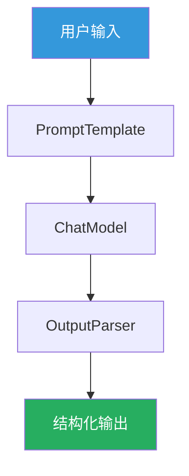

<!-- more -->

# AI框架设计与选型 - 知识点整理

> 本文档面向刚入行的程序员，系统整理了AI Agent框架的核心知识点，帮助你理解AI Agent的设计原理和主流框架的使用方法。

---

## 目录

1. [AI Agent核心问题概述](#1-ai-agent核心问题概述)
2. [LLM统一接口层](#2-llm统一接口层)
3. [工具注册与调度](#3-工具注册与调度)
4. [Context管理机制](#4-context管理机制)
5. [控制流编排](#5-控制流编排)
6. [主流框架详解](#6-主流框架详解)
7. [框架对比与选型](#7-框架对比与选型)
8. [实战案例：多文件智能问答](#8-实战案例多文件智能问答)

---

## 1. AI Agent核心问题概述

### 1.1 什么是AI Agent？

**AI Agent（智能体）** 是一种能够自主理解目标、规划任务、执行操作并根据反馈调整行为的AI系统。与简单的问答不同，Agent能够：

- 分解复杂任务为多个步骤
- 调用外部工具完成特定操作
- 保持对话上下文记忆
- 自我反思和修正错误

### 1.2 构建AI Agent的四个核心问题

构建一个AI Agent框架，需要解决以下四个核心问题：

```
┌─────────────────────────────────────────────────────────────────┐
│                    AI Agent 核心架构                              │
├─────────────────────────────────────────────────────────────────┤
│  ┌─────────────┐                                               │
│  │ 🤖 LLM大脑   │  1. LLM统一接口 - 适配不同模型                  │
│  │ (统一接口层) │                                               │
│  └──────┬──────┘                                               │
│         │                                                       │
│  ┌──────┴──────┐     ┌─────────────┐     ┌─────────────┐      │
│  │ 🔧 双手      │     │ 🧠 记忆      │     │ 🎯 中枢      │      │
│  │ 工具注册调度 │     │ Context管理  │     │ 控制流编排   │      │
│  └─────────────┘     └─────────────┘     └─────────────┘      │
└─────────────────────────────────────────────────────────────────┘
```

### 1.3 四大核心问题详解

| 核心组件         | 解决的问题                                   | 类比理解        |
| ---------------- | -------------------------------------------- | --------------- |
| **LLM统一接口**  | 适配不同语言模型（OpenAI、DeepSeek、Qwen等） | 大脑 - 思考能力 |
| **工具注册调度** | 让LLM能够调用外部函数执行实际操作            | 双手 - 执行能力 |
| **Context管理**  | 管理对话历史和长期记忆                       | 记忆 - 经验存储 |
| **控制流编排**   | 协调各组件完成复杂任务流程                   | 中枢 - 协调指挥 |

---

## 2. LLM统一接口层

### 2.1 为什么需要统一接口层？

不同的LLM服务商（OpenAI、DeepSeek、阿里Qwen等）有不同的API格式和参数命名。如果直接调用，需要编写大量适配代码。**统一接口层**通过适配器模式，抹平这些差异：

```python
# 想象你买了一个万能充电器，不管什么手机都能充
# 统一接口就是AI框架的"万能充电器"
```

### 2.2 三大框架的LLM配置方式

#### LangChain 方式

```python
from langchain_community.chat_models import ChatTongyi

llm = ChatTongyi(
    model_name="deepseek-v3",           # 模型名称
    dashscope_api_key="your-api-key"    # API密钥
)
```

#### Qwen-Agent 方式

```python
llm_cfg = {
    'model': 'deepseek-v3',                              # 模型名称
    'model_server': 'https://dashscope.aliyuncs.com/compatible-mode/v1',  # 模型服务器地址
    'api_key': 'your-api-key',                           # API密钥
    'generate_cfg': {'top_p': 0.8}                        # 生成参数
}
```

#### LlamaIndex 方式

```python
from llama_index.llms.dashscope import DashScope

llm = DashScope(
    model="deepseek-v3",       # 模型名称
    api_key="your-api-key",   # API密钥
    temperature=0.7,           # 温度参数
)
```

### 2.3 统一接口的核心价值

```
┌────────────────────────────────────────────────────────┐
│                  统一接口层的三大价值                     │
├────────────────────────────────────────────────────────┤
│  1. 📋 统一调用方式                                      │
│     不管调用哪个模型，都用同样的方法：llm.invoke("你好")   │
│                                                        │
│  2. ⚙️ 统一参数配置                                      │
│     temperature、top_p等参数统一管理                      │
│                                                        │
│  3. 📦 统一输出格式                                      │
│     输出统一转为Message对象，方便后续处理                 │
└────────────────────────────────────────────────────────┘
```

### 2.4 Prompt管理

**System Message（系统消息）** 用于定义AI的角色和行为：

```python
# LangChain 方式
from langchain_core.prompts import ChatPromptTemplate, MessagesPlaceholder

prompt = ChatPromptTemplate.from_messages([
    ("system", "你是一个乐于助人的AI助手。"),
    MessagesPlaceholder(variable_name="history"),  # 对话历史占位
    ("human", "{input}")                           # 用户输入占位
])

# Qwen-Agent 方式
system_instruction = """你是一个乐于助人的AI助手。
在收到用户的请求后，你应该：
- 首先思考问题的关键点
- 然后调用合适的工具解决问题
你总是用中文回复用户。"""
```

**人设与任务分离**的好处：

- 便于复用：一个人设可以用于多个场景
- 易于维护：修改人设不影响业务流程
- 职责清晰：角色定义和具体指令分开管理

---

## 3. 工具注册与调度

### 3.1 为什么需要工具系统？

LLM本身只能输出文本，无法执行实际操作（如查询网络、操作文件、运行代码）。**工具系统**让LLM能够"看到"并"调用"外部函数：

```
用户：帮我检查 www.example.com 的网络连通性
                │
                ▼
         ┌─────────────┐
         │   LLM       │ 思考：我需要调用"ping_tool"
         └──────┬──────┘
                │ 调用工具
                ▼
         ┌─────────────┐
         │ ping_tool   │ 执行：检查网络连通性
         └──────┬──────┘
                │
                ▼
           "Ping www.example.com 成功：延迟 20ms"
```

### 3.2 三大框架的工具注册方式对比

#### LangChain: @tool 装饰器（最简洁）

```python
from langchain_core.tools import tool

@tool
def ping_tool(target: str) -> str:
    """检查本机到指定主机名或IP地址的网络连通性。

    参数:
        target: 目标主机名或IP地址
    返回:
        模拟的ping结果
    """
    if "unreachable" in target:
        return f"Ping {target} 失败"
    return f"Ping {target} 成功"

@tool
def dns_tool(hostname: str) -> str:
    """解析给定的主机名，获取其对应的IP地址。

    参数:
        hostname: 要解析的主机名
    返回:
        DNS解析结果
    """
    if hostname == "www.example.com":
        return f"DNS解析 {hostname} 成功：IP是93.184.216.34"
    return f"DNS解析 {hostname} 失败：找不到主机"
```

**@tool装饰器的优势：**

- 自动从docstring解析工具描述
- 自动识别参数类型
- 一行装饰器，零配置即可使用

#### Qwen-Agent: @register_tool + 类（显式定义）

```python
from qwen_agent.tools.base import BaseTool, register_tool
import json5
import urllib.parse

@register_tool('my_image_gen')
class MyImageGen(BaseTool):
    # description 告诉LLM这个工具的功能
    description = 'AI绘画服务，输入文本描述，返回图像URL'

    # parameters 显式定义输入参数
    parameters = [{
        'name': 'prompt',
        'type': 'string',
        'description': '期望的图像内容的详细描述',
        'required': True
    }]

    def call(self, params: str, **kwargs) -> str:
        # params 是LLM生成的JSON字符串
        prompt = json5.loads(params)['prompt']
        prompt = urllib.parse.quote(prompt)
        return json5.dumps(
            {'image_url': f'https://image.pollinations.ai/prompt/{prompt}'},
            ensure_ascii=False
        )
```

#### LlamaIndex: FunctionTool类（强类型约束）

```python
from llama_index.core.tools import FunctionTool

def retrieve_documents(query: str) -> str:
    """从文档中检索相关信息"""
    response = query_engine.query(query)
    return str(response)

# 封装为FunctionTool
retrieve_tool = FunctionTool.from_defaults(fn=retrieve_documents)
```

### 3.3 工具注册原理

LLM是如何"看到"工具的？

```
┌─────────────────────────────────────────────────────────────┐
│                    工具注册到LLM的流程                         │
├─────────────────────────────────────────────────────────────┤
│                                                             │
│  Python函数                                                 │
│  ┌─────────────────────┐                                   │
│  │ def ping_tool(      │                                   │
│  │   target: str       │  1. 提取函数名                      │
│  │ ) -> str:           │  ───────────────────────────────>   │
│  │   """检查网络..."""  │  "ping_tool"                       │
│  └─────────────────────┘                                   │
│         │                                                  │
│         ▼  2. 提取docstring                                 │
│  ┌─────────────────────┐                                   │
│  │ "检查本机到指定主机   │                                   │
│  │ 名或IP地址的网络..."  │  ───────────────────────────────>   │
│  └─────────────────────┘                                   │
│         │                                                  │
│         ▼  3. 提取类型注解                                   │
│  ┌─────────────────────┐                                   │
│  │ target: str         │  ───────────────────────────────>   │
│  └─────────────────────┘                                   │
│                                                             │
│         ▼                                                   │
│  ┌─────────────────────────────────────────┐                │
│  │     转换为 JSON Schema                   │                │
│  │     {                                   │                │
│  │       "name": "ping_tool",              │                │
│  │       "description": "检查网络...",      │                │
│  │       "parameters": {                   │                │
│  │         "target": {"type": "string"}    │                │
│  │       }                                 │                │
│  │     }                                   │                │
│  └─────────────────────────────────────────┘                │
│         │                                                  │
│         ▼                                                   │
│  ┌─────────────────────────────────────────┐                │
│  │     发送给 LLM                           │                │
│  │     LLM现在知道有这个工具可用              │                │
│  └─────────────────────────────────────────┘                │
│                                                             │
└─────────────────────────────────────────────────────────────┘
```

### 3.4 Code Interpreter（代码解释器）

Qwen-Agent的杀手锏功能：内置代码执行沙箱。

```python
# 配置工具列表，包含代码解释器
tools = ['my_image_gen', 'code_interpreter']

# code_interpreter 可以：
# - 下载文件 (requests.get)
# - 处理图像 (PIL)
# - 数据分析 (pandas)
# - 绑图展示 (matplotlib)
# - 执行失败时自动修正重试
```

| 能力     | 说明                   |
| -------- | ---------------------- |
| 代码生成 | LLM自动生成Python代码  |
| 沙箱执行 | 安全隔离环境运行代码   |
| 结果获取 | 捕获输出、图像、文件   |
| 错误修复 | 执行失败时自动修正重试 |

---

## 4. Context管理机制

### 4.1 为什么需要记忆管理？

```
┌────────────────────────────────────────────────────────────┐
│                    LLM的"失忆症"                            │
├────────────────────────────────────────────────────────────┤
│                                                            │
│  第1轮对话：                                                │
│  用户：我的公司叫"ABC科技"                                  │
│  AI：好的，ABC科技，有什么可以帮您？                          │
│                                                            │
│  第2轮对话：                                                │
│  用户：我们公司想购买保险                                    │
│  AI：好的，您想了解什么类型的保险？                           │
│  ❓ AI已经忘记公司名叫"ABC科技"                              │
│                                                            │
└────────────────────────────────────────────────────────────┘
```

LLM是无状态的，每次调用都是独立的。为了让AI记住对话内容，需要**Context管理**。

### 4.2 记忆的分类

```
┌─────────────────────────────────────────────────────────────┐
│                    记忆系统架构                              │
├─────────────────────────────────────────────────────────────┤
│                                                             │
│  ┌─────────────────────────────────────────────────────┐   │
│  │  短期记忆 (Session Memory)                            │   │
│  │  ┌─────────┐  ┌─────────┐  ┌─────────┐              │   │
│  │  │对话记录1 │→│对话记录2 │→│对话记录3 │→...           │   │
│  │  └─────────┘  └─────────┘  └─────────┘              │   │
│  │                                                      │   │
│  │  策略：滑动窗口 - 只保留最近N轮对话                    │   │
│  │  原因：Context Window有Token限制，不能无限增长          │   │
│  └─────────────────────────────────────────────────────┘   │
│                                                             │
│  ┌─────────────────────────────────────────────────────┐   │
│  │  长期记忆 (Long-term Memory)                         │   │
│  │  ┌─────────────────────────────────────────┐        │   │
│  │  │ 📄 文档片段1  ──向量1──→  [数据库]       │        │   │
│  │  │ 📄 文档片段2  ──向量2──→  [数据库]       │        │   │
│  │  │ 📄 文档片段3  ──向量3──→  [数据库]       │        │   │
│  │  └─────────────────────────────────────────┘        │   │
│  │                                                      │   │
│  │  检索方式：相似度搜索 - 找与问题最相关的文档           │   │
│  └─────────────────────────────────────────────────────┘   │
│                                                             │
└─────────────────────────────────────────────────────────────┘
```

### 4.3 三大框架的记忆管理

#### LangChain: RunnableWithMessageHistory

```python
from langchain_core.chat_history import InMemoryChatMessageHistory
from langchain_core.runnables.history import RunnableWithMessageHistory

# 创建会话存储
store = {}

def get_session_history(session_id: str):
    """获取指定会话ID的历史记录"""
    if session_id not in store:
        store[session_id] = InMemoryChatMessageHistory()
    return store[session_id]

# 创建带记忆的对话链
conversation = RunnableWithMessageHistory(
    chain,
    get_session_history,
    input_messages_key="input",
    history_messages_key="history"
)

# 使用时指定session_id（支持多用户并发）
config = {"configurable": {"session_id": "user_123"}}
output = conversation.invoke({"input": "Hi!"}, config=config)
```

#### Qwen-Agent: messages列表手动管理

```python
# 对话历史
messages = []

# 添加用户消息
messages.append({'role': 'user', 'content': query})

# 运行助手
for response in bot.run(messages=messages):
    pass

# 添加助手回复到历史
messages.extend(response)
```

#### LlamaIndex: Agent内置记忆

```python
# LlamaIndex的Agent内部自动管理对话历史
agent = ReActAgent.from_tools(
    tools=[retrieve_tool],
    llm=llm,
    verbose=True
)

# 直接对话，内部自动管理历史
response = await agent.run(query)
```

### 4.4 Context管理的核心策略

```
┌────────────────────────────────────────────────────────────┐
│                 有限注意力的管理策略                          │
├────────────────────────────────────────────────────────────┤
│                                                            │
│  1. 滑动窗口策略 (Sliding Window)                          │
│     ┌──────────────────────────────────────────────────┐  │
│     │ [对话1] → [对话2] → [对话3] → [对话4] → [对话5] │  │
│     └──────────────────────────────────────────────────┘  │
│                        │                                    │
│                   保留最近3轮                                │
│                        ▼                                    │
│     ┌──────────────────────────────────────────────────┐  │
│     │ [对话3] → [对话4] → [对话5]                      │  │
│     └──────────────────────────────────────────────────┘  │
│                                                            │
│  2. Token限制控制                                           │
│     Context Window 是昂贵的资源，需要合理分配                │
│     系统提示词 + 对话历史 + 检索上下文 ≤ 最大Token数          │
│                                                            │
│  3. 重要性排序 (Relevance Scoring)                         │
│     优先保留与当前任务相关的内容                            │
│                                                            │
└────────────────────────────────────────────────────────────┘
```

---

## 5. 控制流编排

### 5.1 为什么需要控制流编排？

简单的任务可以靠LLM一口气完成，但复杂任务需要拆解成多个步骤：

```
用户：帮我分析这份销售报告，找出问题和改进建议

❌ 简单方式（效果差）：
   直接让LLM分析，但它可能：
   - 遗漏重要数据
   - 分析不够深入
   - 结论缺乏依据

✅ 复杂方式（效果好）：
   1. 检索相关文档 → 了解业务背景
   2. 分析销售数据 → 找出异常波动
   3. 对比历史数据 → 识别趋势变化
   4. 生成分析报告 → 综合以上信息给出建议
```

### 5.2 四种控制流模式

#### 管道模式 (Pipeline) - 线性处理

```
输入 → 处理1 → 处理2 → 处理3 → 输出
```

适用场景：输入确定、输出确定、顺序固定的场景

#### ReAct循环模式 (Single Agent) - 思考-行动-观察

```
      ┌─────────────────┐
      │                 │
      ▼                 │
   ┌──────┐             │
   │思考   │◄───────────┘
   └──────┘
      │
      ▼
   ┌──────┐
   │行动   │──调用工具──→ 观察结果
   └──────┘
      │
      ▼
   继续思考？
      │
     是├─────────────┐
      │             │
      ▼             │
   ┌──────┐         │
   │完成   │         │
   └──────┘         │
                    │
      否 ◄──────────┘
```

适用场景：单Agent需要多工具协作完成的复杂任务

#### DAG有向无环图模式 - 接力赛

```
节点A ──┬──→ 节点C ──→ 最终结果
        └──→ 节点B ───↗
```

适用场景：有明确前后依赖的流程化任务

#### GroupChat多人对话模式 - 圆桌会议

```
Agent1 ◄──────► Agent2
    ▲               ▲
    │               │
    └────► Agent3 ◄─┘
```

适用场景：需要多角色协作讨论的开放式任务

### 5.3 LangChain的LCEL管道语法

**LCEL (LangChain Expression Language)** 是LangChain的核心创新：

```python
from langchain_core.prompts import PromptTemplate
from langchain_community.llms import Tongyi
from langchain_core.output_parsers import StrOutputParser

# 创建组件
prompt = PromptTemplate(
    input_variables=['product'],
    template='What is a good name for a company that makes {product}?'
)
llm = Tongyi(model_name="qwen-turbo", dashscope_api_key="your-key")

# 管道语法组合（用 | 符号）
chain = prompt | llm | StrOutputParser()

# 调用
result = chain.invoke({"product": "colorful socks"})
```

```
┌─────────────────────────────────────────────────────────────┐
│                  LCEL 管道执行流程                          │
├─────────────────────────────────────────────────────────────┤
│                                                             │
│   用户输入                                                   │
│   ┌───────────┐                                             │
│   │"colorful  │                                            │
│   │ socks"    │                                            │
│   └─────┬─────┘                                             │
│         │                                                   │
│         ▼ prompt |                                          │
│   ┌───────────┐                                             │
│   │Prompt     │ 格式化为：                                   │
│   │Template   │ "What is a good name for a company          │
│   └─────┬─────┘  that makes colorful socks?"               │
│         │                                                   │
│         ▼ llm |                                             │
│   ┌───────────┐                                             │
│   │ChatModel  │ 调用API，返回：                              │
│   │(LLM)      │ "Socktastic"                               │
│   └─────┬─────┘                                             │
│         │                                                   │
│         ▼ StrOutputParser |                                 │
│   ┌───────────┐                                             │
│   │Output     │ 解析为字符串：                               │
│   │Parser     │ "Socktastic"                               │
│   └─────┬─────┘                                             │
│         │                                                   │
│         ▼                                                   │
│   ┌───────────┐                                             │
│   │ 最终结果   │                                             │
│   │"Socktastic│                                            │
│   └───────────┘                                             │
│                                                             │
└─────────────────────────────────────────────────────────────┘
```

---

## 6. 主流框架详解

### 6.1 LangChain - 全能型LLM应用框架

**定位：** 全能型框架，生态丰富，适合各种复杂场景

**GitHub:** github.com/langchain-ai/langchain

**核心特性：**

| 特性         | 说明                        |
| ------------ | --------------------------- |
| LCEL管道语法 | 直观易懂的链式调用          |
| 丰富的生态   | 100+模型、50+向量数据库支持 |
| @tool装饰器  | 最简洁的工具注册方式        |
| 完善记忆管理 | session_id支持多用户并发    |

**适用场景：**

- 工具调用型Agent（网络诊断、API调用等）
- 多轮对话系统（客服机器人）
- 复杂流程编排
- 快速原型开发

**代码示例：**

```python
from langchain_community.chat_models import ChatTongyi
from langchain.agents import create_agent

# 加载模型
llm = ChatTongyi(model_name="deepseek-v3", dashscope_api_key="your-key")

# 定义工具
tools = [ping_tool, dns_tool, calculator]

# 创建Agent
agent = create_agent(llm, tools)

# 调用
result = agent.invoke({
    "messages": [("user", "检查 www.example.com 的连通性")]
})
print(result["messages"][-1].content)
```

### 6.2 LlamaIndex - 数据驱动的RAG专家

**定位：** 为LLM装上私有数据的最强接口

**GitHub:** github.com/run-llama/llama_index

**核心哲学：Index-First**

- 不同于LangChain关注流程，LlamaIndex关注数据结构
- 核心问题：如何让LLM高效索引私有数据

```
┌─────────────────────────────────────────────────────────────┐
│              LlamaIndex RAG 完整流程                         │
├─────────────────────────────────────────────────────────────┤
│                                                             │
│  ┌─────────────────────────────────────────────────────┐   │
│  │              预处理阶段 (Ingestion)                  │   │
│  │                                                     │   │
│  │  📄文档文件 → 📖加载 → 📑分块 → 🔢向量化 → 💾索引   │   │
│  │                                                     │   │
│  └─────────────────────────────────────────────────────┘   │
│                            │                               │
│                            ▼                               │
│  ┌─────────────────────────────────────────────────────┐   │
│  │              查询阶段 (Query)                        │   │
│  │                                                     │   │
│  │  ❓用户问题 → 🔍向量检索 → 📋上下文 → 🤖LLM回答     │   │
│  │                                                     │   │
│  └─────────────────────────────────────────────────────┘   │
│                                                             │
└─────────────────────────────────────────────────────────────┘
```

**适用场景：**

- 企业知识库问答
- 合同审查助手
- 学术论文分析
- 客服机器人

**代码示例：**

```python
from llama_index.core import VectorStoreIndex, SimpleDirectoryReader
from llama_index.core.agent import ReActAgent
from llama_index.core.tools import FunctionTool

# 读取文档
reader = SimpleDirectoryReader('./docs')
documents = reader.load_data()

# 创建索引
index = VectorStoreIndex.from_documents(documents)

# 创建检索工具
query_engine = index.as_query_engine()
retrieve_tool = FunctionTool.from_defaults(fn=lambda q: str(query_engine.query(q)))

# 创建Agent
agent = ReActAgent.from_tools(
    tools=[retrieve_tool],
    llm=llm,
    system_prompt="你是一个乐于助人的AI助手"
)

# 对话
response = agent.chat("介绍下雇主责任险")
```

### 6.3 Qwen-Agent - 轻量级的全能选手

**定位：** 阿里生态亲儿子，轻量、灵活

**GitHub:** github.com/QwenLM/Qwen-Agent

**核心优势：**

| 能力             | 说明                                 |
| ---------------- | ------------------------------------ |
| Tool Use优化     | 专门为Qwen模型的Tool Calling能力优化 |
| Code Interpreter | 内置代码执行沙箱，自我修正错误       |
| 内置WebUI        | 一行代码启动Web界面                  |
| 长文本优势       | 支持超长Context（1M Token）          |

**适用场景：**

- 数据分析（Code Interpreter绑图）
- 复杂工具调用链
- 图像处理（生成、编辑、分析）
- 长文档问答

**代码示例：**

```python
from qwen_agent.agents import Assistant
from qwen_agent.tools.base import BaseTool, register_tool

# 定义工具
@register_tool('my_image_gen')
class MyImageGen(BaseTool):
    description = 'AI绘画服务'
    parameters = [...]

    def call(self, params, **kwargs):
        ...

# 创建Assistant
bot = Assistant(
    llm=llm_cfg,
    system_message="你是一个乐于助人的AI助手",
    function_list=['my_image_gen', 'code_interpreter'],
    files=['./docs/file1.txt', './docs/file2.txt']
)

# 对话
response = []
for response in bot.run(messages):
    print(response[0]['content'], end='')
```

### 6.4 AutoGen - 多智能体框架

**定位：** 微软开源的多智能体对话框架

**核心理念：** Agent之间通过自然语言对话协作，而非硬编码的函数调用

```
┌─────────────────────────────────────────────────────────────┐
│              AutoGen 多智能体协作架构                         │
├─────────────────────────────────────────────────────────────┤
│                                                             │
│                      ┌─────────┐                           │
│                      │  用户   │                           │
│                      └────┬────┘                           │
│                           │                                 │
│                           ▼                                 │
│                      ┌─────────┐                           │
│                      │GroupChat│                           │
│                      │ Manager │                           │
│                      └────┬────┘                           │
│           ┌───────────────┼───────────────┐               │
│           │               │               │               │
│           ▼               ▼               ▼               │
│      ┌─────────┐    ┌─────────┐    ┌─────────┐          │
│      │Assistant│◄──►│ User    │◄──►│ Critic  │          │
│      │ Agent   │    │Proxy    │    │ Agent   │          │
│      └────┬────┘    └────┬────┘    └────┬────┘          │
│           │              │              │               │
│           ▼              ▼              ▼               │
│        写代码         执行代码         评审结果           │
│                                                             │
└─────────────────────────────────────────────────────────────┘
```

**注意：** 2025年10月起，AutoGen进入维护模式，新特性都迁移到Agent Framework

---

## 7. 框架对比与选型

### 7.1 核心维度对比

| 维度           | LangChain                  | Qwen-Agent           | LlamaIndex     | AutoGen        |
| -------------- | -------------------------- | -------------------- | -------------- | -------------- |
| **核心定位**   | 全能型框架                 | 轻量工具调用         | RAG数据接口    | 多Agent协作    |
| **工具注册**   | @tool装饰器                | @register_tool       | FunctionTool   | @register      |
| **RAG支持**    | 需集成VectorStore          | 基础文件读取         | 专业级向量索引 | 需自行集成     |
| **多Agent**    | LangGraph支持              | 基础支持             | 需自行编排     | 原生GroupChat  |
| **代码执行**   | 需集成                     | 内置code_interpreter | 需集成         | UserProxyAgent |
| **记忆管理**   | RunnableWithMessageHistory | messages列表         | Agent内置      | GroupChat自动  |
| **学习曲线**   | 中等                       | 简单                 | 中等           | 中等           |
| **生态完整度** | 最丰富                     | 阿里生态             | RAG社区        | 微软生态       |

### 7.2 选型指南

```
┌─────────────────────────────────────────────────────────────┐
│                      框架选型指南                            │
├─────────────────────────────────────────────────────────────┤
│                                                             │
│  🎯 选 LangChain 如果：                                      │
│     • 开发通用的AI应用                                       │
│     • 需要灵活控制流程                                       │
│     • 需要切换多种模型                                       │
│     • 需要丰富的预置组件                                      │
│                                                             │
│  🎯 选 LlamaIndex 如果：                                     │
│     • 主要做RAG（检索增强生成）                               │
│     • 有大量PDF/Word/Excel要处理                             │
│     • 构建企业知识库                                         │
│     • 需要专业级的向量检索                                    │
│                                                             │
│  🎯 选 Qwen-Agent 如果：                                     │
│     • 主要用Qwen模型                                         │
│     • 需要数据分析（Code Interpreter）                       │
│     • 处理超长文档（1M Context）                              │
│     • 快速搭建工具调用型Agent                                 │
│                                                             │
│  🎯 选 AutoGen 如果：                                        │
│     • 任务太复杂，单Agent干不完                               │
│     • 需要多角色协作讨论                                     │
│     • 需要Agent之间自然对话                                   │
│     • 微软技术栈                                             │
│                                                             │
└─────────────────────────────────────────────────────────────┘
```

---

## 8. 实战案例：多文件智能问答

### 8.1 项目背景

构建一个**保险产品智能问答Agent**，帮助用户快速了解各类保险产品的详细信息。

**加载的文档：**

- 雇主责任险
- 平安商业综合责任保险
- 企业团体综合意外险
- 财产一切险
- 施工保、装修保等

### 8.2 RAG核心流程

```
用户问题 → 向量检索 → 召回相关文档 → LLM生成回答
   │
   ▼
┌─────────────────────────────────────────────────────────────┐
│                    为什么需要RAG？                           │
├─────────────────────────────────────────────────────────────┤
│  1. LLM没有私有数据的知识                                    │
│  2. 避免模型幻觉（编造信息）                                  │
│  3. 回答可追溯到具体文档来源                                  │
└─────────────────────────────────────────────────────────────┘
```

### 8.3 LangChain实现

```python
# 文档加载与索引
from langchain_community.document_loaders import DirectoryLoader, TextLoader
from langchain_community.vectorstores import FAISS

loader = DirectoryLoader('./docs', glob="**/*.txt", loader_cls=TextLoader)
documents = loader.load()

# 文本分割
from langchain_text_splitters import RecursiveCharacterTextSplitter
text_splitter = RecursiveCharacterTextSplitter(chunk_size=1000, chunk_overlap=200)
chunks = text_splitter.split_documents(documents)

# 创建向量索引
vector_store = FAISS.from_documents(chunks, embeddings)

# 问答链
from langchain_core.prompts import ChatPromptTemplate
qa_prompt = ChatPromptTemplate.from_messages([
    ("system", "根据上下文回答问题...\n{context}"),
    ("human", "{question}")
])
qa_chain = qa_prompt | llm | StrOutputParser()

# 执行查询
docs = vector_store.similarity_search(query, k=5)
context = "\n\n".join(doc.page_content for doc in docs)
response = qa_chain.invoke({"context": context, "question": query})
```

### 8.4 LlamaIndex实现

```python
# 一行代码加载整个目录
from llama_index.core import VectorStoreIndex, SimpleDirectoryReader
reader = SimpleDirectoryReader('./docs')
documents = reader.load_data()

# 创建向量索引
index = VectorStoreIndex.from_documents(documents)

# 持久化
index.storage_context.persist(persist_dir="./storage")

# 创建ReAct Agent
from llama_index.core.agent import ReActAgent
from llama_index.core.tools import FunctionTool

query_engine = index.as_query_engine()
retrieve_tool = FunctionTool.from_defaults(
    fn=lambda q: str(query_engine.query(q))
)

agent = ReActAgent.from_tools(
    tools=[retrieve_tool],
    llm=llm,
    verbose=True
)

# 对话
response = agent.chat("介绍下雇主责任险")
```

### 8.5 Qwen-Agent实现

```python
from qwen_agent.agents import Assistant
from qwen_agent.gui import WebUI

# 创建Assistant
bot = Assistant(
    llm=llm_cfg,
    system_message="你是一个乐于助人的AI助手...",
    function_list=['my_image_gen', 'code_interpreter'],
    files=['./docs/file1.txt', './docs/file2.txt']
)

# 启动WebUI
WebUI(bot, chatbot_config={'prompt.suggestions': [...]}).run()
```

---

## 附录：配图说明

### PDF原图

本知识点文档使用了PDF教材中的以下配图：

1. **LCEL管道架构图** - 来自PDF第2页，展示了LangChain Expression Language的管道执行流程
2. **RAG数据处理流程图** - 来自PDF第5页，展示了LlamaIndex的完整RAG流程
3. **保险区别对比图** - 来自PDF第5页，展示了雇主责任险与其他保险的区别

### 补充配图（Mermaid绘制）

为帮助理解额外绘制了以下图表：

1. **AI Agent核心架构图** - 展示LLM大脑、工具双手、记忆系统、控制中枢的关系
2. **记忆系统架构图** - 展示短期记忆和长期记忆的架构
3. **控制流编排模式图** - 展示ReAct循环、管道、DAG、多人对话四种模式
4. **工具注册对比图** - 对比三大框架的工具注册方式
5. **RAG完整流程对比图** - 展示三大框架的RAG支持
6. **AutoGen多智能体架构图** - 展示AutoGen的多Agent协作架构

---

## 图片下载方法

### PDF中的图片

PDF中的图片位于以下路径，可以直接访问：

```
/workspace/extract/viewrange_chunk_5_21_25_d39e8231/images/page_2_img_in_image_box_305_453_1393_617.jpg
/workspace/extract/viewrange_chunk_6_26_30_619ce2d9/images/page_5_img_in_image_box_219_524_1533_695.jpg
/workspace/extract/viewrange_chunk_4_46_50_b5fc5c44/images/page_5_img_in_image_box_952_529_1653_712.jpg
```

### Mermaid图表

Mermaid图表可通过以下方式获取：

1. **复制Mermaid代码**：文档中每个图表都提供了完整的Mermaid代码
2. **在线渲染**：访问 [Mermaid Live Editor](https://mermaid.live/) 粘贴代码即可查看
3. **IDE插件**：在VS Code中安装Mermaid插件，实时预览

**示例Mermaid代码：**



---

> **作者：** MiniMax Agent
> **整理日期：** 2026年3月22日
