<!-- more -->

# AI Agent 框架入门指南

> **学习目标**: 让刚入行的程序员能够理解 AI Agent 的核心概念,并能够使用主流框架搭建简单的智能应用。

---


## 1. 什么是 AI Agent?

### 1.1 通俗理解

想象一个**虚拟员工**: 

- 🧠 **大脑**: 大语言模型(LLM),负责思考和决策
- 🖐️ **双手**: 各种工具(搜索、计算、API调用),负责执行任务
- 💾 **记忆**: 记住之前的对话和知识
- 🎯 **中枢**: 控制整个工作流程

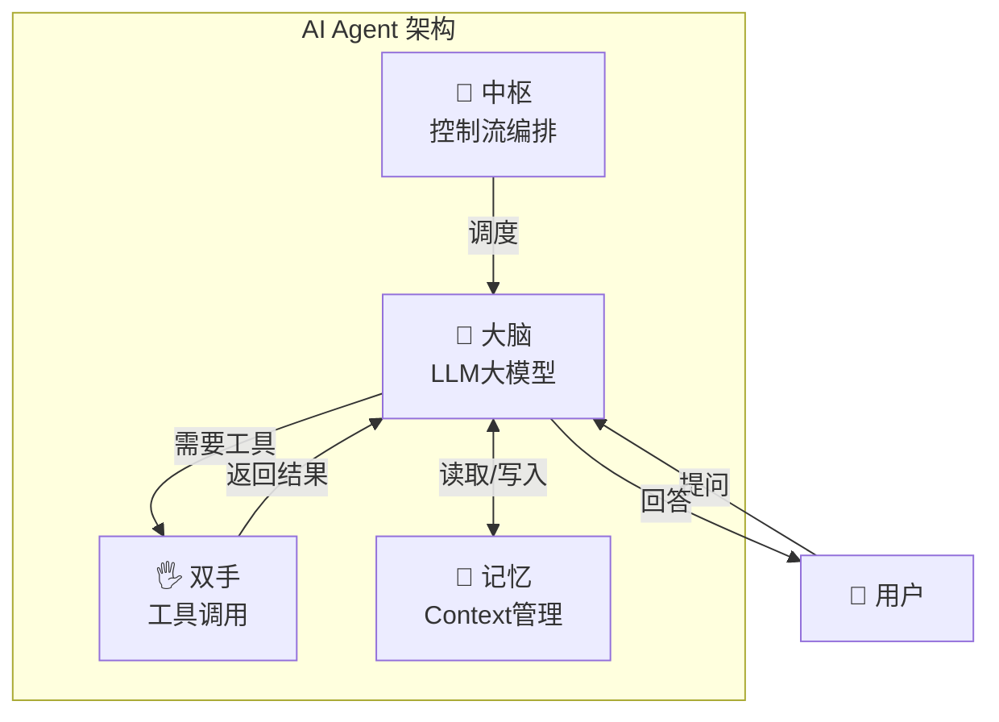

### 1.2 举个例子

**场景**: 用户问 "明天北京天气怎么样?"

**传统 LLM**: "抱歉,我无法获取实时天气信息。"

**AI Agent**:

1. 🧠 **思考**: 用户需要天气信息,我需要调用天气API
2. 🖐️ **行动**: 调用天气查询工具
3. 👀 **观察**: 获取到天气数据
4. 🧠 **思考**: 整理信息,生成回复
5. 💬 **回复**: "明天北京晴天,温度15-25°C..."

---

## 2. AI Agent 的四大核心问题

要开发一个 AI Agent 框架,必须解决以下四个核心问题:

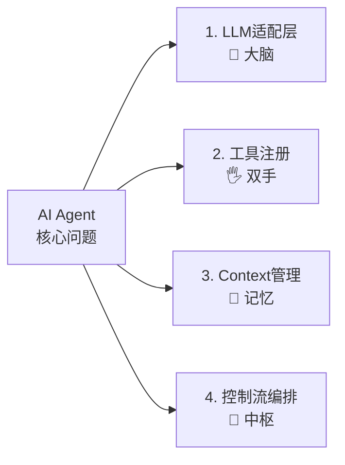

---

### 2.1 大脑的适配层:LLM 统一接口

#### 为什么需要适配层?

不同的 LLM 有不同的 API:

- OpenAI: `openai.ChatCompletion.create()`
- 通义千问: `dashscope.Generation.call()`
- DeepSeek: 类似 OpenAI 但参数不同

**适配层的作用**: 用统一的接口调用不同的模型,就像 USB 接口可以连接各种设备。

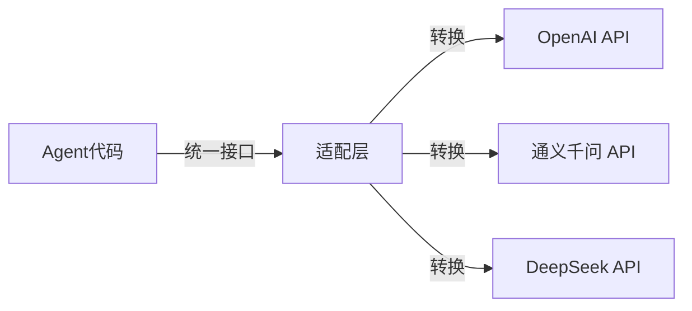

#### 三大框架的 LLM 配置对比

| 框架           | 配置方式      | 特点                      |
| -------------- | ------------- | ------------------------- |
| **LangChain**  | 类实例化      | 丰富的模型适配器,统一接口 |
| **Qwen-Agent** | 字典配置      | 配置式,简洁直观           |
| **LlamaIndex** | 类 + 全局设置 | 与 Settings 结合          |

#### 代码示例

**LangChain 配置 LLM:**

```python
from langchain_community.chat_models import ChatTongyi

# 配置通义千问模型
llm = ChatTongyi(
    model_name="deepseek-v3",  # 模型名称
    dashscope_api_key="your-api-key"  # API Key
)

# 使用:统一的 invoke 接口
response = llm.invoke("你好,请介绍一下自己")
print(response.content)
```

**Qwen-Agent 配置 LLM:**

```python
# 使用字典配置,更简洁
llm_cfg = {
    'model': 'deepseek-v3',
    'model_server': 'https://dashscope.aliyuncs.com/compatible-mode/v1',
    'api_key': 'your-api-key',
    'generate_cfg': {
        'top_p': 0.8,  # 控制输出多样性
        'temperature': 0.7  # 控制随机性
    }
}
```

**LlamaIndex 配置 LLM:**

```python
from llama_index.llms.dashscope import DashScope
from llama_index.core import Settings

# 创建 LLM 实例
llm = DashScope(
    model="deepseek-v3",
    api_key="your-api-key",
    temperature=0.7
)

# 设置为全局默认
Settings.llm = llm
```

#### Prompt 管理:人设与任务分离

**核心思想**: 把"角色定义"和"任务流程"分开,便于维护。

```python
# LangChain 的 Prompt 模板
from langchain_core.prompts import ChatPromptTemplate, MessagesPlaceholder

prompt = ChatPromptTemplate.from_messages([
    # 人设(角色定义)
    ("system", "你是一个乐于助人的AI助手。"),
    # 对话历史占位符
    MessagesPlaceholder(variable_name="history"),
    # 用户输入
    ("human", "{input}")
])
```

---

### 2.2 双手的标准化:工具注册与调度

#### 为什么需要工具?

LLM 只能输出文本,但现实世界需要:

- 查询数据库
- 调用 API
- 执行计算
- 发送邮件

**工具 = 让 LLM 能够执行真实世界的操作**

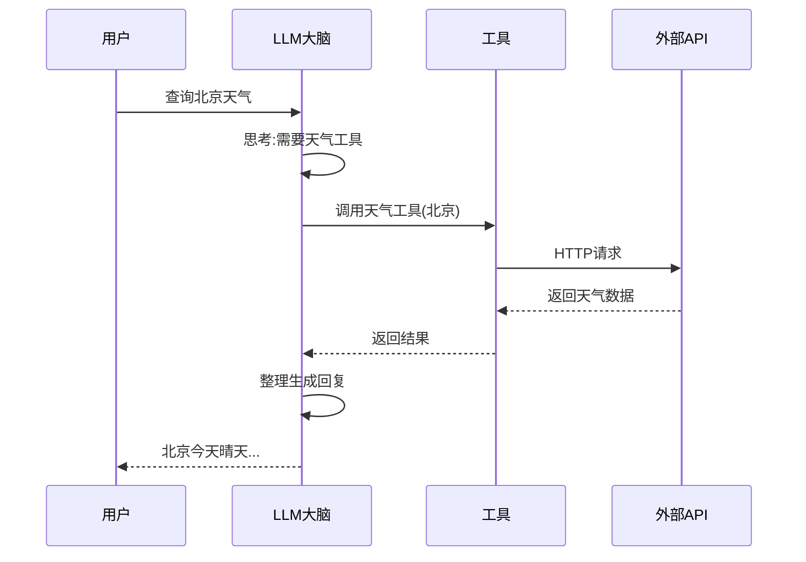

#### 三大框架的工具注册对比

| 框架           | 注册方式              | 特点                      |
| -------------- | --------------------- | ------------------------- |
| **LangChain**  | `@tool` 装饰器        | 最简洁,自动解析 docstring |
| **Qwen-Agent** | `@register_tool` + 类 | 显式参数定义,结构清晰     |
| **LlamaIndex** | `FunctionTool` 封装   | 强类型约束,适合复杂工具   |

#### 代码示例

**LangChain: @tool 装饰器(推荐)**

```python
from langchain_core.tools import tool

@tool
def ping_tool(target: str) -> str:
    """
    检查本机到指定主机名或IP地址的网络连通性。
    
    参数:
        target: 目标主机名或IP地址
        
    返回:
        模拟的ping结果
    """
    if "unreachable" in target:
        return f"Ping {target} 失败"
    return f"Ping {target} 成功"

# 使用:一行装饰器,零配置
# LangChain 会自动从 docstring 解析工具描述和参数
```

**Qwen-Agent: @register_tool 装饰器**

```python
from qwen_agent.tools.base import BaseTool, register_tool
import json5

@register_tool('my_image_gen')
class MyImageGen(BaseTool):
    # 工具描述
    description = 'AI 绘画服务,输入文本描述,返回图像 URL'
    
    # 参数定义(显式)
    parameters = [{
        'name': 'prompt',
        'type': 'string',
        'description': '期望的图像内容的详细描述',
        'required': True
    }]
    
    def call(self, params: str, **kwargs) -> str:
        # params 是 LLM 生成的 JSON 字符串
        prompt = json5.loads(params)['prompt']
        return json5.dumps({
            'image_url': f'https://image.pollinations.ai/prompt/{prompt}'
        })
```

**LlamaIndex: FunctionTool 封装**

```python
from llama_index.core.tools import FunctionTool

# 定义函数
def retrieve_documents(query: str) -> str:
    """从文档中检索相关信息"""
    response = query_engine.query(query)
    return str(response)

# 封装为工具
retrieve_tool = FunctionTool.from_defaults(
    fn=retrieve_documents,
    name="document_retriever",
    description="从知识库中检索相关文档"
)
```

#### LLM 如何"看见"工具?

框架会将 Python 函数转换为 **JSON Schema** 格式,告诉 LLM:

- 工具名称
- 功能描述
- 参数类型
- 是否必填

```json
{
  "name": "ping_tool",
  "description": "检查本机到指定主机名或IP地址的网络连通性",
  "parameters": {
    "type": "object",
    "properties": {
      "target": {
        "type": "string",
        "description": "目标主机名或IP地址"
      }
    },
    "required": ["target"]
  }
}
```

---

### 2.3 记忆的存储:Context 管理机制

#### 为什么需要记忆管理?

**LLM 是无状态的**: 它记不住你之前说过什么。

**Context Window 是昂贵的**: 不能无限制地传入历史记录。

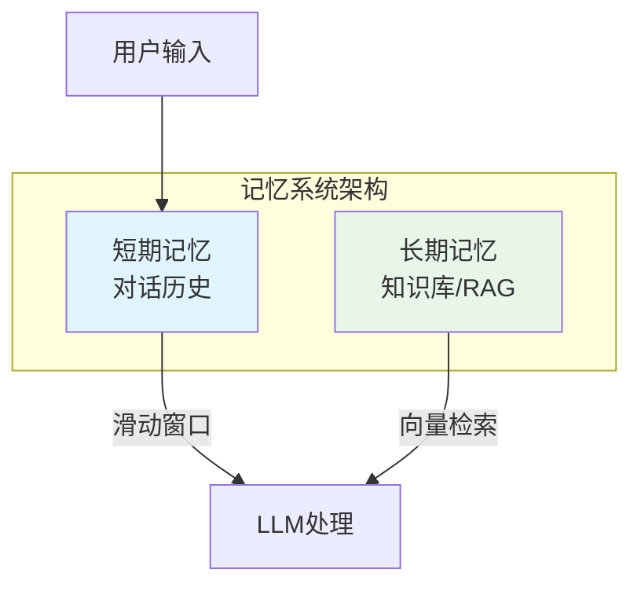

#### 短期记忆 vs 长期记忆

| 类型         | 存储内容 | 实现方式             | 适用场景 |
| ------------ | -------- | -------------------- | -------- |
| **短期记忆** | 对话历史 | 滑动窗口、Session ID | 多轮对话 |
| **长期记忆** | 知识库   | 向量数据库、RAG      | 文档问答 |

#### 代码示例

**LangChain: 带记忆的对话链**

```python
from langchain_core.chat_history import InMemoryChatMessageHistory
from langchain_core.runnables.history import RunnableWithMessageHistory

# 会话存储(支持多用户)
store = {}

def get_session_history(session_id: str):
    """获取指定会话的历史记录"""
    if session_id not in store:
        store[session_id] = InMemoryChatMessageHistory()
    return store[session_id]

# 创建带记忆的对话链
conversation = RunnableWithMessageHistory(
    chain,  # 你的对话链
    get_session_history,
    input_messages_key="input",
    history_messages_key="history"
)

# 使用:指定 session_id 即可保持对话上下文
config = {"configurable": {"session_id": "user_123"}}
output = conversation.invoke(
    {"input": "你好!"}, 
    config=config
)
```

**Qwen-Agent: messages 列表管理**

```python
# 对话历史(简单列表)
messages = []

# 用户提问
messages.append({'role': 'user', 'content': query})

# 运行 Agent,流式输出
for response in bot.run(messages=messages):
    print(response[0]['content'], end='')

# 追加响应到历史
messages.extend(response)
```

**LlamaIndex: 专业级向量索引**

```python
from llama_index.core import VectorStoreIndex, SimpleDirectoryReader

# 加载文档
reader = SimpleDirectoryReader('./docs')
documents = reader.load_data()

# 创建向量索引(自动分块、Embedding)
index = VectorStoreIndex.from_documents(documents)

# 持久化(避免重复创建)
index.storage_context.persist(persist_dir="./storage")

# 从存储加载(快速启动)
from llama_index.core import StorageContext, load_index_from_storage
storage_context = StorageContext.from_defaults(persist_dir="./storage")
index = load_index_from_storage(storage_context)
```

---

### 2.4 中枢的编排:控制流设计

#### 为什么需要控制流编排?

复杂任务不能靠 LLM 一口气说完,需要**拆解步骤**:

- 先获取数据
- 再分析数据
- 最后生成报告

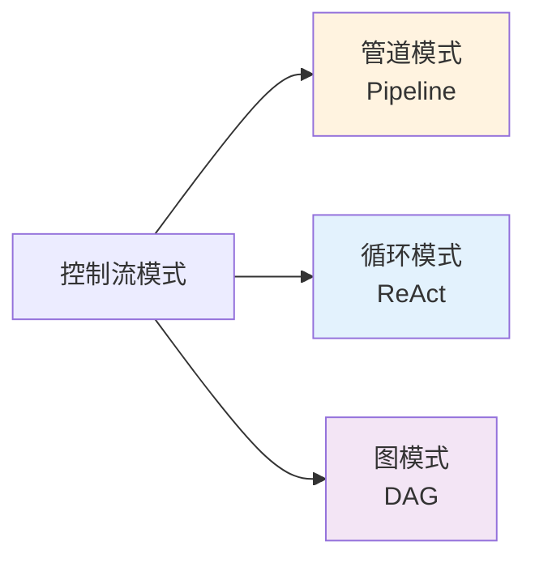

#### 三种控制流模式

| 模式                | 说明                      | 适用场景       |
| ------------------- | ------------------------- | -------------- |
| **管道模式**        | 线性处理: A → B → C       | 数据流水线     |
| **循环模式(ReAct)** | 思考 → 行动 → 观察 → 思考 | Agent 自主决策 |
| **图模式(DAG)**     | 有向无环图,多步骤依赖     | 复杂业务流程   |

#### 代码示例

**LangChain LCEL 管道语法**

```python
from langchain_core.prompts import PromptTemplate
from langchain_core.output_parsers import StrOutputParser

# 创建 Prompt 模板
prompt = PromptTemplate(
    input_variables=["product"],
    template="为生产{product}的公司起一个好名字"
)

# 管道语法: prompt | llm | parser
chain = prompt | llm | StrOutputParser()

# 调用
result = chain.invoke({"product": "彩色袜子"})
print(result)
```

**ReAct 循环模式**

```python
from langchain.agents import create_react_agent

# 定义工具
tools = [ping_tool, dns_tool, calculator]

# 创建 Agent(自动实现 ReAct 循环)
agent = create_react_agent(llm, tools)

# 使用:Agent 会自动思考-行动-观察
result = agent.invoke({
    "messages": [("user", "诊断 www.example.com 的连通性")]
})
```

**ReAct 循环流程:**

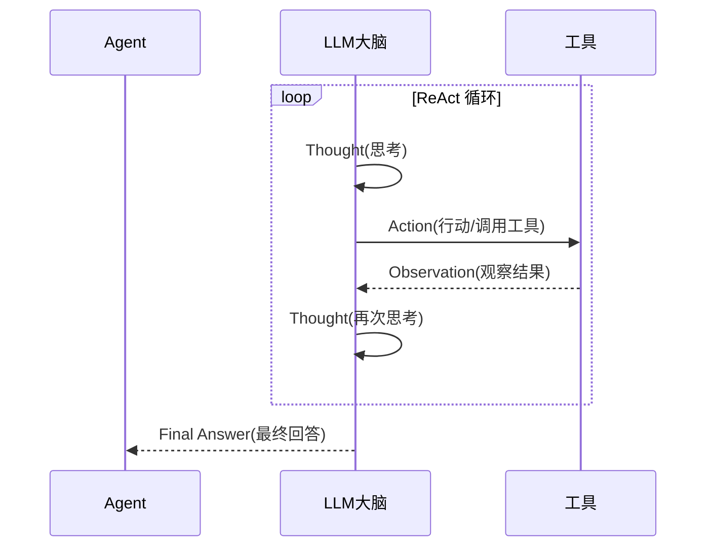

---

## 3. 主流 Agent 框架对比

### 3.1 三大框架定位

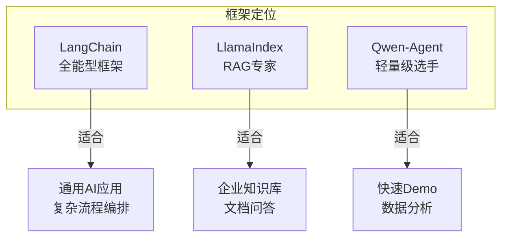

| 维度           | LangChain      | Qwen-Agent                | LlamaIndex     |
| -------------- | -------------- | ------------------------- | -------------- |
| **核心定位**   | 全能型框架     | 轻量工具调用              | RAG 数据接口   |
| **学习曲线**   | 中等           | 简单                      | 中等           |
| **工具注册**   | `@tool` 装饰器 | `@register_tool`          | `FunctionTool` |
| **RAG 支持**   | 需集成         | 基础文件读取              | **专业级**     |
| **代码执行**   | 需集成         | **内置 code_interpreter** | 需集成         |
| **Web UI**     | 需集成         | **内置 WebUI**            | 需集成         |
| **生态完整度** | **最丰富**     | 阿里生态                  | RAG 社区       |

### 3.2 LangChain: 全能型框架

**核心优势**:

- ✅ 生态最丰富:100+ 模型、50+ 向量数据库
- ✅ LCEL 管道语法:直观的链式调用
- ✅ 完善的记忆管理:session_id 支持多用户

**适用场景**:

- 工具调用型 Agent
- 多轮对话系统
- 复杂流程编排

```python
# LangChain 快速入门示例
from langchain_community.chat_models import ChatTongyi
from langchain_core.tools import tool
from langchain.agents import create_react_agent

# 1. 配置 LLM
llm = ChatTongyi(model_name="deepseek-v3")

# 2. 定义工具
@tool
def calculator(expression: str) -> str:
    """计算数学表达式"""
    return str(eval(expression))

# 3. 创建 Agent
agent = create_react_agent(llm, [calculator])

# 4. 使用
result = agent.invoke({"messages": [("user", "计算 123 * 456")]})
```

### 3.3 LlamaIndex: RAG 专家

**核心优势**:

- ✅ 一站式文档处理:加载、分块、向量化、索引、检索
- ✅ 索引持久化:避免重复创建
- ✅ 多种检索策略:向量检索、关键词检索、混合检索

**适用场景**:

- 企业知识库
- 合同审查助手
- 学术论文分析

```python
# LlamaIndex 快速入门示例
from llama_index.core import VectorStoreIndex, SimpleDirectoryReader

# 1. 加载文档
reader = SimpleDirectoryReader('./docs')
documents = reader.load_data()

# 2. 创建向量索引(一行代码完成所有工作)
index = VectorStoreIndex.from_documents(documents)

# 3. 创建查询引擎
query_engine = index.as_query_engine()

# 4. 查询
response = query_engine.query("介绍下雇主责任险")
print(response)
```

### 3.4 Qwen-Agent: 轻量级全能选手

**核心优势**:

- ✅ 配置最简单:字典配置,开箱即用
- ✅ 内置 WebUI:一行代码启动界面
- ✅ 内置 Code Interpreter:代码执行、数据分析

**适用场景**:

- 快速 Demo/POC
- 数据分析型 Agent
- 图像处理任务

```python
# Qwen-Agent 快速入门示例
from qwen_agent.agents import Assistant

# 1. 配置 LLM
llm_cfg = {
    'model': 'deepseek-v3',
    'api_key': 'your-api-key'
}

# 2. 创建 Assistant(内置 RAG)
bot = Assistant(
    llm=llm_cfg,
    system_message="你是一个乐于助人的助手",
    function_list=['code_interpreter'],  # 内置工具
    files=['./docs']  # 直接传入文档
)

# 3. 启动 WebUI
from qwen_agent.gui import WebUI
WebUI(bot).run()
```

---

## 4. 实战案例:多文件智能问答 Agent

### 4.1 案例背景

搭建一个**保险产品智能问答 Agent**,帮助用户快速了解各类保险产品的详细信息。

**支持文档**:

- 雇主责任险
- 平安商业综合责任保险
- 企业团体综合意外险
- 财产一切险
- 施工保、装修保等

### 4.2 技术方案:RAG (检索增强生成)

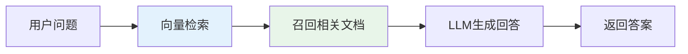

**为什么需要 RAG?**

- ❌ LLM 没有私有数据的知识
- ❌ 避免模型幻觉(编造信息)
- ✅ 回答可追溯到具体文档来源

### 4.3 LangChain 实现

```python
#!/usr/bin/env python
# coding: utf-8
"""
基于 LangChain 的多文件 RAG 应用
支持加载 docs 文件夹下的多种格式文件进行问答
"""

import os
from langchain_community.document_loaders import DirectoryLoader, TextLoader
from langchain_text_splitters import RecursiveCharacterTextSplitter
from langchain_community.embeddings import DashScopeEmbeddings
from langchain_community.vectorstores import FAISS
from langchain_community.chat_models import ChatTongyi
from langchain_core.prompts import ChatPromptTemplate
from langchain_core.output_parsers import StrOutputParser

# 获取 API Key
DASHSCOPE_API_KEY = os.getenv('DASHSCOPE_API_KEY')
if not DASHSCOPE_API_KEY:
    raise ValueError("请设置环境变量 DASHSCOPE_API_KEY")


def load_documents_and_create_index(
    file_dir: str = './docs', 
    persist_dir: str = './langchain_storage'
):
    """
    加载文档文件夹中的所有文件并创建向量索引
    
    流程:
    1. 检查索引是否已存在(避免重复创建)
    2. 加载文档
    3. 文本分割(长文档切分成小块)
    4. 创建向量索引
    5. 保存索引
    """
    
    # 创建嵌入模型(将文本转换为向量)
    embeddings = DashScopeEmbeddings(
        model="text-embedding-v1",
        dashscope_api_key=DASHSCOPE_API_KEY,
    )
    
    # 检查索引是否已存在
    if os.path.exists(persist_dir):
        try:
            vector_store = FAISS.load_local(
                persist_dir, 
                embeddings, 
                allow_dangerous_deserialization=True
            )
            print("✅ 从存储加载索引成功")
            return vector_store
        except Exception as e:
            print(f"⚠️ 加载索引失败: {e}，将重新创建索引")
    
    # 如果索引不存在,创建新索引
    if not os.path.exists(file_dir):
        print(f"❌ 文档目录 {file_dir} 不存在")
        return None
    
    # 加载目录下的所有 txt 文件
    loader = DirectoryLoader(
        file_dir,
        glob="**/*.txt",
        loader_cls=TextLoader,
        loader_kwargs={"encoding": "utf-8"}
    )
    documents = loader.load()
    print(f"📄 加载了 {len(documents)} 个文档")
    
    if not documents:
        print("❌ 没有找到任何文档")
        return None
    
    # 文本分割(防止单段文本过长)
    text_splitter = RecursiveCharacterTextSplitter(
        chunk_size=1000,      # 每块最大长度
        chunk_overlap=200,    # 重叠部分(保持上下文)
        length_function=len,
    )
    chunks = text_splitter.split_documents(documents)
    print(f"✂️ 文本被分割成 {len(chunks)} 个块")
    
    # 创建向量索引
    vector_store = FAISS.from_documents(chunks, embeddings)
    
    # 保存索引
    os.makedirs(persist_dir, exist_ok=True)
    vector_store.save_local(persist_dir)
    print(f"💾 索引已保存到 {persist_dir}")
    
    return vector_store


def create_qa_chain(llm):
    """
    创建 QA 问答链 (LangChain 1.x LCEL 写法)
    
    使用管道语法: prompt | llm | parser
    """
    
    # QA Prompt 模板
    qa_prompt = ChatPromptTemplate.from_messages([
        ("system", """你是一个乐于助人的AI助手。
根据以下上下文内容回答用户的问题。如果上下文中没有相关信息,请如实说明。
你总是用中文回复用户。

上下文内容:
{context}"""),
        ("human", "{question}")
    ])
    
    # 创建问答链 (LCEL 管道语法)
    qa_chain = qa_prompt | llm | StrOutputParser()
    
    return qa_chain


def main():
    """主函数"""
    # 配置 LLM
    llm = ChatTongyi(
        model_name="deepseek-v3",
        dashscope_api_key=DASHSCOPE_API_KEY
    )
    
    # 加载文档并创建索引
    vector_store = load_documents_and_create_index()
    if vector_store is None:
        print("❌ 无法创建索引,程序退出")
        return
    
    # 创建问答链
    qa_chain = create_qa_chain(llm)
    
    # 执行查询
    query = "介绍下雇主责任险"
    print(f"\n🙋 用户查询: {query}\n")
    
    # 相似度搜索,找到相关文档
    docs = vector_store.similarity_search(query, k=5)
    
    # 显示召回的文档内容
    print("📑 ===== 召回的文档内容 =====")
    if docs:
        for i, doc in enumerate(docs):
            print(f"\n📄 文档片段 {i+1}:")
            print(f"内容: {doc.page_content[:200]}...")
            print(f"来源: {doc.metadata.get('source', '未知')}")
    else:
        print("⚠️ 没有召回任何文档内容")
    print("===========================\n")
    
    # 格式化上下文
    context = "\n\n".join(doc.page_content for doc in docs)
    
    # 执行问答链
    print("🤖 ===== AI 回复 =====")
    response = qa_chain.invoke({"context": context, "question": query})
    print(response)
    print("===================\n")


if __name__ == "__main__":
    main()
```

### 4.4 LlamaIndex 实现

```python
#!/usr/bin/env python
# coding: utf-8
"""
基于 LlamaIndex 的多文件 RAG 应用
特点: Index 优先,一站式 RAG 解决方案
"""

import os
import asyncio
from llama_index.core import (
    VectorStoreIndex,
    SimpleDirectoryReader,
    Settings,
    StorageContext,
    load_index_from_storage,
)
from llama_index.core.agent.workflow import ReActAgent
from llama_index.core.tools import FunctionTool
from llama_index.llms.dashscope import DashScope
from llama_index.embeddings.dashscope import (
    DashScopeEmbedding,
    DashScopeTextEmbeddingModels,
)


def setup_llm_and_embedding():
    """配置 LLM 和 Embedding"""
    api_key = os.getenv('DASHSCOPE_API_KEY')
    
    if not api_key:
        raise ValueError("请设置环境变量 DASHSCOPE_API_KEY")
    
    # 使用 DashScope LLM
    llm = DashScope(
        model="deepseek-v3",
        api_key=api_key,
        temperature=0.7,
        top_p=0.8,
    )
    
    # 使用 DashScope Embedding
    embed_model = DashScopeEmbedding(
        model_name=DashScopeTextEmbeddingModels.TEXT_EMBEDDING_V2,
    )
    
    return llm, embed_model


def load_documents_and_create_index(file_dir: str = './docs'):
    """
    加载文档并创建向量索引
    
    LlamaIndex 的优势:
    - 一行代码加载整个目录
    - 自动分块、Embedding
    - 支持索引持久化
    """
    persist_dir = "./storage"
    
    # 检查索引是否已存在
    if os.path.exists(persist_dir):
        try:
            storage_context = StorageContext.from_defaults(
                persist_dir=persist_dir
            )
            index = load_index_from_storage(storage_context)
            print("✅ 从存储加载索引成功")
            return index
        except Exception as e:
            print(f"⚠️ 加载索引失败: {e}，将重新创建索引")
    
    # 如果索引不存在,创建新索引
    if not os.path.exists(file_dir):
        print(f"❌ 文档目录 {file_dir} 不存在")
        return None
    
    # 读取文档(一行代码搞定)
    reader = SimpleDirectoryReader(file_dir)
    documents = reader.load_data()
    
    if not documents:
        print("❌ 没有找到任何文档")
        return None
    
    print(f"📄 加载了 {len(documents)} 个文档")
    
    # 创建向量索引(自动完成所有工作)
    index = VectorStoreIndex.from_documents(documents)
    
    # 保存索引
    index.storage_context.persist(persist_dir=persist_dir)
    print(f"💾 索引已保存到 {persist_dir}")
    
    return index


def create_agent(index, llm):
    """创建 ReAct 智能体"""
    # 创建检索器
    retriever = index.as_retriever(similarity_top_k=5)
    
    # 创建查询引擎
    query_engine = index.as_query_engine(similarity_top_k=5)
    
    # 定义系统提示词
    system_instruction = '''你是一个乐于助人的AI助手。
你可以从给定的文档中检索相关信息来回答用户的问题。
你总是用中文回复用户。'''
    
    # 创建检索工具
    def retrieve_documents(query: str) -> str:
        """从文档中检索相关信息"""
        response = query_engine.query(query)
        return str(response)
    
    retrieve_tool = FunctionTool.from_defaults(fn=retrieve_documents)
    
    # 创建 ReAct 智能体
    agent = ReActAgent(
        tools=[retrieve_tool],
        llm=llm,
        system_prompt=system_instruction,
    )
    
    return agent, retriever


async def main():
    """主函数"""
    # 配置 LLM 和 Embedding
    llm, embed_model = setup_llm_and_embedding()
    Settings.llm = llm
    Settings.embed_model = embed_model
    
    # 加载文档并创建索引
    index = load_documents_and_create_index()
    if index is None:
        print("❌ 无法创建索引,程序退出")
        return
    
    # 创建智能体
    agent, retriever = create_agent(index, llm)
    
    # 执行查询
    query = "介绍下雇主责任险"
    print(f"\n🙋 用户查询: {query}\n")
    
    # 显示召回的文档内容
    print("\n📑 ===== 召回的文档内容 =====")
    retrieved_nodes = retriever.retrieve(query)
    if retrieved_nodes:
        for i, node in enumerate(retrieved_nodes):
            print(f"\n📄 文档片段 {i+1}:")
            print(f"内容: {node.text[:200]}...")
            print(f"元数据: {node.metadata}")
            if hasattr(node, 'score'):
                print(f"相似度分数: {node.score}")
    else:
        print("⚠️ 没有召回任何文档内容")
    print("===========================\n")
    
    # 使用智能体回答问题
    print("\n🤖 ===== 智能体回复 =====")
    response = await agent.run(query)
    print(response)
    print("======================\n")


if __name__ == "__main__":
    asyncio.run(main())
```

### 4.5 Qwen-Agent 实现

```python
#!/usr/bin/env python
# coding: utf-8
"""
基于 Qwen-Agent 的多文件 RAG 应用
特点: 配置简单,内置 WebUI 和 Code Interpreter
"""

import urllib.parse
import json5
import os
from qwen_agent.agents import Assistant
from qwen_agent.tools.base import BaseTool, register_tool
from qwen_agent.gui import WebUI


# ====== 步骤 1: 自定义工具 ======
@register_tool('my_image_gen')
class MyImageGen(BaseTool):
    """
    AI 绘画工具
    演示如何注册自定义工具
    """
    description = 'AI 绘画(图像生成)服务,输入文本描述,返回图像 URL'
    parameters = [{
        'name': 'prompt',
        'type': 'string',
        'description': '期望的图像内容的详细描述',
        'required': True
    }]

    def call(self, params: str, **kwargs) -> str:
        prompt = json5.loads(params)['prompt']
        prompt = urllib.parse.quote(prompt)
        return json5.dumps({
            'image_url': f'https://image.pollinations.ai/prompt/{prompt}'
        }, ensure_ascii=False)


# ====== 步骤 2: 配置 LLM ======
llm_cfg = {
    'model': 'deepseek-v3',
    'model_server': 'https://dashscope.aliyuncs.com/compatible-mode/v1',
    'api_key': os.getenv('DASHSCOPE_API_KEY'),
    'generate_cfg': {'top_p': 0.8}
}

# ====== 步骤 3: 定义系统提示词和工具 ======
system_instruction = '''你是一个乐于助人的AI助手。
在收到用户的请求后,你应该:
- 首先绘制一幅图像,得到图像的url,
- 然后运行代码`requests.get`以下载该图像的url,
- 最后用 `plt.show()` 展示图像。
你总是用中文回复用户。'''

# 工具列表:自定义工具 + 内置 code_interpreter
tools = ['my_image_gen', 'code_interpreter']


# ====== 步骤 4: 获取文档文件 ======
def get_doc_files():
    """获取 docs 文件夹下的所有文件"""
    file_dir = os.path.join('./', 'docs')
    files = []
    if os.path.exists(file_dir):
        for file in os.listdir(file_dir):
            file_path = os.path.join(file_dir, file)
            if os.path.isfile(file_path):
                files.append(file_path)
    print('📄 加载的文件:', files)
    return files


# ====== 步骤 5: 初始化智能体 ======
def init_agent_service():
    """初始化智能体服务"""
    try:
        files = get_doc_files()
        
        # 创建 Assistant
        # files 参数直接传入文档列表,自动完成 RAG
        bot = Assistant(
            llm=llm_cfg,
            system_message=system_instruction,
            function_list=tools,
            files=files  # 直接传入文件列表
        )
        print("✅ 智能体初始化成功!")
        return bot
    except Exception as e:
        print(f"❌ 智能体初始化失败: {str(e)}")
        raise


# ====== 步骤 6: 终端交互模式 ======
def app_tui():
    """终端交互模式"""
    try:
        bot = init_agent_service()
        messages = []
        
        while True:
            try:
                query = input('\n🙋 用户问题: ')
                
                if not query:
                    print('⚠️ 用户问题不能为空!')
                    continue
                    
                messages.append({'role': 'user', 'content': query})
                print("🤔 正在处理您的请求...")
                
                # 流式输出
                current_index = 0
                for response in bot.run(messages=messages):
                    current_response = response[0]['content'][current_index:]
                    current_index = len(response[0]['content'])
                    print(current_response, end='')
                
                messages.extend(response)
                print("\n")
                
            except KeyboardInterrupt:
                print("\n\n👋 退出程序")
                break
            except Exception as e:
                print(f"❌ 处理请求时出错: {str(e)}")
                
    except Exception as e:
        print(f"❌ 启动终端模式失败: {str(e)}")


# ====== 步骤 7: 图形界面模式 ======
def app_gui():
    """图形界面模式"""
    try:
        print("🚀 正在启动 Web 界面...")
        bot = init_agent_service()
        
        # 配置聊天界面
        chatbot_config = {
            'prompt.suggestions': [
                '介绍下雇主责任险',
                '帮我生成一幅关于春天的图像',
                '分析一下文档中的关键信息',
            ]
        }
        
        print("🌐 Web 界面准备就绪,正在启动服务...")
        WebUI(bot, chatbot_config=chatbot_config).run()
        
    except Exception as e:
        print(f"❌ 启动 Web 界面失败: {str(e)}")


if __name__ == '__main__':
    # 运行模式选择
    app_gui()       # 图形界面模式(默认)
    # app_tui()     # 终端交互模式(可选)
```

### 4.6 三种实现对比

| 维度           | LangChain       | LlamaIndex            | Qwen-Agent |
| -------------- | --------------- | --------------------- | ---------- |
| **代码量**     | 中等            | 较少                  | 最少       |
| **配置复杂度** | 中等            | 中等                  | 最简单     |
| **文档加载**   | DirectoryLoader | SimpleDirectoryReader | files 参数 |
| **索引持久化** | save_local()    | persist()             | 无(内置)   |
| **Web UI**     | 需集成          | 需集成                | **内置**   |
| **代码执行**   | 需集成          | 需集成                | **内置**   |

---

## 5. 框架选型指南

### 5.1 决策树

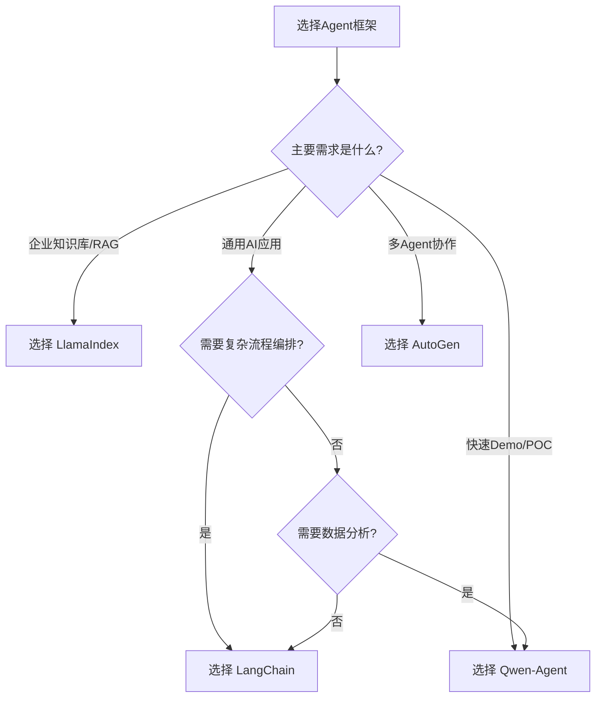

### 5.2 场景推荐

| 场景            | 推荐框架   | 理由                            |
| --------------- | ---------- | ------------------------------- |
| **企业知识库**  | LlamaIndex | 专业的文档处理能力,多种检索策略 |
| **通用AI应用**  | LangChain  | 生态丰富,LCEL支持灵活编排       |
| **快速Demo**    | Qwen-Agent | 配置简单,内置WebUI和代码执行    |
| **多Agent协作** | AutoGen    | 原生支持群聊管理和角色分工      |
| **数据分析**    | Qwen-Agent | 内置 Code Interpreter           |

### 5.3 学习路径建议

**初学者建议**:

1. **第一步**: 从 Qwen-Agent 开始(最简单,快速上手)
2. **第二步**: 学习 LlamaIndex(理解 RAG 核心概念)
3. **第三步**: 掌握 LangChain(应对复杂场景)

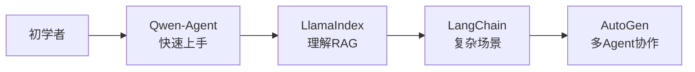

---

## 附录:环境准备

### 安装依赖

```bash
# 创建虚拟环境
python -m venv agent_env
source agent_env/bin/activate  # Linux/Mac
# 或: agent_env\Scripts\activate  # Windows

# 安装 LangChain
pip install langchain langchain-community \
    langchain-text-splitters \
    dashscope faiss-cpu

# 安装 LlamaIndex
pip install llama-index llama-index-llms-dashscope \
    llama-index-embeddings-dashscope

# 安装 Qwen-Agent
pip install qwen-agent

# 设置 API Key
export DASHSCOPE_API_KEY="your-api-key"
```

### 项目结构

```
project/
├── docs/                      # 文档文件夹
│   ├── 雇主责任险.txt
│   ├── 企业团体综合意外险.txt
│   └── ...
├── langchain-agent.py         # LangChain 实现
├── llamaindex-agent.py        # LlamaIndex 实现
├── qwen-agent.py              # Qwen-Agent 实现
└── README.md
```

---

## 总结

### 核心知识点回顾

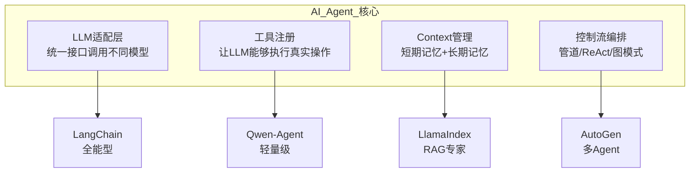

### 关键要点

1. **AI Agent = LLM(大脑) + 工具(双手) + 记忆 + 控制流**
2. **适配层**解决了不同 LLM 的 API 差异问题
3. **工具注册**让 LLM 能够执行真实世界的操作
4. **RAG**是解决私有数据问答的最佳方案
5. **框架选择**应根据具体场景,而非盲目追求流行

## requirement

```python
json5==0.9.14
langchain_community==0.4.1
langchain_core==1.2.8
langchain_text_splitters==1.1.0
llama_index==0.14.13
qwen_agent==0.0.25
```


---

本文档由Kimi生成，仅用于个人学习记录，勿用于商业用途

