<!-- more -->

# HuggingFace生态实战：从模型应用到高效微调

## 目录

1. [HuggingFace简介](#1-huggingface简介)
2. [HuggingFace核心概念](#2-huggingface核心概念)
3. [Transformer架构三大流派](#3-transformer架构三大流派)
4. [Pipeline：一行代码实现AI功能](#4-pipeline一行代码实现ai功能)
5. [深入核心组件：Tokenizer](#5-深入核心组件tokenizer)
6. [深入核心组件：Model](#6-深入核心组件model)
7. [全量微调详解](#7-全量微调详解)
8. [实战案例：垃圾邮件分类器](#8-实战案例垃圾邮件分类器)
9. [实战案例：大模型Qwen应用](#9-实战案例大模型qwen应用)
10. [总结与最佳实践](#10-总结与最佳实践)

---

## 1. HuggingFace简介

### 1.1 什么是HuggingFace

HuggingFace 是一个专注于人工智能的开源社区和平台，被誉为"AI界的GitHub"和"AI界的App Store"。如果说PyTorch是造车的发动机，那HuggingFace就是直接送了程序员一辆跑车。

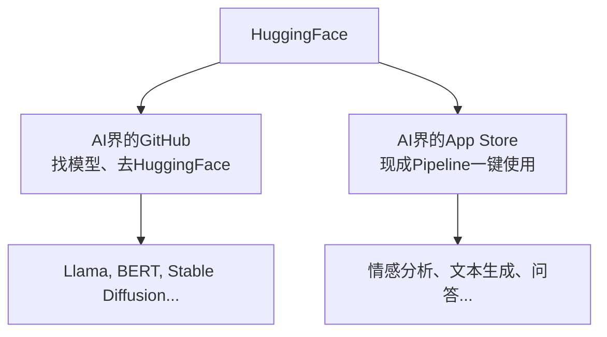

### 1.2 HuggingFace的三大核心

| 核心组件         | 名称   | 作用                   | 类比       |
| ---------------- | ------ | ---------------------- | ---------- |
| **Transformers** | 工具箱 | 提供统一的Python接口   | 万能工具箱 |
| **Model Hub**    | 仓库   | 存放模型权重和配置文件 | 模型商店   |
| **Datasets**     | 燃料库 | 提供海量数据集         | 燃料供应站 |

**核心代码示例：**

```python
# 安装必要的库
# pip install transformers datasets

from transformers import AutoModel, AutoTokenizer
from datasets import load_dataset

# 加载模型和分词器
model_name = "bert-base-chinese"
tokenizer = AutoTokenizer.from_pretrained(model_name)
model = AutoModel.from_pretrained(model_name)

# 加载数据集
dataset = load_dataset(" stanfordnlp/imdb")
```

### 1.3 国内使用HuggingFace

由于网络原因，在国内直接使用HuggingFace可能会遇到连接问题。以下是两种推荐的解决方案：

**方案一：使用HF-Mirror镜像站**

```python
import os

# 必须在导入transformers之前设置
os.environ["HF_ENDPOINT"] = "https://hf-mirror.com"
os.environ["HF_HOME"] = "./models"  # 模型缓存目录

from transformers import pipeline

# 正常使用
classifier = pipeline("sentiment-analysis",
                      model="uer/roberta-base-finetuned-dianping-chinese")
```

**方案二：使用ModelScope（魔搭社区）**

```python
from modelscope import snapshot_download
from transformers import AutoModel, AutoTokenizer

# ModelScope是下载工具，HuggingFace是加载工具
model_dir = snapshot_download('qwen/Qwen2.5-0.5B', cache_dir='./models')

# 使用HuggingFace加载
tokenizer = AutoTokenizer.from_pretrained(model_dir)
model = AutoModel.from_pretrained(model_dir)
```

---

## 2. HuggingFace核心概念

### 2.1 Tokenization（分词）

**核心概念：** 模型不认识汉字或英文单词，它只认识数字。Tokenizer是人类语言和机器数字之间的桥梁。

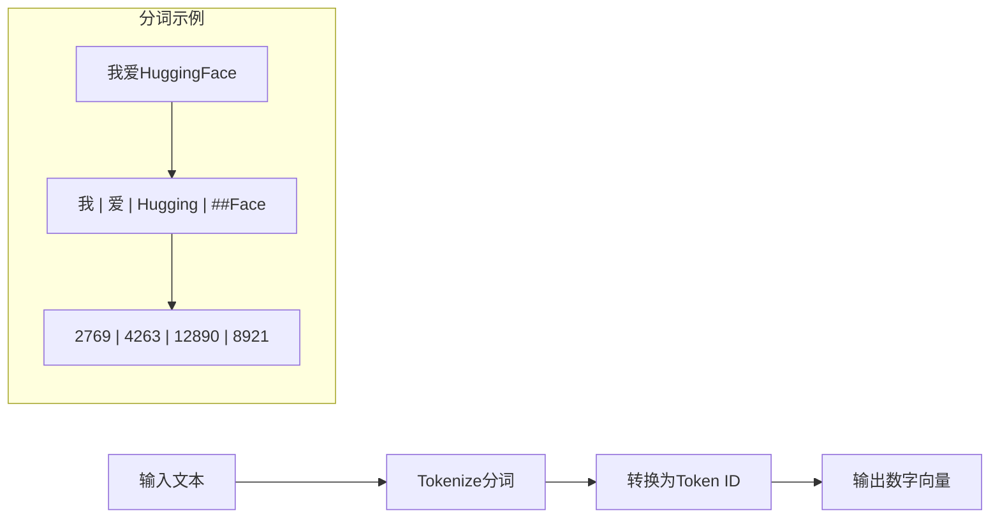

**重要提示：** 不同的模型有专属的Tokenizer，不能混用！用BERT的Tokenizer去处理数据喂给GPT模型，会报错或输出乱码。

### 2.2 特殊Token

为了让模型更好地理解文本结构，开发者会预设一些具有特殊功能的Token：

| Token类型  | 作用                   | 示例                            |
| ---------- | ---------------------- | ------------------------------- |
| **分隔符** | 区分不同文本段落或角色 | `<\|user\|>`, `<\|assistant\|>` |
| **结束符** | 告知模型文本已结束     | `[EOS]`, `<\|endoftext\|>`      |
| **起始符** | 标记序列开始           | `[CLS]`, `[BOS]`                |

### 2.3 常见Token切分方式

不同模型对同一文本的切分方式不同，这会影响模型效率：

```
英文 "Hello World":
  - GPT-4o: ["Hello", "World"] → token id = [13225, 5922]

中文 "人工智能你好啊":
  - DeepSeek-R1: ["人工智能", "你好", "啊"] → token id = [33574, 30594, 3266]
```

可以使用在线工具 https://tiktokenizer.vercel.app/ 查看不同模型的分词方式。

---

## 3. Transformer架构三大流派

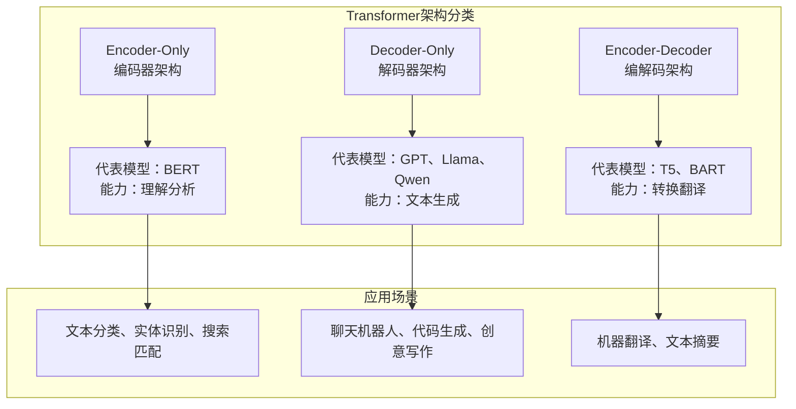

### 3.1 Encoder-Only（编码器架构）

**代表模型：** BERT、RoBERTa、DistilBERT

**能力特点：** 擅长理解和分析，像一个阅读理解满分的学生。

**应用场景：**

- 文本分类（如情感分析）
- 命名实体识别（NER）
- 搜索匹配

### 3.2 Decoder-Only（解码器架构）

**代表模型：** GPT系列、Llama、Qwen、DeepSeek

**能力特点：** 擅长生成，像一个话唠小说家，根据概率不断预测下一个词。

**应用场景：**

- 聊天机器人
- 代码生成
- 创意写作

### 3.3 Encoder-Decoder（编解码架构）

**代表模型：** T5、FLAN-T5、BART

**能力特点：** 擅长转换，像一个翻译官，先理解再重组。

**应用场景：**

- 机器翻译
- 文本摘要
- 文本纠错

### 3.4 常用模型速查表

#### NLP领域

| 类别       | 模型           | 特点               |
| ---------- | -------------- | ------------------ |
| **理解类** | BERT / RoBERTa | 文本分类、NER首选  |
| **理解类** | DistilBERT     | 轻量化版，推理更快 |
| **生成类** | Llama系列      | 最主流开源大模型   |
| **生成类** | Qwen系列       | 中文能力极强       |
| **生成类** | DeepSeek系列   | 性价比高           |
| **生成类** | GPT-2          | 轻量，教学入门     |
| **转换类** | T5 / FLAN-T5   | 文本到文本格式     |
| **转换类** | BART           | 文本纠错、摘要     |

#### CV与多模态领域

| 模型             | 能力          |
| ---------------- | ------------- |
| ViT              | 图像分类      |
| Stable Diffusion | 图像生成      |
| CLIP             | 文本-图像连接 |

---

## 4. Pipeline：一行代码实现AI功能

### 4.1 Pipeline是什么

Pipeline是一个全自动的黑盒，它自动完成三个步骤：

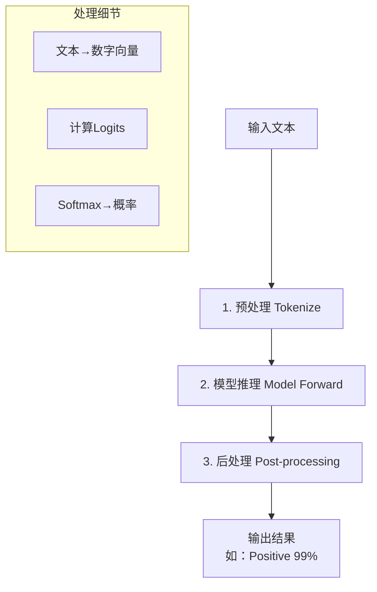

### 4.2 CASE1：情感分析

**任务：** 判断电商评论是好评还是差评

```python
import os
# 必须在导入pipeline之前设置
os.environ["HF_ENDPOINT"] = "https://hf-mirror.com"
os.environ["HF_HOME"] = "/root/autodl-tmp/models"

from transformers import pipeline

# 加载情感分析pipeline
# 使用中文微调模型，效果更好
classifier = pipeline(
    task="text-classification",  # 也可以用"senti
    model="uer/roberta-base-finetuned-dianping-chinese"
)

# 预测差评
result = classifier("这个手机屏幕太烂了，反应很慢！")
print(result)
# 输出: [{'label': 'negative (negative)', 'score': 0.98}]

# 预测好评
result2 = classifier("物流很快，包装很精美，五星好评。")
print(result2)
# 输出: [{'label': 'positive (positive)', 'score': 0.99}]
```

**运行结果解析：**

- `label`: 分类标签（positive/negative）
- `score`: 置信度（0到1之间，越接近1越确定）

### 4.3 CASE2：文本生成

**任务：** 给定开头，让AI续写故事

```python
import os
os.environ["HF_ENDPOINT"] = "https://hf-mirror.com"
os.environ["HF_HOME"] = "/root/autodl-tmp/models"

from transformers import pipeline

# 加载文本生成pipeline
generator = pipeline(
    task="text-generation",
    model="uer/gpt2-chinese-cluecorpussmall"
)

# 生成文本
text = "在一个风雨交加的夜晚，程序员小李打开了电脑，突然"
result = generator(text, max_length=100, truncation=True, do_sample=True)
print(result[0]['generated_text'])
```

**关键参数说明：**

| 参数         | 作用                                    |
| ------------ | --------------------------------------- |
| `max_length` | 生成文本的最大长度                      |
| `truncation` | 是否截断超长输入                        |
| `do_sample`  | 是否采样（True则随机生成，False则贪心） |

### 4.4 CASE3：零样本分类

**任务：** 模型从未见过你的标签，但能根据语义理解进行分类

```python
import os
os.environ["HF_ENDPOINT"] = "https://hf-mirror.com"
os.environ["HF_HOME"] = "/root/autodl-tmp/models"

from transformers import pipeline

# 加载零样本分类器
classifier = pipeline(
    task="zero-shot-classification",
    model="facebook/bart-large-mnli"  # 推荐使用多语言模型
)

text = "特斯拉发布了最新的自动驾驶技术，股价大涨。"
candidate_labels = ["体育", "财经", "娱乐", "科技"]

# 模型自己匹配语义
result = classifier(text, candidate_labels)
print(f"文本内容：{text}")
print(f"预测标签：{result['labels'][0]} (置信度: {result['scores'][0]:.4f})")
```

### 4.5 Pipeline常用任务速查

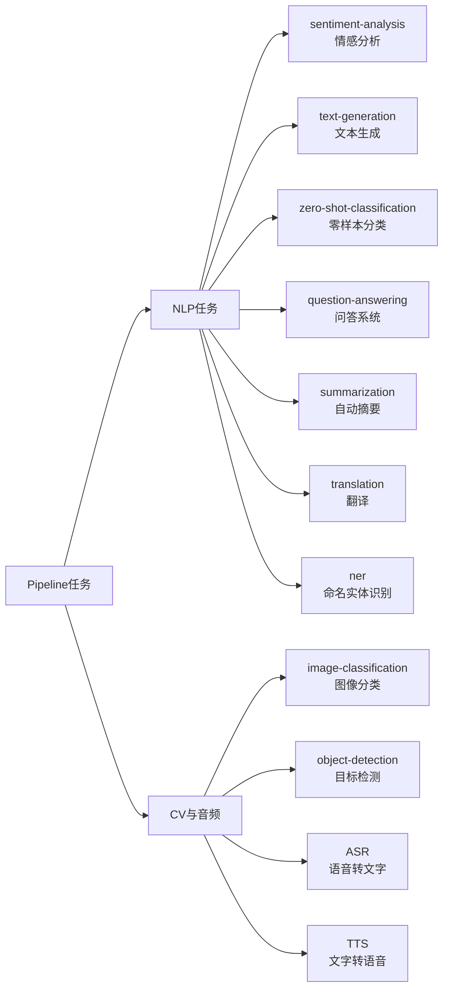

---

## 5. 深入核心组件：Tokenizer

### 5.1 Tokenizer的核心作用

Tokenizer负责将文本转换为模型能处理的数字向量，是数据预处理的关键环节：

```python
import os
os.environ["HF_ENDPOINT"] = "https://hf-mirror.com"
os.environ["HF_HOME"] = "/root/autodl-tmp/models"

from transformers import AutoTokenizer

# 加载分词器
tokenizer = AutoTokenizer.from_pretrained("bert-base-chinese")

# 模拟一个Batch（两个长度不一样的句子）
sentences = ["我爱AI", "HuggingFace真好用"]

# 调用分词器
inputs = tokenizer(
    sentences,
    padding=True,       # 自动填充到最长句子的长度
    truncation=True,     # 超过最大长度就截断
    max_length=10,      # 设置最大长度
    return_tensors="pt"  # 返回PyTorch张量
)

print(inputs)
```

**输出解析：**

```python
{
    'input_ids': tensor([
        [101, 2769, 4263, 100, 102, 0],      # "我爱AI" → 填充了1个0
        [101, 100, 4696, 1962, 4500, 102]     # "HuggingFace真好用" → 无需填充
    ]),
    'token_type_ids': tensor([[0, 0, 0, 0, 0, 0], [0, 0, 0, 0, 0, 0]]),
    'attention_mask': tensor([
        [1, 1, 1, 1, 1, 0],   # 0表示是填充的
        [1, 1, 1, 1, 1, 1]    # 全部是真实token
    ])
}
```

### 5.2 关键参数详解

| 参数             | 作用               | 注意事项                          |
| ---------------- | ------------------ | --------------------------------- |
| `padding`        | 填充短句到统一长度 | `True`自动填充，`False`不填充     |
| `truncation`     | 截断超长句子       | 防止超过模型最大长度限制          |
| `max_length`     | 最大token数量      | BERT通常为512                     |
| `return_tensors` | 返回的张量类型     | `"pt"`=PyTorch，`"tf"`=TensorFlow |

### 5.3 Padding和Truncation的必要性

**问题背景：** GPU喜欢整齐的矩阵，但不同句子长度不同。

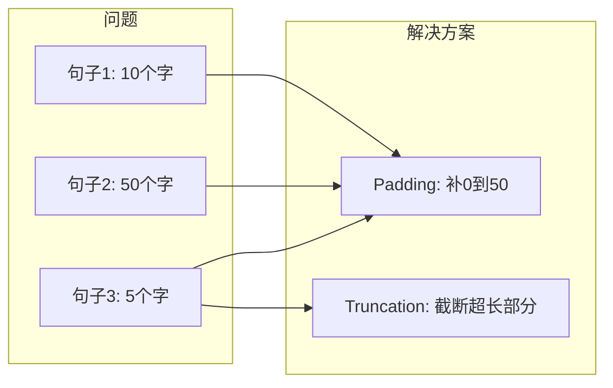

---

## 6. 深入核心组件：Model

### 6.1 AutoModel vs AutoModelFor...

**AutoModel（纯净版）：** 只有"大脑"，输出隐藏状态（高维向量），适合从头搭建网络。

**AutoModelFor...（带头模型）：** 大脑+嘴巴，输出分类分数，适合直接完成任务。

```python
from transformers import AutoModel, AutoModelForSequenceClassification

# 纯净版模型
base_model = AutoModel.from_pretrained("bert-base-chinese")
# 输出形状: (Batch_Size, Sequence_Length, Hidden_Size) → 如 (2, 10, 768)

# 带分类头的模型
cls_model = AutoModelForSequenceClassification.from_pretrained(
    "bert-base-chinese",
    num_labels=2  # 二分类
)
# 输出形状: (Batch_Size, Num_Labels) → 如 (2, 2)
```

### 6.2 模型结构可视化

```
BertModel (纯净版)
├── embeddings (词嵌入层)
│   ├── word_embeddings: Embedding(21128, 768)  # 词表大小×隐藏维度
│   ├── position_embeddings: Embedding(512, 768)
│   └── token_type_embeddings: Embedding(2, 768)
├── encoder (Transformer编码器)
│   └── layer: 12 × BertLayer (12层Transformer)
└── pooler (池化层)

BertForSequenceClassification (带头版)
├── bert: BertModel (同纯净版)
├── dropout
└── classifier: Linear(768, 2)  # 新增分类头！
```

### 6.3 手写Pipeline：完整推理流程

**从输入文本到获得概率的全过程：**

```python
import os
os.environ["HF_ENDPOINT"] = "https://hf-mirror.com"
os.environ["HF_HOME"] = "/root/autodl-tmp/models"

import torch
import torch.nn.functional as F
from transformers import AutoTokenizer, AutoModelForSequenceClassification

# 1. 准备工作
checkpoint = "uer/roberta-base-finetuned-dianping-chinese"
tokenizer = AutoTokenizer.from_pretrained(checkpoint)
model = AutoModelForSequenceClassification.from_pretrained(checkpoint)

# 2. 原始文本
text = "这家餐厅太难吃了，服务员态度还差！"

# 3. Step 1: Tokenize (预处理)
inputs = tokenizer(text, return_tensors="pt")
# inputs 包含 input_ids 和 attention_mask

# 4. Step 2: Model Inference (模型推理)
with torch.no_grad():
    outputs = model(**inputs)
    logits = outputs.logits  # 获取Logits (未归一化的分数)
    print(f"模型原始输出 (Logits): {logits}")

# 5. Step 3: Post-processing (后处理)
probabilities = F.softmax(logits, dim=-1)  # Softmax转换为概率
print(f"概率分布: {probabilities}")

predicted_id = torch.argmax(probabilities).item()  # 取最大概率的索引
predicted_label = model.config.id2label[predicted_id]  # 查表得到标签
print(f"最终结果: {predicted_label}")
```

**运行结果：**

```
模型原始输出 (Logits): tensor([[2.8590, -2.7449]])
概率分布: tensor([[0.9963, 0.0037]])
最终结果: negative (stars 1, 2 and 3)
```

### 6.4 数据流向图

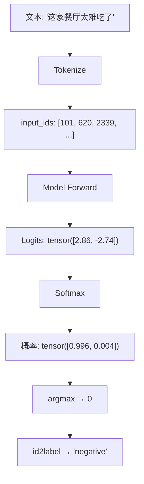

---

## 7. 全量微调详解

### 7.1 为什么需要微调

**预训练（Pre-training）= 大学通识教育**

- 模型读了海量维基百科、书籍
- 能力：懂语法、成语，知道"苹果"既是水果也是公司
- 局限：不知道你公司具体的业务逻辑

**微调（Fine-tuning）= 岗前专业培训**

- 动作：在预训练模型基础上，用特定领域数据再训练
- 目标：从"懂中文的毕业生"变成"懂医疗发票的审核员"

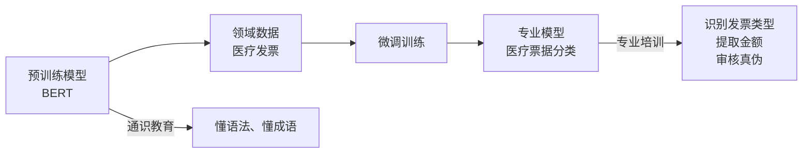

### 7.2 应用场景举例

| 场景         | 通用模型                    | 微调模型                    |
| ------------ | --------------------------- | --------------------------- |
| **医疗影像** | 知道CT是什么                | 精准识别CT中的临床表现      |
| **垃圾邮件** | "恭喜您中奖"→好话(Positive) | "恭喜您中奖"→垃圾邮件(Spam) |
| **客服对话** | 理解日常对话                | 理解产品专业术语            |

### 7.3 核心工具：Datasets与DataCollator

#### Datasets：数据加载与预处理

```python
from datasets import Dataset

# 从列表创建数据集
data = [
    {"text": "今晚有空一起吃饭吗？", "label": 0},  # 正常
    {"text": "恭喜您获得500万大奖，点击领取", "label": 1},  # 垃圾
    {"text": "您的验证码是1234，请勿泄露", "label": 0},
    {"text": "澳门首家线上赌场上线啦", "label": 1},
]
dataset = Dataset.from_list(data)

# 划分训练集和测试集
dataset = dataset.train_test_split(test_size=0.2)

# 批量预处理 (支持多进程并行)
def preprocess_function(examples):
    return tokenizer(examples["text"], truncation=True, max_length=128)

tokenized_datasets = dataset.map(preprocess_function, batched=True)
```

#### DataCollator：动态补齐

**痛点：** 传统做法将所有样本补齐到固定长度（如512），浪费显存。

**聪明做法：** 只补齐到当前批次中最长的长度。

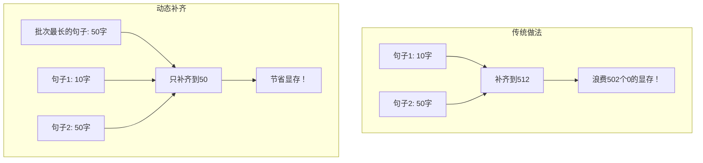

```python
from transformers import DataCollatorWithPadding

# 动态补齐工具
data_collator = DataCollatorWithPadding(tokenizer=tokenizer)
```

### 7.4 Trainer API：训练封装

```python
from transformers import Trainer, TrainingArguments

# 配置训练参数
training_args = TrainingArguments(
    output_dir="./spam-bert-finetuned",  # 模型保存路径
    eval_strategy="epoch",               # 每个epoch结束后评估
    save_strategy="epoch",               # 每个epoch结束后保存
    learning_rate=2e-5,                  # 学习率 (微调通常较小)
    per_device_train_batch_size=4,       # 批次大小
    num_train_epochs=3,                  # 训练轮数
    weight_decay=0.01,                   # 权重衰减
    logging_steps=10,                     # 日志记录间隔
)

# 创建Trainer
trainer = Trainer(
    model=model,
    args=training_args,
    train_dataset=tokenized_datasets["train"],
    eval_dataset=tokenized_datasets["test"],
    data_collator=data_collator,
    compute_metrics=compute_metrics,
)

# 开始训练
trainer.train()
```

#### Trainer vs 传统PyTorch

| 维度     | 传统PyTorch        | HuggingFace Trainer |
| -------- | ------------------ | ------------------- |
| 代码量   | 50+行循环代码      | 实例化1个类         |
| 功能支持 | 需手写日志、保存   | 开箱即用            |
| 硬件优化 | 需手动配置混合精度 | `fp16=True`         |
| 多卡训练 | 配置DDP（极难）    | 自动适配            |

---

## 8. 实战案例：垃圾邮件分类器

### 8.1 项目概述

**任务：** 构建一个垃圾邮件分类器，自动识别垃圾邮件

**输入：** 短信或邮件文本

**输出：** 0（正常）或 1（垃圾）

**模型：** bert-base-chinese

### 8.2 完整代码

```python
#!/usr/bin/env python
# coding: utf-8

import os
# 必须在导入pipeline之前设置
os.environ["HF_ENDPOINT"] = "https://hf-mirror.com"
os.environ["HF_HOME"] = "/root/autodl-tmp/models"

import torch
import numpy as np
from transformers import (
    AutoTokenizer,
    AutoModelForSequenceClassification,
    Trainer,
    TrainingArguments,
    DataCollatorWithPadding
)
from datasets import Dataset
import evaluate

# ============================================
# Step 1: 准备环境与数据
# ============================================

# 模拟数据集（真实场景用load_dataset加载CSV）
data = [
    {"text": "今晚有空一起吃饭吗？", "label": 0},  # 正常
    {"text": "恭喜您获得500万大奖，点击领取", "label": 1},  # 垃圾
    {"text": "您的验证码是1234，请勿泄露", "label": 0},
    {"text": "澳门首家线上赌场上线啦", "label": 1},
    {"text": "项目进度怎么样了？需不需要开会", "label": 0},
    {"text": "独家内幕消息，股票必涨，加群", "label": 1},
]
dataset = Dataset.from_list(data)
dataset = dataset.train_test_split(test_size=0.2)

print(f"训练集大小: {len(dataset['train'])}")
print(f"测试集大小: {len(dataset['test'])}")

# ============================================
# Step 2: 数据预处理 (Map & Tokenize)
# ============================================

checkpoint = "bert-base-chinese"
tokenizer = AutoTokenizer.from_pretrained(checkpoint)

def preprocess_function(examples):
    """
    预处理函数
    - truncation=True: 截断过长的文本
    - padding=False: 先不补齐，留给DataCollator动态处理
    """
    return tokenizer(examples["text"], truncation=True, max_length=128)

# 批量处理（支持多进程）
tokenized_datasets = dataset.map(preprocess_function, batched=True)

# ============================================
# Step 3: DataCollator与模型加载
# ============================================

# 动态补齐工具
data_collator = DataCollatorWithPadding(tokenizer=tokenizer)

# 加载带分类头的模型（num_labels=2: 二分类）
model = AutoModelForSequenceClassification.from_pretrained(
    checkpoint,
    num_labels=2
)

# ============================================
# Step 4: 评估指标定义
# ============================================

metric = evaluate.load("accuracy")

def compute_metrics(eval_pred):
    """计算评估指标"""
    logits, labels = eval_pred
    predictions = np.argmax(logits, axis=-1)
    return metric.compute(predictions=predictions, references=labels)

# ============================================
# Step 5: 训练配置与执行
# ============================================

training_args = TrainingArguments(
    output_dir="./spam-bert-finetuned",  # 模型保存路径
    eval_strategy="epoch",               # 每个epoch结束后评估
    save_strategy="epoch",               # 每个epoch结束后保存
    learning_rate=2e-5,                  # 学习率
    per_device_train_batch_size=4,        # 批次大小
    num_train_epochs=3,                  # 训练轮数
    weight_decay=0.01,                   # 权重衰减
    logging_steps=10,                    # 日志记录间隔
)

trainer = Trainer(
    model=model,
    args=training_args,
    train_dataset=tokenized_datasets["train"],
    eval_dataset=tokenized_datasets["test"],
    data_collator=data_collator,
    compute_metrics=compute_metrics,
)

# 开始训练
trainer.train()

# ============================================
# Step 6: 模型推理 (验证效果)
# ============================================

# 模拟一条新数据
text = "澳门线上赌场，特价酬宾"
inputs = tokenizer(text, return_tensors="pt").to(model.device)

with torch.no_grad():
    logits = model(**inputs).logits
    predicted_class_id = logits.argmax().item()

print(f"\n{'='*50}")
print(f"输入文本: {text}")
print(f"预测类别: {'垃圾邮件' if predicted_class_id == 1 else '正常邮件'}")
```

### 8.3 流程总结

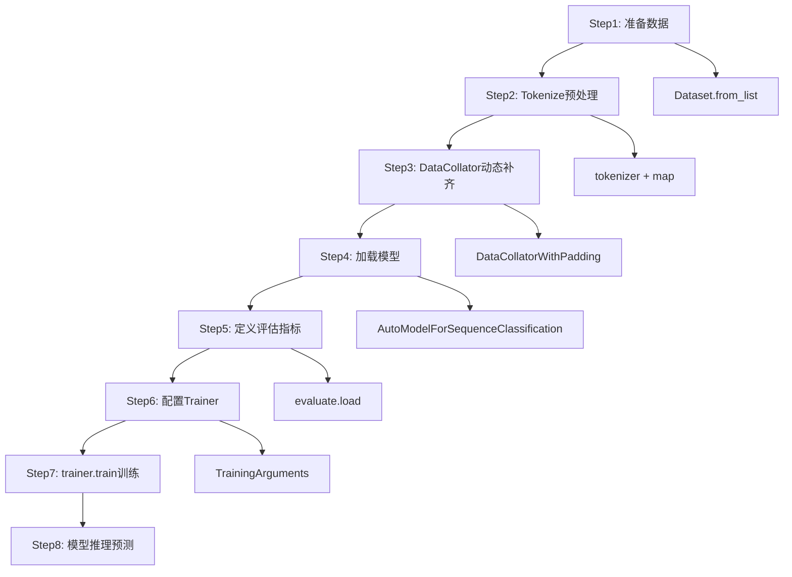

---

## 9. 实战案例：大模型Qwen应用

### 9.1 BERT微调 vs 大模型Prompt

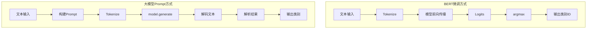

### 9.2 使用Qwen进行垃圾邮件分类

```python
#!/usr/bin/env python
# coding: utf-8

import os
import torch
from transformers import AutoTokenizer, AutoModelForCausalLM, pipeline
from modelscope import snapshot_download

# ============================================
# Step 1: 使用ModelScope下载模型
# ============================================

modelscope_model_id = "Qwen/Qwen2.5-7B-Instruct"
cache_dir = "/root/autodl-tmp/models"

print(f"正在从ModelScope下载模型: {modelscope_model_id}")
model_dir = snapshot_download(modelscope_model_id, cache_dir=cache_dir)
print(f"模型已下载到: {model_dir}")

# ============================================
# Step 2: 使用HuggingFace加载模型
# ============================================

tokenizer = AutoTokenizer.from_pretrained(model_dir, trust_remote_code=True)

# 检查GPU
if torch.cuda.is_available():
    print(f"检测到GPU: {torch.cuda.get_device_name(0)}")
    model = AutoModelForCausalLM.from_pretrained(
        model_dir,
        torch_dtype=torch.float16,  # 半精度节省显存
        device_map="auto",          # 自动分配设备
        trust_remote_code=True
    )
else:
    print("未检测到GPU，使用CPU")
    model = AutoModelForCausalLM.from_pretrained(
        model_dir,
        trust_remote_code=True
    )

# ============================================
# Step 3: 定义分类函数（使用Prompt）
# ============================================

def classify_spam_with_prompt(text, model, tokenizer):
    """
    使用Prompt让大模型进行分类
    """
    prompt = f"""你是一个垃圾邮件分类专家。请判断以下文本是否为垃圾邮件。

文本：{text}

请只回答"垃圾邮件"或"正常邮件"："""

    # Tokenize
    inputs = tokenizer(prompt, return_tensors="pt")
    if torch.cuda.is_available():
        inputs = inputs.to(model.device)

    # 生成回答
    with torch.no_grad():
        outputs = model.generate(
            **inputs,
            max_new_tokens=15,           # 只需生成少量token
            do_sample=False,             # 贪心解码，保证稳定
            pad_token_id=tokenizer.eos_token_id,
        )

    # 解码输出（只取新生成的部分）
    generated_text = tokenizer.decode(
        outputs[0][inputs['input_ids'].shape[1]:],
        skip_special_tokens=True
    ).strip()

    # 解析结果
    if "垃圾" in generated_text or "spam" in generated_text.lower():
        return 1, "垃圾邮件"
    elif "正常" in generated_text or "normal" in generated_text.lower():
        return 0, "正常邮件"
    else:
        return None, f"未识别: {generated_text}"

# ============================================
# Step 4: 测试分类效果
# ============================================

test_texts = [
    "今晚有空一起吃饭吗？",           # 正常
    "恭喜您获得500万大奖，点击领取",   # 垃圾
    "您的验证码是1234，请勿泄露",      # 正常
    "澳门首家线上赌场上线啦",          # 垃圾
    "项目进度怎么样了？需不需要开会",   # 正常
    "独家内幕消息，股票必涨，加群",     # 垃圾
]

print("=" * 60)
print("测试结果")
print("=" * 60)

for text in test_texts:
    label_id, label_name = classify_spam_with_prompt(text, model, tokenizer)
    print(f"文本: {text}")
    print(f"预测: {label_name}")
    print("-" * 60)
```

### 9.3 使用Pipeline方式（更简单）

```python
# 创建text-generation pipeline
generator = pipeline(
    "text-generation",
    model=model,
    tokenizer=tokenizer
    # 不指定device，Pipeline会自动检测模型所在设备
)

def classify_spam_with_pipeline(text, generator):
    prompt = f"""你是一个垃圾邮件分类专家。请判断以下文本是否为垃圾邮件。

文本：{text}

请只回答"垃圾邮件"或"正常邮件"："""

    result = generator(
        prompt,
        max_new_tokens=15,
        do_sample=False,
        return_full_text=False,  # 只返回新生成的部分
    )

    generated_text = result[0]['generated_text'].strip()

    if "垃圾" in generated_text:
        return 1, "垃圾邮件"
    elif "正常" in generated_text:
        return 0, "正常邮件"
    else:
        return None, f"未识别: {generated_text}"

# 使用
for text in test_texts:
    label_id, label_name = classify_spam_with_pipeline(text, generator)
    print(f"文本: {text} → {label_name}")
```

### 9.4 何时使用BERT微调，何时使用大模型

| 维度           | BERT微调         | 大模型Prompt       |
| -------------- | ---------------- | ------------------ |
| **数据需求**   | 需要大量标注数据 | 无需标注           |
| **任务灵活性** | 任务固定         | 多样化任务         |
| **准确率**     | 高（特定任务）   | 中等（依赖Prompt） |
| **推理速度**   | 快               | 慢                 |
| **显存需求**   | 1-2GB            | 8GB+               |
| **适用场景**   | 生产环境         | 快速验证           |

---

## 10. 总结与最佳实践

### 10.1 核心概念总结

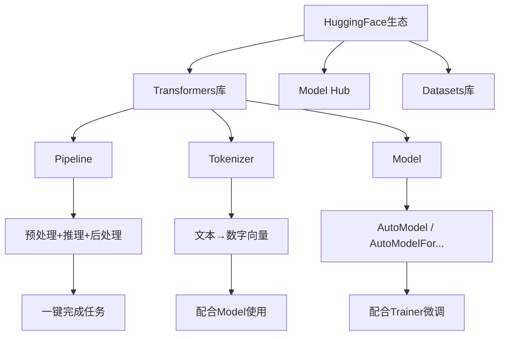

### 10.2 关键知识点

| 知识点              | 说明                                            |
| ------------------- | ----------------------------------------------- |
| **Pipeline**        | 最快的落地方式，Demo阶段首选                    |
| **Tokenizer**       | 必须和模型配套，padding和truncation是批处理关键 |
| **AutoModelFor...** | 封装了特定任务的头，微调时通常使用              |
| **DataCollator**    | 动态补齐，提升训练效率                          |
| **Trainer API**     | 封装训练循环，支持混合精度、多卡训练            |

### 10.3 微调最佳实践

1. **数据准备**
   - 使用`Dataset.from_list()`或`load_dataset()`加载数据
   - 用`map()`函数批量预处理
   - 使用`DataCollatorWithPadding`动态补齐

2. **模型选择**
   - 小数据量：使用微调过的中文模型
   - 大数据量：可从头预训练或全量微调
   - 中文任务：优先选择中文预训练模型

3. **训练技巧**
   - 学习率：微调通常用2e-5
   - 批次大小：根据显存调整
   - 训练轮数：3-5个epoch通常足够

4. **国内使用**
   - 设置`HF_ENDPOINT=https://hf-mirror.com`
   - 或使用ModelScope下载模型

### 10.4 代码模板

```python
# 标准模板
import os
os.environ["HF_ENDPOINT"] = "https://hf-mirror.com"

from transformers import pipeline, AutoTokenizer, AutoModel
from datasets import Dataset
from transformers import Trainer, TrainingArguments

# 1. Pipeline快速体验
classifier = pipeline("sentiment-analysis", model="模型名")

# 2. 深度定制
tokenizer = AutoTokenizer.from_pretrained("模型名")
model = AutoModelForSequenceClassification.from_pretrained("模型名", num_labels=2)

# 3. 训练微调
trainer = Trainer(model=model, args=training_args, train_dataset=train_data)
trainer.train()

# 4. 推理预测
result = classifier("待预测文本")
```

---

## 附录：常用模型速查

### 中文情感分析

| 模型                                          | 说明             |
| --------------------------------------------- | ---------------- |
| `uer/roberta-base-finetuned-dianping-chinese` | 大众点评情感分析 |
| `bert-base-chinese`                           | 通用中文BERT     |

### 中文文本生成

| 模型                               | 说明      |
| ---------------------------------- | --------- |
| `uer/gpt2-chinese-cluecorpussmall` | 中文GPT-2 |

### 零样本分类

| 模型                       | 说明       |
| -------------------------- | ---------- |
| `facebook/bart-large-mnli` | 多语言支持 |

### 通用模型

| 模型                       | 说明     |
| -------------------------- | -------- |
| `bert-base-chinese`        | 中文BERT |
| `Qwen/Qwen2.5-7B-Instruct` | 通义千问 |

---

**作者：** MiniMax Agent
**日期：** 2026年3月22日
