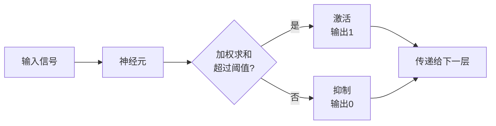
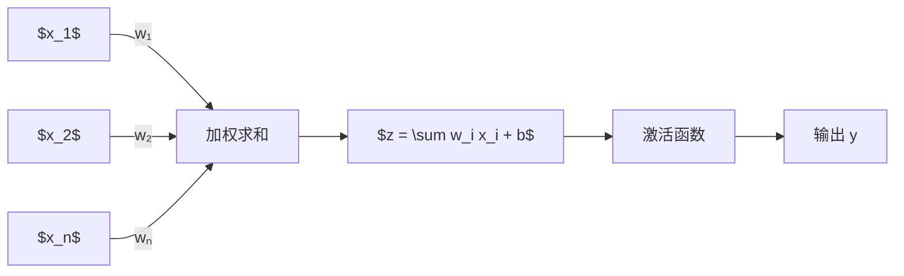
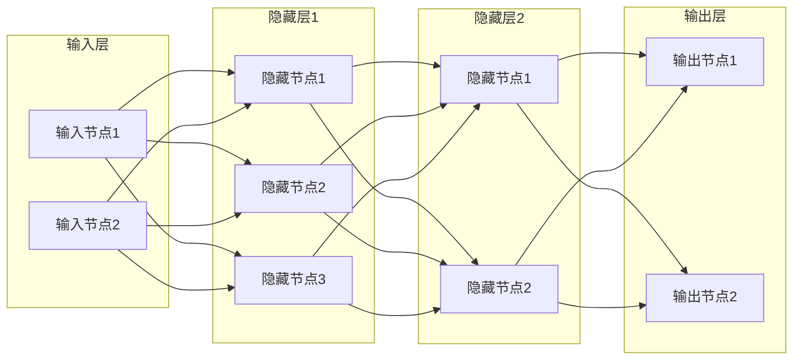
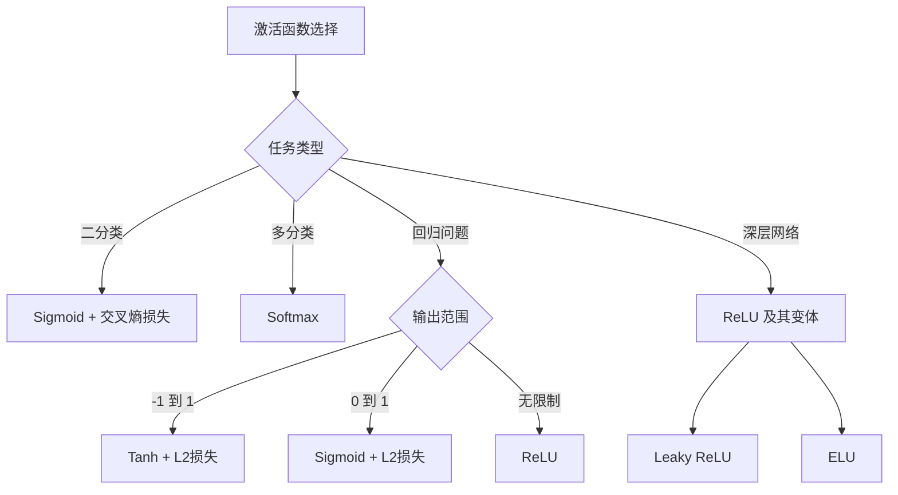
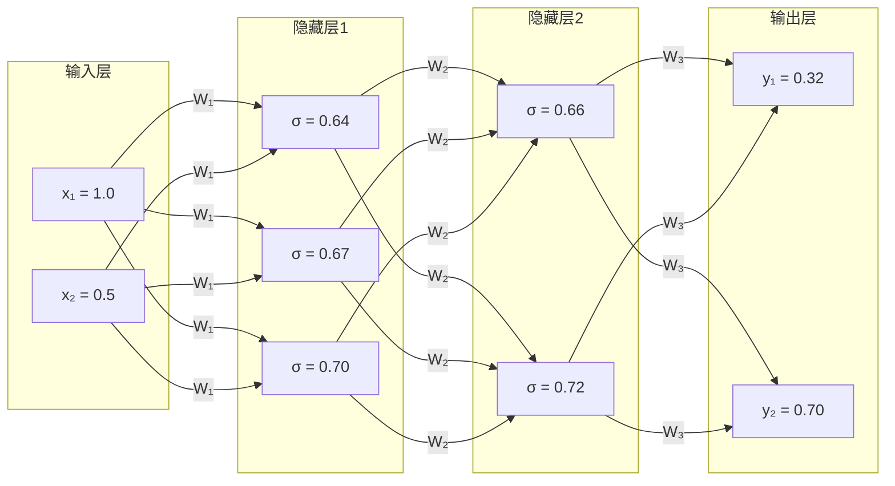
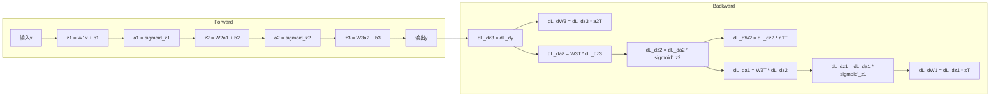
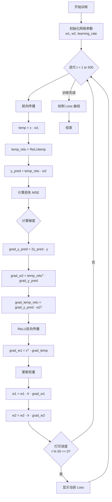
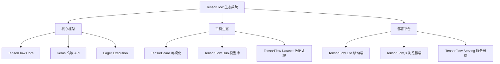
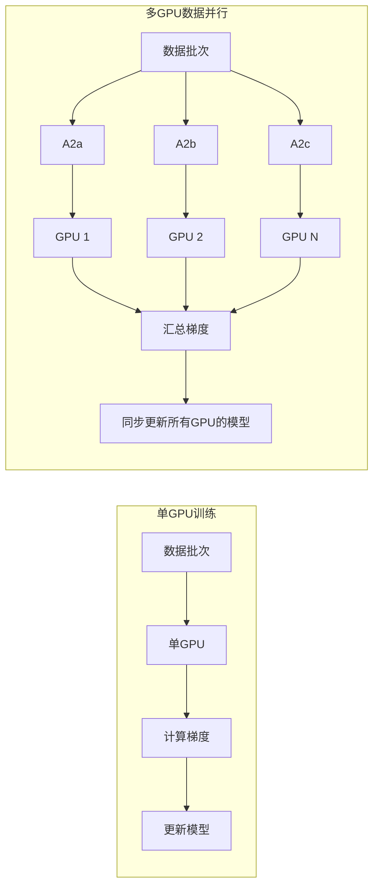
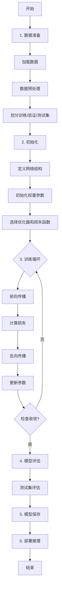

<!-- more -->


## 第一章：神经网络基础概念

### 1.1 从生物神经元到人工神经元

神经网络的概念源于对生物大脑中神经元工作方式的模拟。在生物大脑中，单个神经细胞只有两种状态：兴奋和抑制。网络中的每个节点（神经元）接收输入信号，如果所有信号的加权总和超过一个“阈值”，它就被“激活”（兴奋），并向下传递信息；否则就保持“抑制”。这种简单的开关机制，构成了整个网络决策和学习的根本。



人工神经元是生物神经元的数学抽象，它由输入值、权重、偏置和激活函数组成。对于给定的输入 $x_1, x_2, ..., x_n$，神经元首先计算加权和：

$$z = \sum_{i=1}^{n} w_i \cdot x_i + b$$

---

其中 $w_i$ 是第 $i$ 个输入的权重，$b$ 是偏置项。然后，将加权和传入激活函数 $f(\cdot)$，得到最终输出：

$$y = f(z)$$



### 1.2 神经网络的基本结构

神经网络由三层组成：输入层、隐藏层和输出层。输入层接收原始数据，隐藏层负责特征提取和变换，输出层产生最终预测结果。隐藏层的层数可以根据问题复杂度进行调整，现代深度学习模型可以有数十甚至上百层隐藏层。



在代码实现中，神经网络的权重通常用矩阵表示。对于从第 $l-1$ 层到第 $l$ 层的传播，可以表示为：

$$\mathbf{z}^{[l]} = \mathbf{W}^{[l]} \cdot \mathbf{a}^{[l-1]} + \mathbf{b}^{[l]}$$
$$\mathbf{a}^{[l]} = g^{[l]}(\mathbf{z}^{[l]})$$

其中 $\mathbf{W}^{[l]}$ 是权重矩阵，$\mathbf{b}^{[l]}$ 是偏置向量，$g^{[l]}$ 是第 $l$ 层的激活函数。

---

### 1.3 激活函数详解

激活函数是神经网络中至关重要的组件。如果没有激活函数，每一层节点的输入都是上层输出的线性函数，无论神经网络有多少层，输出都是输入的线性组合，这就与没有隐藏层效果相当。引入非线性激活函数后，神经网络可以逼近任意复杂函数，具有更强大的表达能力。

---

#### 1.3.1 Sigmoid 函数

Sigmoid 函数的数学表达式为：

$$f(x) = \frac{1}{1 + e^{-x}}$$

---

Sigmoid 函数的导数为：

$$f'(x) = f(x) \cdot (1 - f(x))$$

---

Sigmoid 函数的特点是输出值在 (0, 1) 之间，常用于二分类问题。然而，它存在两个主要问题：第一，输出不是零均值，这会导致梯度更新效率降低；第二，在深层网络中容易出现梯度消失问题，因为其导数最大值为 0.25，当梯度逐层反向传播时会不断衰减。

---

#### 1.3.2 Tanh 函数

Tanh（双曲正切）函数的数学表达式为：

$$\tanh(x) = \frac{e^x - e^{-x}}{e^x + e^{-x}}$$

Tanh 函数与 Sigmoid 函数的关系为：$\tanh(x) = 2 \cdot \text{sigmoid}(2x) - 1$。相比 Sigmoid，Tanh 的输出是零均值的，这使得收敛速度更快。Tanh 常用于归一化回归问题，输出范围在 [-1, 1] 之间。

---

#### 1.3.3 ReLU 函数

ReLU（Rectified Linear Unit，修正线性单元）函数的数学表达式为：

$$\text{ReLU}(x) = \max(0, x) = \begin{cases} x & \text{if } x > 0 \\ 0 & \text{if } x \leq 0 \end{cases}$$

---

ReLU 函数的导数非常简单：当 $x > 0$ 时，导数为 1；当 $x \leq 0$ 时，导数为 0。这意味着对于被激活的神经元，梯度恒定为 1，可以有效避免梯度消失问题。

ReLU 函数的优点包括：计算效率高，收敛速度快；避免了梯度消失问题。然而，它也存在"Dying ReLU"问题，即当输入为负时神经元可能永久失活（输出恒为 0，梯度也为 0）。

---

#### 1.3.4 激活函数对比总结



各激活函数的特点对比如下表所示：

| 激活函数   | 输出范围 | 导数特点    | 优点                 | 缺点               | 适用场景           |
| ---------- | -------- | ----------- | -------------------- | ------------------ | ------------------ |
| Sigmoid    | (0, 1)   | 最大值 0.25 | 输出概率化           | 梯度消失、非零均值 | 二分类输出层       |
| Tanh       | (-1, 1)  | 最大值 1    | 零均值               | 梯度消失           | 隐藏层、归一化回归 |
| ReLU       | [0, +∞)  | 1 或 0      | 计算快、避免梯度消失 | Dying ReLU         | 隐藏层（主流选择） |
| Leaky ReLU | (-∞, +∞) | 接近 1      | 避免 Dying ReLU      | 超参数敏感         | 隐藏层             |
| ELU        | (-α, +∞) | 接近 1      | 输出更平滑           | 计算复杂           | 隐藏层             |

### 1.4 损失函数

损失函数（Loss Function）用于衡量模型预测值与真实值之间的差异，是模型训练优化的目标函数。选择合适的损失函数对模型性能至关重要。

---

#### 1.4.1 均方误差损失（MSE Loss）

均方误差（Mean Squared Error，MSE）是最常用的回归损失函数之一：

$$MSE = \frac{1}{n} \sum_{i=1}^{n} (y_i - \hat{y}_i)^2$$

MSE 损失的特点是：对大误差惩罚更重（平方项），对小误差容忍度较高。这使得模型对离群点（outliers）比较敏感。

---

#### 1.4.2 交叉熵损失（Cross-Entropy Loss）

交叉熵损失广泛用于分类问题，特别是二分类和多分类问题：

**二分类交叉熵**：
$$L = -\frac{1}{n} \sum_{i=1}^{n} [y_i \cdot \log(\hat{y}_i) + (1 - y_i) \cdot \log(1 - \hat{y}_i)]$$

**多分类交叉熵**（常与 Softmax 配合使用）：
$$L = -\frac{1}{n} \sum_{i=1}^{n} \sum_{c=1}^{C} y_{ic} \cdot \log(\hat{y}_{ic})$$

---

### 1.5 前向传播算法

前向传播（Forward Propagation）是神经网络从输入到输出的计算过程。数据从输入层开始，经过每一层的线性变换和激活函数，最终到达输出层产生预测结果。




### 1.6 反向传播算法

反向传播（Backpropagation，BP）是神经网络训练的核心算法，它通过链式法则计算损失函数对每个参数的梯度，然后使用梯度下降法更新参数。

#### 1.6.1 链式法则

反向传播的基础是微积分中的链式法则。对于复合函数 $y = f(g(x))$，有：

$$\frac{dy}{dx} = \frac{dy}{dg} \cdot \frac{dg}{dx}$$

对于多层神经网络，误差需要从输出层逐层反向传播到输入层，每一层的梯度都需要利用链式法则计算。



#### 1.6.2 梯度下降法

梯度下降（Gradient Descent）是优化神经网络参数的基本方法。参数更新公式为：

$$w := w - \alpha \cdot \frac{\partial L}{\partial w}$$

其中 $\alpha$ 是学习率（learning rate），$\frac{\partial L}{\partial w}$ 是损失函数对参数 $w$ 的梯度。

---

### 1.7 从零实现一个完整的神经网络

下面我们使用 NumPy 从零实现一个完整的神经网络，包括前向传播、损失计算、反向传播和参数更新。

```python
import numpy as np
import matplotlib.pyplot as plt

# 设置中文字体
plt.rcParams['font.sans-serif'] = ['SimHei', 'Microsoft YaHei']
plt.rcParams['axes.unicode_minus'] = False

# =====================================================
# 神经网络参数配置
# =====================================================
# n: 样本大小（每批次）
# d_in: 输入层维度
# h: 隐藏层维度
# d_out: 输出层维度
n, d_in, h, d_out = 64, 1000, 100, 10

# 随机生成输入数据 x 和目标输出 y
# x: (64, 1000) - 64 个样本，每个样本 1000 维特征
x = np.random.randn(n, d_in)
# y: (64, 10) - 64 个样本，每个样本 10 维目标值
y = np.random.randn(n, d_out)

# 随机初始化权重参数
# w1: (1000, 100) - 输入层到隐藏层的权重
w1 = np.random.randn(d_in, h)
# w2: (100, 10) - 隐藏层到输出层的权重
w2 = np.random.randn(h, d_out)

# 设置学习率
learning_rate = 1e-6

# 用于记录每次迭代的 loss 值
loss_history = []

# =====================================================
# 训练循环
# =====================================================
print("开始训练...")
print("-" * 50)

for t in range(500):
    # -------------------- 前向传播 --------------------
    # 步骤 1: 输入层到隐藏层的线性变换
    # temp 形状: (64, 100)
    temp = x.dot(w1)

    # 步骤 2: 隐藏层激活（ReLU）
    # temp_relu 形状: (64, 100)
    temp_relu = np.maximum(temp, 0)

    # 步骤 3: 隐藏层到输出层的线性变换
    # y_pred 形状: (64, 10)
    y_pred = temp_relu.dot(w2)

    # -------------------- 计算损失 --------------------
    # 均方误差损失
    loss = np.square(y_pred - y).sum()
    loss_history.append(loss)

    # 每 50 次迭代打印一次损失
    if t % 50 == 0:
        print(f"迭代 {t:4d} | Loss: {loss:.2f}")

    # -------------------- 反向传播 --------------------
    # 步骤 1: 计算损失对预测输出的梯度
    # grad_y_pred 形状: (64, 10)
    grad_y_pred = 2.0 * (y_pred - y)

    # 步骤 2: 计算损失对 w2 的梯度
    # temp_relu.T: (100, 64), grad_y_pred: (64, 10)
    # grad_w2 形状: (100, 10)
    grad_w2 = temp_relu.T.dot(grad_y_pred)

    # 步骤 3: 计算损失对隐藏层输出的梯度
    # grad_y_pred: (64, 10), w2.T: (10, 100)
    # grad_temp_relu 形状: (64, 100)
    grad_temp_relu = grad_y_pred.dot(w2.T)

    # 步骤 4: ReLU 反向传播（小于 0 的部分梯度置零）
    grad_temp = grad_temp_relu.copy()
    grad_temp[temp < 0] = 0

    # 步骤 5: 计算损失对 w1 的梯度
    # x.T: (1000, 64), grad_temp: (64, 100)
    # grad_w1 形状: (1000, 100)
    grad_w1 = x.T.dot(grad_temp)

    # -------------------- 更新权重 --------------------
    w1 = w1 - learning_rate * grad_w1
    w2 = w2 - learning_rate * grad_w2

print("-" * 50)
print("训练完成！")

# =====================================================
# 可视化训练过程
# =====================================================
plt.figure(figsize=(12, 5))

# 绘制 Loss 曲线
plt.subplot(1, 2, 1)
plt.plot(loss_history, 'b-', linewidth=1.5)
plt.xlabel('迭代次数', fontsize=12)
plt.ylabel('Loss 值', fontsize=12)
plt.title('训练过程中的 Loss 变化曲线', fontsize=14)
plt.grid(True, alpha=0.3)

# 绘制 Loss 曲线（对数尺度）
plt.subplot(1, 2, 2)
plt.semilogy(loss_history, 'r-', linewidth=1.5)
plt.xlabel('迭代次数', fontsize=12)
plt.ylabel('Loss 值（对数尺度）', fontsize=12)
plt.title('训练过程中的 Loss 变化曲线（对数尺度）', fontsize=14)
plt.grid(True, alpha=0.3)

plt.tight_layout()
plt.show()

# =====================================================
# 打印最终权重
# =====================================================
print("\n最终训练得到的权重参数：")
print(f"w1 形状: {w1.shape}")
print(f"w2 形状: {w2.shape}")
```



### 1.8 Boston 房价预测实战

Boston 房价数据集是一个经典的回归问题，包含 506 个样本，每个样本有 13 个特征（如犯罪率、房产税率等），目标是预测房屋的中位数价格。

#### 1.8.1 数据预处理

```python
import numpy as np
import pandas as pd
import matplotlib.pyplot as plt

# =====================================================
# 1. 数据加载
# =====================================================
# 从 CSV 文件加载数据（无表头，空格分隔）
data = pd.read_csv('./code/housing.csv', header=None, sep="\s+")

# 分离特征和目标
# 前 13 列为特征
X = data.iloc[:, :-1].values
# 最后一列为目标（房价）
y = data.iloc[:, -1].values

print(f"特征数据形状: {X.shape}")      # (506, 13)
print(f"目标数据形状: {y.shape}")      # (506,)
print(f"\n特征数据前 5 行:\n{X[:5]}")

# =====================================================
# 2. 数据规范化（标准化）
# =====================================================
# 将数据转换为均值为 0、标准差为 1 的分布
# 公式: x_norm = (x - mean) / std
X_normalized = (X - np.mean(X, axis=0)) / np.std(X, axis=0)

# 特征数量
n_feature = X_normalized.shape[1]
print(f"\n特征数量: {n_feature}")

# 将目标值转换为列向量
y = y.reshape(-1, 1)
print(f"目标数据形状（调整后）: {y.shape}")  # (506, 1)

# =====================================================
# 3. 数据可视化
# =====================================================
fig, axes = plt.subplots(2, 3, figsize=(15, 10))
axes = axes.ravel()

# 绘制部分特征的分布
feature_names = ['CRIM (犯罪率)', 'ZN (住宅用地比例)', 'INDUS (工业用地比例)',
                 'NOX (氮氧化物浓度)', 'RM (平均房间数)', 'LSTAT (低收入人口比例)']
for i in range(6):
    axes[i].hist(X[:, i], bins=30, edgecolor='black', alpha=0.7)
    axes[i].set_title(feature_names[i])
    axes[i].set_xlabel('值')
    axes[i].set_ylabel('频数')

plt.tight_layout()
plt.show()

# 绘制房价分布
plt.figure(figsize=(10, 5))
plt.subplot(1, 2, 1)
plt.hist(y, bins=30, edgecolor='black', alpha=0.7, color='steelblue')
plt.xlabel('房价（千美元）', fontsize=12)
plt.ylabel('频数', fontsize=12)
plt.title('Boston 房价分布', fontsize=14)

plt.subplot(1, 2, 2)
plt.boxplot(y.flatten())
plt.ylabel('房价（千美元）', fontsize=12)
plt.title('Boston 房价箱线图', fontsize=14)

plt.tight_layout()
plt.show()
```

#### 1.8.2 使用 NumPy 实现 Boston 房价预测

```python
import numpy as np
import pandas as pd
import matplotlib.pyplot as plt

# =====================================================
# 1. 数据加载与预处理
# =====================================================
data = pd.read_csv('./code/housing.csv', header=None, sep="\s+")
X = data.iloc[:, :-1].values
y = data.iloc[:, -1].values.reshape(-1, 1)

# 数据标准化
X_normalized = (X - np.mean(X, axis=0)) / np.std(X, axis=0)

# =====================================================
# 2. 网络结构定义
# =====================================================
n_feature = X_normalized.shape[1]  # 13 个特征
n_hidden = 10                       # 隐藏层神经元数量
n_output = 1                        # 输出层神经元数量（房价）

# 初始化权重和偏置
# 输入层到隐藏层的权重: (13, 10)
w1 = np.random.randn(n_feature, n_hidden)
b1 = np.zeros(n_hidden)

# 隐藏层到输出层的权重: (10, 1)
w2 = np.random.randn(n_hidden, n_output)
b2 = np.zeros(n_output)

# =====================================================
# 3. 定义激活函数和损失函数
# =====================================================
def relu(x):
    """ReLU 激活函数"""
    return np.where(x > 0, x, 0)

def relu_derivative(x):
    """ReLU 激活函数的导数"""
    return np.where(x > 0, 1, 0)

def mse_loss(y_true, y_pred):
    """均方误差损失函数"""
    return np.mean(np.square(y_pred - y_true))

# =====================================================
# 4. 定义训练函数
# =====================================================
def train(X, y, w1, b1, w2, b2, learning_rate=1e-5, epochs=5000):
    """训练神经网络

    参数:
        X: 输入特征，形状 (n_samples, n_feature)
        y: 目标值，形状 (n_samples, 1)
        w1, b1: 输入层到隐藏层的权重和偏置
        w2, b2: 隐藏层到输出层的权重和偏置
        learning_rate: 学习率
        epochs: 训练轮数

    返回:
        w1, b1, w2, b2: 训练后的参数
        loss_history: 损失历史记录
    """
    loss_history = []

    for epoch in range(epochs):
        # -------------------- 前向传播 --------------------
        # 隐藏层线性变换: (n_samples, 13) @ (13, 10) = (n_samples, 10)
        l1 = X.dot(w1) + b1
        # 隐藏层激活
        s1 = relu(l1)
        # 输出层线性变换: (n_samples, 10) @ (10, 1) = (n_samples, 1)
        y_pred = s1.dot(w2) + b2

        # -------------------- 计算损失 --------------------
        loss = mse_loss(y, y_pred)
        loss_history.append(loss)

        # 每 1000 次迭代打印一次
        if epoch % 1000 == 0:
            print(f"Epoch {epoch:5d} | Loss: {loss:.4f}")

        # -------------------- 反向传播 --------------------
        # 损失对预测输出的梯度
        grad_y_pred = 2.0 * (y_pred - y) / len(y)

        # 损失对 w2 和 b2 的梯度
        grad_w2 = s1.T.dot(grad_y_pred)
        grad_b2 = np.sum(grad_y_pred, axis=0)

        # 损失对隐藏层输出的梯度
        grad_s1 = grad_y_pred.dot(w2.T)

        # ReLU 反向传播
        grad_l1 = grad_s1 * relu_derivative(l1)

        # 损失对 w1 和 b1 的梯度
        grad_w1 = X.T.dot(grad_l1)
        grad_b1 = np.sum(grad_l1, axis=0)

        # -------------------- 更新参数 --------------------
        w1 = w1 - learning_rate * grad_w1
        b1 = b1 - learning_rate * grad_b1
        w2 = w2 - learning_rate * grad_w2
        b2 = b2 - learning_rate * grad_b2

    return w1, b1, w2, b2, loss_history

# =====================================================
# 5. 训练模型
# =====================================================
print("=" * 50)
print("使用 NumPy 从零实现神经网络进行 Boston 房价预测")
print("=" * 50)
print(f"\n网络结构: {n_feature} -> {n_hidden} -> {n_output}")
print(f"样本数量: {X_normalized.shape[0]}")
print("-" * 50)

w1, b1, w2, b2, loss_history = train(
    X_normalized, y, w1, b1, w2, b2,
    learning_rate=0.01,
    epochs=5000
)

print("-" * 50)
print("训练完成！")

# =====================================================
# 6. 可视化训练过程
# =====================================================
plt.figure(figsize=(12, 5))

# 绘制 Loss 曲线
plt.subplot(1, 2, 1)
plt.plot(loss_history, 'b-', linewidth=1)
plt.xlabel('Epoch', fontsize=12)
plt.ylabel('Loss', fontsize=12)
plt.title('训练过程中的 Loss 变化', fontsize=14)
plt.grid(True, alpha=0.3)

# 绘制 Loss 曲线（对数尺度）
plt.subplot(1, 2, 2)
plt.semilogy(loss_history, 'r-', linewidth=1)
plt.xlabel('Epoch', fontsize=12)
plt.ylabel('Loss (log scale)', fontsize=12)
plt.title('训练过程中的 Loss 变化（对数尺度）', fontsize=14)
plt.grid(True, alpha=0.3)

plt.tight_layout()
plt.show()

# =====================================================
# 7. 模型预测与评估
# =====================================================
# 重新进行前向传播计算预测值
l1 = X_normalized.dot(w1) + b1
s1 = relu(l1)
y_pred = s1.dot(w2) + b2

# 计算 R² 分数
def r2_score(y_true, y_pred):
    """计算 R² 分数"""
    ss_res = np.sum(np.square(y_true - y_pred))
    ss_tot = np.sum(np.square(y_true - np.mean(y_true)))
    return 1 - (ss_res / ss_tot)

r2 = r2_score(y, y_pred)
print(f"\n模型 R² 分数: {r2:.4f}")

# 绘制预测值与真实值的对比
plt.figure(figsize=(10, 5))
plt.scatter(y, y_pred, alpha=0.6, edgecolors='black', linewidth=0.5)
plt.plot([y.min(), y.max()], [y.min(), y.max()], 'r--', linewidth=2, label='理想预测线')
plt.xlabel('真实房价（千美元）', fontsize=12)
plt.ylabel('预测房价（千美元）', fontsize=12)
plt.title(f'Boston 房价预测结果（R² = {r2:.4f}）', fontsize=14)
plt.legend()
plt.grid(True, alpha=0.3)
plt.show()

# =====================================================
# 8. 打印最终权重
# =====================================================
print(f"\n最终权重参数：")
print(f"w1 形状: {w1.shape}")
print(f"b1 形状: {b1.shape}")
print(f"w2 形状: {w2.shape}")
print(f"b2 形状: {b2.shape}")
```

## 第二章：TensorFlow 深度学习框架

### 2.1 TensorFlow 概述

TensorFlow 是由 Google Brain 团队开发的开源深度学习框架，于 2015 年首次发布。2019 年推出的 TensorFlow 2.0 相比 1.x 版本更加简洁易用，默认使用 Eager Execution（动态图模式），大大降低了学习和使用门槛。



TensorFlow 与 PyTorch 的主要对比如下：

| 对比维度 | TensorFlow                   | PyTorch                 |
| -------- | ---------------------------- | ----------------------- |
| 开发风格 | 早期静态图，2.0 后支持动态图 | 原生动态图，调试方便    |
| 生态系统 | 工业部署工具完善             | 学术研究主流            |
| API 设计 | API 复杂但功能全面           | Pythonic 风格，代码简洁 |
| 适用场景 | 生产环境、大规模部署         | 快速实验、学术研究      |

### 2.2 TensorFlow 基本用法

#### 2.2.1 数据处理

TensorFlow 提供了强大的数据处理工具，可以高效地处理各种格式的数据。

```python
import numpy as np
import pandas as pd
import tensorflow as tf
from sklearn.preprocessing import MinMaxScaler
from sklearn.model_selection import train_test_split

# =====================================================
# 1. 使用 pandas 加载数据
# =====================================================
# 从 CSV 文件加载 Boston 房价数据
data = pd.read_csv('./code/housing.csv', header=None, sep="\s+")

# 分离特征和目标
x = data.iloc[:, :-1].values  # 前 13 列为特征
y = data.iloc[:, -1].values   # 最后一列为目标（房价）

print(f"特征数据形状: {x.shape}")
print(f"目标数据形状: {y.shape}")

# =====================================================
# 2. 数据规范化
# =====================================================
# Min-Max 标准化：将数据缩放到 [0, 1] 区间
scaler = MinMaxScaler()
x_scaled = scaler.fit_transform(x)

# 将目标值转换为列向量
y = y.reshape(-1, 1)

print(f"\n规范化后特征范围: [{x_scaled.min():.2f}, {x_scaled.max():.2f}]")

# =====================================================
# 3. 划分训练集和测试集
# =====================================================
train_x, test_x, train_y, test_y = train_test_split(
    x_scaled, y,
    test_size=0.25,  # 25% 的数据用于测试
    random_state=42  # 设置随机种子，保证结果可复现
)

print(f"\n训练集大小: {train_x.shape[0]}")
print(f"测试集大小: {test_x.shape[0]}")
```

#### 2.2.2 构建神经网络模型

TensorFlow 2.x 提供了两种主要的模型构建方式：Sequential API 和 Functional API。

```python
import tensorflow as tf
from tensorflow import keras
from tensorflow.keras import layers

# =====================================================
# 方法一：Sequential API（顺序模型）
# =====================================================
# 适合简单的、层级顺序连接的神经网络
model = keras.Sequential([
    # 输入层：13 个特征，输出 10 个神经元，使用 ReLU 激活
    layers.Dense(10, activation='relu', input_shape=(13,)),
    # 输出层：1 个神经元（房价预测）
    layers.Dense(1)
], name='boston_house_price_model')

# 查看模型结构
model.summary()

"""
输出：
Model: "boston_house_price_model"
_________________________________________________________________
Layer (type)                Output Shape              Param #
=================================================================
dense (Dense)               (None, 10)                140
dense_1 (Dense)            (None, 1)                 11
=================================================================
Total params: 151
Trainable params: 151
Non-trainable params: 0
_________________________________________________________________
"""

# =====================================================
# 方法二：Functional API（函数式模型）
# =====================================================
# 适合更复杂的模型结构，如多输入/输出、共享层等
inputs = keras.Input(shape=(13,), name='input_layer')
x = layers.Dense(10, activation='relu', name='hidden_layer')(inputs)
outputs = layers.Dense(1, name='output_layer')(x)

model_functional = keras.Model(inputs=inputs, outputs=outputs, name='boston_model_functional')
model_functional.summary()
```


#### 2.2.3 编译和训练模型

```python
# =====================================================
# 编译模型
# =====================================================
# 指定优化器、损失函数和评估指标
model.compile(
    optimizer=keras.optimizers.Adam(learning_rate=0.01),
    loss='mse',  # 均方误差
    metrics=['mae']  # 平均绝对误差
)

# 打印编译后的模型信息
print("模型编译完成！")
print(f"优化器: Adam (lr=0.01)")
print(f"损失函数: MSE")
print(f"评估指标: MAE")

# =====================================================
# 训练模型
# =====================================================
max_epoch = 300

# 训练模型
history = model.fit(
    train_x,           # 训练数据
    train_y,           # 训练标签
    epochs=max_epoch,  # 训练轮数
    batch_size=32,     # 每批次样本数
    validation_split=0.2,  # 使用 20% 的训练数据作为验证集
    verbose=0          # 不打印训练过程
)

print(f"\n训练完成！共训练 {len(history.history['loss'])} 轮")
print(f"最终训练损失: {history.history['loss'][-1]:.4f}")
print(f"最终验证损失: {history.history['val_loss'][-1]:.4f}")
```

### 2.3 Boston 房价预测完整实战

```python
import numpy as np
import pandas as pd
import tensorflow as tf
from tensorflow import keras
from sklearn.preprocessing import MinMaxScaler
from sklearn.model_selection import train_test_split
import matplotlib.pyplot as plt

# 设置随机种子，保证结果可复现
np.random.seed(42)
tf.random.set_seed(42)

# =====================================================
# 1. 数据加载与预处理
# =====================================================
print("=" * 60)
print("Boston 房价预测 - TensorFlow 实现")
print("=" * 60)

# 加载数据
data = pd.read_csv('./code/housing.csv', header=None, sep="\s+")
x = data.iloc[:, :-1].values
y = data.iloc[:, -1].values

print(f"\n原始数据形状: 特征 {x.shape}, 目标 {y.shape}")

# 数据规范化
scaler_x = MinMaxScaler()
x_scaled = scaler_x.fit_transform(x)

# 划分数据集
train_x, test_x, train_y, test_y = train_test_split(
    x_scaled, y.reshape(-1, 1),
    test_size=0.25,
    random_state=42
)

print(f"训练集: {train_x.shape[0]} 样本")
print(f"测试集: {test_x.shape[0]} 样本")

# =====================================================
# 2. 构建模型
# =====================================================
model = keras.Sequential([
    layers.Dense(10, activation='relu', input_shape=(13,)),
    layers.Dense(1)
], name='boston_model')

# 编译模型
model.compile(
    optimizer=keras.optimizers.Adam(learning_rate=0.01),
    loss='mse',
    metrics=['mae']
)

print("\n模型结构:")
model.summary()

# =====================================================
# 3. 训练模型
# =====================================================
max_epoch = 300

print(f"\n开始训练（{max_epoch} 轮）...")
history = model.fit(
    train_x, train_y,
    epochs=max_epoch,
    validation_split=0.2,
    verbose=0
)
print("训练完成！")

# =====================================================
# 4. 可视化训练过程
# =====================================================
fig, axes = plt.subplots(1, 2, figsize=(14, 5))

# 损失曲线
axes[0].plot(history.history['loss'], 'b-', label='训练损失', linewidth=2)
axes[0].plot(history.history['val_loss'], 'r-', label='验证损失', linewidth=2)
axes[0].set_xlabel('Epoch', fontsize=12)
axes[0].set_ylabel('Loss (MSE)', fontsize=12)
axes[0].set_title('训练过程中的损失变化', fontsize=14)
axes[0].legend()
axes[0].grid(True, alpha=0.3)

# MAE 曲线
axes[1].plot(history.history['mae'], 'b-', label='训练 MAE', linewidth=2)
axes[1].plot(history.history['val_mae'], 'r-', label='验证 MAE', linewidth=2)
axes[1].set_xlabel('Epoch', fontsize=12)
axes[1].set_ylabel('MAE', fontsize=12)
axes[1].set_title('训练过程中的 MAE 变化', fontsize=14)
axes[1].legend()
axes[1].grid(True, alpha=0.3)

plt.tight_layout()
plt.show()

# =====================================================
# 5. 模型评估
# =====================================================
# 在测试集上评估
test_results = model.evaluate(test_x, test_y, verbose=0)
print(f"\n测试集评估结果:")
print(f"  MSE: {test_results[0]:.4f}")
print(f"  MAE: {test_results[1]:.4f}")

# 预测
predictions = model.predict(test_x)

# 计算 R² 分数
ss_res = np.sum(np.square(test_y - predictions))
ss_tot = np.sum(np.square(test_y - np.mean(test_y)))
r2 = 1 - (ss_res / ss_tot)
print(f"  R²:  {r2:.4f}")

# =====================================================
# 6. 可视化预测结果
# =====================================================
fig, axes = plt.subplots(1, 2, figsize=(14, 5))

# 预测值 vs 真实值散点图
axes[0].scatter(test_y, predictions, alpha=0.6, edgecolors='black', linewidth=0.5)
axes[0].plot([test_y.min(), test_y.max()], [test_y.min(), test_y.max()],
             'r--', linewidth=2, label='理想预测线')
axes[0].set_xlabel('真实房价（千美元）', fontsize=12)
axes[0].set_ylabel('预测房价（千美元）', fontsize=12)
axes[0].set_title(f'预测值 vs 真实值（R² = {r2:.4f}）', fontsize=14)
axes[0].legend()
axes[0].grid(True, alpha=0.3)

# 部分样本对比
sample_size = min(20, len(test_y))
x_idx = np.arange(sample_size)
axes[1].bar(x_idx - 0.2, test_y[:sample_size].flatten(), 0.4,
            label='真实值', color='steelblue', alpha=0.8)
axes[1].bar(x_idx + 0.2, predictions[:sample_size].flatten(), 0.4,
            label='预测值', color='orange', alpha=0.8)
axes[1].set_xlabel('样本索引', fontsize=12)
axes[1].set_ylabel('房价（千美元）', fontsize=12)
axes[1].set_title('部分样本的预测结果对比', fontsize=14)
axes[1].legend()
axes[1].set_xticks(x_idx)
axes[1].grid(True, alpha=0.3, axis='y')

plt.tight_layout()
plt.show()

# =====================================================
# 7. 打印训练历史
# =====================================================
print("\n训练历史摘要:")
print(f"  初始训练损失: {history.history['loss'][0]:.4f}")
print(f"  最终训练损失: {history.history['loss'][-1]:.4f}")
print(f"  初始验证损失: {history.history['val_loss'][0]:.4f}")
print(f"  最终验证损失: {history.history['val_loss'][-1]:.4f}")
```

### 2.4 模型保存与加载

在实际应用中，训练好的模型需要保存以便后续使用。TensorFlow 提供了多种保存和加载模型的方式。

```python
import tensorflow as tf
from tensorflow import keras

# =====================================================
# 模型保存与加载
# =====================================================

# 方式一：保存为 H5 格式（传统方式）
# -------------------- 保存模型 --------------------
model_path = './code/boston_house_price_model.h5'
model.save(model_path)
print(f"模型已保存至: {model_path}")

# -------------------- 加载模型 --------------------
loaded_model = keras.models.load_model(model_path)
print("模型加载成功！")

# 验证加载的模型是否可用
test_loss, test_mae = loaded_model.evaluate(test_x, test_y, verbose=0)
print(f"加载模型的测试损失: {test_loss:.4f}")

# =====================================================
# 方式二：保存为 TensorFlow SavedModel 格式（推荐方式）
# =====================================================
saved_model_path = './code/saved_boston_model'
model.save(saved_model_path)
print(f"\n模型已保存至: {saved_model_path}")

# 加载 SavedModel 格式的模型
loaded_saved_model = keras.models.load_model(saved_model_path)

# =====================================================
# 单样本预测示例
# =====================================================
print("\n" + "=" * 60)
print("单样本预测示例")
print("=" * 60)

# 取测试集的第一条数据
sample_index = 0
sample = test_x[sample_index:sample_index+1]
true_value = test_y[sample_index][0]
predicted_value = loaded_model.predict(sample)[0][0]

print(f"\n样本索引: {sample_index}")
print(f"真实房价: {true_value:.2f} 千美元")
print(f"预测房价: {predicted_value:.2f} 千美元")
print(f"预测误差: {abs(true_value - predicted_value):.2f} 千美元")

# =====================================================
# 可视化单样本预测结果
# =====================================================
plt.figure(figsize=(6, 4))
plt.bar(['真实值', '预测值'], [true_value, predicted_value],
        color=['steelblue', 'orange'], edgecolor='black')
plt.ylabel('房价（千美元）', fontsize=12)
plt.title(f'单样本预测结果（误差: {abs(true_value - predicted_value):.2f}）', fontsize=14)
for i, v in enumerate([true_value, predicted_value]):
    plt.text(i, v + 0.3, f'{v:.2f}', ha='center', fontsize=11)
plt.ylim(0, max(true_value, predicted_value) * 1.3)
plt.show()
```

### 2.5 使用 TensorFlow 进行分布式训练

当数据量较大或模型较复杂时，单 GPU 可能无法高效完成训练。TensorFlow 提供了分布式训练策略，可以利用多 GPU 或多台机器进行并行训练。

#### 2.5.1 数据并行策略（MirroredStrategy）

数据并行是最常用的分布式训练策略，它将数据分成多个批次，在多个 GPU 上并行计算，然后将梯度汇总更新模型参数。

```python
import numpy as np
import pandas as pd
import tensorflow as tf
from tensorflow import keras
from sklearn.preprocessing import MinMaxScaler
from sklearn.model_selection import train_test_split
import matplotlib.pyplot as plt

# =====================================================
# 1. 数据准备
# =====================================================
# 加载数据
data = pd.read_csv('./code/housing.csv', header=None, sep="\s+")
x = data.iloc[:, :-1].values
y = data.iloc[:, -1].values.reshape(-1, 1)

# 数据规范化
scaler_x = MinMaxScaler()
x_scaled = scaler_x.fit_transform(x)

# 划分数据集
train_x, test_x, train_y, test_y = train_test_split(
    x_scaled, y, test_size=0.25, random_state=42
)

print(f"训练集大小: {train_x.shape[0]}")
print(f"测试集大小: {test_x.shape[0]}")

# =====================================================
# 2. 使用 MirroredStrategy 进行数据并行训练
# =====================================================
print("\n" + "=" * 60)
print("使用 TensorFlow MirroredStrategy 进行分布式训练")
print("=" * 60)

# 创建 MirroredStrategy 策略
# 该策略会自动检测可用的 GPU，并在多个 GPU 之间同步训练
strategy = tf.distribute.MirroredStrategy()

print(f"\n分布式训练配置:")
print(f"  策略类型: MirroredStrategy")
print(f"  可用 GPU 数量: {strategy.num_replicas_in_sync}")

# 在策略范围内创建和训练模型
with strategy.scope():
    # 构建模型（在所有 GPU 上复制）
    model = keras.Sequential([
        layers.Dense(10, activation='relu', input_shape=(13,)),
        layers.Dense(1)
    ])

    # 编译模型
    model.compile(
        optimizer=keras.optimizers.Adam(learning_rate=0.01),
        loss='mse',
        metrics=['mae']
    )

print("\n模型结构:")
model.summary()

# =====================================================
# 3. 训练模型
# =====================================================
max_epoch = 300

print(f"\n开始训练（{max_epoch} 轮）...")
history = model.fit(
    train_x, train_y,
    epochs=max_epoch,
    validation_split=0.2,
    verbose=0
)
print("训练完成！")

# =====================================================
# 4. 模型评估
# =====================================================
test_results = model.evaluate(test_x, test_y, verbose=0)
print(f"\n测试集评估结果:")
print(f"  MSE: {test_results[0]:.4f}")
print(f"  MAE: {test_results[1]:.4f}")

# 预测
predictions = model.predict(test_x)

# 计算 R² 分数
ss_res = np.sum(np.square(test_y - predictions))
ss_tot = np.sum(np.square(test_y - np.mean(test_y)))
r2 = 1 - (ss_res / ss_tot)
print(f"  R²:  {r2:.4f}")

# =====================================================
# 5. 可视化结果
# =====================================================
plt.figure(figsize=(10, 5))

# 训练损失曲线
plt.subplot(1, 2, 1)
plt.plot(history.history['loss'], 'b-', label='训练损失', linewidth=2)
plt.plot(history.history['val_loss'], 'r-', label='验证损失', linewidth=2)
plt.xlabel('Epoch', fontsize=12)
plt.ylabel('Loss (MSE)', fontsize=12)
plt.title('分布式训练损失曲线', fontsize=14)
plt.legend()
plt.grid(True, alpha=0.3)

# 预测值 vs 真实值
plt.subplot(1, 2, 2)
plt.scatter(test_y, predictions, alpha=0.6, edgecolors='black', linewidth=0.5)
plt.plot([test_y.min(), test_y.max()], [test_y.min(), test_y.max()],
         'r--', linewidth=2, label='理想预测线')
plt.xlabel('真实房价（千美元）', fontsize=12)
plt.ylabel('预测房价（千美元）', fontsize=12)
plt.title(f'预测结果（R² = {r2:.4f}）', fontsize=14)
plt.legend()
plt.grid(True, alpha=0.3)

plt.tight_layout()
plt.show()
```



### 2.6 PyTorch 实现对比

为了帮助读者理解不同深度学习框架的差异，下面提供使用 PyTorch 实现相同任务的代码。

```python
import numpy as np
import pandas as pd
import torch
import torch.nn as nn
from sklearn.preprocessing import MinMaxScaler
from sklearn.model_selection import train_test_split
import matplotlib.pyplot as plt

# =====================================================
# 1. 数据准备
# =====================================================
# 加载数据
data = pd.read_csv('./code/housing.csv', header=None, sep="\s+")
x = data.iloc[:, :-1].values
y = data.iloc[:, -1].values.reshape(-1, 1)

print(f"特征数据形状: {x.shape}")
print(f"目标数据形状: {y.shape}")

# 数据规范化
scaler_x = MinMaxScaler()
x_scaled = scaler_x.fit_transform(x)

# 转换为 PyTorch 张量
torch_x = torch.from_numpy(x_scaled).float()
torch_y = torch.from_numpy(y).float()

# 划分数据集
train_x, test_x, train_y, test_y = train_test_split(
    torch_x, torch_y, test_size=0.25, random_state=42
)

print(f"\n训练集: {train_x.shape[0]} 样本")
print(f"测试集: {test_x.shape[0]} 样本")

# =====================================================
# 2. 定义神经网络模型
# =====================================================
class BostonModel(nn.Module):
    """Boston 房价预测模型"""

    def __init__(self, input_dim, hidden_dim, output_dim):
        super(BostonModel, self).__init__()

        # 定义网络层
        self.layer1 = nn.Linear(input_dim, hidden_dim)  # 输入层到隐藏层
        self.relu = nn.ReLU()                           # ReLU 激活函数
        self.layer2 = nn.Linear(hidden_dim, output_dim) # 隐藏层到输出层

    def forward(self, x):
        """前向传播"""
        x = self.layer1(x)
        x = self.relu(x)
        x = self.layer2(x)
        return x

# 创建模型实例
model = BostonModel(input_dim=13, hidden_dim=10, output_dim=1)
print("\nPyTorch 模型结构:")
print(model)

# =====================================================
# 3. 定义损失函数和优化器
# =====================================================
criterion = nn.MSELoss()                              # 均方误差损失
optimizer = torch.optim.Adam(model.parameters(), lr=0.01)  # Adam 优化器

# =====================================================
# 4. 训练模型
# =====================================================
print("\n" + "=" * 60)
print("PyTorch 实现 - Boston 房价预测")
print("=" * 60)

max_epoch = 300
iter_loss = []

print(f"\n开始训练（{max_epoch} 轮）...")
for epoch in range(max_epoch):
    # 前向传播
    y_pred = model(train_x)

    # 计算损失
    loss = criterion(y_pred, train_y)
    iter_loss.append(loss.item())

    # 清空梯度
    optimizer.zero_grad()

    # 反向传播
    loss.backward()

    # 更新参数
    optimizer.step()

    # 每 100 轮打印一次
    if (epoch + 1) % 100 == 0:
        print(f"Epoch [{epoch+1}/{max_epoch}], Loss: {loss.item():.4f}")

print("训练完成！")

# =====================================================
# 5. 模型评估
# =====================================================
# 在测试集上评估
model.eval()  # 设置为评估模式
with torch.no_grad():
    predictions = model(test_x)
    test_loss = criterion(predictions, test_y)

print(f"\n测试集 MSE: {test_loss.item():.4f}")

# 计算 R² 分数
pred_np = predictions.numpy()
test_np = test_y.numpy()
ss_res = np.sum(np.square(test_np - pred_np))
ss_tot = np.sum(np.square(test_np - np.mean(test_np)))
r2 = 1 - (ss_res / ss_tot)
print(f"测试集 R²: {r2:.4f}")

# =====================================================
# 6. 可视化
# =====================================================
fig, axes = plt.subplots(1, 2, figsize=(14, 5))

# Loss 曲线
axes[0].plot(iter_loss, 'b-', linewidth=1.5)
axes[0].set_xlabel('Epoch', fontsize=12)
axes[0].set_ylabel('Loss (MSE)', fontsize=12)
axes[0].set_title('PyTorch 训练损失曲线', fontsize=14)
axes[0].grid(True, alpha=0.3)

# 预测结果
axes[1].scatter(test_np, pred_np, alpha=0.6, edgecolors='black', linewidth=0.5)
axes[1].plot([test_np.min(), test_np.max()], [test_np.min(), test_np.max()],
             'r--', linewidth=2, label='理想预测线')
axes[1].set_xlabel('真实房价（千美元）', fontsize=12)
axes[1].set_ylabel('预测房价（千美元）', fontsize=12)
axes[1].set_title(f'PyTorch 预测结果（R² = {r2:.4f}）', fontsize=14)
axes[1].legend()
axes[1].grid(True, alpha=0.3)

plt.tight_layout()
plt.show()

# =====================================================
# 7. TensorFlow vs PyTorch 对比
# =====================================================
print("\n" + "=" * 60)
print("TensorFlow vs PyTorch 代码风格对比")
print("=" * 60)

print("""
+------------------------------------------------------------+
|                      TensorFlow 2.x                         |
+------------------------------------------------------------+
|  # 使用 Keras Sequential API                               |
|  model = tf.keras.Sequential([                              |
|      tf.keras.layers.Dense(10, activation='relu'),         |
|      tf.keras.layers.Dense(1)                               |
|  ])                                                         |
|                                                             |
|  model.compile(optimizer='adam', loss='mse')              |
|  model.fit(train_x, train_y, epochs=300)                  |
+------------------------------------------------------------+
|                        PyTorch                              |
+------------------------------------------------------------+
|  # 定义模型类                                               |
|  class Model(nn.Module):                                    |
|      def __init__(self):                                    |
|          self.layer = nn.Sequential(...)                    |
|      def forward(self, x):                                 |
|          return self.layer(x)                               |
|                                                             |
|  model = Model()                                            |
|  optimizer = torch.optim.Adam(model.parameters())           |
|  for epoch in range(300):                                   |
|      optimizer.zero_grad()                                  |
|      loss.backward()                                        |
|      optimizer.step()                                       |
+------------------------------------------------------------+

主要区别：
1. TensorFlow 使用 Keras 高级 API，代码更简洁
2. PyTorch 使用面向对象方式，需要手动定义前向传播
3. PyTorch 的动态图特性使调试更直观
4. TensorFlow 的模型保存加载更统一
""")
```

## 第三章：深度学习核心概念总结

### 3.1 神经网络的完整训练流程



### 3.2 常见问题与解决方案

| 问题       | 原因                           | 解决方案                           |
| ---------- | ------------------------------ | ---------------------------------- |
| 梯度消失   | 激活函数导数太小，网络层数过深 | 使用 ReLU/Leaky ReLU，使用残差连接 |
| 梯度爆炸   | 权重初始化过大，学习率过高     | 使用梯度裁剪，降低学习率           |
| 过拟合     | 模型过于复杂，训练数据不足     | 增加数据，正则化，Dropout          |
| 欠拟合     | 模型过于简单，训练不足         | 增加模型复杂度，增加训练轮数       |
| 模型不收敛 | 学习率不合适，特征未归一化     | 调整学习率，数据归一化             |

---

## requirement

```python
matplotlib==3.10.8
numpy
pandas
scikit_learn==1.8.0
tensorflow==2.14.0
tensorflow_intel==2.14.0
torch==2.7.0
```

